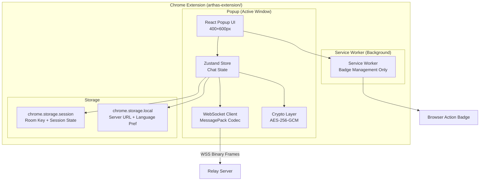
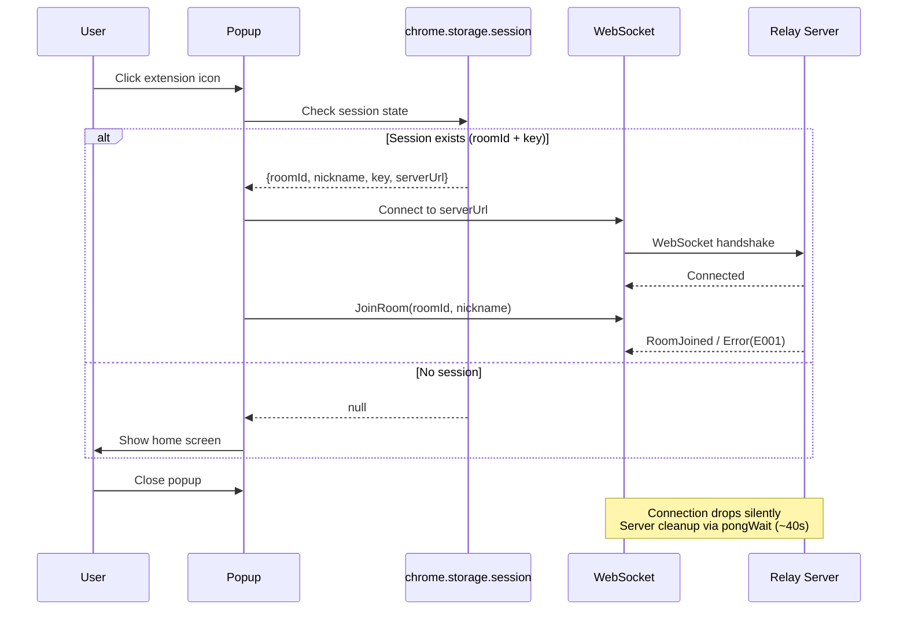

# Design: Arthas Chrome Extension

## Overview

The Arthas Chrome Extension is a Manifest V3 browser extension that provides E2EE chat functionality in a compact popup window (400×600px). It operates as a fully independent package (`arthas-extension/`) that connects to the same WebSocket relay server and uses the same AES-256-GCM encryption protocol as the web client, enabling cross-client interoperability.

### Key Design Constraints

1. **MV3 Service Worker Lifecycle**: No persistent background connections. WebSocket is active only while the popup is open.
2. **Memory-Only Key Storage**: Room keys stored exclusively in `chrome.storage.session` (never touches disk).
3. **Zero Existing Package Changes**: Self-contained package with copied crypto/protocol logic.
4. **CSP Compliance**: No `eval()`, inline scripts, or remote code — all bundled at build time.

### Technology Stack

| Layer | Technology | Rationale |
|-------|-----------|-----------|
| UI Framework | React 18 | Consistent with web client |
| State Management | Zustand | Consistent with web client |
| Build Tool | Vite + `@crxjs/vite-plugin` | MV3-aware bundling, HMR in dev |
| Serialization | `@msgpack/msgpack` | Same version as web client for protocol compatibility |
| Crypto | Web Crypto API (native) | AES-256-GCM, no third-party crypto |
| Styling | Tailwind CSS | Consistent with web client aesthetic |
| Testing | Vitest + fast-check | Property-based testing for protocol/crypto |
| Language | TypeScript (strict) | Type safety, no `any` |

> **Build Tool Risk Note:** `@crxjs/vite-plugin` has known compatibility issues with Vite 5+. If issues arise, evaluate `vite-plugin-web-extension` as an alternative, or pin to Vite 4.x. Verify plugin status before implementation.

## Architecture

### High-Level Architecture



### Connection Lifecycle (Popup-Driven)



### Module Structure

```
arthas-extension/
├── manifest.json              # MV3 manifest (permissions, CSP, icons)
├── package.json               # Independent dependencies
├── vite.config.ts             # Vite + @crxjs/vite-plugin config
├── tsconfig.json              # Strict TypeScript config
├── tailwind.config.ts         # Tailwind with dark theme
├── src/
│   ├── popup/                 # Popup entry point
│   │   ├── index.html         # Popup HTML shell
│   │   ├── main.tsx           # React mount point
│   │   └── App.tsx            # Root component (router)
│   ├── background/            # Service Worker
│   │   └── service-worker.ts  # Badge management only
│   ├── crypto/                # Copied + adapted from arthas-client
│   │   ├── keys.ts            # generateRoomKey, exportRoomKey, importRoomKey
│   │   ├── encrypt.ts         # encryptMessage (AES-256-GCM)
│   │   ├── decrypt.ts         # decryptMessage (AES-256-GCM)
│   │   ├── typingEncrypt.ts   # encryptTypingStatus, decryptTypingStatus
│   │   ├── shareKey.ts        # encodeShareKey, decodeShareKey
│   │   └── utils.ts           # toBase64Url, fromBase64Url
│   ├── network/               # Copied + adapted from arthas-client
│   │   ├── protocol.ts        # Message type constants + interfaces
│   │   └── websocket.ts       # WebSocket connect/send/reconnect
│   ├── stores/                # Zustand state management
│   │   └── chatStore.ts       # Chat state + session persistence
│   ├── pages/                 # UI pages
│   │   ├── Home.tsx           # Nickname + Create/Join + Settings
│   │   ├── ChatRoom.tsx       # Message list + input + header
│   │   └── Settings.tsx       # Server URL + language + test connection
│   ├── components/            # Reusable UI components
│   │   ├── MessageList.tsx    # Scrollable message display (max 200)
│   │   ├── MessageInput.tsx   # Text input + send button + char counter
│   │   ├── MemberList.tsx     # Expandable member list
│   │   ├── ShareCode.tsx      # Share code display + copy button
│   │   ├── TypingIndicator.tsx# Typing status display
│   │   └── ConnectionStatus.tsx # Green/yellow/red dot indicator
│   ├── i18n/                  # Internationalization
│   │   ├── index.ts           # i18n hook + language detection
│   │   └── locales/
│   │       ├── en.json        # English strings
│   │       ├── zh.json        # Chinese Simplified strings
│   │       └── ja.json        # Japanese strings
│   └── utils/                 # Shared utilities
│       ├── storage.ts         # chrome.storage.session/local wrappers
│       ├── payload.ts         # buildPayload, parsePayload (JSON message wrapping)
│       ├── messageId.ts       # generateMessageId, makeStableId
│       └── rateLimit.ts       # Sliding window rate limiter
├── public/
│   └── icons/                 # Extension icons (16, 48, 128px)
└── tests/
    ├── crypto/                # Crypto property tests
    ├── network/               # Protocol codec property tests
    └── stores/                # Store logic tests
```

## Components and Interfaces

### 1. Crypto Layer (`src/crypto/`)

Copied from `arthas-client/src/crypto/` with minimal adaptation (no signing in MVP).

```typescript
// keys.ts
export async function generateRoomKey(): Promise<CryptoKey>;
export async function exportRoomKey(key: CryptoKey): Promise<string>;
export async function importRoomKey(encoded: string): Promise<CryptoKey>;

// encrypt.ts
export async function encryptMessage(
  key: CryptoKey,
  plaintext: string
): Promise<{ iv: string; ciphertext: string }>;

// decrypt.ts
export async function decryptMessage(
  key: CryptoKey,
  iv: string,
  ciphertext: string
): Promise<string>;

// shareKey.ts
export interface ShareCodeComponents {
  roomId: string;
  keyEncoded: string;
  ephemeral: number;
  expiresAt: number;
}
export async function encodeShareKey(roomId: string, key: CryptoKey, ephemeral?: number, expiresAt?: number): Promise<string>;
export function decodeShareKey(code: string): ShareCodeComponents | null;
// Supports 2-4 segment formats:
//   2 segments: {roomId}:{key} → ephemeral=0, expiresAt=0
//   3 segments: {roomId}:{key}:{ephemeral} → expiresAt=0
//   4 segments: {roomId}:{key}:{ephemeral}:{expiresAt}
// Returns null if: segments < 2 or > 4, roomId.length ≠ 21, keyEncoded.length ≠ 43,
//   or ephemeral/expiresAt are not valid non-negative integers

// utils.ts
export function toBase64Url(buffer: ArrayBuffer): string;
export function fromBase64Url(encoded: string): ArrayBuffer;

// typingEncrypt.ts — Encrypted typing status for web client interop
export async function encryptTypingStatus(
  key: CryptoKey,
  typing: boolean
): Promise<{ iv: string; ciphertext: string }>;

export async function decryptTypingStatus(
  key: CryptoKey,
  iv: string,
  ciphertext: string
): Promise<boolean>;
```

### 1b. Payload Utility (`src/utils/payload.ts`)

JSON wrapping layer for message content — required for interoperability with web client.
The web client wraps all message text in `{text, reply?, sig?, type?, pubkey?}` JSON before encryption.

```typescript
// payload.ts
export interface ReplyData {
  stableId: string;
  senderName: string;
  preview: string;
}

// Wrap text in JSON payload format before encryption (for sending)
export function buildPayload(text: string, reply?: ReplyData | null): string;

// Extract text from decrypted JSON payload (for receiving)
// Backward compatible: if plaintext is not valid JSON or lacks 'text' field,
// the entire plaintext string is returned as text (handles old/CLI clients)
export function parsePayload(plaintext: string): { text: string; reply?: ReplyData };
```

### 1c. Message ID Utility (`src/utils/messageId.ts`)

```typescript
// Generate locally-unique message ID for React keys
export function generateMessageId(): string;

// Generate cross-client stable ID for future reply/reaction support
// Format: "{senderId}:{timestamp}"
export function makeStableId(senderId: string, timestamp: number): string;
```

### 2. Network Layer (`src/network/`)

Adapted from `arthas-client/src/network/` with extension-specific connection management.

```typescript
// protocol.ts — Message type constants (subset used by extension)
export const MSG_CREATE_ROOM = 0x01;
export const MSG_JOIN_ROOM = 0x02;
export const MSG_SEND_MESSAGE = 0x03;
export const MSG_LEAVE_ROOM = 0x04;
export const MSG_TYPING = 0x05;
export const MSG_PONG = 0x06;
// Server → Client
export const MSG_ROOM_CREATED = 0x10;
export const MSG_ROOM_JOINED = 0x11;
export const MSG_MEMBER_JOINED = 0x12;
export const MSG_MEMBER_LEFT = 0x13;
export const MSG_RELAY_MESSAGE = 0x14;
export const MSG_MEMBER_TYPING = 0x15;
export const MSG_ROOM_CLOSED = 0x16;
export const MSG_ERROR = 0x17;
export const MSG_PING = 0x18;

// Message envelope
export interface Message {
  type: number;
  data: unknown;
}

// websocket.ts — Extension-specific WebSocket management
export interface ConnectionState {
  status: 'disconnected' | 'connecting' | 'connected' | 'reconnecting' | 'failed';
  consecutiveFailures: number;
}

export function connect(url: string): void;
export function disconnect(): void;  // Sets shouldReconnect=false, no auto-reconnect
export function send(type: number, data: unknown): void;
export function onMessage(handler: (msg: Message) => void): void;
export function getConnectionState(): ConnectionState;

// Internal: shouldReconnect flag distinguishes "connection dropped → retry"
// from "user explicitly disconnected → don't retry"
```

### 3. Storage Layer (`src/utils/storage.ts`)

Typed wrappers around Chrome storage APIs with clear separation of concerns.

```typescript
// Session storage (memory-only, cleared on browser close)
export interface SessionState {
  roomId: string;
  nickname: string;
  keyEncoded: string;  // base64url-encoded AES-256 key
  serverUrl: string;
  members: Array<{ id: string; name: string; color: string }>;
}

export async function saveSession(state: SessionState): Promise<void>;
export async function loadSession(): Promise<SessionState | null>;
export async function clearSession(): Promise<void>;
export async function hasSession(): Promise<boolean>;

// Local storage (persisted to disk — no secrets!)
export interface LocalSettings {
  serverUrl: string;
  language: 'en' | 'zh' | 'ja';
}

export async function saveSettings(settings: Partial<LocalSettings>): Promise<void>;
export async function loadSettings(): Promise<LocalSettings>;
```

### 4. Chat Store (`src/stores/chatStore.ts`)

Zustand store managing all chat state, integrating crypto, network, and storage layers.

```typescript
export interface ChatState {
  // Connection
  connectionStatus: 'disconnected' | 'connecting' | 'connected' | 'reconnecting' | 'failed';
  consecutiveFailures: number;
  myId: string | null;
  myName: string;

  // Room
  roomId: string | null;
  roomKey: CryptoKey | null;
  shareCode: string | null;
  members: Member[];

  // Messages
  messages: ChatMessage[];
  typingMembers: Map<string, number>;  // memberId → timeout handle

  // Actions
  initialize: () => Promise<void>;  // Load session, auto-rejoin
  createRoom: (name: string) => Promise<void>;
  joinRoom: (shareCode: string, name: string) => Promise<void>;
  sendMessage: (text: string) => Promise<void>;
  setTyping: (typing: boolean) => Promise<void>;  // async: encrypts typing status
  leaveRoom: () => Promise<void>;
  retryConnection: () => void;
}

// Typing Concurrency Control (module-level, not in store):
// - typingVersion counter implements last-write-wins for async encryption.
//   Each setTyping call increments the counter; after encryption completes,
//   the result is only sent if the counter hasn't been incremented since
//   (i.e., no newer setTyping call has occurred). This prevents out-of-order
//   typing messages when rapid typing events overlap with async crypto.
// - typingTimer: auto-cancel after TYPING_TIMEOUT_MS (2000ms)
// - isCurrentlyTyping: dedup flag to avoid redundant sends
```

### 5. Service Worker (`src/background/service-worker.ts`)

Minimal — manages badge and storage access level.

```typescript
// CRITICAL: Allow popup to access chrome.storage.session
// Without this, only the service worker can read/write session storage
chrome.storage.session.setAccessLevel({
  accessLevel: 'TRUSTED_AND_UNTRUSTED_CONTEXTS'
});

// Listen for messages from popup to set/clear badge
chrome.runtime.onMessage.addListener((message, _sender, sendResponse) => {
  if (message.type === 'SET_BADGE') {
    chrome.action.setBadgeText({ text: message.text });
    chrome.action.setBadgeBackgroundColor({ color: '#6366f1' });
  } else if (message.type === 'CLEAR_BADGE') {
    chrome.action.setBadgeText({ text: '' });
  }
  sendResponse({ ok: true });
});

// On install/update: set access level and check badge state
chrome.runtime.onInstalled.addListener(async () => {
  chrome.storage.session.setAccessLevel({
    accessLevel: 'TRUSTED_AND_UNTRUSTED_CONTEXTS'
  });
  const session = await chrome.storage.session.get('roomId');
  if (session.roomId) {
    chrome.action.setBadgeText({ text: '\u25cf' });
    chrome.action.setBadgeBackgroundColor({ color: '#6366f1' });
  }
});

// On browser startup: check if session exists and set badge
chrome.runtime.onStartup.addListener(async () => {
  const session = await chrome.storage.session.get('roomId');
  if (session.roomId) {
    chrome.action.setBadgeText({ text: '\u25cf' });
    chrome.action.setBadgeBackgroundColor({ color: '#6366f1' });
  }
});

// Badge lifecycle via port-based popup detection:
// The popup connects a port on open; when the port disconnects (popup closed),
// the service worker sets the badge if session state exists.
chrome.runtime.onConnect.addListener((port) => {
  if (port.name === 'popup') {
    // Popup opened — clear badge
    chrome.action.setBadgeText({ text: '' });

    port.onDisconnect.addListener(async () => {
      // Popup closed — set badge if session active
      const session = await chrome.storage.session.get('roomId');
      if (session.roomId) {
        chrome.action.setBadgeText({ text: '\u25cf' });
        chrome.action.setBadgeBackgroundColor({ color: '#6366f1' });
      }
    });
  }
});
```

### 6. Manifest Configuration

```json
{
  "manifest_version": 3,
  "name": "Arthas E2EE Chat",
  "version": "1.0.0",
  "description": "End-to-end encrypted chat in your browser",
  "permissions": ["storage"],
  "host_permissions": ["ws://*/*", "wss://*/*"],
  "action": {
    "default_popup": "src/popup/index.html",
    "default_icon": {
      "16": "public/icons/icon-16.png",
      "48": "public/icons/icon-48.png",
      "128": "public/icons/icon-128.png"
    }
  },
  "background": {
    "service_worker": "src/background/service-worker.ts",
    "type": "module"
  },
  "content_security_policy": {
    "extension_pages": "script-src 'self'; object-src 'none'"
  }
}
```

## Data Models

### Message Types (Extension Subset)

The extension uses a subset of the full Arthas protocol — chat messages only (no file transfer, no reactions, no signing in MVP).

| Direction | Type ID | Name | Data Fields |
|-----------|---------|------|-------------|
| C→S | 0x01 | CreateRoom | `{name: string, password: string, ephemeral: number, expiry: number}` |
| C→S | 0x02 | JoinRoom | `{roomId: string, name: string, password: string}` |
| C→S | 0x03 | SendMessage | `{iv: string, ciphertext: string}` |
| C→S | 0x04 | LeaveRoom | `{}` |
| C→S | 0x05 | Typing | `{iv: string, ciphertext: string}` *(encrypted boolean)* |
| C→S | 0x06 | Pong | `{t: number}` |
| S→C | 0x10 | RoomCreated | `{roomId: string}` |
| S→C | 0x11 | RoomJoined | `{roomId: string, members: Member[]}` |
| S→C | 0x12 | MemberJoined | `{id, name, color}` |
| S→C | 0x13 | MemberLeft | `{id}` |
| S→C | 0x14 | RelayMessage | `{senderId, senderName, iv, ciphertext, t}` |
| S→C | 0x15 | MemberTyping | `{id, iv, ciphertext}` *(encrypted boolean)* |
| S→C | 0x16 | RoomClosed | `{}` |
| S→C | 0x17 | Error | `{code, msg}` |
| S→C | 0x18 | Ping | `{t: number}` |
| S→C | 0x19 | RelayReaction | *(silently ignored — reactions not in MVP)* |
| S→C | 0x1A-0x1E | RelayFile* | *(silently ignored — file transfer not in MVP)* |

> **Interop Note:** Typing messages are encrypted using the Room_Key (same as chat messages). The web client sends `{iv, ciphertext}` where the plaintext is a JSON-encoded boolean. The extension MUST encrypt typing status for interoperability. Unencrypted `{typing: boolean}` would cause web clients to fail decryption.

> **Unknown Message Handling:** The message handler MUST include a default case that silently ignores any unrecognized message type IDs. This includes `type: "pubkey"` messages (Ed25519 public key broadcasts from web clients) which appear as normal RelayMessage but contain a special payload — the extension should detect `parsed.type === "pubkey"` after decryption and skip display.

### Storage Schema

```typescript
// chrome.storage.session (memory-only)
// IMPORTANT: Requires chrome.storage.session.setAccessLevel({
//   accessLevel: 'TRUSTED_AND_UNTRUSTED_CONTEXTS'
// }) in service worker for popup access
interface SessionData {
  roomId: string;           // 21-char NanoID
  nickname: string;         // 1-20 chars
  keyEncoded: string;       // 43-char base64url AES-256 key
  serverUrl: string;        // ws:// or wss:// URL
  members: MemberInfo[];    // Current member list snapshot
}

// chrome.storage.local (persisted)
interface LocalData {
  serverUrl: string;        // User-configured server URL
  language: 'en' | 'zh' | 'ja';  // UI language preference
}
```

### Chat Message Model

```typescript
interface ChatMessage {
  id: string;              // Locally-unique ID for React key
  stableId: string;        // Cross-client stable ID (senderId:timestamp) for future reply/reactions
  senderId: string;        // Sender's client ID
  senderName: string;      // Display name
  text: string;            // Decrypted plaintext (or placeholder)
  timestamp: number;       // Unix ms
  isMine: boolean;         // Sent by current user
  isSystem: boolean;       // System notification message
}

interface Member {
  id: string;
  name: string;
  color: string;           // Hex color assigned by server
}
```


## Correctness Properties

*A property is a characteristic or behavior that should hold true across all valid executions of a system — essentially, a formal statement about what the system should do. Properties serve as the bridge between human-readable specifications and machine-verifiable correctness guarantees.*

### Property 1: MessagePack Codec Round-Trip

*For any* valid Message object `{type: uint8, data: object}`, encoding it with MessagePack and then decoding the resulting binary should produce an object deeply equal to the original.

**Validates: Requirements 2.2, 2.3, 15.1, 15.2, 15.3**

### Property 2: Encryption Round-Trip

*For any* valid UTF-8 plaintext string (1–500 characters) and any valid AES-256-GCM CryptoKey, encrypting the plaintext and then decrypting the resulting `{iv, ciphertext}` with the same key should produce the original plaintext.

**Validates: Requirements 5.2, 6.2**

### Property 3: Key Export/Import Round-Trip

*For any* freshly generated AES-256-GCM CryptoKey, exporting it to base64url and then importing the base64url string back should produce a CryptoKey that encrypts/decrypts identically to the original.

**Validates: Requirements 4.3**

### Property 4: Share Code Round-Trip

*For any* valid roomId (21-character NanoID), any valid AES-256-GCM CryptoKey, any non-negative integer `ephemeral`, and any non-negative integer `expiresAt`, encoding a share code with `encodeShareKey(roomId, key, ephemeral, expiresAt)` and then decoding it with `decodeShareKey` should produce components where `roomId` matches the original, `keyEncoded` has length 43, `ephemeral` matches the original, and `expiresAt` matches the original.

**Validates: Requirements 3.4, 4.1**

### Property 5: Share Code Validation Rejects Malformed Input

*For any* string that has fewer than 2 or more than 4 colon-separated segments, or whose first segment length ≠ 21, or whose second segment length ≠ 43, or (if 3+ segments) whose third segment is not a valid non-negative integer, or (if 4 segments) whose fourth segment is not a valid non-negative integer, `decodeShareKey` should return `null`.

**Validates: Requirements 4.2**

### Property 6: Rate Limiter Invariant

*For any* sequence of N message send attempts within a 10-second sliding window, the rate limiter should allow exactly the first 10 and reject all subsequent attempts until timestamps older than 10 seconds are evicted from the window.

**Validates: Requirements 5.5**

### Property 7: Input Validation Bounds

*For any* string `s`:
- Nickname validation returns `true` if and only if `s.trim().length` is between 1 and 20 (inclusive).
- Message validation returns `true` if and only if `s.length` is between 1 and 500 (inclusive).

**Validates: Requirements 3.6, 5.6**

### Property 8: Exponential Backoff Calculation

*For any* number of consecutive connection failures `n` (where n ≥ 1), the reconnection delay should equal `min(2^(n-1) × 1000, 30000)` milliseconds.

**Validates: Requirements 2.5**

### Property 9: Message List Bounded at 200

*For any* sequence of messages added to the chat store (regardless of count), the `messages` array length should never exceed 200, and when the limit is reached, the array should contain the 200 most recent messages in chronological order.

**Validates: Requirements 6.5**

### Property 10: Member List Consistency

*For any* member list and any MemberJoined event with a new member, handling the event should increase the list length by exactly 1 and the list should contain the new member. Conversely, *for any* member list containing a member and a MemberLeft event for that member, handling the event should decrease the list length by exactly 1 and the member should no longer be present.

**Validates: Requirements 9.1, 9.2**

### Property 11: Language Detection

*For any* `navigator.language` string, the language detection function should return exactly one of `'en'`, `'zh'`, or `'ja'`. If the language prefix (first 2 characters) matches a supported locale, that locale is returned; otherwise `'en'` is returned.

**Validates: Requirements 12.3, 12.4, 12.5**

### Property 12: Server URL Validation

*For any* string `url`, the server URL validator should return `true` if and only if `url` starts with `ws://` or `wss://` AND ends with `/ws`.

**Validates: Requirements 11.4**

### Property 13: Typing Encryption Round-Trip

*For any* boolean value `b` and any valid AES-256-GCM CryptoKey, encrypting the typing status `b` with `encryptTypingStatus` and then decrypting the resulting `{iv, ciphertext}` with `decryptTypingStatus` using the same key should produce the original boolean `b`.

**Validates: Requirements 10.1, 10.3 (interop with web client)**

### Property 14: Payload Format Round-Trip

*For any* valid UTF-8 string `text` (1–500 characters), `parsePayload(buildPayload(text))` should produce an object where the `text` field equals the original string.

**Validates: Requirements 5.3, 6.2 (interop with web client)**

### Property 15: Unknown Message Type Resilience

*For any* message with a `type` field value not in the set of handled message types (0x10–0x18), the message handler should not throw an exception and should not modify the chat state.

**Validates: Graceful degradation for future protocol extensions**

## Error Handling

### Connection Errors

| Error Scenario | Handling | User Feedback |
|---------------|----------|---------------|
| WebSocket connection refused | Exponential backoff retry (1s → 30s cap) | Yellow dot + "Reconnecting..." |
| 5 consecutive reconnection failures | Stop retrying, show manual retry | Red dot + "Disconnected" + Retry button |
| Connection drops mid-session | Auto-reconnect with backoff | Yellow dot during reconnect |
| Server URL not configured | Block room creation/joining | Prompt to configure in settings |
| Invalid server URL format | Reject on save | Inline validation error |
| Test Connection fails | Show failure result | "Connection failed" message |

### Room Errors

| Error Code | Meaning | User Feedback |
|-----------|---------|---------------|
| E001 | Room not found | "Room not found or closed" |
| E002 | Room full (50 max) | "Room is full (max 50 members)" |
| E003 | Not in room | Internal error, trigger rejoin |
| E004 | Rate limited (server) | "Too many messages, slow down" |
| E005 | Invalid message format | Internal error, log and skip |

### Crypto Errors

| Error Scenario | Handling | User Feedback |
|---------------|----------|---------------|
| Decryption failure (wrong key) | Display placeholder | "[Cannot decrypt this message]" |
| Key generation failure | Prevent room creation | "Failed to generate encryption key" |
| Key import failure (invalid share code) | Prevent room join | "Invalid share code" |
| Web Crypto API unavailable | Block all crypto operations | "Your browser doesn't support required encryption" |

### Typing Errors

| Error Scenario | Handling | User Feedback |
|---------------|----------|---------------|
| Typing encryption fails | Silently skip (don't break typing flow) | None (non-critical) |
| MemberTyping decryption fails (wrong key or old client sending plaintext) | Silently ignore — do not show typing indicator | None |
| MemberTyping message has no `iv`/`ciphertext` fields (backward compat) | Silently ignore — treat as unrecognized format | None |

> **Backward Compatibility:** The web client handles both encrypted and unencrypted typing messages gracefully. The extension should do the same: if `decryptTypingStatus` throws, silently ignore the typing event rather than crashing.

### Session Errors

| Error Scenario | Handling | User Feedback |
|---------------|----------|---------------|
| Auto-rejoin fails (E001) | Clear session, show home | "Room session expired" |
| Session storage read fails | Treat as no session | Show home screen |
| Session storage write fails | Log error, continue | Silent (non-critical) |

### Graceful Degradation Principles

1. **Network failures** → Retry with backoff, never crash
2. **Crypto failures** → Show placeholder, never expose raw ciphertext
3. **Storage failures** → Degrade to stateless mode (no session persistence)
4. **Invalid messages** → Log and skip, never crash the message handler

## Testing Strategy

### Unit Tests (Example-Based)

Focus on specific scenarios, edge cases, and integration points:

- **Ping/Pong handling**: Verify Pong sent with correct timestamp on Ping receipt
- **Room creation flow**: Verify correct message sequence (CreateRoom → handle RoomCreated/RoomJoined)
- **Room join flow**: Verify share code decode → key import → JoinRoom message
- **Error handling**: Verify E001, E002 produce correct user-facing messages
- **Decryption failure**: Verify placeholder shown for undecryptable messages
- **Leave room**: Verify LeaveRoom sent, session cleared, badge cleared
- **Typing indicators**: Verify debounce timing (2s stop, 5s timeout)
- **Typing version counter**: Verify last-write-wins when rapid typing events overlap with async encryption
- **Typing decryption failure**: Verify silent ignore when decryption fails (backward compat)
- **Badge management**: Verify badge set/clear on session state changes
- **Badge on popup close**: Verify port disconnect triggers badge set when session active
- **Connection status**: Verify green/yellow/red states based on connection health
- **Auto-rejoin**: Verify rejoin attempt on popup open with session state

### Property-Based Tests (Universal Properties)

Using `fast-check` library with minimum 100 iterations per property:

| Property | Module Under Test | Generator Strategy |
|----------|------------------|-------------------|
| 1. MessagePack round-trip | `network/websocket.ts` | Random `{type: uint8, data: object}` with nested structures |
| 2. Encryption round-trip | `crypto/encrypt.ts` + `crypto/decrypt.ts` | Random UTF-8 strings (1–500 chars) + generated CryptoKey |
| 3. Key export/import round-trip | `crypto/keys.ts` | Generated CryptoKeys |
| 4. Share code round-trip | `crypto/shareKey.ts` | Random 21-char roomIds + generated CryptoKeys + random ephemeral (0-86400) + random expiresAt (0 or future timestamp) |
| 5. Share code validation | `crypto/shareKey.ts` | Random malformed strings (wrong segments, wrong lengths, invalid integers) |
| 6. Rate limiter invariant | `utils/rateLimit.ts` | Random sequences of timestamps within sliding windows |
| 7. Input validation | Store validators | Random strings of varying lengths (0–1000 chars) |
| 8. Backoff calculation | `network/websocket.ts` | Random integers 1–100 (failure counts) |
| 9. Message list bounded | `stores/chatStore.ts` | Random sequences of 1–500 messages |
| 10. Member list consistency | `stores/chatStore.ts` | Random member lists + join/leave events |
| 11. Language detection | `i18n/index.ts` | Random locale strings (BCP 47 format + garbage) |
| 12. Server URL validation | `utils/storage.ts` | Random strings + valid/invalid URL patterns |
| 13. Typing encryption round-trip | `crypto/typingEncrypt.ts` | Random booleans + generated CryptoKey |
| 14. Payload format round-trip | `utils/payload.ts` | Random UTF-8 strings (1–500 chars) |
| 15. Unknown message resilience | `stores/chatStore.ts` | Random uint8 type IDs outside handled set |

### Property Test Configuration

```typescript
// Each property test tagged with design reference
// Example:
// Feature: chrome-extension, Property 1: MessagePack codec round-trip
import fc from 'fast-check';

fc.assert(
  fc.property(
    fc.record({
      type: fc.integer({ min: 0x01, max: 0x18 }),
      data: fc.dictionary(fc.string(), fc.jsonValue())
    }),
    (msg) => {
      const encoded = encode(msg);
      const decoded = decode(encoded);
      expect(decoded).toEqual(msg);
    }
  ),
  { numRuns: 100 }
);
```

### Integration Tests

- **Full room lifecycle**: Create → Share → Join → Send/Receive → Leave
- **Reconnection flow**: Connect → Disconnect → Auto-reconnect → Rejoin
- **Session persistence**: Create room → Close popup → Reopen → Auto-rejoin
- **Cross-client interop**: Extension message decryptable by web client (shared test vectors)

### Test Infrastructure

- **Framework**: Vitest (consistent with web client)
- **PBT Library**: fast-check (consistent with web client)
- **Mocking**: `chrome.storage` API mocked via `vitest` mocks
- **WebSocket Mock**: Custom mock for WebSocket connection testing
- **Crypto**: Use real Web Crypto API (available in Node.js 18+ / happy-dom)
