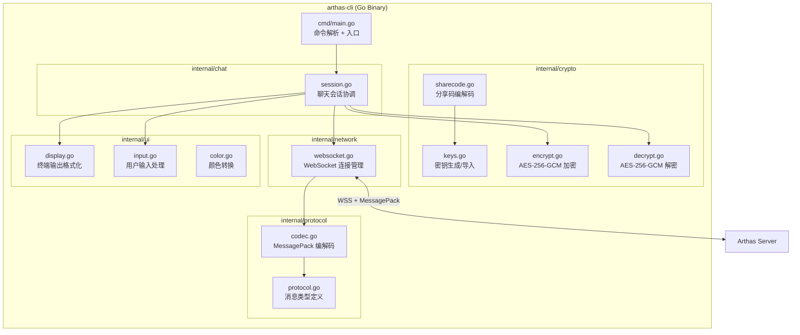
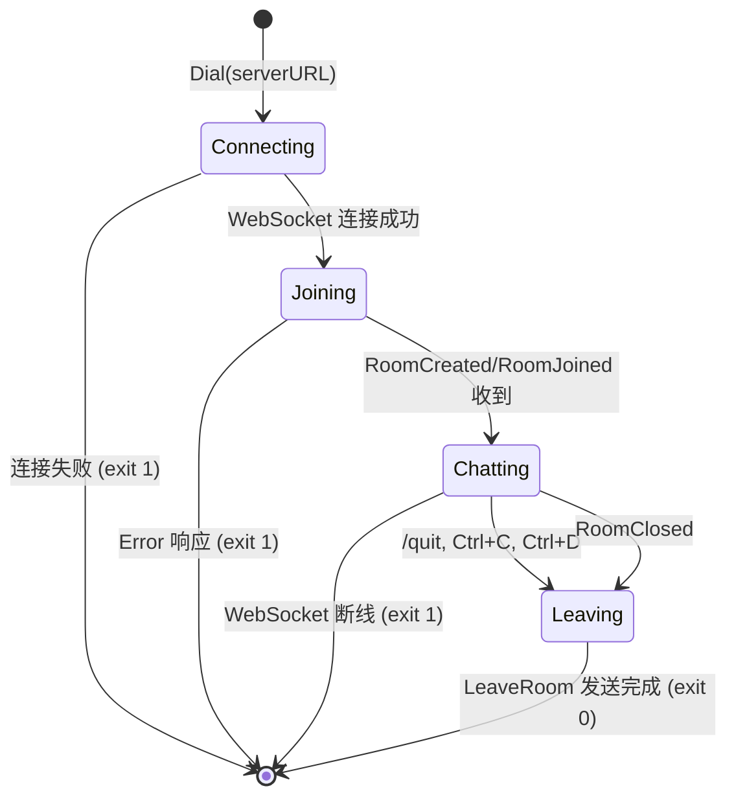

# Design Document: CLI Client (arthas-cli)

## Overview

arthas-cli 是一个独立的 Go 命令行二进制程序，为 Arthas 加密聊天系统提供终端访问能力。它实现与 Web 客户端完全相同的 WebSocket + MessagePack + AES-256-GCM 协议，使开发者和服务器管理员能够直接从终端创建和加入加密聊天房间。

### 设计目标

1. **协议兼容性**: 与现有 Web 客户端和服务器完全互操作
2. **零依赖部署**: 编译为单一静态二进制，无需运行时依赖
3. **安全性**: 使用 Go 标准库 `crypto/aes` + `crypto/cipher` 实现 AES-256-GCM，`crypto/rand` 生成 IV
4. **学习价值**: 代码作为学习材料，展示 Go 中 WebSocket 客户端、加密通信、终端 UI 的实现模式

### 技术选型理由

| 决策 | 选择 | 理由 |
|------|------|------|
| WebSocket 库 | `gorilla/websocket` | 与服务器端一致，成熟稳定 |
| MessagePack 库 | `vmihailenco/msgpack/v5` | 与服务器端一致，避免兼容性问题 |
| 加密 | Go 标准库 `crypto/*` | 无需第三方依赖，Go 标准库 AES-GCM 实现经过审计 |
| CLI 框架 | 无（标准库 `flag`） | 命令简单（create/join），不需要 cobra 等重型框架 |
| 终端颜色 | 手动 ANSI 转义序列 | 避免引入新依赖，逻辑简单 |

---

## Architecture

### 高层架构图



### 目录结构

```
arthas-cli/
├── cmd/
│   └── arthas-cli/
│       └── main.go              # 入口：命令解析、参数验证、启动会话
├── internal/
│   ├── protocol/
│   │   ├── protocol.go          # 消息类型常量 + 数据结构定义
│   │   └── codec.go             # MessagePack 编解码 + toInt() 辅助函数
│   ├── crypto/
│   │   ├── keys.go              # 密钥生成（crypto/rand）、base64url 导入/导出
│   │   ├── encrypt.go           # AES-256-GCM 加密（生成 IV + 加密 + base64url 编码）
│   │   ├── decrypt.go           # AES-256-GCM 解密（base64url 解码 + 解密）
│   │   └── sharecode.go         # 分享码解析/构建
│   ├── network/
│   │   └── websocket.go         # WebSocket 连接管理（连接、读写、关闭）
│   ├── ui/
│   │   ├── display.go           # 终端输出（消息渲染、系统消息、时间戳）
│   │   ├── input.go             # stdin 行读取、命令解析
│   │   └── color.go             # Hex 颜色 → ANSI 256-color 转换
│   └── chat/
│       └── session.go           # 聊天会话主循环（协调所有模块）
├── go.mod
├── go.sum
└── Makefile                     # 跨平台编译目标
```

### 数据流

#### 发送消息流程

```
用户在终端输入文本
    → stdinPump goroutine 通过 inputCh 传递给 main
    → session 验证非空 + 长度 ≤ 500 runes
    → json.Marshal(MessagePayload{Text: input}) → JSON 字节
    → crypto.Encrypt(roomKey, jsonBytes) → {iv, ciphertext}（base64url 编码）
    → protocol.Encode({type: 0x03, data: {iv, ciphertext}}) → msgpack bytes
    → conn.Send(bytes) → sendCh → writePump → WebSocket Binary Frame
    → 服务器转发给房间其他成员
```

#### 接收消息流程

```
WebSocket 收到 Binary Frame
    → network.ReadMessage() → raw bytes
    → protocol.Decode(raw) → Message{Type, Data}
    → switch Type:
        case RelayMessage (0x14):
            → 提取 iv, ciphertext, senderName, timestamp
            → crypto.Decrypt(roomKey, iv, ciphertext) → plaintext JSON
            → JSON 解析提取 "text" 字段
            → ui.DisplayMessage(senderName, color, text, timestamp)
        case MemberJoined (0x12):
            → ui.DisplaySystemMessage("*** <name> joined")
        case MemberLeft (0x13):
            → ui.DisplaySystemMessage("*** <name> left")
        case Ping (0x18):
            → protocol.EncodePong(timestamp) → network.Send()
        case Error (0x17):
            → ui.DisplayError(code, msg)
        case RoomClosed (0x16):
            → ui.DisplaySystemMessage("Room closed")
            → graceful exit
```

### 并发模型

```mermaid
graph TB
    subgraph "Goroutines (4个)"
        MAIN[main goroutine<br/>select 事件循环 + 协调]
        READ[readPump goroutine<br/>WebSocket 读取 → inputCh]
        WRITE[writePump goroutine<br/>sendCh → WebSocket 写入]
        STDIN[stdinPump goroutine<br/>stdin 读取 → inputCh]
    end
    
    STDIN -->|"inputCh chan string"| MAIN
    READ -->|"msgCh chan *Message"| MAIN
    MAIN -->|"sendCh chan []byte"| WRITE
    WRITE -->|"Binary Frame"| WS[WebSocket conn]
    WS -->|"Binary Frame"| READ
    
    subgraph "Channels"
        direction LR
        SEND[sendCh chan []byte<br/>容量 16]
        INPUT[inputCh chan string<br/>容量 1]
        MSG[msgCh chan *Message<br/>容量 16]
    end
    
    subgraph "取消信号"
        CTX[context.Context<br/>cancel() 广播退出]
    end
```

CLI 使用四个 goroutine（含 main）：
1. **main goroutine**: 运行 select 事件循环，协调所有输入源（stdin、WebSocket、信号）
2. **stdinPump goroutine**: 阻塞读取 stdin，通过 `inputCh` 传递给 main（解决 stdin 阻塞问题）
3. **readPump goroutine**: 阻塞读取 WebSocket 消息，解码后通过 `msgCh` 传递给 main
4. **writePump goroutine**: 从 `sendCh` 读取数据，写入 WebSocket（保证写操作线程安全）

使用 `context.WithCancel` 协调所有 goroutine 的退出（比裸 channel 更符合 Go 惯用模式）。

> 📚 学习要点: 为什么需要 stdinPump goroutine？
> Go 的 `select` 语句只能等待 channel 操作。`bufio.Scanner.Scan()` 是阻塞调用，
> 不能直接放在 select 的 case 中。如果放在 `default` 分支，会导致 select 永远
> 无法检查其他 case（信号、断线）。解决方案是将 stdin 读取放在独立 goroutine 中，
> 通过 channel 将输入传递给 main goroutine 的 select 循环。

> 📚 学习要点: 为什么需要 writePump goroutine？
> gorilla/websocket 的 `WriteMessage` 不是线程安全的（同一时刻只能有一个写者）。
> 如果 main goroutine 和 readPump 都需要发送消息（如 Pong 响应），
> 必须通过 sendCh 序列化所有写操作到单一的 writePump goroutine。
> 这与服务器端 client.go 的 writePump 模式完全一致。

---

## Components and Interfaces

### 1. `cmd/arthas-cli/main.go` — 入口与命令路由

```go
// main 解析命令行参数，根据子命令（create/join）启动对应流程。
// 支持的命令：
//   arthas-cli create [--server URL] [--name NAME]
//   arthas-cli join <share_code> [--server URL] [--name NAME]
//   arthas-cli --version
//   arthas-cli --help
func main()
```

### 2. `internal/crypto` — 加密层

```go
// keys.go

// GenerateRoomKey 生成 32 字节 AES-256 密钥（使用 crypto/rand）。
// 返回原始字节切片，调用方负责安全存储。
func GenerateRoomKey() ([]byte, error)

// ExportKeyBase64URL 将 32 字节密钥导出为 base64url 编码字符串（43 字符，无 padding）。
func ExportKeyBase64URL(key []byte) string

// ImportKeyBase64URL 将 base64url 编码字符串解码为 32 字节密钥。
// 验证解码后长度为 32 字节，否则返回错误。
func ImportKeyBase64URL(encoded string) ([]byte, error)
```

```go
// encrypt.go

// Encrypt 使用 AES-256-GCM 加密明文。
// 自动生成 12 字节随机 IV（crypto/rand），返回 base64url 编码的 IV 和密文。
// 密文包含 16 字节 GCM authentication tag。
func Encrypt(key []byte, plaintext []byte) (iv string, ciphertext string, err error)
```

```go
// decrypt.go

// Decrypt 使用 AES-256-GCM 解密密文。
// 输入为 base64url 编码的 IV 和密文，返回明文字节。
// 如果认证标签验证失败（密钥错误或数据被篡改），返回 error。
func Decrypt(key []byte, ivB64 string, ciphertextB64 string) ([]byte, error)
```

```go
// sharecode.go

// ShareCode 表示解析后的分享码结构。
type ShareCode struct {
    RoomID    string // 21 字符 NanoID
    KeyBytes  []byte // 32 字节原始密钥
    Ephemeral int    // 临时模式秒数（0 = 非临时）
}

// ParseShareCode 解析分享码字符串。
// 格式: {roomId}:{base64url(roomKey)}[:{ephemeral}]
// 验证: roomId 长度 21, key 解码后 32 字节。
func ParseShareCode(code string) (*ShareCode, error)

// BuildShareCode 从组件构建分享码字符串。
func BuildShareCode(roomID string, key []byte, ephemeral int) string
```

### 3. `internal/protocol` — 协议层

```go
// protocol.go

// 消息类型常量（与服务器 protocol.go 完全一致）
const (
    // Client → Server
    MsgCreateRoom    uint8 = 0x01
    MsgJoinRoom      uint8 = 0x02
    MsgSendMessage   uint8 = 0x03
    MsgLeaveRoom     uint8 = 0x04
    MsgTyping        uint8 = 0x05 // CLI 不发送，但定义以保持完整
    MsgPong          uint8 = 0x06
    MsgSendReaction  uint8 = 0x07 // CLI 不发送，但定义以保持完整

    // Server → Client
    MsgRoomCreated   uint8 = 0x10
    MsgRoomJoined    uint8 = 0x11
    MsgMemberJoined  uint8 = 0x12
    MsgMemberLeft    uint8 = 0x13
    MsgRelayMessage  uint8 = 0x14
    MsgMemberTyping  uint8 = 0x15 // 静默忽略
    MsgRoomClosed    uint8 = 0x16
    MsgError         uint8 = 0x17
    MsgPing          uint8 = 0x18
    MsgRelayReaction uint8 = 0x19 // 静默忽略

    // 文件传输 Server → Client（全部静默忽略）
    MsgRelayFileMeta     uint8 = 0x1A
    MsgRelayFileChunk    uint8 = 0x1B
    MsgRelayFileComplete uint8 = 0x1C
    MsgRelayFileCancel   uint8 = 0x1D
    MsgRelayFileAck      uint8 = 0x1E
)

// Message 通用消息信封
type Message struct {
    Type uint8       `msgpack:"type"`
    Data interface{} `msgpack:"data"`
}

// 各消息类型的 Data 结构体（与服务器定义对齐）
type CreateRoomData struct { ... }
type JoinRoomData struct { ... }
type SendMessageData struct { ... }
// ... 等等
```

```go
// codec.go

// Encode 将 Message 序列化为 MessagePack 字节。
func Encode(msg *Message) ([]byte, error)

// Decode 将 MessagePack 字节反序列化为 Message。
// Data 字段解码为 map[string]interface{}，调用方使用类型断言提取字段。
func Decode(data []byte) (*Message, error)

// ToInt 安全地将 msgpack 解码的数字类型转换为 int64。
// 📚 学习要点: msgpack 类型断言陷阱
// vmihailenco/msgpack/v5 将小正整数解码为 int8/uint8（不是 int64），
// 直接 .(int64) 断言会 panic。此函数统一处理所有整数类型。
func ToInt(v interface{}) int64
```

### 4. `internal/network` — 网络层

```go
// websocket.go

// 连接超时常量（与服务器 client.go 对齐）
const (
    writeWait      = 10 * time.Second  // 写操作超时
    pongWait       = 40 * time.Second  // 读超时（服务器 25s ping 间隔 × 1.6）
    maxMessageSize = 102400            // 100KB，与服务器一致
)

// Conn 封装 WebSocket 连接，提供线程安全的读写操作。
// 📚 学习要点: 为什么封装 gorilla/websocket.Conn？
// gorilla/websocket 的 Conn 支持并发读（一个 reader）和并发写（一个 writer），
// 但不支持多个并发写者。通过 sendCh + writePump 模式，
// 将所有写操作序列化到单一 goroutine，确保线程安全。
type Conn struct {
    conn   *websocket.Conn
    sendCh chan []byte    // 发送队列（容量 16）
    ctx    context.Context
    cancel context.CancelFunc
}

// Dial 建立 WebSocket 连接到指定服务器 URL。
// 设置读取限制为 102400 字节（与服务器 maxMessageSize 一致）。
// 设置初始读超时为 pongWait（40s），后续由 Pong 处理器重置。
// 连接成功后自动启动 writePump goroutine（从 sendCh 消费并写入 WebSocket）。
//
// 📚 学习要点: Origin 头与 CORS
// gorilla/websocket 的 Dialer 默认不发送 Origin 头。
// 生产环境服务器配置了 ALLOWED_ORIGINS 时，空 Origin 会被拒绝。
// 解决方案：在 Dialer.HandshakeHeader 中设置 Origin: "arthas-cli"，
// 并要求服务器在 ALLOWED_ORIGINS 中添加 "arthas-cli"。
func Dial(serverURL string) (*Conn, error)

// Send 将消息放入发送队列（非阻塞）。
// 如果队列满，返回 error（不丢弃消息）。
func (c *Conn) Send(data []byte) error

// ReadMessage 从 WebSocket 读取下一条二进制消息（阻塞）。
// 每次成功读取后重置读超时为 pongWait。
func (c *Conn) ReadMessage() ([]byte, error)

// Close 优雅关闭连接（发送 Close frame，等待 writePump 退出）。
func (c *Conn) Close() error

// writePump 从 sendCh 读取数据并写入 WebSocket（独立 goroutine）。
// 设置 writeWait 超时，确保慢速网络不会永久阻塞。
// 当 ctx 取消时退出。
func (c *Conn) writePump()

// Done 返回 context 的 Done channel，用于检测连接关闭。
func (c *Conn) Done() <-chan struct{}
```

### 5. `internal/ui` — 终端 UI 层

```go
// display.go

// Display 管理终端输出格式化。
type Display struct {
    colorSupport bool   // 是否支持 ANSI 颜色
    myName       string // 当前用户昵称（用于区分自己的消息）
}

// NewDisplay 创建 Display 实例，自动检测终端颜色支持。
func NewDisplay(myName string) *Display

// ShowMessage 显示聊天消息（带颜色的发送者名 + 时间戳 + 内容）。
// 格式: [HH:MM] <colored_name>: message_text
func (d *Display) ShowMessage(senderName, hexColor, text string, timestamp int64)

// ShowOwnMessage 显示自己发送的消息。
// 格式: [HH:MM] <name>: message_text (使用不同样式区分)
func (d *Display) ShowOwnMessage(text string)

// ShowSystemMessage 显示系统消息（成员加入/离开等）。
// 格式: *** message (dimmed)
func (d *Display) ShowSystemMessage(msg string)

// ShowError 显示错误消息到 stderr。
func (d *Display) ShowError(msg string)

// ShowMembers 显示房间成员列表。
func (d *Display) ShowMembers(members []MemberInfo)

// ShowShareCode 显示分享码（高亮）。
func (d *Display) ShowShareCode(code string)

// ShowReplyContext 显示引用回复的上下文（在消息正文之前）。
// 格式: ↩ Re: <senderName>: <preview> (dimmed)
func (d *Display) ShowReplyContext(senderName, preview string)
```

```go
// input.go

// ReadLine 从 stdin 读取一行输入（阻塞）。
// 返回去除尾部换行符的字符串。
// 当 stdin 关闭（Ctrl+D/EOF）时返回 io.EOF。
func ReadLine() (string, error)

// PromptName 交互式提示用户输入昵称。
// 验证 1-20 字符，非空。
func PromptName() (string, error)
```

```go
// color.go

// HexToANSI256 将 CSS hex 颜色（如 "#4a7fbf"）转换为最接近的 ANSI 256-color 转义序列。
// 如果终端不支持颜色，返回空字符串。
func HexToANSI256(hex string) string

// Reset 返回 ANSI 重置序列。
func Reset() string
```

### 6. `internal/chat` — 会话协调层

```go
// session.go

// SessionState 会话状态机
type SessionState int
const (
    StateConnecting SessionState = iota // 正在建立 WebSocket 连接
    StateJoining                        // 已连接，等待 RoomCreated/RoomJoined 响应
    StateChatting                       // 已加入房间，正常聊天中
    StateLeaving                        // 正在发送 LeaveRoom，准备退出
)

// Session 协调所有模块，管理聊天会话的完整生命周期。
type Session struct {
    conn        *network.Conn
    roomKey     []byte
    display     *ui.Display
    myName      string
    members     map[string]MemberInfo // id → member info（用于 MemberLeft 时查找名字）
    state       SessionState
    hasPassword bool                  // 从 RoomJoined 响应中获取
    ephemeral   int                   // 从 RoomJoined 响应中获取
    ctx         context.Context       // chatLoop 中初始化，所有 goroutine 共享
    cancel      context.CancelFunc    // 任何退出路径调用 cancel() 通知所有 goroutine
}

// RunCreate 执行创建房间流程：
// 1. 生成 Room_Key
// 2. 连接 WebSocket（设置 Origin: "arthas-cli"）
// 3. 发送 CreateRoom（含 name, password="", ephemeral=0）
// 4. 等待 RoomCreated + RoomJoined
// 5. 存储 members、hasPassword、ephemeral
// 6. 显示 Share_Code
// 7. 进入聊天循环
func RunCreate(serverURL, name string) error

// RunJoin 执行加入房间流程：
// 1. 解析 Share_Code
// 2. 连接 WebSocket（设置 Origin: "arthas-cli"）
// 3. 发送 JoinRoom（含 roomId, name, password=""）
// 4. 等待 RoomJoined
// 5. 存储 members map（用于后续 MemberLeft 查找名字）
// 6. 存储 hasPassword、ephemeral 字段
// 7. 显示成员列表
// 8. 进入聊天循环
func RunJoin(serverURL, name, shareCode string) error

// chatLoop 聊天主循环（修正版：无阻塞 select）：
// - stdinPump goroutine: 读取 stdin → inputCh
// - readPump goroutine: 读取 WebSocket → msgCh
// - writePump goroutine: sendCh → WebSocket 写入
// - main goroutine: select 等待 inputCh/msgCh/sigCh/ctx.Done()
func (s *Session) chatLoop() error

// handleRelayMessage 处理收到的加密消息：
// 1. 解密 → JSON 字符串
// 2. 使用 parsePayload() 提取 text 和可选的 reply 字段
// 3. 如果有 reply，显示引用上下文（"↩ Re: <preview>"）
// 4. 显示消息文本
func (s *Session) handleRelayMessage(data map[string]interface{})

// handleMemberLeft 处理成员离开：
// 从 s.members map 中查找 ID 对应的 name，显示 "*** <name> left"，
// 然后从 map 中删除该成员。
func (s *Session) handleMemberLeft(data map[string]interface{})
```

---

## Data Models

### 消息明文格式 (Message_Payload)

```go
// MessagePayload 加密前的消息载荷结构。
// 与 Web 客户端 payload.ts 的 buildPayload/parsePayload 完全兼容。
type MessagePayload struct {
    Text  string     `json:"text"`
    Reply *ReplyData `json:"reply,omitempty"` // 可选：引用回复
}

// ReplyData 引用回复的上下文信息。
type ReplyData struct {
    StableID   string `json:"stableId"`   // 被引用消息的稳定 ID (senderId:timestamp)
    SenderName string `json:"senderName"` // 被引用消息的发送者名称
    Preview    string `json:"preview"`    // 被引用消息的文本摘要（最多 50 字符）
}
```

**加密流程（使用 encoding/json，非手动拼接）：**
```go
payload := MessagePayload{Text: userInput}
jsonBytes, _ := json.Marshal(payload)  // 正确处理所有 UTF-8 和特殊字符
iv, ct, err := crypto.Encrypt(roomKey, jsonBytes)
```

**解密流程（向后兼容）：**
```go
plaintext, err := crypto.Decrypt(roomKey, iv, ciphertext)
var payload MessagePayload
if err := json.Unmarshal(plaintext, &payload); err != nil || payload.Text == "" {
    // 旧格式：整个明文作为消息文本（向后兼容）
    payload = MessagePayload{Text: string(plaintext)}
}
// payload.Reply 可能非 nil（Web 客户端发送的引用回复）
```

> 📚 学习要点: 为什么使用 json.Marshal 而非 fmt.Sprintf？
> `fmt.Sprintf(`{"text":"%s"}`, text)` 无法正确处理包含 `"`, `\`, `\n`, `\u0000`
> 等特殊字符的文本。`json.Marshal` 自动处理所有 JSON 转义规则，
> 确保与 Web 客户端的 `JSON.stringify()` 行为完全一致。

### 分享码格式 (Share_Code)

```
{roomId}:{base64url(roomKey)}[:{ephemeral}]
```

| 段 | 长度 | 说明 |
|----|------|------|
| roomId | 21 chars | NanoID，服务器生成 |
| separator | 1 char | 固定 `:` |
| keyEncoded | 43 chars | 32 字节密钥的 base64url 编码（无 padding） |
| separator | 1 char | 可选 `:` |
| ephemeral | variable | 可选，临时模式秒数 |

### 成员信息

```go
type MemberInfo struct {
    ID    string // 8 字符 UUID 前缀
    Name  string // 1-20 字符昵称
    Color string // CSS hex 颜色 (如 "#4a7fbf")
}
```

### RoomJoined 响应完整字段

```go
// 服务器 RoomJoined 响应包含以下字段（全部需要处理）：
type RoomJoinedResponse struct {
    RoomID      string       // 房间 ID
    Members     []MemberInfo // 当前成员列表
    HasPassword bool         // 房间是否有密码保护（CLI 存储但 MVP 不使用）
    Ephemeral   int          // 临时模式秒数（0 = 非临时，CLI 存储但 MVP 不使用）
}
```

### 配置优先级

```
命令行 --server flag  >  ARTHAS_SERVER 环境变量  >  默认值
命令行 --name flag    >  交互式提示输入
```

### Base64URL 编码规则

与 Web 客户端 `utils.ts` 完全一致：
- 标准 Base64 中 `+` → `-`
- 标准 Base64 中 `/` → `_`
- 去除尾部 `=` padding
- 解码时恢复 padding 后使用标准 Base64 解码

---


## Correctness Properties

*A property is a characteristic or behavior that should hold true across all valid executions of a system — essentially, a formal statement about what the system should do. Properties serve as the bridge between human-readable specifications and machine-verifiable correctness guarantees.*

### Property 1: Share Code Round-Trip

*For any* valid room ID (21 characters) and any 32-byte key and any non-negative ephemeral value, building a share code string and then parsing it back SHALL produce the original room ID, key bytes, and ephemeral value.

**Validates: Requirements 1.4, 3.1, 3.2, 3.3, 3.4**

### Property 2: Encryption/Decryption Round-Trip (Message Payload)

*For any* valid 32-byte AES-256 key and any UTF-8 string (including multi-byte characters like CJK and emoji), wrapping the text in `{"text": "<content>"}` JSON format, encrypting with AES-256-GCM, then decrypting and extracting the `text` field SHALL produce the original string.

**Validates: Requirements 4.1, 4.3, 5.1, 5.2, 5.3, 7.4**

### Property 3: IV Uniqueness

*For any* sequence of N encryption operations using the same key, all generated 12-byte IVs SHALL be distinct (no two IVs are equal).

**Validates: Requirements 4.6**

### Property 4: MessagePack Codec Round-Trip

*For any* valid protocol message (CreateRoom, JoinRoom, SendMessage, LeaveRoom, Pong), encoding to MessagePack bytes and then decoding back SHALL produce a message where: (a) the `type` field is identical, and (b) all data fields extracted via `ToInt()` for numbers and string assertion for strings match the original values. Note: decoded Data is `map[string]interface{}` not the original struct, so "equivalent" means same keys with type-coerced values.

**Validates: Requirements 1.3, 2.4, 4.4, 10.1, 10.2, 10.3, 10.5**

### Property 5: Integer Type Coercion (toInt)

*For any* integer value in the range representable by int64, regardless of the specific msgpack encoding width (int8, uint8, int16, uint16, int32, uint32, int64, uint64), the `ToInt()` helper SHALL correctly convert it to the expected int64 value.

**Validates: Requirements 10.4**

### Property 6: Invalid Share Code Rejection

*For any* string that does not conform to the share code format (room ID not 21 characters, key segment not 43 base64url characters, or key decodes to non-32-byte value), parsing SHALL return an error.

**Validates: Requirements 2.2**

### Property 7: Hex Color to ANSI Conversion

*For any* valid CSS hex color string (format `#RRGGBB`), converting to ANSI 256-color SHALL produce a string that starts with `\033[38;5;` and ends with `m`, containing a valid color index (0-255).

**Validates: Requirements 6.1**

### Property 8: Timestamp Formatting

*For any* Unix millisecond timestamp, formatting as `HH:MM` in the user's local timezone SHALL produce a string matching the pattern `[0-2][0-9]:[0-5][0-9]` where HH is 00-23 and MM is 00-59. The timezone used is `time.Now().Location()` (local system timezone).

**Validates: Requirements 6.6**

### Property 9: Message Display Contains Required Elements

*For any* message with a non-empty sender name, a valid hex color, non-empty text, and a valid timestamp, the formatted display output SHALL contain the sender name, the message text, and a valid HH:MM timestamp substring.

**Validates: Requirements 5.5**

### Property 10: Ping/Pong Timestamp Echo

*For any* Ping message containing a timestamp value T, the generated Pong response SHALL contain the exact same timestamp value T.

**Validates: Requirements 8.1**

### Property 11: Unhandled Message Types Ignored

*For any* message with a type ID not in the set of handled types (0x15, 0x19, 0x1A-0x1E, and any undefined type), processing the message SHALL not produce an error or crash — it SHALL be silently discarded.

**Validates: Requirements 8.5**

### Property 12: Display Name Validation

*For any* string that is empty (0 runes) or exceeds 20 runes, name validation SHALL return an error. *For any* string with 1-20 runes, validation SHALL succeed.

**Validates: Requirements 9.7**

### Property 13: Message Length Validation

*For any* string exceeding 500 characters (runes), message validation SHALL reject it. *For any* string with 1-500 characters, validation SHALL accept it.

**Validates: Requirements 7.5**

### Property 14: Key Generation Size

*For any* invocation of the key generation function, the result SHALL be exactly 32 bytes (256 bits) in length.

**Validates: Requirements 1.2**

---

## Error Handling

### 错误分类与处理策略

| 错误类型 | 处理方式 | 退出码 |
|----------|----------|--------|
| 参数验证失败 | 打印用法提示到 stderr，立即退出 | 1 |
| 分享码格式无效 | 打印具体错误到 stderr，立即退出 | 1 |
| WebSocket 连接失败 | 打印连接错误到 stderr，立即退出 | 1 |
| 服务器返回 Error (0x17) | 打印错误码和描述到 stderr，退出 | 1 |
| 解密失败 (GCM auth tag) | 显示 `[⚠ decryption failed]`，继续运行 | — |
| JSON 解析失败 | 使用原始明文作为消息内容，继续运行 | — |
| 加密失败 | 打印错误到 stderr，不发送消息，继续运行 | — |
| WebSocket 断线 | 打印断线消息到 stderr，退出 | 1 |
| 房间关闭 (0x16) | 显示 "Room closed"，正常退出 | 0 |
| 用户 Ctrl+C / Ctrl+D | 发送 LeaveRoom，正常退出 | 0 |
| 用户 /quit 或 /exit | 发送 LeaveRoom，正常退出 | 0 |

### 错误消息格式

```
Error: <descriptive message>
```

所有错误消息输出到 stderr（不污染 stdout），便于管道操作。

### Fail-Fast 原则

- 连接阶段的任何错误立即终止程序（不重试）
- 聊天阶段的非致命错误（解密失败、JSON 解析失败）不中断会话
- 致命错误（WebSocket 断线）立即终止

---

## Session State Machine



**状态转换规则：**
- `Connecting`: 只允许转到 `Joining`（成功）或终止（失败）
- `Joining`: 等待服务器响应，只允许转到 `Chatting`（成功）或终止（错误）
- `Chatting`: 正常聊天状态，可接收/发送消息
- `Leaving`: 发送 LeaveRoom 后关闭连接，不再处理新消息

---

## Known Limitations & Server Compatibility

### CORS/Origin 问题

**问题：** 生产环境服务器配置了 `ALLOWED_ORIGINS` 环境变量时，CLI 客户端的 WebSocket 连接会被拒绝。

**原因：** gorilla/websocket 的 Dialer 默认不发送 Origin 头。服务器的 `CheckOriginAllowed("")` 在有白名单时返回 false。

**解决方案（需要服务器端配合）：**
1. CLI 在 WebSocket 握手时设置 `Origin: arthas-cli` 头
2. 服务器的 `CheckOriginAllowed` 增加对空 Origin 的特殊处理（非浏览器客户端）
3. 或者：用户在部署时将 `arthas-cli` 添加到 `ALLOWED_ORIGINS` 列表

**实现：**
```go
dialer := websocket.Dialer{
    HandshakeTimeout: 10 * time.Second,
    ReadBufferSize:   131072,
    WriteBufferSize:  131072,
}
header := http.Header{}
header.Set("Origin", "arthas-cli")
conn, _, err := dialer.Dial(serverURL, header)
```

**注意：** 开发模式（`ALLOWED_ORIGINS` 未设置）下无此问题，所有 Origin 均被允许。

---

## Testing Strategy

### 测试框架

- **单元测试**: Go 标准库 `testing` 包
- **属性测试**: `pgregory.net/rapid` (Go 属性测试库，API 简洁，与 `testing` 包集成良好)
- **集成测试**: 使用 `httptest` + `gorilla/websocket` 搭建本地测试服务器

### 属性测试配置

- 每个属性测试最少运行 **100 次迭代**（rapid 默认）
- 每个属性测试通过注释标注对应的设计文档属性编号
- 标注格式: `// Feature: cli-client, Property N: <property_text>`

### 测试分层

| 层级 | 覆盖范围 | 测试类型 |
|------|----------|----------|
| `internal/crypto` | 加密/解密/密钥/分享码 | 属性测试 (Properties 1-3, 6, 14) |
| `internal/protocol` | MessagePack 编解码 | 属性测试 (Properties 4-5) |
| `internal/ui` | 颜色转换/时间格式/显示 | 属性测试 (Properties 7-9) + 单元测试 |
| `internal/network` | WebSocket 连接管理 | 集成测试 |
| `internal/chat` | 会话协调/消息路由 | 集成测试 + 单元测试 (Properties 10-13) |
| `cmd/arthas-cli` | CLI 参数解析/入口 | 单元测试 |

### 单元测试重点

- 各错误码的处理路径 (E001, E002, E006)
- 信号处理 (SIGINT, EOF)
- 命令解析 (/quit, /exit)
- 边界条件（空输入、超长输入、无效 UTF-8）

### 属性测试生成器

```go
// 示例：分享码组件生成器
func genRoomID(t *rapid.T) string {
    // 生成 21 字符的 NanoID 格式字符串
    chars := "ABCDEFGHIJKLMNOPQRSTUVWXYZabcdefghijklmnopqrstuvwxyz0123456789_-"
    result := make([]byte, 21)
    for i := range result {
        result[i] = chars[rapid.IntRange(0, len(chars)-1).Draw(t, "char")]
    }
    return string(result)
}

func genRoomKey(t *rapid.T) []byte {
    // 生成 32 字节随机密钥
    key := make([]byte, 32)
    for i := range key {
        key[i] = byte(rapid.IntRange(0, 255).Draw(t, "byte"))
    }
    return key
}

func genUTF8Text(t *rapid.T) string {
    // 生成包含多字节字符的 UTF-8 字符串（1-500 字符）
    return rapid.StringOfN(rapid.RuneFrom(nil, unicode.Han, unicode.Latin, unicode.Emoji),
        1, 500, -1).Draw(t, "text")
}
```

### 集成测试策略

使用内嵌的测试 WebSocket 服务器模拟 Arthas 协议：

```go
func setupTestServer(t *testing.T) *httptest.Server {
    // 启动本地 WebSocket 服务器
    // 实现最小协议子集：CreateRoom, JoinRoom, RelayMessage, Ping
    // 用于端到端测试 CLI 的完整流程
}
```

### 不测试的内容

- 终端颜色的视觉效果（依赖人工验证）
- 跨平台编译结果（CI/CD 验证）
- 与生产服务器的网络连接（集成测试使用本地服务器）

### V2 增强：Fuzz 测试

Go 1.18+ 内置 fuzz 测试支持，可用于发现 msgpack 解码器的边界情况：

```go
// 📚 学习要点: Fuzz 测试 vs 属性测试
// Fuzz 测试使用随机变异的输入探索代码路径，擅长发现 crash 和 panic。
// 属性测试使用结构化生成器验证逻辑正确性。两者互补：
// - Fuzz: "给你随机垃圾，你不应该 crash"
// - Property: "给你合法输入，输出应满足某个性质"

func FuzzDecode(f *testing.F) {
    // 种子语料：合法的 msgpack 消息
    f.Add(validCreateRoomBytes)
    f.Add(validSendMessageBytes)
    
    f.Fuzz(func(t *testing.T, data []byte) {
        // 不应 panic，错误返回即可
        msg, err := protocol.Decode(data)
        if err != nil { return }
        // 如果解码成功，Type 应在合法范围内
        _ = msg.Type
    })
}
```

此项为 V2 增强，MVP 阶段不阻塞。

---

## Low-Level Design

### 加密算法伪代码

```go
// 📚 学习要点: AES-256-GCM 加密流程
// AES-GCM 是一种 AEAD（Authenticated Encryption with Associated Data）算法：
// - 提供机密性（加密）和完整性（认证标签）
// - 12 字节 IV + 256 位密钥 → 密文 + 16 字节认证标签
// - 认证标签附加在密文末尾（Go 的 Seal 方法自动处理）
//
// 安全要求：同一密钥下 IV 绝不重复（重复会泄露明文 XOR）
// 使用 crypto/rand 生成随机 IV，碰撞概率 ≈ 2^(-48)（对于 2^32 条消息）

func Encrypt(key []byte, plaintext []byte) (ivB64, ciphertextB64 string, err error) {
    // 1. 创建 AES cipher block
    block, err := aes.NewCipher(key)  // key 必须 32 字节
    
    // 2. 创建 GCM 模式
    gcm, err := cipher.NewGCM(block)  // 默认 12 字节 nonce, 16 字节 tag
    
    // 3. 生成 12 字节随机 IV
    iv := make([]byte, gcm.NonceSize())  // NonceSize() = 12
    io.ReadFull(rand.Reader, iv)
    
    // 4. 加密（Seal 将认证标签附加在密文末尾）
    ciphertext := gcm.Seal(nil, iv, plaintext, nil)
    // ciphertext 长度 = len(plaintext) + 16 (GCM tag)
    
    // 5. Base64URL 编码
    ivB64 = base64.RawURLEncoding.EncodeToString(iv)
    ciphertextB64 = base64.RawURLEncoding.EncodeToString(ciphertext)
    
    return ivB64, ciphertextB64, nil
}

func Decrypt(key []byte, ivB64, ciphertextB64 string) ([]byte, error) {
    // 1. Base64URL 解码
    iv, err := base64.RawURLEncoding.DecodeString(ivB64)
    ciphertext, err := base64.RawURLEncoding.DecodeString(ciphertextB64)
    
    // 2. 创建 AES-GCM
    block, _ := aes.NewCipher(key)
    gcm, _ := cipher.NewGCM(block)
    
    // 3. 解密（Open 验证认证标签，失败返回 error）
    plaintext, err := gcm.Open(nil, iv, ciphertext, nil)
    // 如果密钥错误或数据被篡改，Open 返回 "cipher: message authentication failed"
    
    return plaintext, err
}
```

### MessagePack 编解码伪代码

```go
// 📚 学习要点: MessagePack 信封格式
// 所有消息使用统一的 {type: uint8, data: object} 信封。
// vmihailenco/msgpack/v5 将 struct 编码为 msgpack map，
// 字段名由 `msgpack:"name"` tag 控制。

func Encode(msg *Message) ([]byte, error) {
    return msgpack.Marshal(msg)
}

func Decode(data []byte) (*Message, error) {
    var msg Message
    err := msgpack.Unmarshal(data, &msg)
    // msg.Data 被解码为 map[string]interface{}
    // 数字类型需要 ToInt() 处理
    return &msg, err
}

// 📚 学习要点: msgpack 整数类型陷阱
// vmihailenco/msgpack/v5 将整数解码为最小适配类型：
//   0-127     → int8
//   128-255   → uint8  (注意: 不是 int8!)
//   256-32767 → int16
//   ...
// 直接 .(int64) 类型断言会 panic。
// ToInt() 使用 type switch 统一处理所有整数类型。

func ToInt(v interface{}) int64 {
    switch n := v.(type) {
    case int8:    return int64(n)
    case uint8:   return int64(n)
    case int16:   return int64(n)
    case uint16:  return int64(n)
    case int32:   return int64(n)
    case uint32:  return int64(n)
    case int64:   return n
    case uint64:  return int64(n)
    case int:     return int64(n)
    case uint:    return int64(n)
    default:      return 0
    }
}
```

### 分享码解析伪代码

```go
// 📚 学习要点: 分享码格式与 Web 客户端兼容性
// 格式: {roomId}:{base64url(roomKey)}[:{ephemeral}]
// - roomId: 21 字符 NanoID (A-Za-z0-9_-)
// - keyEncoded: 43 字符 base64url (32 字节 → 43 字符，无 padding)
// - ephemeral: 可选整数（秒数）
//
// Go 的 base64.RawURLEncoding 对应 Web 的 base64url 无 padding 变体。

func ParseShareCode(code string) (*ShareCode, error) {
    parts := strings.Split(code, ":")
    if len(parts) < 2 || len(parts) > 3 {
        return nil, errors.New("invalid share code format")
    }
    
    roomID := parts[0]
    if len(roomID) != 21 {
        return nil, fmt.Errorf("invalid room ID length: %d (expected 21)", len(roomID))
    }
    
    keyEncoded := parts[1]
    if len(keyEncoded) != 43 {
        return nil, fmt.Errorf("invalid key length: %d (expected 43)", len(keyEncoded))
    }
    
    keyBytes, err := base64.RawURLEncoding.DecodeString(keyEncoded)
    if err != nil || len(keyBytes) != 32 {
        return nil, errors.New("invalid key encoding")
    }
    
    ephemeral := 0
    if len(parts) == 3 {
        ephemeral, _ = strconv.Atoi(parts[2])
    }
    
    return &ShareCode{RoomID: roomID, KeyBytes: keyBytes, Ephemeral: ephemeral}, nil
}

func BuildShareCode(roomID string, key []byte, ephemeral int) string {
    encoded := base64.RawURLEncoding.EncodeToString(key)
    if ephemeral > 0 {
        return fmt.Sprintf("%s:%s:%d", roomID, encoded, ephemeral)
    }
    return fmt.Sprintf("%s:%s", roomID, encoded)
}
```

### Hex 颜色转 ANSI 256 伪代码

```go
// 📚 学习要点: ANSI 256-color 映射算法
// ANSI 256-color 调色板分为三个区域：
// - 0-15: 标准色 + 高亮色（不使用，因为终端主题差异大）
// - 16-231: 6×6×6 RGB 立方体（每通道 6 级: 0, 95, 135, 175, 215, 255）
// - 232-255: 24 级灰度
//
// 算法：将 CSS hex 的 RGB 值映射到最近的 6×6×6 立方体坐标。
// 公式：index = 16 + 36*r + 6*g + b，其中 r,g,b ∈ [0,5]

func HexToANSI256(hex string) string {
    // 解析 "#RRGGBB" → r, g, b (0-255)
    r, g, b := parseHex(hex)
    
    // 映射到 0-5 范围（6 级量化）
    ri := colorToAnsiComponent(r)  // 0-5
    gi := colorToAnsiComponent(g)  // 0-5
    bi := colorToAnsiComponent(b)  // 0-5
    
    // 计算 ANSI 256-color 索引
    index := 16 + 36*ri + 6*gi + bi
    
    return fmt.Sprintf("\033[38;5;%dm", index)
}

func colorToAnsiComponent(value uint8) int {
    // 6 级量化阈值: 0, 95, 135, 175, 215, 255
    // 使用最近邻匹配
    thresholds := []uint8{0, 95, 135, 175, 215, 255}
    closest := 0
    minDist := abs(int(value) - int(thresholds[0]))
    for i, t := range thresholds[1:] {
        dist := abs(int(value) - int(t))
        if dist < minDist {
            minDist = dist
            closest = i + 1
        }
    }
    return closest
}
```

### 聊天会话主循环伪代码

```go
// 📚 学习要点: 四 goroutine 模型与 context 取消
// CLI 使用四个 goroutine 实现全双工通信 + 优雅退出：
// - main goroutine: select 事件循环（协调所有输入源）
// - stdinPump goroutine: 阻塞读取 stdin → inputCh
// - readPump goroutine: 阻塞读取 WebSocket → msgCh
// - writePump goroutine: sendCh → WebSocket 写入
//
// 退出触发条件（任一即可）：
// 1. 用户 Ctrl+C (SIGINT) → 信号处理器调用 cancel()
// 2. 用户 Ctrl+D (EOF) → stdinPump 关闭 inputCh
// 3. 用户输入 /quit 或 /exit → main 调用 cancel()
// 4. WebSocket 断线 → readPump 发送 error 到 errCh
// 5. 服务器发送 RoomClosed → readPump 通过 msgCh 传递，main 调用 cancel()
//
// 使用 context.WithCancel 协调所有 goroutine 的退出（比裸 channel 更惯用）。
// context 取消后，writePump 退出，readPump 因 conn.Close() 退出。

func (s *Session) chatLoop() error {
    // 初始化 Session 的 context（所有 goroutine 共享此 context）
    s.ctx, s.cancel = context.WithCancel(context.Background())
    defer s.cancel()
    
    inputCh := make(chan string, 1)   // stdin 输入
    msgCh := make(chan *protocol.Message, 16)  // WebSocket 消息
    errCh := make(chan error, 1)      // 连接错误
    
    // 信号处理
    sigCh := make(chan os.Signal, 1)
    signal.Notify(sigCh, syscall.SIGINT, syscall.SIGTERM)
    defer signal.Stop(sigCh)
    
    // stdinPump goroutine
    // 📚 学习要点: 为什么 stdin 必须在独立 goroutine？
    // bufio.Scanner.Scan() 是阻塞调用，无法放入 select case。
    // 如果放在 default 分支，select 会在 Scan() 阻塞期间
    // 无法响应其他 channel（信号、断线、房间关闭）。
    //
    // bufio.Scanner 默认行缓冲区为 64KB (bufio.MaxScanTokenSize)。
    // 对于 500 字符（最多 2000 字节 UTF-8）的消息限制绰绰有余，无需自定义 Buffer。
    go func() {
        defer close(inputCh)
        scanner := bufio.NewScanner(os.Stdin)
        for scanner.Scan() {
            select {
            case inputCh <- scanner.Text():
            case <-s.ctx.Done():
                return
            }
        }
        // EOF (Ctrl+D) → inputCh 被 close
    }()
    
    // readPump goroutine
    go func() {
        for {
            raw, err := s.conn.ReadMessage()
            if err != nil {
                select {
                case errCh <- err:
                case <-s.ctx.Done():
                }
                return
            }
            msg, err := protocol.Decode(raw)
            if err != nil { continue }
            
            select {
            case msgCh <- msg:
            case <-s.ctx.Done():
                return
            }
        }
    }()
    
    // main goroutine: 无阻塞 select 事件循环
    for {
        select {
        case <-s.ctx.Done():
            return nil
            
        case err := <-errCh:
            s.display.ShowError(fmt.Sprintf("Connection lost: %v", err))
            return err
            
        case <-sigCh:
            s.sendLeaveRoom()
            return nil
            
        case line, ok := <-inputCh:
            if !ok {
                // EOF (Ctrl+D)
                s.sendLeaveRoom()
                return nil
            }
            s.handleUserInput(line)
            
        case msg := <-msgCh:
            exit := s.handleServerMessage(msg)
            if exit { return nil }
        }
    }
}

func (s *Session) handleUserInput(line string) {
    line = strings.TrimSpace(line)
    if line == "" { return }
    if line == "/quit" || line == "/exit" {
        s.sendLeaveRoom()
        s.cancel()
        return
    }
    if len([]rune(line)) > 500 {
        s.display.ShowError("Message too long (max 500 characters)")
        return
    }
    
    // 使用 json.Marshal 构建载荷（正确处理所有特殊字符）
    payload := MessagePayload{Text: line}
    jsonBytes, err := json.Marshal(payload)
    if err != nil {
        s.display.ShowError("Failed to encode message: " + err.Error())
        return
    }
    
    iv, ct, err := crypto.Encrypt(s.roomKey, jsonBytes)
    if err != nil {
        s.display.ShowError("Encryption failed: " + err.Error())
        return
    }
    
    msg := &protocol.Message{
        Type: protocol.MsgSendMessage,
        Data: protocol.SendMessageData{IV: iv, Ciphertext: ct},
    }
    data, _ := protocol.Encode(msg)
    s.conn.Send(data)
    
    // 本地回显（服务器不回传自己的消息）
    s.display.ShowOwnMessage(line)
}

func (s *Session) handleServerMessage(msg *protocol.Message) (shouldExit bool) {
    switch msg.Type {
    case protocol.MsgRelayMessage:
        s.handleRelayMessage(msg.Data)
    case protocol.MsgMemberJoined:
        s.handleMemberJoined(msg.Data)
    case protocol.MsgMemberLeft:
        // 📚 学习要点: MemberLeft 只包含 ID，不包含 name
        // 服务器的 MemberLeftData 只有 {id: string}。
        // 需要从 Session.members map 中查找对应的 name 来显示离开消息。
        data := msg.Data.(map[string]interface{})
        id, _ := data["id"].(string)
        if member, ok := s.members[id]; ok {
            s.display.ShowSystemMessage(fmt.Sprintf("*** %s left", member.Name))
            delete(s.members, id)
        }
    case protocol.MsgPing:
        s.handlePing(msg.Data)
    case protocol.MsgRoomClosed:
        s.display.ShowSystemMessage("Room closed")
        return true  // 退出
    case protocol.MsgError:
        s.handleError(msg.Data)
    default:
        // 静默忽略: MemberTyping(0x15), RelayReaction(0x19),
        // RelayFileMeta(0x1A), RelayFileChunk(0x1B), RelayFileComplete(0x1C),
        // RelayFileCancel(0x1D), RelayFileAck(0x1E), 及任何未知类型
    }
    return false
}

// handleRelayMessage 解密并显示收到的消息。
func (s *Session) handleRelayMessage(rawData interface{}) {
    data := rawData.(map[string]interface{})
    senderName, _ := data["senderName"].(string)
    ivB64, _ := data["iv"].(string)
    ctB64, _ := data["ciphertext"].(string)
    timestamp := protocol.ToInt(data["t"])
    
    // 从 members map 获取颜色
    senderId, _ := data["senderId"].(string)
    color := "#ffffff"
    if member, ok := s.members[senderId]; ok {
        color = member.Color
    }
    
    // 解密
    plaintext, err := crypto.Decrypt(s.roomKey, ivB64, ctB64)
    if err != nil {
        s.display.ShowMessage(senderName, color, "[⚠ decryption failed]", timestamp)
        return
    }
    
    // 解析载荷（兼容新旧格式）
    var payload MessagePayload
    if err := json.Unmarshal(plaintext, &payload); err != nil || payload.Text == "" {
        payload = MessagePayload{Text: string(plaintext)}
    }
    
    // 如果有引用回复，先显示引用上下文
    if payload.Reply != nil {
        s.display.ShowReplyContext(payload.Reply.SenderName, payload.Reply.Preview)
    }
    
    s.display.ShowMessage(senderName, color, payload.Text, timestamp)
}
```

### 跨平台编译 Makefile

```makefile
VERSION ?= $(shell git describe --tags --always --dirty)
LDFLAGS := -ldflags "-s -w -X main.version=$(VERSION)"

.PHONY: build build-all clean

build:
	go build $(LDFLAGS) -o arthas-cli ./cmd/arthas-cli/

build-all:
	GOOS=linux   GOARCH=amd64 go build $(LDFLAGS) -o dist/arthas-cli-linux-amd64 ./cmd/arthas-cli/
	GOOS=linux   GOARCH=arm64 go build $(LDFLAGS) -o dist/arthas-cli-linux-arm64 ./cmd/arthas-cli/
	GOOS=darwin  GOARCH=amd64 go build $(LDFLAGS) -o dist/arthas-cli-darwin-amd64 ./cmd/arthas-cli/
	GOOS=darwin  GOARCH=arm64 go build $(LDFLAGS) -o dist/arthas-cli-darwin-arm64 ./cmd/arthas-cli/
	GOOS=windows GOARCH=amd64 go build $(LDFLAGS) -o dist/arthas-cli-windows-amd64.exe ./cmd/arthas-cli/

clean:
	rm -rf dist/ arthas-cli
```

### Go 模块依赖

```
module github.com/user/arthas-cli

go 1.22

require (
    github.com/gorilla/websocket v1.5.3
    github.com/vmihailenco/msgpack/v5 v5.4.1
    pgregory.net/rapid v1.1.0  // 属性测试（仅 test 依赖）
)
```

> 📚 学习要点: 模块路径选择
> CLI 作为独立二进制，使用独立的 Go module（不与 arthas-server 共享 go.mod）。
> 这允许独立版本管理和独立的依赖树。
> 与服务器使用相同版本的 `gorilla/websocket` 和 `vmihailenco/msgpack/v5`，确保协议兼容性。
> 不使用 `go-nanoid`（CLI 不生成 NanoID，只解析服务器生成的）。
> 使用 Go 标准库 `context` 包进行取消传播（无需额外依赖）。

