# Documentation Polish — Design

## Overview

This design describes the technical approach for polishing the Arthas project documentation. The work covers 8 requirements spanning broken asset removal, content synchronization, deprecation redirects, factual corrections, brand asset creation, and internationalization notices.

The goal is to bring documentation quality to the standard set by top open-source projects (Tailwind CSS, Supabase, Signal, Minio, Deno), establishing immediate trust with first-time visitors.

**Design Principles:**
- **Accuracy first** — All technical references (ports, versions, links) must match the actual codebase
- **Sync by structure** — Chinese README mirrors English README section-by-section
- **No dead ends** — Every deprecated doc explicitly redirects readers to the replacement
- **Minimal assets** — Prefer text + links over binary media that can break
- **Exhaustive sweep** — Every change type is grep-verified across all files, not just known locations

---

## Architecture

This feature modifies static documentation files only. No runtime code changes are involved.

```mermaid
graph TD
    A[README.md] -->|structure source| B[README.zh.md]
    C[official_doc/deployment.md] -->|deprecated, redirects to| D[official_doc/self-hosting.md]
    E[official_doc/faq.md] -->|links updated| D
    F[official_doc/index.md] -->|links updated| D
    G[docs/social-preview.svg] -->|new asset| H[GitHub Settings Social Preview]
    K[official_doc/architecture.md] -->|links updated| D
    L[official_doc/architecture.en.md] -->|links updated| D2[official_doc/self-hosting.en.md]
    M[official_doc/configuration.md] -->|links updated| D
    N[official_doc/configuration.en.md] -->|links updated| D2
    O[official_doc/getting-started.md] -->|links + port/version| D
    P[official_doc/getting-started.en.md] -->|links + port/version| D2
    
    subgraph "Files Modified"
        A
        B
        C
        E
        F
        I[official_doc/development.md]
        J[official_doc/contributing.md]
        K
        L
        M
        N
        O
        P
    end
    
    subgraph "Files Created"
        G
    end
```



**Complete File Change Manifest:**

| Category | Files | Nature |
|----------|-------|--------|
| Asset removal | `README.md` | Remove broken `demo.gif` reference |
| Content sync | `README.zh.md` | Full rewrite to match English |
| Deprecation | `official_doc/deployment.md` | Add redirect notice |
| Link fixes (deployment→self-hosting) | `official_doc/faq.md`, `official_doc/index.md`, `official_doc/architecture.md`, `official_doc/architecture.en.md`, `official_doc/configuration.md`, `official_doc/configuration.en.md`, `official_doc/getting-started.md`, `official_doc/getting-started.en.md` | Update dead deployment.md links |
| Fact corrections (port/version) | `official_doc/index.md`, `official_doc/development.md`, `official_doc/getting-started.md`, `official_doc/getting-started.en.md` | Fix port 3000→5173, Vite 5→6 |
| New asset | `docs/social-preview.svg` | Brand SVG for GitHub |
| Content addition | `README.md` | Contributors section |
| i18n notice | `official_doc/faq.md`, `official_doc/contributing.md` | Language banner |

**Total files modified:** 13  
**Total files created:** 1

---

## Execution Order

Tasks have dependencies. Recommended execution order:

```
Phase 1 (README.md changes):  REQ-1 → REQ-7
Phase 2 (Chinese README):     REQ-2 (depends on Phase 1 being final)
Phase 3 (Link sweep):         REQ-3 → REQ-4 → REQ-5 (interconnected via deployment.md)
Phase 4 (New assets):         REQ-6
Phase 5 (i18n notices):       REQ-8
```

**Rationale:**
- REQ-2 rewrites README.zh.md to match English, so English README must be finalized first (REQ-1 + REQ-7)
- REQ-3 adds the deprecation banner, then REQ-4/5 fix links pointing to it — logical flow
- REQ-6 and REQ-8 are independent, can run in parallel after Phase 3

---

## Components and Interfaces

### REQ-1: Demo Section Rewrite (README.md)

**Current state:**
```markdown
## Demo


> Create a room, share the key, chat securely — everything disappears.

- 🌐 **Live Demo:** [arthas-blush.vercel.app](https://arthas-blush.vercel.app/)
- 📖 **Project Website:** [michaelwang123.github.io/arthas](https://michaelwang123.github.io/arthas/)
```

**Target state (Tailwind CSS approach):**
```markdown
## Demo

> Create a room, share the key, chat securely — everything disappears.

- 🌐 **Live Demo:** [arthas-blush.vercel.app](https://arthas-blush.vercel.app/)
- 📖 **Project Website:** [michaelwang123.github.io/arthas](https://michaelwang123.github.io/arthas/)
```

Only the `` line is removed. Everything else is preserved.

---

### REQ-2: Chinese README Sync (README.zh.md)

**Sync strategy:**
1. Copy the English README structure section-by-section
2. Translate all prose into Chinese
3. Keep badges identical (they are language-neutral image shields)
4. Keep SVG diagram references identical (visual, no translation needed — `docs/diagrams/*.svg` all exist)
5. Update all technical facts: version → v1.2.2, Vite → 6, Go → 1.23, port → 5173
6. Remove references to non-existent files (`docs/backlog.md`)

**Sections to DELETE from current Chinese README (do not carry forward):**

| Current Chinese-only Section | Reason for Removal |
|------|------|
| 网络策略（心跳保活/自动重连/二进制传输） | Implementation detail, not in English README; covered in protocol.md |
| 使用流程（text-based flow chart） | Replaced by "How It Works" SVG diagram |
| ASCII 架构图 (`浏览器A → Go Server → 浏览器B`) | Replaced by `docs/diagrams/architecture.svg` |
| 部署方案表格（Vercel/HF/Cron-job.org） | Replaced by "Self-Hosting" section with SVG + 3 tiers |
| 保活 / Cron-job.org 行 (tech stack) | Deployment detail, not in English version |

**Sections to include (matching English 1:1):**
1. Title + language switcher + badges
2. Tagline + description
3. Demo (text + links, no GIF)
4. How It Works (SVG diagram — `docs/diagrams/how-it-works.svg`)
5. Features (feature list with emoji)
6. Architecture (SVG diagram `docs/diagrams/architecture.svg` + design principles)
7. Encryption (SVG diagram `docs/diagrams/encryption-flow.svg` + table)
8. Tech Stack (corrected table — Vite 6, Go 1.23, no Cron-job row)
9. Self-Hosting (SVG diagram `docs/diagrams/self-hosting-tiers.svg` + 3 tiers + code block)
10. Quick Start (backend/frontend/CLI, port 5173)
11. Project Structure (simplified, matching English)
12. Documentation (table with links to official_doc files — link to Chinese `.md` files, not `.en.md`; where no Chinese version exists, link target with `(English)` suffix label)
13. Status (v1.2.2, date 2026-06-02)
14. Contributing
15. Contributors (new, matching REQ-7)
16. License (AGPL-3.0)

**Also fix:** `official_doc/development.md` — line 104:
- Current: "前端使用 Vite dev server（端口 3000）独立运行"
- Target: "前端使用 Vite dev server（端口 5173）独立运行"

---

### REQ-3: Deprecation Notice (deployment.md) + Link Sweep

**Part A — Add deprecation banner** at the top of `official_doc/deployment.md` without removing existing content (preserves git history context):

```markdown
> ⚠️ **本文档已废弃 (Deprecated)**
>
> 部署指南已迁移到 [自托管部署文档 (Self-Hosting Guide)](self-hosting.md)。
> 请使用新文档获取最新的部署方案（单二进制 / Docker / Docker Compose）。
>
> This document is deprecated. Please refer to [Self-Hosting Guide](self-hosting.md).
```

**Part B — Fix ALL files referencing deployment.md** (exhaustive list from `grep -rn "deployment" official_doc/`):

| File | Current Link | Replacement |
|------|-------------|-------------|
| `faq.md` (部署问题 section) | `[部署指南](deployment.md)` | `[自托管部署指南](self-hosting.md)` |
| `faq.md` (下一步 section) | `[部署指南](deployment.md) — 生产环境部署` | `[自托管部署](self-hosting.md) — 生产环境部署` |
| `index.md` (文档导航 table) | `[部署指南](deployment.md) \| 生产环境部署方案` | `[自托管部署](self-hosting.md) \| 自托管部署方案（单二进制 / Docker / Docker Compose）` |
| `architecture.md` (相关文档 section) | `[部署指南](deployment.md) — 生产环境部署` | `[自托管部署](self-hosting.md) — 生产环境部署` |
| `architecture.en.md` (Related Docs) | `[Deployment Guide](deployment.md)` | `[Self-Hosting Guide](self-hosting.en.md)` |
| `configuration.md` (相关文档 section) | `[部署指南](deployment.md) — 生产环境部署` | `[自托管部署](self-hosting.md) — 生产环境部署` |
| `configuration.en.md` (Related Docs) | `[Deployment Guide](deployment.md)` | `[Self-Hosting Guide](self-hosting.en.md)` |
| `getting-started.md` (下一步 section) | `[部署指南](deployment.md) — 部署到生产环境` | `[自托管部署](self-hosting.md) — 部署到生产环境` |
| `getting-started.en.md` (Next Steps) | `[Deployment Guide](deployment.md)` | `[Self-Hosting Guide](self-hosting.en.md)` |

**Note:** English `.en.md` files link to `self-hosting.en.md` (not `self-hosting.md`) to maintain language consistency.

---

### REQ-4: FAQ Fixes (faq.md)

**Changes:**

1. **Deployment links** — Already covered in REQ-3 Part B table above (2 occurrences)

2. **Message length** — Change:
   - Current: "单条消息最多 500 字符"
   - Target: "单条消息最多 4000 字符"
   
   Rationale: The OpenClaw channel plugin's `send` method splits messages into ≤4000 character chunks, and the frontend has no hard character limit enforced below this.

3. **Deployment options list** — The "如何自己部署？" answer lists stale options that don't match self-hosting.md:
   - Current:
     ```markdown
     参考 [部署指南](deployment.md)，支持多种方案：
     - Vercel + Docker（推荐）
     - Docker Compose（自建 VPS）
     - Railway / Fly.io
     ```
   - Target:
     ```markdown
     参考 [自托管部署指南](self-hosting.md)，支持三种方案：
     - 单二进制（零依赖，推荐开发/内网使用）
     - Docker 单容器（一条命令快速部署）
     - Docker Compose + Caddy（公网自动 HTTPS）
     ```
   
   Rationale: The old list references SaaS deployment (Vercel) and undocumented platforms (Railway/Fly.io). The new list matches self-hosting.md's actual Tier 1/2/3 structure.

---

### REQ-5: Port & Version Corrections (ALL affected files)

**Exhaustive occurrence list** (from `grep -rn "localhost:3000\|Vite 5\|VITE v5" official_doc/`):

| File | Line | Current | Target |
|------|------|---------|--------|
| `index.md` | 快速体验 | `http://localhost:3000` | `http://localhost:5173` |
| `index.md` | 技术栈 table | `Vite 5` | `Vite 6` |
| `development.md` | dev mode note | `端口 3000` | `端口 5173` |
| `getting-started.md` | Vite output example | `VITE v5.x.x ready in xxx ms` | `VITE v6.x.x ready in xxx ms` |
| `getting-started.md` | Vite output example | `➜  Local:   http://localhost:3000/` | `➜  Local:   http://localhost:5173/` |
| `getting-started.md` | 验证步骤 | `打开浏览器访问 http://localhost:3000` | `打开浏览器访问 http://localhost:5173` |
| `getting-started.en.md` | Vite output example | `VITE v5.x.x ready in xxx ms` | `VITE v6.x.x ready in xxx ms` |
| `getting-started.en.md` | Vite output example | `➜  Local:   http://localhost:3000/` | `➜  Local:   http://localhost:5173/` |
| `getting-started.en.md` | verification step | `navigate to http://localhost:3000` | `navigate to http://localhost:5173` |

**Total: 9 occurrences across 4 files.**

---

### REQ-6: GitHub Social Preview SVG

**Specification:**
- Dimensions: 1280×640 (GitHub recommended social preview size)
- Background: `#0d0d1a` (dark navy, matching project brand)
- Primary accent: `#ffd700` (gold, from Release badge color)
- Content layout:
  - Center: Gold lock icon (shield/padlock SVG path)
  - Below icon: "Arthas" in large white text (48px, `#ffffff`)
  - Below name: Tagline "E2EE Ephemeral Chat" in muted gray (24px, `#888888`)
  - Bottom row: Three keyword pills — "End-to-End Encrypted" · "Zero Knowledge" · "Self-Hostable"
    - Pill style: rounded rect, `#1a1a2e` fill, `#ffd700` 1px border, white text 16px
- Font: System sans-serif (renders consistently across platforms)
- File path: `docs/social-preview.svg`

**SVG Structure:**
```xml
<svg xmlns="http://www.w3.org/2000/svg" viewBox="0 0 1280 640">
  <rect fill="#0d0d1a" width="1280" height="640"/>
  <!-- Gold lock icon (centered, y=160, size ~120px) -->
  <path d="M640 160 ... lock path data ..." fill="#ffd700"/>
  <!-- "Arthas" title (centered, y=340) -->
  <text x="640" y="340" text-anchor="middle" font-size="48" fill="#fff" font-family="system-ui, sans-serif">Arthas</text>
  <!-- Tagline (centered, y=390) -->
  <text x="640" y="390" text-anchor="middle" font-size="24" fill="#888" font-family="system-ui, sans-serif">E2EE Ephemeral Chat</text>
  <!-- Keyword pills row (centered, y=480) -->
  <!-- Three rounded rects with text inside -->
</svg>
```

Users export to PNG (e.g., via browser or Inkscape) and upload at GitHub → Settings → Social Preview.

---

### REQ-7: Contributors Section (README.md + README.zh.md)

**Placement:** After the "Contributing" section, before "License" — in BOTH README files.

**Content (English README):**
```markdown
## Contributors

<a href="https://github.com/michaelwang123/arthas/graphs/contributors">
  
</a>
```

**Content (Chinese README — identical, since contrib.rocks is visual):**
```markdown
## 贡献者

<a href="https://github.com/michaelwang123/arthas/graphs/contributors">
  
</a>
```

This uses [contrib.rocks](https://contrib.rocks) to auto-generate contributor avatars (same approach as Deno, Supabase, and many popular projects). The image updates automatically as new contributors join.

---

### REQ-8: Language Notice (faq.md, contributing.md)

**Banner text (inserted as first line after the title):**
```markdown
> 🌐 English translation coming soon. Contributions welcome!
```

This is a minimal, non-intrusive notice that signals to international visitors that translation is planned.

**Scope check:** Only `faq.md` and `contributing.md` need this notice. Other Chinese-only files (`index.md`, `security.md`, `deployment.md`) either have English equivalents already planned or are deprecated.

---

## Data Models

Not applicable — this feature modifies static documentation files only. No runtime data structures or database schemas are involved.

---

## Error Handling

**Broken link prevention strategy:**

1. All internal links use relative paths (e.g., `self-hosting.md` not absolute URLs)
2. English `.en.md` files link to other `.en.md` files (language-consistent linking)
3. Deprecated files retain a redirect notice rather than being deleted (prevents 404 from external bookmarks)
4. The Demo section uses external links to Vercel/GitHub Pages that are independently deployable
5. The social preview SVG is self-contained (no external font/image dependencies)
6. The Contributors image uses `contrib.rocks` CDN which gracefully falls back if unavailable
7. SVG diagrams referenced by both READMEs already exist at `docs/diagrams/` (verified)

**Validation approach:**
- After changes, verify all relative links resolve to existing files via automated grep
- Run `npm run build` in the website directory to confirm no build breakage
- Visually inspect SVG renders correctly in browser

---

## Testing Strategy

Property-based testing is **not applicable** to this feature. The work involves:
- Static markdown file editing (no executable logic)
- SVG asset creation (visual design, not a function)
- Link correction (verifiable by existence check, not by input variation)
- Content synchronization (structural comparison, not algorithmic)

### Verification Approach

**Manual verification checklist:**

| # | Check | Method |
|---|-------|--------|
| 1 | No broken images in README.md | View on GitHub, confirm no broken image placeholders |
| 2 | README.md and README.zh.md structure match | Side-by-side section comparison |
| 3 | All version/port references accurate | Grep for `3000`, `Vite 5`, `v1.0`, `Go 1.22` — zero matches in all official_doc/ and README files |
| 4 | No dead deployment.md links | Grep `deployment.md` in official_doc/ — only found inside deployment.md itself |
| 5 | deployment.md has deprecation banner | Open file, confirm banner is first content |
| 6 | social-preview.svg renders correctly | Open in browser, verify 1280×640, dark bg, gold lock |
| 7 | Contributors section present in both READMEs | View on GitHub, confirm avatar grid renders |
| 8 | Language notices present | Check faq.md and contributing.md first lines |
| 9 | Website builds | Run `cd website && npm run build` — exits 0 |
| 10 | English link consistency | All `.en.md` files link to `self-hosting.en.md`, not `self-hosting.md` |

**Automated validation (shell script):**
```bash
#!/bin/bash
set -e
FAIL=0

echo "=== Checking for stale references ==="

# No broken demo.gif reference
if grep -rn "demo\.gif" README.md README.zh.md; then
  echo "FAIL: demo.gif reference still exists"; FAIL=1
fi

# No port 3000 anywhere in docs
if grep -rn "localhost:3000" official_doc/ README.zh.md; then
  echo "FAIL: localhost:3000 still referenced"; FAIL=1
fi

# No Vite 5 in docs
if grep -rn "Vite 5\|VITE v5" official_doc/; then
  echo "FAIL: Vite 5 still referenced"; FAIL=1
fi

# No backlog.md reference in Chinese README
if grep -rn "backlog\.md" README.zh.md; then
  echo "FAIL: backlog.md still referenced"; FAIL=1
fi

# No direct deployment.md links (except inside deployment.md itself)
if grep -rn "\](deployment\.md)" official_doc/ | grep -v "deployment.md:"; then
  echo "FAIL: deployment.md links still exist outside deployment.md"; FAIL=1
fi

# No Go 1.22 in Chinese README
if grep -rn "Go 1\.22" README.zh.md; then
  echo "FAIL: Go 1.22 still in README.zh.md"; FAIL=1
fi

echo "=== Checking for required content ==="

# Deprecation notice exists
if ! head -5 official_doc/deployment.md | grep -q "废弃\|Deprecated"; then
  echo "FAIL: deployment.md missing deprecation notice"; FAIL=1
fi

# Language notices exist
if ! head -5 official_doc/faq.md | grep -q "English translation"; then
  echo "FAIL: faq.md missing language notice"; FAIL=1
fi
if ! head -5 official_doc/contributing.md | grep -q "English translation"; then
  echo "FAIL: contributing.md missing language notice"; FAIL=1
fi

# Contributors section exists
if ! grep -q "contrib.rocks" README.md; then
  echo "FAIL: README.md missing contributors section"; FAIL=1
fi
if ! grep -q "contrib.rocks" README.zh.md; then
  echo "FAIL: README.zh.md missing contributors section"; FAIL=1
fi

# Social preview SVG exists
if [ ! -f "docs/social-preview.svg" ]; then
  echo "FAIL: docs/social-preview.svg not found"; FAIL=1
fi

echo "=== Building website ==="
cd website && npm run build

if [ $FAIL -ne 0 ]; then
  echo "VALIDATION FAILED"
  exit 1
fi
echo "ALL CHECKS PASSED"
```

**Unit tests and property tests are not applicable** — there is no executable code being added or modified. The testing strategy relies on:
1. Grep-based validation scripts (automated link/content checks across ALL affected files)
2. Build verification (`npm run build` for the website)
3. Visual inspection (SVG rendering, GitHub README rendering)
