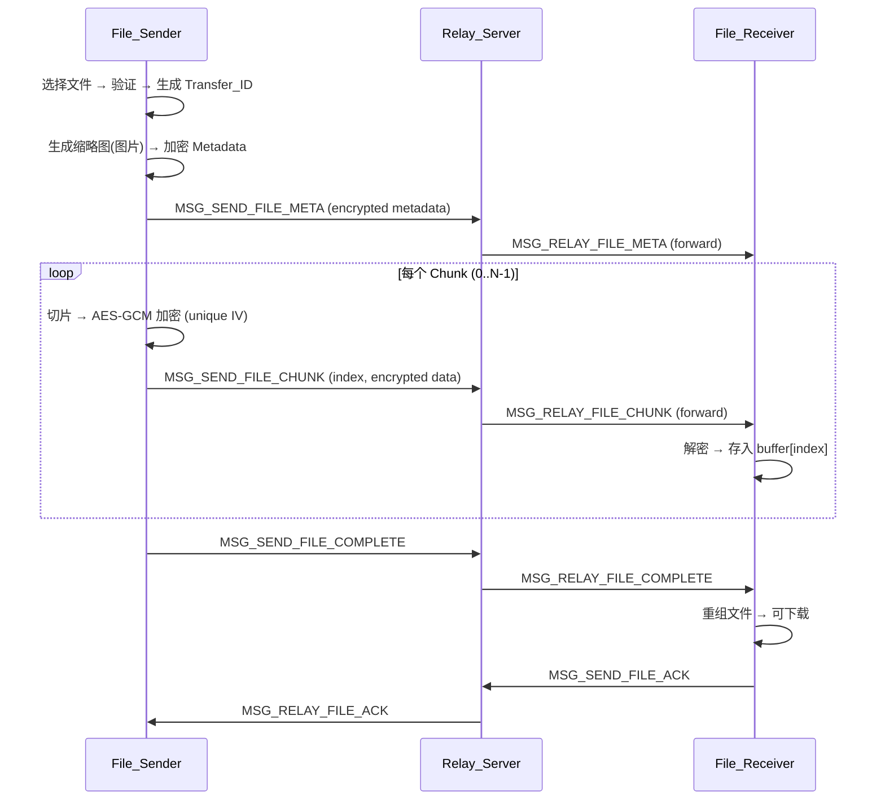
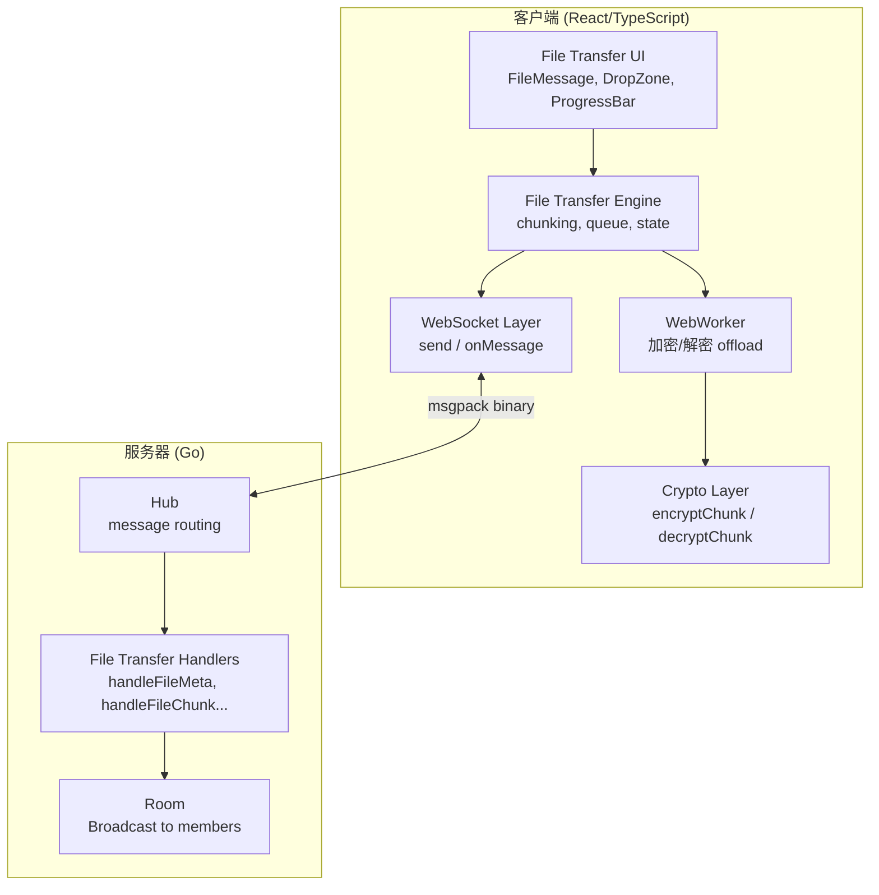
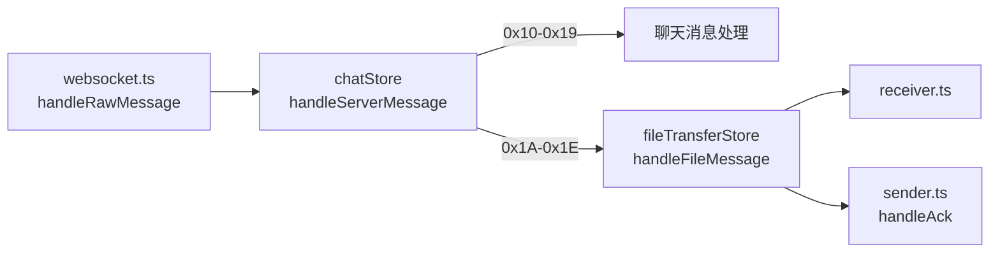
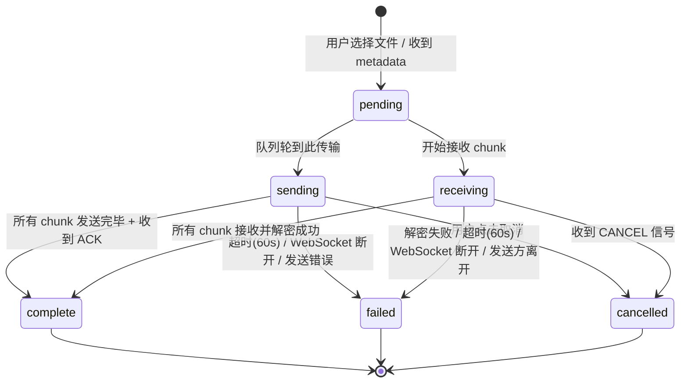

# Design Document: Encrypted File Sharing

## Overview

加密文件分享功能为 Arthas E2EE 聊天应用添加安全的文件传输能力。文件在发送方客户端进行 AES-256-GCM 分片加密，通过 WebSocket 实时中转给房间内在线成员，接收方实时解密并重组文件。服务器保持零知识架构——不存储、不解密、不检查任何文件内容。

核心设计决策：
- **分片加密**：64KB 固定分片，每片独立 IV，允许流式处理且单片损坏不影响其他片
- **二进制传输**：使用 msgpack bin 格式直接传输加密字节，避免 base64 编码的 33% 膨胀
- **顺序传输**：依赖 TCP 保序，无需乱序处理逻辑，简化实现
- **即时中转**：服务器收到即转发，不缓存不持久化，内存占用 O(chunk_size) 仅在写操作期间
- **背压感知**：文件传输使用带超时的阻塞发送，避免 send buffer 满时静默丢包



## Architecture

### 系统层次结构



> 📚 学习要点: WebWorker 架构决策
> 加密/解密操作通过 WebWorker 在独立线程执行，避免阻塞主线程 UI 渲染。
> Engine 通过 postMessage 将 chunk 数据发送给 Worker，Worker 完成加密后回传结果。
> 这确保了即使在低端设备上，文件传输也不会导致 UI 卡顿。
> 当前版本先实现主线程方案（简单），如果性能测试发现瓶颈再迁移到 Worker。

### 与现有架构的集成点

| 层级 | 现有模块 | 文件传输扩展 |
|------|---------|-------------|
| 协议 | `protocol.ts` / `protocol.go` | 新增 10 个消息类型 (0x08-0x0C, 0x1A-0x1E) |
| 加密 | `src/crypto/encrypt.ts`, `decrypt.ts` | 新增 `encryptChunk()` / `decryptChunk()` (ArrayBuffer 版本) |
| 网络 | `websocket.ts` / `client.go` | 提升 maxMessageSize 到 100KB, buffer 到 128KB |
| 状态 | `chatStore.ts` (Zustand) | 新增独立的 `fileTransferStore.ts` |
| UI | `MessageBubble.tsx`, `MessageInput.tsx` | 新增 `FileMessage.tsx`, `DropZone.tsx`, 修改 `MessageInput.tsx` |
| 服务器 | `hub.go` HandleMessage switch | 新增 5 个 case 分支 |

### 消息分发架构

> 📚 学习要点: 多路消息分发
> 现有架构中，`websocket.ts` 的 `handleRawMessage` 将所有消息分发给单一 `messageHandler`（即 `chatStore.handleServerMessage`）。
> 文件传输引入了新的消息类型（0x1A-0x1E），需要路由到独立的 `fileTransferStore`。
> 
> 设计选择：在 `chatStore.handleServerMessage` 的 switch 中增加文件传输 case，
> 内部 import 并调用 `fileTransferStore` 的对应方法。
> 这比修改 `websocket.ts` 支持多 handler 注册更简单，且保持了现有的单入口模式。



**具体实现方案：**

```typescript
// chatStore.ts — handleServerMessage 中新增 case
import { useFileTransferStore } from '../file-transfer/fileTransferStore';

case MSG_RELAY_FILE_META:
case MSG_RELAY_FILE_CHUNK:
case MSG_RELAY_FILE_COMPLETE:
case MSG_RELAY_FILE_CANCEL:
case MSG_RELAY_FILE_ACK: {
  // 委托给文件传输 store 处理
  useFileTransferStore.getState().handleFileMessage(msg);
  break;
}
```

### 文件消息与聊天列表集成

> 📚 学习要点: 占位符模式（Placeholder Pattern）
> 文件消息需要同时出现在聊天流中（用于 UI 展示）和文件传输 store 中（用于状态管理）。
> 采用「占位符」模式：在 `messages[]` 中插入一个 `type: 'file'` 的特殊消息，
> 包含 `transferId` 引用，实际传输状态从 `fileTransferStore` 读取。
> 这样既保持了消息流的时间顺序，又避免了在 messages 数组中存储大量传输状态。

```typescript
/** 聊天列表中的文件消息占位符 */
interface ChatFileMessage extends ChatMessage {
  type: 'file';
  transferId: string;    // 引用 fileTransferStore 中的传输状态
  fileName: string;      // 冗余存储，用于消息列表快速渲染
  fileSize: number;      // 冗余存储
  mimeType: string;      // 冗余存储，用于显示文件图标
}
```

**发送方乐观渲染流程：**
1. 用户选择文件 → 立即在 `messages[]` 中插入 `ChatFileMessage` 占位符（status: pending）
2. 同时在 `fileTransferStore` 中创建 `TransferState`
3. `FileMessage.tsx` 组件通过 `transferId` 从 `fileTransferStore` 订阅实时状态（进度、速度）
4. 传输完成后，占位符保留在消息流中，状态变为 complete

**接收方流程：**
1. 收到 `MSG_RELAY_FILE_META` → 解密 metadata → 在 `messages[]` 中插入占位符
2. 同时在 `fileTransferStore` 中创建接收状态
3. 后续 chunk 到达时，`FileMessage.tsx` 自动更新进度

### 设计原则

1. **模块隔离**：文件传输逻辑独立于 `src/file-transfer/` 目录，不污染现有聊天代码
2. **复用加密模式**：沿用现有 AES-256-GCM + random IV 模式，仅扩展为 ArrayBuffer 输入
3. **零新依赖**：仅使用 Web Crypto API、Canvas API、MessagePack（已有依赖）
4. **状态分离**：传输状态（buffer、进度）独立于消息数组，不受 MAX_MESSAGES=200 限制
5. **背压感知**：服务器端文件传输使用带超时的发送，避免静默丢包

## 流控与背压设计

> 📚 学习要点: 背压（Backpressure）问题
> 现有 `client.go` 的 `Send()` 方法使用非阻塞 select：
> ```go
> func (c *Client) Send(data []byte) {
>     select {
>     case c.send <- data:
>     default:
>         // 缓冲区满，丢弃 ← 文件分片会被静默丢弃！
>     }
> }
> ```
> `sendBufferSize = 256`，对于聊天消息绰绰有余。但文件传输场景下：
> - 发送方以 10ms 间隔发送 80 个 chunk
> - 服务器 broadcast 给 N-1 个接收方
> - 如果某个接收方网络慢，其 send channel 填满后 chunk 被丢弃
> - 接收方永远收不齐所有 chunk → 传输永远无法完成 → 60s 后超时
>
> 这是一个经典的「生产者-消费者速率不匹配」问题。

### 解决方案：文件传输专用的带超时阻塞发送

```go
// SendFileData 为文件传输消息提供带超时的阻塞发送。
// 与普通 Send() 不同，此方法会等待 send channel 有空间，
// 而不是在缓冲区满时静默丢弃。
//
// 📚 学习要点: 为什么不直接修改 Send() 为阻塞？
// 聊天消息使用非阻塞 Send() 是正确的设计：
// - 聊天消息丢失一条不影响整体体验
// - 阻塞会导致 Hub.Run() goroutine 被慢客户端拖住
// 但文件传输不同：
// - 丢失任何一个 chunk 都会导致整个传输失败
// - 文件传输已有 60s 超时保护，不会无限阻塞
//
// 因此为文件传输提供独立的发送方法，带 5s 超时：
// - 成功：chunk 进入 send channel
// - 超时：通知发送方该接收方传输失败（不影响其他接收方）
func (c *Client) SendFileData(data []byte) bool {
    select {
    case c.send <- data:
        return true
    case <-time.After(5 * time.Second):
        // 接收方 send buffer 持续满 5s，认为该接收方传输失败
        return false
    }
}
```

### 服务器端文件 Broadcast 实现

```go
// BroadcastFileData 向房间内其他成员发送文件传输数据。
// 与普通 Broadcast 不同，使用 SendFileData（带超时阻塞）。
// 如果某个接收方发送超时，记录日志但不影响其他接收方。
//
// 📚 学习要点: 并发 Broadcast 与 Worker Pool
// 串行发送的问题：如果成员 A 的 send buffer 满了，需要等 5s 超时，
// 这 5s 内成员 B、C、D 都无法收到 chunk，导致不必要的延迟。
// 
// 解决方案：并发发送给所有成员。每个成员的 SendFileData 在独立 goroutine 中执行。
// 使用 sync.WaitGroup 等待所有发送完成（或超时），确保函数返回时所有操作已结束。
//
// 为什么不用无限 goroutine？
// MaxMembers=50，每个 chunk 最多创建 49 个短生命周期 goroutine（5s 内结束）。
// 对于 Go runtime 来说这是轻量级的（每个 goroutine 初始栈仅 2KB）。
// 如果未来 MaxMembers 增大，可以引入 worker pool 限制并发数。
func (r *Room) BroadcastFileData(excludeID string, data []byte) {
    r.mu.RLock()
    members := make([]*Member, 0, len(r.members))
    for _, m := range r.members {
        if m.ID != excludeID {
            members = append(members, m)
        }
    }
    r.mu.RUnlock()

    // 并发发送给所有接收方
    var wg sync.WaitGroup
    for _, m := range members {
        wg.Add(1)
        go func(member *Member) {
            defer wg.Done()
            if !member.SendFileFunc(data) {
                logger.Warn("Room", "file data send timeout for member %s", member.ID)
            }
        }(m)
    }
    wg.Wait() // 等待所有发送完成（最多 5s）
}
```

### 客户端发送限速

```typescript
// 📚 学习要点: 客户端主动限速
// 除了服务器端背压，客户端也主动限速：
// - 每个 chunk 之间插入 10ms 延迟（已有设计）
// - 如果检测到 WebSocket bufferedAmount 过高，动态增加延迟
// 这是一种「协作式流控」：客户端和服务器共同防止过载。

const BASE_CHUNK_DELAY_MS = 10;
const MAX_CHUNK_DELAY_MS = 100;
const BUFFER_THRESHOLD = 65536; // 64KB

function getAdaptiveDelay(): number {
  const ws = getWs();
  if (!ws) return BASE_CHUNK_DELAY_MS;
  
  // 📚 学习要点: WebSocket.bufferedAmount
  // 浏览器维护一个发送队列，bufferedAmount 表示尚未发送到网络的字节数。
  // 如果这个值持续增长，说明网络速度跟不上发送速度。
  if (ws.bufferedAmount > BUFFER_THRESHOLD) {
    return Math.min(
      BASE_CHUNK_DELAY_MS * (ws.bufferedAmount / BUFFER_THRESHOLD),
      MAX_CHUNK_DELAY_MS
    );
  }
  return BASE_CHUNK_DELAY_MS;
}
```

### 发送方限速 + 服务器端 per-client 写入监控

| 层级 | 机制 | 作用 |
|------|------|------|
| 客户端 | 10ms 基础延迟 + bufferedAmount 自适应 | 防止客户端发送过快 |
| 服务器 | SendFileData 5s 超时 | 防止慢接收方拖住整个系统 |
| 服务器 | 1 active transfer per client | 防止单客户端占用过多资源 |
| 接收方 | 60s 无新 chunk 超时 | 检测并清理失败的传输 |


## Components and Interfaces

### 客户端模块结构

```
src/file-transfer/
├── types.ts              # 文件传输相关类型定义
├── chunker.ts            # 文件分片逻辑（纯函数）
├── encryptChunk.ts       # Chunk 级加密（复用 crypto 模式）
├── decryptChunk.ts       # Chunk 级解密
├── cryptoWorker.ts       # WebWorker 加密/解密（性能优化，渐进式启用）
├── thumbnail.ts          # 图片缩略图生成（Canvas API）
├── sanitize.ts           # 文件名清理（安全）
├── fileTransferStore.ts  # 传输状态管理（Zustand）
├── persistence.ts        # 传输状态持久化（sessionStorage）
├── sender.ts             # 发送引擎（分片、加密、排队、发送）
├── receiver.ts           # 接收引擎（接收、解密、重组）
└── components/
    ├── FileMessage.tsx    # 文件消息气泡
    ├── DropZone.tsx       # 拖拽上传覆盖层
    ├── ProgressBar.tsx    # 进度条组件
    └── FileAttachButton.tsx # 附件按钮
```

### 服务器端扩展

```
internal/network/
├── protocol.go           # 新增文件传输消息类型常量和数据结构
├── hub.go                # 新增 handleFileMeta, handleFileChunk 等 handler
├── client.go             # 调整 maxMessageSize, ReadBufferSize, WriteBufferSize
│                         # 新增 SendFileData() 方法（带超时阻塞发送）
└── room.go               # 新增 BroadcastFileData() 方法
```

### 服务器端活跃传输追踪

> 📚 学习要点: 服务器端状态最小化
> 服务器保持零知识架构，但需要追踪「每个客户端是否有活跃传输」以实现：
> 1. 限制每客户端同时只有 1 个活跃传输（防止资源滥用）
> 2. 客户端断线时清理传输状态（通知接收方）
> 3. 传输超时清理（COMPLETE/CANCEL 消息丢失时的兜底）
>
> 注意：服务器只追踪 transferId 和时间戳，不存储任何文件内容。

```go
// Client 结构体新增字段
type Client struct {
    // ... 现有字段 ...
    
    // 文件传输追踪（服务器端最小状态）
    activeTransferID string    // 当前活跃传输的 ID（空字符串 = 无活跃传输）
    transferStartAt  time.Time // 传输开始时间（用于服务器端超时清理）
}

// 服务器端传输超时常量
const serverTransferTimeout = 90 * time.Second // 比客户端 60s 超时稍长，作为兜底
```

**生命周期管理：**

```go
// handleFileMeta 中设置活跃传输
func (h *Hub) handleFileMeta(client *Client, data interface{}) {
    // 1. 验证客户端在房间中
    // 2. 验证没有其他活跃传输
    if client.activeTransferID != "" {
        h.sendError(client, ErrCodeInvalidMessage, "already has active transfer")
        return
    }
    // 3. 设置活跃传输
    client.activeTransferID = transferId
    client.transferStartAt = time.Now()
    // 4. 广播 metadata
}

// handleFileComplete / handleFileCancel 中清除活跃传输
func (h *Hub) handleFileComplete(client *Client, data interface{}) {
    // 验证 transferId 匹配
    client.activeTransferID = ""
    // 广播 complete
}

// handleClientDisconnect 中清理（已有方法，新增逻辑）
func (h *Hub) handleClientDisconnect(client *Client) {
    if client.RoomID != "" {
        // 如果有活跃传输，广播 CANCEL 给房间成员
        if client.activeTransferID != "" {
            h.broadcastFileCancel(client)
            client.activeTransferID = ""
        }
        h.handleLeaveRoom(client, nil)
    }
}
```

**服务器端超时清理（兜底机制）：**

```go
// 📚 学习要点: 为什么需要服务器端超时？
// 正常流程中，传输通过 COMPLETE 或 CANCEL 消息结束。
// 但如果这些消息丢失（网络异常、客户端崩溃但 TCP 未断开），
// 服务器需要一个兜底机制来清理 activeTransferID。
// 
// 实现方式：在 Hub.Run() 中增加一个定时器，每 30s 扫描一次，
// 清理超过 90s 的活跃传输。90s > 客户端 60s 超时，
// 确保正常超时流程优先触发。

func (h *Hub) cleanupStaleTransfers() {
    h.mu.RLock()
    defer h.mu.RUnlock()
    now := time.Now()
    for client := range h.clients {
        if client.activeTransferID != "" && 
           now.Sub(client.transferStartAt) > serverTransferTimeout {
            logger.Warn("Hub", "cleaning up stale transfer %s for client %s",
                client.activeTransferID, client.ID)
            client.activeTransferID = ""
        }
    }
}
```

### 核心接口定义

#### 客户端 — File Transfer Engine

```typescript
// sender.ts — 发送引擎
interface FileSender {
  /** 发起文件传输（验证 → 分片 → 加密 → 发送） */
  sendFile(file: File, roomKey: CryptoKey): Promise<void>;
  /** 取消当前传输 */
  cancelTransfer(transferId: string): void;
}

// receiver.ts — 接收引擎
interface FileReceiver {
  /** 处理收到的文件元数据 */
  handleFileMeta(data: RelayFileMetaData, roomKey: CryptoKey): Promise<void>;
  /** 处理收到的加密分片 */
  handleFileChunk(data: RelayFileChunkData, roomKey: CryptoKey): Promise<void>;
  /** 处理传输完成信号 */
  handleFileComplete(data: RelayFileCompleteData): void;
  /** 处理传输取消信号 */
  handleFileCancel(data: RelayFileCancelData): void;
}
```

#### 客户端 — File Transfer Store

```typescript
// fileTransferStore.ts — 统一消息入口
interface FileTransferActions {
  /** 统一处理所有文件传输相关的服务器消息 */
  handleFileMessage(msg: Message): void;
  /** 发起文件传输 */
  initiateTransfer(file: File): void;
  /** 取消传输 */
  cancelTransfer(transferId: string): void;
  /** 清理已完成的传输（释放内存） */
  cleanupTransfer(transferId: string): void;
}
```

#### 服务器端 — Hub Handlers

```go
// hub.go — 新增处理函数
func (h *Hub) handleFileMeta(client *Client, data interface{})
func (h *Hub) handleFileChunk(client *Client, data interface{})
func (h *Hub) handleFileComplete(client *Client, data interface{})
func (h *Hub) handleFileCancel(client *Client, data interface{})
func (h *Hub) handleFileAck(client *Client, data interface{})
```

## Data Models

### 协议消息类型 (新增)

```typescript
// === Client → Server ===
export const MSG_SEND_FILE_META     = 0x08;  // 发送加密文件元数据
export const MSG_SEND_FILE_CHUNK    = 0x09;  // 发送加密文件分片
export const MSG_SEND_FILE_COMPLETE = 0x0A;  // 传输完成信号
export const MSG_SEND_FILE_CANCEL   = 0x0B;  // 取消传输
export const MSG_SEND_FILE_ACK      = 0x0C;  // 接收确认

// === Server → Client ===
export const MSG_RELAY_FILE_META     = 0x1A;  // 中转文件元数据
export const MSG_RELAY_FILE_CHUNK    = 0x1B;  // 中转文件分片
export const MSG_RELAY_FILE_COMPLETE = 0x1C;  // 中转完成信号
export const MSG_RELAY_FILE_CANCEL   = 0x1D;  // 中转取消信号
export const MSG_RELAY_FILE_ACK      = 0x1E;  // 中转接收确认
```

### 客户端数据结构

```typescript
/** 文件传输元数据（加密前的明文结构） */
interface FileMetadata {
  transferId: string;       // NanoID 21 chars
  fileName: string;         // 原始文件名
  fileSize: number;         // 文件大小（字节）
  mimeType: string;         // MIME 类型
  totalChunks: number;      // 分片总数 = ceil(fileSize / 65536)
  thumbnail?: Uint8Array;   // 可选：加密前的缩略图数据 (≤50KB, JPEG)
  chunkHashes?: string[];   // 可选：每个 chunk 明文的 SHA-256 hash (hex, 用于未来 resume 校验)
}

/** 加密后的文件元数据消息 (Client → Server) */
interface SendFileMetaData {
  transferId: string;       // 明文传输 ID（用于路由）
  iv: string;               // base64url IV (metadata 加密)
  ciphertext: Uint8Array;   // msgpack bin: 加密后的 FileMetadata JSON
}

/**
 * 加密后的文件分片消息 (Client → Server)
 *
 * 📚 学习要点: IV 格式差异（base64url vs binary）
 * Metadata 的 iv 使用 string（base64url 编码），而 Chunk 的 iv 使用 Uint8Array（原始二进制）。
 * 这是有意的性能优化：
 * - Metadata 只发送一次，base64url 方便调试和日志记录
 * - Chunk 高频发送（80 次/文件），避免 base64 编码/解码开销
 *   每次 base64 编码 12 bytes → 16 chars，解码需要字符串解析
 *   直接使用 msgpack bin 格式传输原始字节，零额外开销
 * - msgpack 对 Uint8Array 使用 bin 格式，比 string 更紧凑
 */
interface SendFileChunkData {
  transferId: string;       // 明文传输 ID
  index: number;            // 分片索引 (0-based, uint16)
  iv: Uint8Array;           // 12 bytes IV (bin format, not base64)
  data: Uint8Array;         // 加密后的分片数据 (bin format)
}

/** 传输完成信号 */
interface SendFileCompleteData {
  transferId: string;
}

/** 取消传输信号 */
interface SendFileCancelData {
  transferId: string;
}

/** 接收确认信号 */
interface SendFileAckData {
  transferId: string;
}

/** 中转文件元数据 (Server → Client) */
interface RelayFileMetaData {
  senderId: string;
  senderName: string;
  transferId: string;
  iv: string;
  ciphertext: Uint8Array;
  t: number;                // 服务器时间戳
}

/** 中转文件分片 (Server → Client) */
interface RelayFileChunkData {
  senderId: string;
  transferId: string;
  index: number;
  iv: Uint8Array;
  data: Uint8Array;
}

/** 中转完成信号 (Server → Client) */
interface RelayFileCompleteData {
  senderId: string;
  transferId: string;
}

/** 中转取消信号 (Server → Client) */
interface RelayFileCancelData {
  senderId: string;
  transferId: string;
}

/** 中转接收确认 (Server → Client) */
interface RelayFileAckData {
  receiverId: string;
  transferId: string;
}
```

### 传输状态模型

```typescript
/** 传输方向 */
type TransferDirection = 'send' | 'receive';

/** 传输状态 */
type TransferStatus = 
  | 'pending'       // 排队等待
  | 'sending'       // 正在发送分片
  | 'receiving'     // 正在接收分片
  | 'complete'      // 传输完成
  | 'failed'        // 传输失败
  | 'cancelled';    // 已取消

/** 单次传输的完整状态 */
interface TransferState {
  transferId: string;
  direction: TransferDirection;
  status: TransferStatus;
  fileName: string;
  fileSize: number;
  mimeType: string;
  totalChunks: number;
  receivedChunks: number;       // 已接收/已发送的分片数
  lastReceivedIndex: number;    // 最后成功接收的 chunk 索引（用于未来 resume 和进度恢复）
  chunks: (Uint8Array | null)[]; // 接收方: 解密后的分片缓冲区
  chunkHashes?: string[];        // 可选：从 metadata 获取的 chunk hash 列表
  thumbnail?: string;            // data URL (解密后的缩略图)
  blobUrl?: string;              // 完成后的下载 URL
  error?: string;                // 错误信息
  startTime: number;             // 传输开始时间
  lastChunkTime: number;         // 最后一个分片的时间
  senderId: string;
  senderName: string;
  ackCount: number;              // 发送方: 已确认接收的人数
  totalReceivers: number;        // 发送方: 总接收人数
  chatMessageId: string;         // 对应的聊天消息占位符 ID（用于 ephemeral 清理）
}

/** 文件传输 Store 状态 */
interface FileTransferState {
  transfers: Map<string, TransferState>;  // transferId → state
  sendQueue: string[];                     // 待发送队列 (max 3)
  activeSendId: string | null;             // 当前活跃发送的 transferId
  activeReceiveCount: number;              // 当前活跃接收传输数
}
```

### 并发接收限制

> 📚 学习要点: 内存保护策略
> 如果 10 个发送方同时发送 5MB 文件，接收方需要 50MB 缓冲区。
> 在移动设备或低内存环境下，这可能导致页面崩溃。
> 因此限制最大并发接收传输数为 5 个，超过限制时静默丢弃新传输的 metadata。

```typescript
const MAX_CONCURRENT_RECEIVES = 5;

// receiver.ts — handleFileMeta 中的并发检查
function handleFileMeta(data: RelayFileMetaData, roomKey: CryptoKey): void {
  const { transfers, activeReceiveCount } = useFileTransferStore.getState();
  
  // 并发接收限制：防止内存耗尽
  if (activeReceiveCount >= MAX_CONCURRENT_RECEIVES) {
    console.warn('[FileTransfer] Max concurrent receives reached, discarding:', data.transferId);
    return; // 静默丢弃，不通知发送方（发送方通过 ACK 缺失感知）
  }
  
  // ... 正常处理逻辑
}
```

### 传输状态机

> 📚 学习要点: 有限状态机（FSM）
> 每个传输的生命周期可以用有限状态机精确描述。
> 明确的状态转换规则防止非法状态（如从 complete 回到 sending），
> 也使得 UI 渲染和资源清理逻辑更容易推理正确性。



**状态转换规则（exhaustive）：**

| 当前状态 | 触发事件 | 目标状态 | 副作用 |
|---------|---------|---------|--------|
| pending | 队列调度 | sending | 开始发送 chunk |
| pending | 收到首个 chunk | receiving | 启动超时定时器 |
| pending | 用户取消 | cancelled | 从队列移除 |
| pending | 超时(60s) | failed | 释放 buffer |
| sending | 所有 chunk 已发送 | complete* | 等待 ACK |
| sending | 超时(60s 无 ACK) | failed | — |
| sending | WebSocket 断开 | failed | — |
| sending | 用户取消 | cancelled | 发送 CANCEL 消息 |
| receiving | 所有 chunk 已收齐 | complete | 重组文件, 发送 ACK |
| receiving | 解密失败 | failed | 释放 buffer |
| receiving | 超时(60s 无新 chunk) | failed | 释放 buffer |
| receiving | WebSocket 断开 | failed | 释放 buffer |
| receiving | 收到 CANCEL | cancelled | 释放 buffer |
| receiving | 发送方离开(MEMBER_LEFT) | failed | 释放 buffer |

*注：发送方的 "complete" 分两阶段：chunk 全部发送后进入 complete 状态，ACK 计数持续更新。

### 服务器端数据结构 (Go)

```go
// --- 文件传输 Client → Server 数据结构 ---

// SendFileMetaData 发送加密文件元数据。
type SendFileMetaData struct {
    TransferID string `msgpack:"transferId"`
    IV         string `msgpack:"iv"`
    Ciphertext []byte `msgpack:"ciphertext"` // msgpack bin format
}

// SendFileChunkData 发送加密文件分片。
type SendFileChunkData struct {
    TransferID string `msgpack:"transferId"`
    Index      int    `msgpack:"index"`
    IV         []byte `msgpack:"iv"`   // 12 bytes, bin format
    Data       []byte `msgpack:"data"` // encrypted chunk, bin format
}

// SendFileCompleteData 传输完成信号。
type SendFileCompleteData struct {
    TransferID string `msgpack:"transferId"`
}

// SendFileCancelData 取消传输信号。
type SendFileCancelData struct {
    TransferID string `msgpack:"transferId"`
}

// SendFileAckData 接收确认信号。
type SendFileAckData struct {
    TransferID string `msgpack:"transferId"`
}

// --- 文件传输 Server → Client 数据结构 ---

// RelayFileMetaData 中转文件元数据给房间成员。
type RelayFileMetaData struct {
    SenderID   string `msgpack:"senderId"`
    SenderName string `msgpack:"senderName"`
    TransferID string `msgpack:"transferId"`
    IV         string `msgpack:"iv"`
    Ciphertext []byte `msgpack:"ciphertext"`
    T          int64  `msgpack:"t"`
}

// RelayFileChunkData 中转文件分片给房间成员。
type RelayFileChunkData struct {
    SenderID   string `msgpack:"senderId"`
    TransferID string `msgpack:"transferId"`
    Index      int    `msgpack:"index"`
    IV         []byte `msgpack:"iv"`
    Data       []byte `msgpack:"data"`
}

// RelayFileCompleteData 中转传输完成信号。
type RelayFileCompleteData struct {
    SenderID   string `msgpack:"senderId"`
    TransferID string `msgpack:"transferId"`
}

// RelayFileCancelData 中转取消信号。
type RelayFileCancelData struct {
    SenderID   string `msgpack:"senderId"`
    TransferID string `msgpack:"transferId"`
}

// RelayFileAckData 中转接收确认给发送方。
type RelayFileAckData struct {
    ReceiverID string `msgpack:"receiverId"`
    TransferID string `msgpack:"transferId"`
}
```

### 分片策略

```
文件: [========================================] 320KB
      |  Chunk 0  |  Chunk 1  |  Chunk 2  |  Chunk 3  | Chunk 4 |
      |   64KB    |   64KB    |   64KB    |   64KB    |  64KB   |
      
加密后每片: [12B IV][ciphertext (64KB + 16B GCM tag)]
总开销: 28 bytes/chunk × ceil(fileSize/65536) chunks

最大文件 5MB = 80 chunks × (65536 + 28) = 5,244,640 bytes 传输总量
额外开销: 80 × 28 = 2,240 bytes (0.04%) — 可忽略
```

### WebSocket 消息大小计算

```
单个 MSG_SEND_FILE_CHUNK 的 msgpack 编码大小:
- type field: 1 byte (fixint)
- data map header: 1 byte (fixmap, 4 fields)
- "transferId" key + 21 char value: ~25 bytes
- "index" key + uint16 value: ~8 bytes
- "iv" key + 12 bytes bin: ~16 bytes
- "data" key + (65536 + 16) bytes bin: ~65,558 bytes
- msgpack envelope overhead: ~10 bytes
总计: ~65,620 bytes ≈ 64KB

maxMessageSize = 100KB (102400) 提供充足余量
ReadBufferSize = WriteBufferSize = 128KB (131072)
```

## Correctness Properties

*A property is a characteristic or behavior that should hold true across all valid executions of a system—essentially, a formal statement about what the system should do. Properties serve as the bridge between human-readable specifications and machine-verifiable correctness guarantees.*

### Property 1: Chunk split/reassemble round-trip

*For any* ArrayBuffer of size 1 to 5,242,880 bytes (5MB), splitting it into 64KB chunks and then concatenating those chunks in order SHALL produce a byte-for-byte identical copy of the original buffer. Additionally, all chunks except the last SHALL be exactly 65,536 bytes, and the total number of chunks SHALL equal `Math.ceil(size / 65536)`.

**Validates: Requirements 2.1, 2.2, 5.3**

### Property 2: Chunk encryption round-trip

*For any* ArrayBuffer chunk (1 byte to 65,536 bytes) and any valid AES-256-GCM CryptoKey, encrypting the chunk with `encryptChunk(key, chunk)` and then decrypting the result with `decryptChunk(key, iv, ciphertext)` SHALL produce a byte-for-byte identical copy of the original chunk.

**Validates: Requirements 2.5, 2.3, 2.4, 5.2**

### Property 3: Encrypted chunk structure invariant

*For any* plaintext chunk of N bytes encrypted with AES-256-GCM, the resulting encrypted output SHALL have an IV of exactly 12 bytes and a ciphertext of exactly N + 16 bytes (where 16 bytes is the GCM authentication tag). The total encryption overhead per chunk is exactly 28 bytes.

**Validates: Requirements 2.6, 2.3**

### Property 4: Server relay preserves bytes

*For any* file transfer message (metadata, chunk, complete, cancel, ack) sent by a client, the data relayed by the server to other room members SHALL be byte-for-byte identical to the original encrypted payload. The server SHALL NOT modify, truncate, or reorder the binary content.

**Validates: Requirements 4.3, 4.1**

### Property 5: File name sanitization

*For any* string input, the `sanitizeFileName` function SHALL produce an output that: (a) contains no forward slash `/`, (b) contains no backslash `\`, (c) contains no null byte `\0`, (d) has length ≤ 255 characters, and (e) is idempotent — `sanitize(sanitize(x)) === sanitize(x)`.

**Validates: Requirements 5.10**

### Property 6: Thumbnail dimension and size constraints

*For any* image file (PNG, JPEG, GIF, WebP) up to 5MB, the generated thumbnail SHALL have: (a) maximum dimension (width or height) ≤ 300 pixels, (b) total byte size ≤ 51,200 bytes (50KB), and (c) JPEG format output.

**Validates: Requirements 8.1**

### Property 7: Transfer queue invariant

*For any* sequence of file transfer requests from a single sender, at most 1 transfer SHALL be in 'sending' status at any time, at most 3 transfers SHALL be in 'pending' (queued) status, and any request beyond the queue limit SHALL be rejected. The queue SHALL process transfers in FIFO order.

**Validates: Requirements 3.7, 4.9, 11.3, 11.4**

### Property 8: Progress calculation correctness

*For any* transfer with `totalChunks > 0` and `receivedChunks` in range `[0, totalChunks]`, the progress percentage SHALL equal `Math.floor(receivedChunks / totalChunks * 100)`. For any transfer with elapsed time > 0 and bytes transferred > 0, the speed SHALL equal `bytesTransferred / elapsedSeconds` (KB/s) and ETA SHALL equal `remainingBytes / speed` (seconds).

**Validates: Requirements 7.1, 7.4, 7.5**

### Property 9: File size validation

*For any* file with size in bytes, the validation function SHALL accept files where `size > 0 && size <= 5,242,880` and reject files where `size <= 0 || size > 5,242,880`. The boundary value 5,242,880 (5MB exactly) SHALL be accepted.

**Validates: Requirements 1.1**

### Property 10: Concurrent transfers independence

*For any* N simultaneous incoming transfers (each with a unique Transfer_ID), receiving a chunk for transfer A SHALL NOT modify the buffer, progress, or state of any other transfer B. Each transfer's state is isolated by its Transfer_ID.

**Validates: Requirements 5.8**

### Property 11: Unknown Transfer_ID discard

*For any* incoming chunk message whose Transfer_ID does not exist in the active transfers map, the receiver SHALL silently discard the chunk without creating new state, modifying existing state, or raising an error to the user.

**Validates: Requirements 11.7**

### Property 12: Chunk index bounds validation

*For any* incoming chunk message with `index` field, the receiver SHALL validate that `index >= 0 && index < transfer.totalChunks`. If the index is out of bounds, the receiver SHALL silently discard the chunk without modifying transfer state. This prevents malicious senders from causing out-of-bounds array access or triggering allocation of excessively large arrays.

**Validates: Requirements 5.6, 11.7 (extended)**

```typescript
// receiver.ts — Chunk 索引边界验证
function handleFileChunk(data: RelayFileChunkData, roomKey: CryptoKey): void {
  const transfer = transfers.get(data.transferId);
  if (!transfer) return; // Property 11: unknown transferId

  // Property 12: index bounds check
  // 📚 学习要点: 防御性编程
  // 恶意发送方可能发送 index = 65535（uint16 最大值），
  // 如果不验证，会导致 chunks[] 数组越界访问或触发 JS 引擎分配巨大稀疏数组。
  // 例如 chunks[65535] = data 会创建一个长度为 65536 的稀疏数组，浪费内存。
  if (data.index < 0 || data.index >= transfer.totalChunks) {
    console.warn('[FileTransfer] Invalid chunk index:', data.index, 
                 'expected < ', transfer.totalChunks);
    return; // 静默丢弃非法 chunk
  }

  // ... 正常解密和存储逻辑
}
```

### Property 13: Backpressure delivery guarantee

*For any* file chunk relayed by the server, the server SHALL either: (a) successfully deliver the chunk to the receiver's send buffer within 5 seconds, OR (b) log a warning and skip that receiver for that chunk. The server SHALL NOT silently discard chunks without any detection mechanism. Failed deliveries are detectable through the receiver's 60s timeout and the sender's ACK count.

**Validates: Requirements 4.1, 4.4 (extended), 流控设计**

## Ephemeral Mode 集成

> 📚 学习要点: Ephemeral 与文件传输的交互
> Ephemeral 模式要求消息在指定时间后消失。文件传输需要特殊处理：
> - 传输进行中时，不能删除文件消息气泡（否则用户无法看到进度）
> - 倒计时从传输完成时开始，而非消息出现时
> - 已下载到本地的文件不受影响

**实现细节：**

```typescript
// handleFileComplete 中启动 ephemeral timer
function handleFileComplete(data: RelayFileCompleteData): void {
  const transfer = transfers.get(data.transferId);
  if (!transfer) return;
  
  // 标记传输完成
  transfer.status = 'complete';
  
  // 如果房间启用了 ephemeral 模式，从完成时刻开始倒计时
  const { ephemeral } = useChatStore.getState();
  if (ephemeral > 0) {
    // 📚 学习要点: 为什么从完成时开始计时？
    // 如果从消息出现时计时，大文件传输可能在倒计时结束前还没完成，
    // 导致用户永远无法下载文件。从完成时计时确保用户至少有
    // ephemeral 秒的时间来下载文件。
    scheduleEphemeralRemoval(transfer.chatMessageId, ephemeral);
  }
}

// ephemeral 触发时的清理逻辑
function handleEphemeralExpiry(transferId: string): void {
  const transfer = transfers.get(transferId);
  if (!transfer) return;
  
  if (transfer.status === 'receiving' || transfer.status === 'sending') {
    // 传输仍在进行中 — 中止传输并释放资源
    transfer.status = 'cancelled';
    cleanupTransfer(transferId);
  } else {
    // 传输已完成 — 仅清理内存（已下载的文件不受影响）
    cleanupTransfer(transferId);
  }
}
```

## Error Handling

### 错误分类与处理策略

| 错误场景 | 检测方式 | 处理策略 | 用户反馈 |
|---------|---------|---------|---------|
| 文件超过 5MB | 选择时验证 | 拒绝，不发送 | "文件大小不能超过 5MB" |
| 分片解密失败 | `crypto.subtle.decrypt` 抛异常 | 中止传输，释放 buffer | "文件解密失败" |
| 传输超时 (60s) | 定时器检查 `lastChunkTime` | 标记失败，释放 buffer | "传输超时" |
| WebSocket 断开 | `ws.onclose` 事件 | 标记所有活跃传输失败 | "连接断开，传输失败" |
| 发送方取消 | 收到 MSG_RELAY_FILE_CANCEL | 释放 buffer | "发送方已取消传输" |
| 发送方离开房间 | 收到 MSG_MEMBER_LEFT | 标记相关传输失败 | "发送方已离开，传输中断" |
| 房间关闭 | 收到 MSG_ROOM_CLOSED | 中止所有传输，释放所有 buffer | "房间已关闭" |
| 队列已满 (>3) | 队列长度检查 | 拒绝新传输 | "队列已满，请稍后再试" |
| 未知 Transfer_ID | Map 查找失败 | 静默丢弃 | 无 |
| Buffer 超过 5MB | 累计大小检查 | 中止传输 | "文件数据异常，传输中止" |
| Chunk 索引越界 | `index >= totalChunks` | 静默丢弃该 chunk | 无 |
| 并发接收超限 (>5) | activeReceiveCount 检查 | 静默丢弃新传输 metadata | 无 |
| 服务器端发送超时 | SendFileData 5s 超时 | 跳过该接收方 | 接收方 60s 后超时 |
| 服务器端活跃传输冲突 | activeTransferID 非空 | 拒绝新传输 | "already has active transfer" |

### 服务器端错误处理

```go
// 服务器端验证清单（在 handler 中执行）:
// 1. client.RoomID != "" — 客户端必须在房间中
// 2. transferId 非空 — 必须有有效的传输 ID
// 3. 对于 chunk: index 使用 toInt() 解析，data 为 []byte 类型
// 4. 对于 meta: 验证 client.activeTransferID == ""（无其他活跃传输）
// 5. 对于 chunk/complete/cancel: 验证 transferId == client.activeTransferID
// 6. 验证失败 → sendError(client, ErrCodeInvalidMessage, ...)
```

### 内存安全

```typescript
// 📚 学习要点: 内存泄漏防护
// 1. 传输完成/失败/取消时，立即清空 chunks[] 数组引用
// 2. Blob URL 在下载完成或消息移除时 revoke
// 3. 超时定时器在传输结束时 clearTimeout
// 4. 房间关闭时遍历所有活跃传输执行清理
// 5. 并发接收限制防止内存耗尽（MAX_CONCURRENT_RECEIVES = 5）

function cleanupTransfer(transferId: string): void {
  const transfer = transfers.get(transferId);
  if (!transfer) return;
  
  // 释放分片缓冲区
  transfer.chunks = [];
  
  // 释放 Blob URL
  if (transfer.blobUrl) {
    URL.revokeObjectURL(transfer.blobUrl);
    transfer.blobUrl = undefined;
  }
  
  // 清除超时定时器
  clearTransferTimeout(transferId);
  
  // 更新活跃接收计数
  if (transfer.direction === 'receive' && 
      (transfer.status === 'receiving' || transfer.status === 'pending')) {
    useFileTransferStore.setState((state) => ({
      activeReceiveCount: state.activeReceiveCount - 1
    }));
  }
}
```

## Broadcast 放大效应与运行时监控

> 📚 学习要点: 带宽放大（Bandwidth Amplification）
> 文件传输的 broadcast 模式导致带宽放大：
> - 发送方上传 5MB
> - 服务器转发给 N-1 个接收方 → 出口流量 = 5MB × (N-1)
> - MaxMembers=50 时，最大出口流量 = 5MB × 49 ≈ 245MB/次传输
>
> 这是 P2P 中转架构的固有特性，缓解措施：
> 1. 5MB 文件大小限制（已有）
> 2. 大房间警告（>10人时提示用户）
> 3. 每客户端 1 个活跃传输限制
> 4. 运行时监控指标

### 监控指标（待实现）

```go
// 📚 学习要点: 可观测性（Observability）
// 生产环境中需要监控以下指标，以便及时发现性能瓶颈：
// - file_transfer_active_count: 当前活跃传输数（gauge）
// - file_transfer_bytes_relayed_total: 累计中转字节数（counter）
// - file_transfer_send_timeout_total: SendFileData 超时次数（counter）
// - file_transfer_duration_seconds: 传输耗时分布（histogram）
//
// 当前阶段（学习项目）使用 logger 记录关键事件，
// 未来可接入 Prometheus/OpenTelemetry。

// hub.go — 文件传输事件日志
func (h *Hub) handleFileChunk(client *Client, data interface{}) {
    // ... 验证逻辑 ...
    
    // 记录大房间的文件传输（监控放大效应）
    memberCount := r.MemberCount()
    if memberCount > 10 {
        logger.Info("FileTransfer", "chunk relay: transfer=%s, room_members=%d, amplification=%dx",
            transferId, memberCount, memberCount-1)
    }
    
    // 使用 BroadcastFileData（带超时）而非普通 Broadcast
    r.BroadcastFileData(client.ID, broadcastData)
}
```

## 扩展性设计与未来演进

> 📚 学习要点: 可扩展架构（Extensible Architecture）
> 好的设计不仅解决当前问题，还为未来演进预留扩展点。
> 以下设计决策在当前版本中不实现完整功能，但通过预留字段和接口，
> 使得未来版本可以在不破坏兼容性的前提下增加能力。

### 1. 断点续传预留（Resume/Partial Retry）

**当前版本行为：** 传输失败后需要完全重新发送，不支持从断点继续。

**预留设计：** `TransferState` 中的 `lastReceivedIndex` 字段记录最后成功接收的 chunk 索引。

```typescript
// 📚 学习要点: 为什么当前不实现 Resume？
// 1. 复杂度高：需要新增 MSG_RESUME_TRANSFER 协议消息
// 2. 安全考量：resume 需要验证发送方身份未变（防止中间人注入 chunk）
// 3. 场景有限：5MB 文件在正常网络下 <10s 完成，重传成本低
// 4. 服务器无状态：服务器不存储任何传输历史，resume 只能在双方都在线时触发
//
// 未来实现路径：
// 1. 接收方断线重连后，检查 sessionStorage 中的 lastReceivedIndex
// 2. 发送方如果仍在线且传输未超时，发送 MSG_RESUME_REQUEST(transferId, fromIndex)
// 3. 发送方从 fromIndex 开始重新发送剩余 chunk
// 4. 需要 chunkHashes 验证已收到的 chunk 完整性（防止内存中的数据被篡改）

// 未来 Resume 协议扩展（预留，当前不实现）
// export const MSG_SEND_FILE_RESUME  = 0x0D;  // 请求从指定 index 继续
// export const MSG_RELAY_FILE_RESUME = 0x1F;  // 中转 resume 请求

interface ResumeRequestData {
  transferId: string;
  fromIndex: number;        // 从此 index 开始重新发送
  receivedHashes: string[]; // 已收到 chunk 的 hash（用于校验）
}
```

### 2. Chunk Hash 完整性校验

**当前版本行为：** 依赖 AES-GCM 的 authentication tag 做完整性校验（解密失败 = 数据损坏）。

**预留设计：** `FileMetadata` 中的可选 `chunkHashes` 字段。

```typescript
// 📚 学习要点: 为什么需要额外的 Hash？
// AES-GCM auth tag 已经保证了密文完整性，为什么还需要明文 hash？
//
// 场景 1: Resume 校验
// 接收方断线重连后，内存中的已解密 chunk 可能已被 GC 回收。
// 如果从 sessionStorage 恢复了 lastReceivedIndex，需要验证
// 之前解密的 chunk 是否仍然正确（防止内存损坏或 bug）。
//
// 场景 2: 并行下载验证（未来 P2P 模式）
// 如果未来支持从多个 peer 并行下载不同 chunk，
// 需要独立验证每个 chunk 的正确性（不依赖加密层）。
//
// 当前版本：chunkHashes 字段为 optional，发送方可以选择不生成。
// 生成 hash 的开销：SHA-256(64KB) ≈ 0.1ms（Web Crypto API 硬件加速）
// 80 chunks × 64 chars/hash = 5120 chars 额外 metadata 开销（可接受）

async function generateChunkHashes(chunks: ArrayBuffer[]): Promise<string[]> {
  return Promise.all(chunks.map(async (chunk) => {
    const hash = await crypto.subtle.digest('SHA-256', chunk);
    return Array.from(new Uint8Array(hash))
      .map(b => b.toString(16).padStart(2, '0'))
      .join('');
  }));
}

// 接收方验证（可选，仅当 metadata 包含 chunkHashes 时）
async function verifyChunk(chunk: ArrayBuffer, expectedHash: string): Promise<boolean> {
  const hash = await crypto.subtle.digest('SHA-256', chunk);
  const actual = Array.from(new Uint8Array(hash))
    .map(b => b.toString(16).padStart(2, '0'))
    .join('');
  return actual === expectedHash;
}
```

### 3. WebWorker 加密卸载

**当前版本行为：** 加密/解密在主线程执行。NFR-1 要求每 chunk 不超过 50ms。

**渐进式迁移策略：**

```typescript
// 📚 学习要点: WebWorker 渐进式迁移
// 阶段 1（当前）：主线程加密，简单直接
// 阶段 2（性能优化）：检测到主线程阻塞时自动切换到 Worker
// 阶段 3（完全 Worker）：所有加密操作在 Worker 中执行
//
// 为什么不一开始就用 Worker？
// 1. Worker 通信有 postMessage 序列化开销（Transferable 可缓解）
// 2. Worker 中的 CryptoKey 不能直接传递（需要 exportKey/importKey）
// 3. 调试 Worker 比主线程困难
// 4. 64KB chunk 的 AES-GCM 加密在现代设备上 <5ms（远低于 50ms 阈值）
//
// 触发迁移的信号：
// - 性能测试发现 encryptChunk 耗时 > 20ms（接近阈值）
// - 用户报告文件传输时 UI 卡顿
// - 需要支持更大的 chunk size（如 256KB）

// cryptoWorker.ts — WebWorker 实现骨架
// 📚 学习要点: Transferable Objects
// postMessage 默认会复制数据（structured clone），对于 64KB chunk 这意味着
// 额外的内存分配和复制开销。使用 Transferable 可以「转移」所有权而非复制：
// worker.postMessage({ chunk }, [chunk]) — chunk 的所有权转移给 Worker，
// 主线程不再能访问该 ArrayBuffer（变为 detached 状态）。

interface CryptoWorkerMessage {
  type: 'encrypt' | 'decrypt';
  id: number;              // 请求 ID，用于匹配响应
  chunk: ArrayBuffer;      // Transferable
  keyData: ArrayBuffer;    // 导出的 raw key（Transferable）
  iv?: ArrayBuffer;        // 解密时提供
}

interface CryptoWorkerResponse {
  type: 'result' | 'error';
  id: number;
  data?: ArrayBuffer;      // 加密/解密结果（Transferable）
  iv?: ArrayBuffer;        // 加密时生成的 IV
  error?: string;
}

// 主线程适配器（透明切换主线程/Worker）
class CryptoAdapter {
  private worker: Worker | null = null;
  private useWorker = false;
  private pendingRequests = new Map<number, { resolve: Function; reject: Function }>();
  private nextId = 0;

  constructor() {
    // 📚 学习要点: Feature Detection
    // 检测 Worker 是否可用（某些环境如 SSR 不支持）
    if (typeof Worker !== 'undefined') {
      try {
        this.worker = new Worker(
          new URL('./cryptoWorker.ts', import.meta.url),
          { type: 'module' }
        );
        this.worker.onmessage = this.handleResponse.bind(this);
        this.useWorker = true;
      } catch {
        // Worker 创建失败，回退到主线程
        this.useWorker = false;
      }
    }
  }

  async encryptChunk(key: CryptoKey, chunk: ArrayBuffer): Promise<{ iv: Uint8Array; data: Uint8Array }> {
    if (!this.useWorker) {
      // 回退：主线程加密
      return encryptChunkMainThread(key, chunk);
    }
    // Worker 加密（Transferable 传输，零拷贝）
    return this.postToWorker('encrypt', chunk, key);
  }

  // ... decrypt 类似
}
```

### 4. 传输状态持久化（sessionStorage）

**当前版本行为：** 页面刷新后所有传输状态丢失，进行中的传输无法恢复。

**持久化策略：**

```typescript
// 📚 学习要点: 为什么用 sessionStorage 而非 localStorage？
// - sessionStorage: 标签页关闭后清除，适合临时传输状态
// - localStorage: 永久存储，需要手动清理，可能积累垃圾数据
// 
// 文件传输是临时操作，关闭标签页后传输必然失败（WebSocket 断开），
// 因此 sessionStorage 的生命周期完美匹配。
//
// 持久化内容（不含 chunks buffer）：
// - transferId, status, fileName, fileSize, mimeType
// - totalChunks, receivedChunks, lastReceivedIndex
// - startTime, senderId, senderName
// - direction, error
//
// 不持久化的内容：
// - chunks[] — 太大（最多 5MB），且刷新后无法恢复加密上下文
// - blobUrl — Blob URL 在页面刷新后失效
// - roomKey — 安全原因，不存储密钥

const STORAGE_KEY = 'arthas_file_transfers';

interface PersistedTransferState {
  transferId: string;
  direction: TransferDirection;
  status: TransferStatus;
  fileName: string;
  fileSize: number;
  mimeType: string;
  totalChunks: number;
  receivedChunks: number;
  lastReceivedIndex: number;
  startTime: number;
  senderId: string;
  senderName: string;
  error?: string;
}

// persistence.ts — 持久化模块

/**
 * 保存传输状态到 sessionStorage（去除大数据字段）。
 * 在每次状态变更时调用（debounced，最多 500ms 一次）。
 */
function persistTransfers(transfers: Map<string, TransferState>): void {
  const persisted: PersistedTransferState[] = [];
  transfers.forEach((t) => {
    // 只持久化活跃状态的传输
    if (t.status === 'sending' || t.status === 'receiving' || t.status === 'pending') {
      persisted.push({
        transferId: t.transferId,
        direction: t.direction,
        status: t.status,
        fileName: t.fileName,
        fileSize: t.fileSize,
        mimeType: t.mimeType,
        totalChunks: t.totalChunks,
        receivedChunks: t.receivedChunks,
        lastReceivedIndex: t.lastReceivedIndex,
        startTime: t.startTime,
        senderId: t.senderId,
        senderName: t.senderName,
      });
    }
  });
  
  try {
    sessionStorage.setItem(STORAGE_KEY, JSON.stringify(persisted));
  } catch {
    // sessionStorage 满或不可用，静默忽略
  }
}

/**
 * 页面加载时恢复传输状态。
 * 所有恢复的传输标记为 'failed'（因为 WebSocket 已断开，无法继续）。
 * 这样用户至少能看到「传输已中断」而非完全消失。
 */
function restoreTransfers(): Map<string, TransferState> {
  const transfers = new Map<string, TransferState>();
  
  try {
    const raw = sessionStorage.getItem(STORAGE_KEY);
    if (!raw) return transfers;
    
    const persisted: PersistedTransferState[] = JSON.parse(raw);
    for (const p of persisted) {
      transfers.set(p.transferId, {
        ...p,
        status: 'failed',  // 刷新后无法继续，标记为失败
        error: '页面刷新，传输已中断',
        chunks: [],
        lastChunkTime: 0,
        ackCount: 0,
        totalReceivers: 0,
        chatMessageId: '',
      });
    }
    
    // 清理已恢复的数据
    sessionStorage.removeItem(STORAGE_KEY);
  } catch {
    // 解析失败，忽略
  }
  
  return transfers;
}
```

### 5. 并发 Broadcast 优化（已集成到流控章节）

并发 Broadcast 的设计已在「流控与背压设计」章节的 `BroadcastFileData` 中实现。
核心改进：从串行遍历改为并发 goroutine + WaitGroup，避免一个慢接收方阻塞其他成员。

**未来扩展：Worker Pool 模式**

```go
// 📚 学习要点: 何时需要 Worker Pool？
// 当前设计：每个 chunk broadcast 创建 N-1 个 goroutine（N = 房间成员数）
// MaxMembers=50 时，每个 chunk 最多 49 个 goroutine，每个最多存活 5s。
// 
// 极端场景：80 chunks × 49 goroutines = 3920 个 goroutine（峰值）
// Go runtime 轻松处理（每个 goroutine 初始栈 2KB，总计 ~8MB）。
//
// 但如果未来 MaxMembers 增大到 500+，或支持多文件并发传输，
// 可能需要引入 Worker Pool 限制并发 goroutine 数量：

// 未来优化：带并发限制的 BroadcastFileData
const maxConcurrentSends = 20 // 最多同时向 20 个成员发送

func (r *Room) BroadcastFileDataPooled(excludeID string, data []byte) {
    r.mu.RLock()
    members := make([]*Member, 0, len(r.members))
    for _, m := range r.members {
        if m.ID != excludeID {
            members = append(members, m)
        }
    }
    r.mu.RUnlock()

    // Semaphore pattern: buffered channel 限制并发
    sem := make(chan struct{}, maxConcurrentSends)
    var wg sync.WaitGroup
    
    for _, m := range members {
        wg.Add(1)
        sem <- struct{}{} // 获取信号量（满时阻塞）
        go func(member *Member) {
            defer wg.Done()
            defer func() { <-sem }() // 释放信号量
            if !member.SendFileFunc(data) {
                logger.Warn("Room", "file data send timeout for member %s", member.ID)
            }
        }(m)
    }
    wg.Wait()
}
```

### 扩展性总结

| 扩展点 | 当前版本 | 预留机制 | 未来触发条件 |
|--------|---------|---------|-------------|
| 断点续传 | 不支持，失败需重传 | `lastReceivedIndex` 字段 + `chunkHashes` | 用户反馈大文件传输体验差 |
| Chunk 校验 | 依赖 GCM auth tag | `chunkHashes?: string[]` 可选字段 | 实现 resume 或 P2P 模式 |
| WebWorker | 主线程加密 | `CryptoAdapter` 透明切换 | 性能测试 >20ms/chunk |
| 状态持久化 | 刷新后丢失 | `persistence.ts` + sessionStorage | V1 即实现（用户体验） |
| 并发 Broadcast | 并发 goroutine | Worker Pool 预留 | MaxMembers > 100 |

## Testing Strategy

### 测试方法概述

本功能采用双重测试策略：

1. **Property-Based Tests (属性测试)**：验证核心纯函数的通用正确性，使用随机输入覆盖边界情况
2. **Unit Tests (单元测试)**：验证具体示例、边界条件和错误路径
3. **Integration Tests (集成测试)**：验证端到端传输流程和服务器中转行为

### Property-Based Testing 配置

- **库**: [fast-check](https://github.com/dubzzz/fast-check)（TypeScript，已广泛使用的 PBT 库）
- **最小迭代次数**: 100 次/属性
- **标签格式**: `Feature: encrypted-file-sharing, Property {N}: {description}`

> **依赖决策（待团队确认）：**
> 项目原则是不引入新依赖，但 fast-check 仅作为 devDependency 用于测试，不影响生产包大小。
> 
> **方案 A（推荐）：** 引入 fast-check 作为 devDependency
> - 优点：成熟的 shrinking 算法、丰富的 arbitrary 生成器、社区活跃
> - 缺点：新增一个 devDependency
>
> **方案 B（无依赖替代）：** 自实现简易 PBT 框架
> ```typescript
> // 简易 PBT 骨架（约 50 行代码）
> function forAll<T>(gen: () => T, prop: (x: T) => boolean, iterations = 100): void {
>   for (let i = 0; i < iterations; i++) {
>     const value = gen();
>     if (!prop(value)) {
>       throw new Error(`Property violated at iteration ${i}: ${JSON.stringify(value)}`);
>     }
>   }
> }
> 
> // 使用示例
> forAll(
>   () => crypto.getRandomValues(new Uint8Array(Math.floor(Math.random() * 65536) + 1)),
>   (chunk) => {
>     const split = splitIntoChunks(chunk.buffer);
>     const reassembled = reassembleChunks(split);
>     return arraysEqual(new Uint8Array(reassembled), chunk);
>   }
> );
> ```
> - 优点：零依赖，完全自主
> - 缺点：无 shrinking（失败时无法自动找到最小反例）、生成器简陋

### 属性测试实现计划

| Property | 测试目标函数 | 生成器 |
|----------|------------|--------|
| P1: Split/Reassemble | `splitIntoChunks()`, `reassembleChunks()` | `fc.uint8Array({minLength: 1, maxLength: 5242880})` |
| P2: Encrypt/Decrypt | `encryptChunk()`, `decryptChunk()` | `fc.uint8Array({minLength: 1, maxLength: 65536})` |
| P3: Structure | `encryptChunk()` | `fc.uint8Array({minLength: 1, maxLength: 65536})` |
| P5: Sanitize | `sanitizeFileName()` | `fc.string()` with special chars |
| P7: Queue | `TransferQueue` class | `fc.array(fc.record({...}))` |
| P8: Progress | `calculateProgress()` | `fc.nat()` pairs |
| P9: Validation | `validateFileSize()` | `fc.nat({max: 10_000_000})` |
| P12: Index Bounds | `handleFileChunk()` | `fc.nat({max: 100000})` with random totalChunks |
| P13: Backpressure | `SendFileData()` (Go) | Go testing with mock slow writer |

### 单元测试覆盖

- 文件选择验证（具体 MIME 类型、边界大小）
- 缩略图生成（具体图片尺寸、GIF 静态帧）
- 协议消息序列化/反序列化
- 传输状态机转换（pending → sending → complete/failed/cancelled）
- 错误消息显示
- 超时处理
- 取消流程
- **Chunk 索引越界验证**（index = -1, 0, totalChunks-1, totalChunks, 65535）
- **并发接收限制**（第 6 个传输被丢弃）
- **ChatFileMessage 占位符插入和状态同步**
- **Ephemeral 模式下的传输完成后倒计时**

### 集成测试覆盖

- 完整的发送→中转→接收→确认流程
- 多接收方并发接收
- 传输中断开连接
- 传输中发送方离开
- 传输中房间关闭
- 大房间警告显示
- 阻塞模式（ephemeral 交互）
- **背压场景：慢接收方不影响快接收方**
- **服务器端活跃传输限制（第二个传输被拒绝）**
- **服务器端超时清理（90s 兜底）**
- **消息路由：文件传输消息正确分发到 fileTransferStore**

### Go 服务器端测试

- Handler 单元测试（mock Room.Broadcast）
- 验证 toInt() 用于所有数字字段
- 验证非房间成员被拒绝
- 验证活跃传输限制（1 per client）
- 验证消息大小限制生效
- **SendFileData 超时行为测试**
- **handleClientDisconnect 清理活跃传输测试**
- **cleanupStaleTransfers 定时清理测试**
- **BroadcastFileData 并发发送测试**（验证慢接收方不阻塞快接收方）
- **BroadcastFileData WaitGroup 正确性**（所有 goroutine 在函数返回前结束）

### 扩展性相关测试

- **sessionStorage 持久化/恢复**（写入 → 刷新模拟 → 恢复为 failed 状态）
- **CryptoAdapter 回退**（Worker 不可用时回退到主线程）
- **chunkHashes 生成与验证**（SHA-256 round-trip）
- **lastReceivedIndex 正确更新**（每次成功接收 chunk 后递增）
