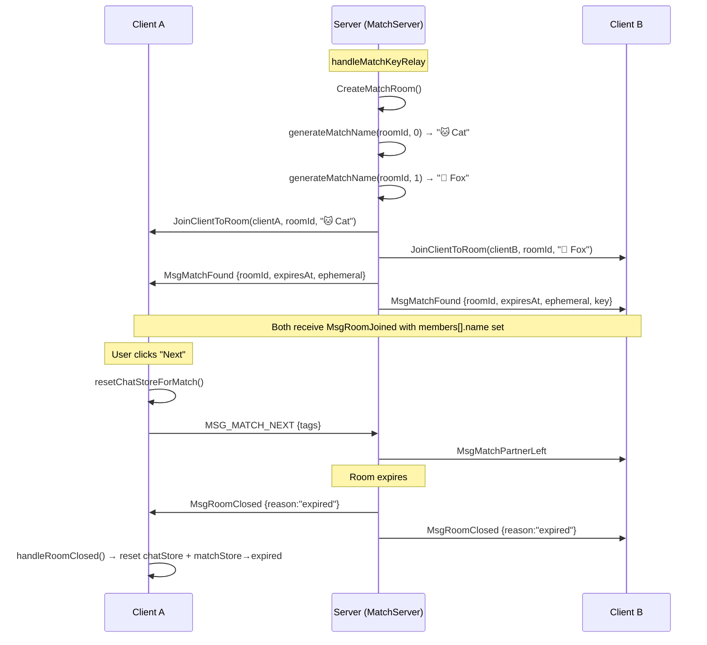

# Design: Random Match UX Polish

## Overview

This design addresses four gaps in the Random Match feature after core flow validation: indistinguishable user identities, session lifecycle state leaks, missing MatchRoom header, and server test compatibility. All changes are scoped to minimize impact on the verified happy-path.

**Key Design Decisions:**
- Name generation is server-side and deterministic (no extra round trips, no client logic)
- Session cleanup is explicit and synchronous (no rely on eventual GC)
- MatchRoom header reuses existing `ExpiryCountdown` component
- Server test fixes are mechanical (format migration), no protocol changes

## Architecture



## Components and Interfaces

### 1. Server-Side Name Generator (`arthas-server/internal/match/names.go`)

A new file providing deterministic name generation for match participants.

```go
package match

// matchNames is a fixed list of distinguishable emoji+animal pairs.
// List must have even length (names are used in position pairs).
// 32 pairs (64 entries) ensures <3.2% collision rate for consecutive matches.
var matchNames = []string{
    "🐱 Cat", "🦊 Fox", "🐼 Panda", "🦁 Lion",
    "🐨 Koala", "🦄 Unicorn", "🐙 Octopus", "🦋 Butterfly",
    "🐬 Dolphin", "🦉 Owl", "🐺 Wolf", "🦈 Shark",
    "🐯 Tiger", "🦅 Eagle", "🐸 Frog", "🦜 Parrot",
    "🐻 Bear", "🦚 Peacock", "🐧 Penguin", "🦩 Flamingo",
    "🐢 Turtle", "🦔 Hedgehog", "🐝 Bee", "🦀 Crab",
    "🐳 Whale", "🦒 Giraffe", "🐴 Horse", "🦥 Sloth",
    "🐑 Sheep", "🦦 Otter", "🐘 Elephant", "🦘 Kangaroo",
    "🐿️ Squirrel", "🦫 Beaver", "🪿 Goose", "🐓 Rooster",
    "🐕 Dog", "🦌 Deer", "🐈 Kitten", "🦎 Lizard",
    "🐇 Rabbit", "🦢 Swan", "🐊 Crocodile", "🦡 Badger",
    "🐉 Dragon", "🦏 Rhino", "🦧 Orangutan", "🐋 Humpback",
    "🦙 Llama", "🐫 Camel", "🐠 Fish", "🦑 Squid",
    "🐁 Mouse", "🦃 Turkey", "🐎 Stallion", "🦞 Lobster",
    "🦝 Raccoon", "🐄 Cow", "🐲 Serpent", "🦗 Cricket",
    "🦤 Dodo", "🐐 Goat", "🐏 Ram", "🦂 Scorpion",
}

// GenerateMatchName returns a deterministic display name for a match participant.
// position: 0 for Client A, 1 for Client B.
// roomId: used as seed to select the name pair (ensures both clients see consistent names).
//
// Algorithm:
//   1. Hash roomId → index into matchNames (even index)
//   2. Client A gets matchNames[index], Client B gets matchNames[index+1]
//
// This is deterministic: same roomId + position always yields the same name.
func GenerateMatchName(roomId string, position int) string {
    // Defensive: validate position parameter
    if position < 0 || position > 1 {
        return "Stranger"
    }
    // Fallback for empty roomId
    if roomId == "" {
        if position == 0 {
            return "Stranger A"
        }
        return "Stranger B"
    }
    // Simple hash of roomId to select pair index
    var hash uint32
    for _, c := range roomId {
        hash = hash*31 + uint32(c)
    }
    // Ensure even index (pairs are adjacent)
    pairIndex := int(hash % uint32(len(matchNames)/2)) * 2
    return matchNames[pairIndex+position]
}
```

**Integration point:** `handleMatchKeyRelay` in `server.go` replaces hardcoded `"Anonymous"`:

```go
// Before:
ms.roomCreator.JoinClientToRoom(pm.ClientA, roomId, "Anonymous")
ms.roomCreator.JoinClientToRoom(pm.ClientB, roomId, "Anonymous")

// After:
nameA := GenerateMatchName(roomId, 0)
nameB := GenerateMatchName(roomId, 1)
ms.roomCreator.JoinClientToRoom(pm.ClientA, roomId, nameA)
ms.roomCreator.JoinClientToRoom(pm.ClientB, roomId, nameB)
```

### 2. Session Lifecycle Cleanup (`arthas-client/src/match/matchCleanup.ts`)

**Problem:** `nextMatch()` resets matchStore but not chatStore. `MsgRoomClosed` resets chatStore but doesn't coordinate with matchStore.

**Solution:** Dedicated cleanup module + cross-store coordination. The cleanup function lives in its own file to maintain single responsibility (it operates on chatStore but is called from match contexts).

```typescript
// arthas-client/src/match/matchCleanup.ts

import { useChatStore } from '../stores/chatStore';
import { useVoiceStore } from '../voice/voiceStore';
import { useFileTransferStore } from '../file-transfer/fileTransferStore';

/**
 * Resets chatStore to initial room state. Called before re-queue or navigation.
 * Must be synchronous and complete — no partial resets.
 */
export function resetChatStoreForMatch(): void {
  // Cancel voice recording if active and release all voice caches
  useVoiceStore.getState().cancelRecording();
  useVoiceStore.getState().cleanup();

  // Abort any active file transfers
  useFileTransferStore.getState().abortAllTransfers();

  useChatStore.setState({
    roomId: null,
    roomKey: null,
    shareCode: null,
    members: [],
    hasPassword: false,
    ephemeral: 0,
    expiresAt: 0,
    messages: [],
    typingMembers: new Map(),
    replyTo: null,
    reactions: new Map(),
    signingKeyPair: null,
    publicKeyMap: new Map(),
  });
}
```

**Modified actions:**

| Action | Before | After |
|--------|--------|-------|
| `nextMatch()` | Resets matchStore only | Imports and calls `resetChatStoreForMatch()` from `matchCleanup.ts` first, then resets matchStore and sends MSG_MATCH_NEXT |
| `handleBackToHub()` in MatchPage.tsx | Resets matchStore to idle | Imports and calls `resetChatStoreForMatch()` from `matchCleanup.ts` + resets matchStore to idle |
| `MsgRoomClosed` in chatStore | Resets chatStore, ignores matchStore | Additionally checks `useMatchStore.getState().status === 'in-room'` and transitions matchStore to `'expired'` |

**MsgRoomClosed cross-store coordination (in chatStore.handleServerMessage):**

```typescript
case MSG_ROOM_CLOSED: {
  // ... existing file transfer abort and message display ...

  // Cross-store coordination: if in a match session, transition matchStore
  const matchStatus = useMatchStore.getState().status;
  if (matchStatus === 'in-room') {
    useMatchStore.setState({
      status: 'expired',
      matchRoomId: null,
      matchKey: null,
      matchExpiresAt: null,
    });
  }

  // ... existing chatStore reset ...
  break;
}
```

### 3. MatchRoom Header Component (`arthas-client/src/match/MatchRoomHeader.tsx`)

New component rendered at the top of `MatchRoom`:

```typescript
interface MatchRoomHeaderProps {
  /** Partner name from members list (excluding self) */
  partnerName: string | null;
  /** Room expiry timestamp (Unix seconds) */
  expiresAt: number;
  /** Ephemeral duration in seconds */
  ephemeral: number;
}

export function MatchRoomHeader({ partnerName, expiresAt, ephemeral }: MatchRoomHeaderProps) {
  const t = useTranslation();
  return (
    <header className="flex items-center justify-between px-4 py-2 bg-gray-800/90 border-b border-gray-700 shrink-0">
      {/* Left: E2EE indicator + partner name */}
      <div className="flex items-center gap-2">
        <span className="text-green-400" aria-label={t('match.room.e2eeLabel')}>🔒</span>
        <span className="text-sm text-gray-200 font-medium">
          {partnerName ?? t('match.room.waitingForPartner')}
        </span>
      </div>

      {/* Right: Ephemeral badge + expiry countdown */}
      <div className="flex items-center gap-3">
        {ephemeral > 0 && (
          <span className="text-xs text-purple-400 bg-purple-900/30 px-2 py-0.5 rounded">
            ⏱️ {ephemeral}s
          </span>
        )}
        <ExpiryCountdown expiresAt={expiresAt} />
      </div>
    </header>
  );
}
```

**Integration in MatchRoom.tsx:**

```tsx
export function MatchRoom() {
  const matchExpiresAt = useMatchStore((s) => s.matchExpiresAt);
  const matchEphemeral = useMatchStore((s) => s.matchEphemeral);
  const members = useChatStore((s) => s.members);
  const myId = useChatStore((s) => s.myId);

  // Derive partner name from members list
  const partnerName = members.find((m) => m.id !== myId)?.name ?? null;

  return (
    <div className="flex flex-col h-full">
      <MatchRoomHeader
        partnerName={partnerName}
        expiresAt={matchExpiresAt ?? 0}
        ephemeral={matchEphemeral ?? 0}
      />
      {/* ... rest of MatchRoom content ... */}
    </div>
  );
}
```

### 4. Server Test Fixes (`arthas-server/internal/match/server_test.go`)

**Problem:** Some test assertions still use old `[type_byte][payload]` binary format instead of the `{type, data}` msgpack envelope.

**Solution:** Ensure all message inspection in tests uses the `decodeMatchMsg` helper consistently:

```go
// decodeMatchMsg extracts type and data from the {type, data} msgpack envelope.
func decodeMatchMsg(raw []byte) (uint8, []byte, error) {
    var env matchMsgEnvelope
    if err := msgpack.Unmarshal(raw, &env); err != nil {
        return 0, nil, err
    }
    data, err := msgpack.Marshal(env.Data)
    if err != nil {
        return 0, nil, err
    }
    return env.Type, data, nil
}
```

All assertions checking `client.sent` messages must call `decodeMatchMsg(msg)` first, then unmarshal the data portion into the expected struct.

## Data Models

### Name Generation (Server)

No new persistent data. Name is computed on-the-fly from `roomId + position` and passed to `JoinClientToRoom`. The name flows through the existing `Member.Name` field in room state.

### State Reset Contract (Client)

```typescript
// chatStore fields that MUST be null/empty after match session cleanup:
interface ChatStoreMatchReset {
  roomId: null;
  roomKey: null;
  shareCode: null;
  members: [];          // empty array
  messages: [];         // empty array
  hasPassword: false;
  ephemeral: 0;
  expiresAt: 0;
  typingMembers: Map(); // empty map
  replyTo: null;
  reactions: Map();     // empty map
  signingKeyPair: null;
  publicKeyMap: Map();  // empty map
}

// matchStore fields reset on cleanup (nextMatch/backToHub):
interface MatchStoreSessionReset {
  matchRoomId: null;
  matchKey: null;
  matchKeyRaw: null;
  matchExpiresAt: null;
  matchEphemeral: null;
  isKeyGenerator: false;
  partnerId: null;
  inviteLink: null;
  inviteToken: null;
  extensionProposed: false;
  extensionCount: 0;
  partnerProposedExtend: false;
  partnerLeft: false;
}
```

## Correctness Properties

*A property is a characteristic or behavior that should hold true across all valid executions of a system — essentially, a formal statement about what the system should do. Properties serve as the bridge between human-readable specifications and machine-verifiable correctness guarantees.*

### Property 1: Name Determinism and Distinctness

*For any* room ID and valid position pair (0, 1), `GenerateMatchName(roomId, 0)` SHALL always return a different value than `GenerateMatchName(roomId, 1)`, and repeated calls with the same (roomId, position) SHALL always return the same value.

**Validates: Requirements 1.1, 1.2**

### Property 2: Next-Match Cleanup Completeness

*For any* chatStore state (arbitrary messages, members, roomKey, reactions, typing state), invoking the next-match cleanup SHALL result in chatStore containing only initial/empty values for all room-related fields (roomId=null, roomKey=null, members=[], messages=[], etc.).

**Validates: Requirements 2.1, 2.4**

### Property 3: Back-to-Hub Cleanup Completeness

*For any* combined chatStore and matchStore state, invoking back-to-hub SHALL result in both stores containing only initial/empty values for all session-related fields.

**Validates: Requirements 2.2, 2.4**

### Property 4: Room-Closed State Coordination

*For any* matchStore state where `status === 'in-room'`, when a `MsgRoomClosed` event is received, matchStore.status SHALL transition to `'expired'` and chatStore room-related fields SHALL be reset to initial values.

**Validates: Requirements 2.3**

## Error Handling

| Scenario | Handling |
|----------|----------|
| Name generation with empty roomId | Return fallback names ("Stranger A" / "Stranger B") — defensive, should never happen in practice |
| Name generation with invalid position (not 0 or 1) | Return "Stranger" — defensive guard clause prevents array out-of-bounds |
| `resetChatStoreForMatch()` called when chatStore is already empty | No-op — all fields are idempotently set to initial values |
| `MsgRoomClosed` arrives when matchStore.status ≠ 'in-room' | Existing chatStore handling applies; matchStore left unchanged |
| ExpiryCountdown receives `expiresAt=0` | Component returns null (existing behavior) |
| `matchExpiresAt` is null in MatchRoomHeader | ExpiryCountdown receives 0, renders nothing (graceful) |
| Partner name not yet available (member list has 1 entry) | Header shows "Waiting for partner..." placeholder |
| Voice recording active when Next/Back pressed | `cancelRecording()` called first, releases microphone before state reset |

## Testing Strategy

### Unit Tests (Example-Based)

- **Name generator edge cases:** empty roomId, single-char roomId, very long roomId
- **MatchRoomHeader rendering:** with/without partner, with/without ephemeral, expired state
- **UI presence verification:** header contains E2EE icon, does NOT contain room ID or Leave button
- **MsgRoomClosed handler:** verify matchStore transition and chatStore reset

### Property-Based Tests

- **Library:** Go: `pgregory.net/rapid` (already used in project); TypeScript: `fast-check` (already in devDependencies)
- **Minimum iterations:** 100 per property
- **Test file locations:** Go: `arthas-server/internal/match/names_property_test.go`; TypeScript: `arthas-client/src/match/__tests__/cleanup.property.test.ts`
- **Tag format:** `Feature: match-ux-polish, Property {N}: {description}`

| Property | Test Approach |
|----------|--------------|
| 1: Name determinism & distinctness | Generate random strings for roomId (rapid.String()), verify `GenerateMatchName(id, 0) != GenerateMatchName(id, 1)` and `GenerateMatchName(id, 0) == GenerateMatchName(id, 0)` for all inputs |
| 2: Next-match cleanup | Generate random chatStore state objects, call resetChatStoreForMatch(), assert all fields match initial state |
| 3: Back-to-hub cleanup | Generate random chatStore+matchStore state, invoke handleBackToHub logic, assert both stores reset |
| 4: Room-closed coordination | Generate random in-room matchStore state, dispatch MsgRoomClosed, assert matchStore.status==='expired' and chatStore is reset |

### Integration Tests

- Full match flow: queue → pair → key exchange → room → Next → re-queue (verify no state leaks between sessions)
- Server tests: all existing tests in `server_test.go` and `hub_integration_test.go` pass with `decodeMatchMsg` helper

### Server Test Fixes (Requirement 4)

Mechanical migration:
1. Find all assertions that directly inspect `client.sent` byte arrays
2. Replace with `decodeMatchMsg(msg)` calls
3. Unmarshal data portion into expected struct
4. Run `go test ./internal/match/...` to verify green
