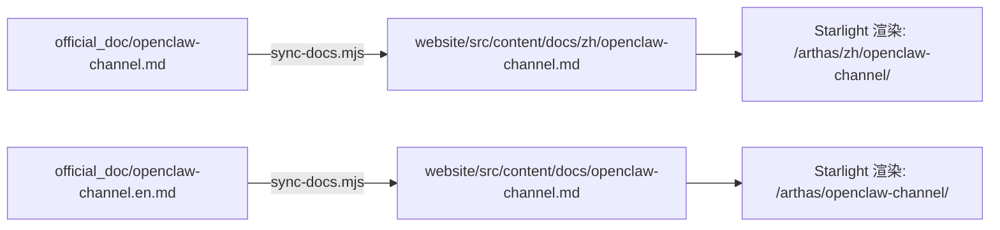

# Technical Design: OpenClaw Channel Plugin Documentation

## Overview

本设计文档描述 `@arthas/openclaw-channel` 插件官方文档的创建方案。文档将以中英双语发布在 Arthas 项目网站（Astro + Starlight），通过现有的 `sync-docs.mjs` 脚本自动同步到 Starlight 内容目录。

**核心目标：**
- 在 `official_doc/` 创建中英文文档源文件
- 集成到网站侧边栏导航（新增 "Integrations" 分组）
- 更新主 README 和网站首页展示 AI Agent 集成能力
- 确保所有代码示例和配置引用与实际实现一致
- 修正 Package README 中的 license 和 GitHub URL 不一致问题

**设计约束：**
- 文档源文件不包含 Starlight frontmatter（由 sync-docs.mjs 自动注入）
- 文件命名遵循现有约定：中文 `openclaw-channel.md`，英文 `openclaw-channel.en.md`
- 语言切换行格式遵循现有模式（sync 时自动剥离）
- 代码示例必须是可编译的 TypeScript
- 内部链接使用相对 Markdown 路径（sync-docs.mjs 自动转换为 Starlight 路由）
- sync-docs.mjs 会**删除整个 `zh/` 目录**再重建，所有中文文档必须通过 `official_doc/` 同步
- 版本号硬编码为当前 `1.0.0`（与 package.json 一致），测试脚本自动检测不一致

## Architecture

```
official_doc/
├── openclaw-channel.md        # 中文文档源文件（新增）
└── openclaw-channel.en.md     # 英文文档源文件（新增）

website/
├── astro.config.mjs           # 侧边栏配置（修改：新增 Integrations 分组）
├── src/
│   ├── i18n/
│   │   ├── en.json            # 英文 i18n（修改：新增 features.openclaw.* 键）
│   │   └── zh.json            # 中文 i18n（修改：新增 features.openclaw.* 键）
│   ├── components/
│   │   └── FeatureCards.astro # 特性卡片（修改：新增第 7 张卡片 + 网格布局调整）
│   └── content/docs/
│       ├── openclaw-channel.md       # 英文（sync-docs.mjs 生成，勿手动编辑）
│       └── zh/openclaw-channel.md    # 中文（sync-docs.mjs 生成，勿手动编辑）

README.md                      # 项目 README（修改：Features + Docs + Structure）
packages/openclaw-channel/
├── package.json               # 包配置（修改：license 字段 MIT → AGPL-3.0）
└── README.md                  # 包 README（修改：精简为摘要 + 链接到 official_doc）
```

### 文档权威性策略

**问题：** 现有 `packages/openclaw-channel/README.md` 已包含完整文档（安装、配置、使用、安全模型、故障排除、API 参考），与新的 `official_doc/` 文档存在内容重复风险。

**策略：** `official_doc/` 作为权威源（canonical source），Package README 精简为摘要版本。

| 文档 | 角色 | 内容范围 |
|------|------|----------|
| `official_doc/openclaw-channel.md` | 权威源（中文） | 完整文档：快速开始 + 所有章节 + 学习要点注释 |
| `official_doc/openclaw-channel.en.md` | 权威源（英文） | 完整文档：与中文版等价 |
| `packages/openclaw-channel/README.md` | npm 包摘要 | 简介 + 快速开始 + 配置表 + "完整文档见 official_doc" 链接 |

Package README 修改要点：
- 保留：简介、架构图、快速开始、配置表、API 方法表
- 移除：详细使用示例、安全模型详解、故障排除（指向 official_doc）
- 修正：GitHub URL `nicepkg/arthas` → `michaelwang123/arthas`
- 修正：License `MIT` → `AGPL-3.0`（与项目根 LICENSE 一致）
- 新增：顶部链接 "📖 Full documentation: [中文](../../official_doc/openclaw-channel.md) | [English](../../official_doc/openclaw-channel.en.md)"

### 数据流：文档同步



sync-docs.mjs 处理流程：
1. **删除** `website/src/content/docs/zh/` 整个目录（破坏性操作，所有中文内容必须从 official_doc 同步）
2. 剥离语言切换行（`[English](...) | 中文`）
3. 转换内部 Markdown 链接为 Starlight 路由路径（如 `architecture.md` → `/arthas/zh/architecture/`）
4. 规范化代码块语言标识符（`env` → `ini`）
5. 从 H1 提取标题，注入 YAML frontmatter
6. 移除原始 H1（避免与 frontmatter title 重复）

### 内部链接策略

文档中引用其他 official_doc 文件时，使用相对 Markdown 链接：

```markdown
<!-- 中文文档中链接到其他中文文档 -->
[系统架构](architecture.md)
[协议规范](protocol.md)

<!-- 英文文档中链接到其他英文文档 -->
[Architecture](architecture.en.md)
[Protocol](protocol.en.md)
```

sync-docs.mjs 会自动将这些链接转换为 Starlight 路由：
- `architecture.md` → `/arthas/zh/architecture/`（中文文档中）
- `architecture.en.md` → `/arthas/architecture/`（英文文档中）

## Components and Interfaces

### 1. 中文文档 (`official_doc/openclaw-channel.md`)

**文档结构（按 Requirement 1.3 顺序，各 section 之间使用 `---` 水平分隔线）：**

```markdown
# OpenClaw Channel 插件 — AI Agent 加密通信通道

[English](openclaw-channel.en.md) | 中文

## 快速开始

​```typescript
import { ArthasChannelAdapter } from '@arthas/openclaw-channel';
const adapter = new ArthasChannelAdapter();
adapter.onMessage(msg => console.log(`${msg.userName}: ${msg.text}`));
await adapter.connect({ serverUrl: 'wss://your-server.com/ws', shareCode: 'roomId:key' });
await adapter.send({ text: 'Hello!', id: '1', channelId: 'arthas' });
​```

> 注：示例使用 ESM top-level await（需要 package.json 中 `"type": "module"`）。

---

## 简介

---

## 安装

---

## 配置参考

---

## 使用示例

---

## 安全模型

---

## 故障排除

---

## API 参考

---

## 下一步

- [系统架构](architecture.md) — 了解整体设计
- [协议规范](protocol.md) — 消息格式详解
- [自托管部署](self-hosting.md) — 部署自己的服务器
```

**关键内容来源：**
- 配置参考 → 从 `packages/openclaw-channel/src/config.ts` 提取环境变量定义
- 代码示例 → 基于 `packages/openclaw-channel/src/adapter.ts` 的公共 API
- 错误消息 → 从 `config.ts` 中的中文错误字符串直接引用
- 安全模型 → 基于 `crypto.ts` 和 `signing.ts` 的实现

**代码示例中的 `📚 学习要点:` 使用方式（Requirement 7.4）：**

文档中的 TypeScript 代码块应在关键设计决策处包含学习要点注释：

```typescript
// 📚 学习要点: 为什么使用 onMessage 回调而非 EventEmitter？
// OpenClaw Gateway 的 ChannelAdapter 接口规定使用回调模式，
// 确保消息处理的顺序性（避免并发回调导致的竞态条件）。
adapter.onMessage((message) => {
  console.log(`[${message.timestamp.toISOString()}] ${message.userName}: ${message.text}`);
});
```

```typescript
// 📚 学习要点: 为什么 connect() 是异步的？
// connect() 内部执行：配置验证 → 密钥派生 → WebSocket 连接 → 加入房间。
// 任何步骤失败都会抛出描述性错误（Fail-Fast 原则）。
await adapter.connect({
  serverUrl: 'wss://arthas.example.com/ws',
  shareCode: 'roomId:base64Key:0:0',
  displayName: 'Code Assistant',
});
```

### 2. 英文文档 (`official_doc/openclaw-channel.en.md`)

与中文版结构完全对应，使用一致的英文术语：
- "share code"（非 "sharing code"）
- "blind relay"（非 "dumb relay"）
- "end-to-end encryption"（非 "E2E encryption"）

英文版同样包含 `📚 学习要点:` 注释（保持英文注释内容，不翻译注释前缀）。

末尾"Next Steps"section：
```markdown
## Next Steps

- [Architecture](architecture.en.md) — System design overview
- [Protocol](protocol.en.md) — Message format specification
- [Self-Hosting](self-hosting.en.md) — Deploy your own server
```

### 3. 侧边栏配置修改 (`website/astro.config.mjs`)

在现有 `Tools` 分组之后新增 `Integrations` 分组：

```javascript
sidebar: [
  // ... existing groups ...
  {
    label: 'Tools',
    items: [
      { slug: 'cli-guide' },
    ],
  },
  // 新增
  {
    label: 'Integrations',
    translations: { 'zh-CN': '集成' },
    items: [
      { slug: 'openclaw-channel' },
    ],
  },
],
```

### 4. Feature Card 新增 (`FeatureCards.astro`)

在 `features` 数组末尾添加第 7 项：

```javascript
{ icon: '🤖', titleKey: 'features.openclaw.title', descKey: 'features.openclaw.description' },
```

### 5. i18n 字符串新增

**en.json:**
```json
"features.openclaw.title": "AI Agent Channel",
"features.openclaw.description": "Connect AI agents to encrypted rooms. Zero-knowledge conversations — the server cannot observe prompts or responses."
```

**zh.json:**
```json
"features.openclaw.title": "AI Agent 通道",
"features.openclaw.description": "将 AI Agent 接入加密房间。零知识对话 — 服务器无法观察提示词或回复内容。"
```

### 6. Grid 布局调整 (`FeatureCards.astro`)

当前 6 张卡片使用响应式网格：手机 1 列、平板 2 列、桌面 3 列。新增第 7 张后需要调整以满足 Requirement 5.5（3+4 行模式）。

**方案：桌面断点改为 4 列（≥1100px）**

```css
/* 桌面断点 (≥1100px): 改为 4 列，7 张卡片排列为 4+3 */
@media (min-width: 1100px) {
  .feature-grid {
    grid-template-columns: repeat(4, 1fr);
  }
}
```

**响应式效果：**
- 手机（<768px）：1 列，7 行
- 平板（768px-1099px）：2 列，4 行（7 张卡片占 4 行 × 2 列 = 8 格中的 7 格）
- 桌面（≥1100px）：4 列，4+3 行模式（第一行 4 张 + 第二行 3 张）

**为什么选择 4 列而非 `auto-fill`：**
- 与现有代码风格一致（显式断点控制，非 auto-fit/minmax）
- 7 张卡片在 4 列下排列为 4+3，视觉平衡
- 卡片最小宽度 ~262px（1100px viewport 下，1200px max-width 不生效时），文案不会溢出
- 第二行 3 张卡片左对齐，与网格对齐线一致

**为什么断点选 1100px 而非 1024px：**
- 1024px 时 4 列每张约 238px，对于中文文案可能过窄
- 1100px 时每张约 262px，与现有 3 列在 1024px 时的 ~320px 差距可接受
- 768px-1099px 区间使用 2 列，卡片宽度充裕

### 7. README 修改 (`README.md`)

**Features 部分新增：**
```markdown
- 🤖 **AI Agent Channel** – OpenClaw plugin for E2EE AI conversations, server sees nothing
```

**Project Structure 部分新增：**
```markdown
├── packages/openclaw-channel/  # OpenClaw AI agent channel plugin (TypeScript)
```

**Documentation 部分新增：**
```markdown
- [OpenClaw Channel Plugin](official_doc/openclaw-channel.en.md)
```

### 8. Package README 重构 (`packages/openclaw-channel/README.md`)

**修改策略：** 精简为摘要版本，指向 official_doc 完整文档。

修正内容：
- GitHub URL：`https://github.com/nicepkg/arthas` → `https://github.com/michaelwang123/arthas`
- Contributing 部分的 Fork 链接同步修正
- License：`MIT` → `AGPL-3.0`（与项目根 LICENSE 一致）
- 新增顶部完整文档链接

保留内容：
- 简介段落 + 架构图
- Quick Start（5 行代码）
- 配置环境变量表
- API 方法表
- Development section（对贡献者有用）

移除内容（指向 official_doc）：
- 详细使用示例（Programmatic Integration、File Transfer）
- Security Model 详解
- Troubleshooting 详解
- Share Code Format 详解

### 9. Package.json 修正 (`packages/openclaw-channel/package.json`)

```json
{
  "license": "AGPL-3.0"
}
```

**原因：** 当前 package.json 声明 `"license": "MIT"`，但项目统一使用 AGPL-3.0 协议。所有子包必须与项目根 LICENSE 保持一致。

### 10. 侧边栏分组标签（含中文翻译）

新增的 "Integrations" 分组使用 Starlight 的 `translations` 字段提供中文翻译，提升中文用户体验：

```javascript
{
  label: 'Integrations',
  translations: { 'zh-CN': '集成' },
  items: [
    { slug: 'openclaw-channel' },
  ],
},
```

**注意：** 现有分组（"Getting Started"、"Architecture"、"Tools"）目前没有中文翻译。本次仅为新增的 "Integrations" 分组添加翻译。如果未来需要统一翻译所有分组标签，可作为独立任务处理。

### 11. 文档中的架构图格式

Requirement 6.4 要求的数据流图使用 ASCII art 格式（与 Package README 和 cli-guide.md 风格一致），不使用 Mermaid：

```
User (Web/CLI)
    │ 加密消息
    ▼
Arthas Server (blind relay, 只转发密文)
    │ 转发密文
    ▼
@arthas/openclaw-channel (解密 → 明文)
    │ IncomingMessage
    ▼
OpenClaw Gateway (路由 + 上下文管理)
    │ prompt
    ▼
AI Agent (LLM 推理)
    │ response
    ▼
OpenClaw Gateway
    │ OutgoingMessage
    ▼
@arthas/openclaw-channel (加密 → 密文)
    │ 加密消息
    ▼
Arthas Server (blind relay)
    │ 转发密文
    ▼
User (解密 → 明文)
```

## Data Models

本功能不涉及运行时数据模型。文档内容为静态 Markdown 文件，i18n 为静态 JSON 键值对。

### 文档内容模型（逻辑结构）

```typescript
// 文档各节的内容来源映射
interface DocContentSources {
  quickStart: 'adapter.ts public API (5-line example)';
  introduction: 'README.md + E2EE value proposition';
  installation: 'package.json (name, version, engines)';
  configuration: 'config.ts (ENV_* constants, defaults, validation)';
  usageExamples: 'adapter.ts (connect, send, onMessage, disconnect)';
  securityModel: 'crypto.ts + signing.ts (algorithms, key lifecycle)';
  troubleshooting: 'config.ts (Chinese error messages)';
  apiReference: 'types.ts (exported types) + adapter.ts (public methods)';
  nextSteps: 'Links to architecture.md, protocol.md, self-hosting.md';
}
```

### 配置参考数据（从 config.ts 提取）

| 环境变量 | 必填 | 默认值 | 说明 |
|----------|------|--------|------|
| `ARTHAS_SERVER_URL` | 是 | — | WebSocket 服务器地址（必须以 `wss://` 或 `ws://` 开头） |
| `ARTHAS_SHARE_CODE` | 是 | — | 房间分享码（格式：`roomId:base64Key[:ephemeral:expiresAt]`，最少 2 段） |
| `ARTHAS_DISPLAY_NAME` | 否 | `AI Assistant` | Agent 在房间中的显示名称 |
| `ARTHAS_SIGNING_ENABLED` | 否 | `false` | 是否启用 Ed25519 消息签名（`true` 或 `1` 启用） |
| `ARTHAS_ROOM_PASSWORD` | 否 | — | 密码保护房间的密码（传输时使用 SHA-256 哈希） |

### 版本号策略

文档中引用的版本号硬编码为当前值 `1.0.0`（来自 `packages/openclaw-channel/package.json`）。

**理由：** 文档是静态 Markdown 文件，不支持模板变量。版本号变更时需要手动更新文档。测试脚本会自动检测版本不一致并报错。

## Error Handling

### 文档构建错误

| 错误场景 | 原因 | 解决方案 |
|----------|------|----------|
| Starlight frontmatter 验证失败 | 文档中包含了手动 frontmatter | 确保 `openclaw-channel.md` 不以 `---` 开头 |
| 侧边栏 slug 404 | slug 与文件名不匹配 | 确保 slug `openclaw-channel` 对应文件 `openclaw-channel.md` |
| sync-docs.mjs 跳过文件 | 文件名不符合 `*.md` / `*.en.md` 模式 | 使用正确的命名约定 |
| i18n key 未找到 | JSON 中缺少对应键 | 确保 en.json 和 zh.json 都包含 `features.openclaw.*` 键 |
| 代码块语法高亮失败 | 使用了 Shiki 不支持的语言标识符 | 使用 `typescript`、`bash`、`json`、`ini` 等标准标识符 |
| 内部链接 404 | 链接目标文件不存在或命名错误 | 确保链接的 `.md` 文件在 `official_doc/` 中存在 |
| zh/ 目录文件丢失 | sync-docs.mjs 删除了整个 zh/ 目录 | 所有中文文档必须放在 `official_doc/` 中通过 sync 同步 |

### 内容准确性验证

文档中的代码示例应可通过以下方式验证：
1. TypeScript 代码示例 → 提取到临时 `.ts` 文件，运行 `tsc --noEmit` 检查
2. 环境变量引用 → 与 `config.ts` 中的 `ENV_*` 常量交叉比对
3. 分享码格式 → 与 `validateShareCode()` 函数的验证逻辑一致（最少 2 段，每段非空）
4. 错误消息 → 与 `config.ts` 中的 throw 语句中的字符串一致
5. 版本号 → 与 `packages/openclaw-channel/package.json` 中的 `version` 字段一致

## Testing Strategy

**PBT 不适用于本功能。** 本功能的产出是静态文档文件、配置修改和 i18n 字符串，不涉及可属性测试的算法逻辑或数据转换。

### 验证方法

| 验证项 | 方法 | 自动化程度 |
|--------|------|------------|
| 文档文件存在 | `ls official_doc/openclaw-channel*.md` | 手动/CI |
| sync-docs.mjs 正确处理新文件 | `node website/scripts/sync-docs.mjs` 后检查输出 | CI 脚本 |
| 网站构建成功 | `cd website && pnpm build` | CI |
| 侧边栏显示正确 | 本地预览检查 | 手动 |
| 代码示例可编译 | 提取代码块 → `tsc --noEmit` | 可自动化 |
| i18n 键完整 | 检查 en.json 和 zh.json 都包含新键 | 可自动化 |
| 内部链接有效 | Starlight 构建时会报告死链 | CI（构建失败即检测到） |
| GitHub URL 正确 | grep 检查 `nicepkg/arthas` 不再出现 | 可自动化 |
| 版本号一致 | 比对文档中的版本与 package.json 中的 version | 可自动化 |
| License 一致 | 检查 package.json license 字段为 AGPL-3.0 | 可自动化 |
| 水平分隔线 | 检查文档 section 之间有 `---` | 可自动化 |

### 推荐测试脚本

```bash
#!/bin/bash
# scripts/validate-openclaw-docs.sh

set -e

# 1. 检查文件存在
test -f official_doc/openclaw-channel.md || { echo "❌ Missing Chinese doc"; exit 1; }
test -f official_doc/openclaw-channel.en.md || { echo "❌ Missing English doc"; exit 1; }

# 2. 检查不包含 frontmatter
head -1 official_doc/openclaw-channel.md | grep -q "^---" && { echo "❌ Chinese doc has frontmatter"; exit 1; }
head -1 official_doc/openclaw-channel.en.md | grep -q "^---" && { echo "❌ English doc has frontmatter"; exit 1; }

# 3. 检查 GitHub URL 已修正
grep -r "nicepkg/arthas" packages/openclaw-channel/ && { echo "❌ Old GitHub URL found"; exit 1; }

# 4. 检查 i18n 键存在
grep -q "features.openclaw.title" website/src/i18n/en.json || { echo "❌ Missing en i18n key"; exit 1; }
grep -q "features.openclaw.title" website/src/i18n/zh.json || { echo "❌ Missing zh i18n key"; exit 1; }

# 5. 检查 license 一致性
grep -q '"AGPL-3.0"' packages/openclaw-channel/package.json || { echo "❌ Package license not AGPL-3.0"; exit 1; }

# 6. 检查版本号一致
PKG_VERSION=$(node -p "require('./packages/openclaw-channel/package.json').version")
grep -q "$PKG_VERSION" official_doc/openclaw-channel.md || { echo "❌ Chinese doc version mismatch (expected $PKG_VERSION)"; exit 1; }
grep -q "$PKG_VERSION" official_doc/openclaw-channel.en.md || { echo "❌ English doc version mismatch (expected $PKG_VERSION)"; exit 1; }

# 7. 检查文档包含"下一步"section
grep -q "## 下一步" official_doc/openclaw-channel.md || { echo "❌ Chinese doc missing 下一步 section"; exit 1; }
grep -q "## Next Steps" official_doc/openclaw-channel.en.md || { echo "❌ English doc missing Next Steps section"; exit 1; }

# 8. 检查水平分隔线存在（至少 5 个 section 分隔）
SEPARATORS=$(grep -c "^---$" official_doc/openclaw-channel.md)
[ "$SEPARATORS" -ge 5 ] || { echo "❌ Chinese doc has fewer than 5 section separators (found $SEPARATORS)"; exit 1; }

# 9. 运行 sync 并构建
cd website && node scripts/sync-docs.mjs && pnpm build

echo "✅ All documentation checks passed"
```

### 人工审查清单

- [ ] 中文文档语言风格与 `cli-guide.md` 一致（技术中文 + 英文专有名词）
- [ ] 英文文档语言风格与 `cli-guide.en.md` 一致（简洁技术英文）
- [ ] 代码示例包含 `📚 学习要点:` 注释（项目规范要求）
- [ ] 配置参考与 `config.ts` 中的实际实现完全匹配
- [ ] 分享码格式说明与 `validateShareCode()` 一致（最少 2 段，每段非空）
- [ ] 错误消息与源码中的中文字符串一致
- [ ] 安全模型描述准确反映 AES-256-GCM + Ed25519 实现
- [ ] 版本号 `1.0.0` 与 `package.json` 一致
- [ ] 所有内部链接使用相对 Markdown 路径（sync 脚本会转换）
- [ ] Feature card 在 7 项布局下视觉合理（桌面 4 列 4+3 / 平板 2 列 / 手机 1 列）
- [ ] 各 section 之间有 `---` 水平分隔线（与 cli-guide.md 风格一致）
- [ ] 文档末尾有"下一步"section（与 cli-guide.md 风格一致）
- [ ] Package README 已精简，顶部有完整文档链接
- [ ] Package README 和 package.json 的 license 为 AGPL-3.0
- [ ] Quick Start 的 5 行代码可直接复制运行（语法正确、import 路径正确）
- [ ] 侧边栏 "Integrations" 分组包含 `translations: { 'zh-CN': '集成' }`
- [ ] 桌面 4 列布局在 1100px 视口下文案不溢出
