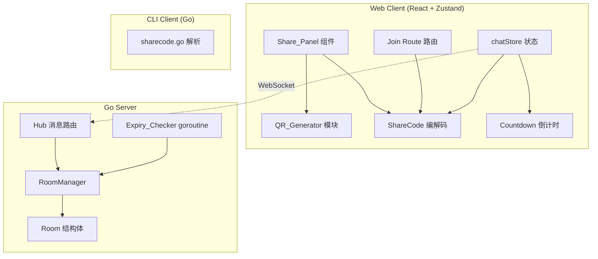

# Design Document: QR 码分享 & 房间链接过期

## Overview

本设计文档描述 Arthas Phase 10 的两个子功能的技术实现方案：

1. **QR 码分享** — 纯前端功能，将 Join_URL 编码为 QR 码图像，支持手机扫码加入房间。引入 `qrcode` npm 包作为 bundled 依赖（不引入运行时网络请求）。
2. **房间链接过期** — 前后端协同功能，创建房间时可设置有效期，服务器端新增过期字段和定时清理 goroutine。

设计原则：
- 保持服务器零知识架构不变（服务器不接触加密密钥）
- 分享码中的 expiresAt 是信息性的，服务器是唯一权威
- 向后兼容：旧客户端生成的分享码仍可正常解析
- 不引入新的 Go 依赖（服务器端），允许引入一个纯前端 QR 生成 npm 包
- 防御性设计：服务器端对 expiry 输入做边界检查（负数归零、超大值截断）

## Architecture



### 数据流

**QR 码生成流程：**
```
用户点击 QR 按钮
  → Share_Panel 获取当前 shareCode（已缓存的 QR data URL 命中？直接显示）
  → buildJoinURL(configuredBaseURL || window.location.origin, shareCode) → Join_URL
  → QR_Generator.generate(Join_URL, { errorCorrection: 'M' })
  → 缓存 QR data URL（shareCode 为 key）
  → 渲染 QR 码到 Modal 中
```

**房间过期创建流程：**
```
用户选择有效期 → createRoom(name, password, ephemeral, expiry)
  → ws.send(MSG_CREATE_ROOM, { name, password, ephemeral, expiry })
  → 服务器 handleCreateRoom:
      → sanitizeExpiry(expiry): 负数→0, >maxExpiryDuration→maxExpiryDuration
      → expiresAt = expiry > 0 ? time.Now().Unix() + expiry : 0
  → Room 存储 expiresAt
  → 返回 RoomCreated { roomId, expiresAt }
  → 客户端存储 expiresAt，启动倒计时
  → encodeShareKey(roomId, key, ephemeral, expiresAt) → 4 段分享码
```

**过期清理流程：**
```
Expiry_Checker ticker (每 60s)
  → RoomManager.GetExpiredRooms(now) 获取过期房间 ID 快照（RLock）
  → 对每个过期房间 ID:
      → GetRoom(id)，nil 则跳过（已被并发删除）
      → 重新验证 room.IsExpired(now)（防止 TOCTOU 竞态）
      → 遍历 Hub.clients 找到该房间内有 activeTransferID 的客户端
      → 对每个活跃传输广播 FILE_CANCEL 给所有成员（含发送方，使用 broadcastFileCancelForExpiry）
      → 广播 MsgRoomClosed { reason: "expired" } 给所有成员
      → 断开所有成员的 RoomID 关联
      → RemoveRoom(roomId)
```

**handleJoinRoom 过期检查流程：**
```
客户端发送 JoinRoom { roomId, name, password }
  → GetRoom(roomId) → 房间不存在? 返回 E001
  → room.IsExpired(time.Now().Unix())? 返回 E007 "room has expired"  ← 新增检查点
  → 验证密码
  → 检查满员
  → AddMember
  → 返回 RoomJoined { ..., expiresAt }
```

## Components and Interfaces

### 前端新增模块

#### 1. QR_Generator (`src/qr/generator.ts`)

```typescript
/**
 * QR 码生成模块 — 将 Join_URL 编码为 QR 码 Data URL。
 * 使用 bundled 的 qrcode 库，不发起任何网络请求。
 */

export interface QROptions {
  /** 错误纠正等级: L(7%), M(15%), Q(25%), H(30%) */
  errorCorrectionLevel: 'L' | 'M' | 'Q' | 'H';
  /** 输出宽度（CSS 像素） */
  width: number;
  /** 静默区模块数 */
  margin: number;
  /** 深色模块颜色 */
  colorDark: string;
  /** 浅色模块颜色（背景） */
  colorLight: string;
}

/**
 * 生成 QR 码 Data URL。
 * @param text - 要编码的文本（Join_URL）
 * @param options - QR 码配置选项
 * @returns Promise<string> - QR 码的 data:image/png;base64,... URL
 */
export async function generateQRCode(text: string, options?: Partial<QROptions>): Promise<string>;

/**
 * 构建完整的 Join URL。
 * 优先使用环境变量 VITE_APP_URL，fallback 到 window.location.origin。
 * 自动去除 base URL 尾部斜杠，防止生成 `https://example.com//#/join/...` 双斜杠。
 * 这确保在反向代理或自定义域名场景下生成正确的 URL。
 *
 * @param shareCode - 分享码字符串
 * @returns 完整的加入链接
 */
export function buildJoinURL(shareCode: string): string;
```

#### 2. Share_Panel QR 扩展 (`src/components/QRCodeModal.tsx`)

```typescript
/**
 * QR 码模态框组件 — 显示房间加入链接的 QR 码。
 * 支持响应式布局（<640px: 200px, >=640px: 256px）。
 * 始终使用黑色模块 + 白色背景（确保扫描兼容性）。
 *
 * 📚 学习要点: QR 码缓存策略
 * 使用 useEffect + state 缓存 QR data URL，避免每次打开 modal 都重新生成。
 * shareCode 在房间生命周期内不变，因此 QR 码只需生成一次。
 * 依赖数组为 [shareCode]，仅在分享码变化时重新生成。
 */
interface QRCodeModalProps {
  /** 是否显示模态框 */
  open: boolean;
  /** 关闭回调 */
  onClose: () => void;
  /** 分享码字符串 */
  shareCode: string;
}
```

#### 3. Join Route 处理 (`src/pages/Home.tsx` 扩展)

```typescript
/**
 * URL hash 路由解析 — 处理 /#/join/{shareCode} 格式的加入链接。
 * 在 Home 组件挂载时检查 URL hash，如果匹配 join 路由则预填分享码。
 */

/**
 * 解析 URL hash 中的 join 路由。
 * @param hash - window.location.hash (e.g., "#/join/abc123:key456")
 * @returns 分享码字符串或 null
 */
export function parseJoinRoute(hash: string): string | null;
```

#### 4. ShareCode 编解码扩展 (`src/crypto/shareKey.ts`)

```typescript
/**
 * 扩展后的分享码格式：
 * - 2 段: {roomId}:{key} → ephemeral=0, expiresAt=0
 * - 3 段: {roomId}:{key}:{ephemeral} → expiresAt=0
 * - 4 段: {roomId}:{key}:{ephemeral}:{expiresAt}
 *
 * 编码规则：
 * - expiresAt > 0: 必须输出 4 段（ephemeral 段显式包含，即使为 0）
 * - expiresAt == 0: 使用现有格式（2 或 3 段）
 *
 * 验证规则（decodeShareKey 返回 null 的条件）：
 * - 段数不在 [2, 4] 范围内
 * - roomId 长度 ≠ 21
 * - keyEncoded 长度 ≠ 43
 * - ephemeral 段不是有效非负整数
 * - expiresAt 段不是有效非负整数
 */

export interface ShareCodeComponents {
  roomId: string;
  keyEncoded: string;
  ephemeral: number;
  expiresAt: number;  // Unix seconds, 0 = no expiration
}

export async function encodeShareKey(
  roomId: string,
  key: CryptoKey,
  ephemeral?: number,
  expiresAt?: number
): Promise<string>;

export function decodeShareKey(code: string): ShareCodeComponents | null;
```

#### 5. Countdown 倒计时 (`src/components/ExpiryCountdown.tsx`)

```typescript
/**
 * 房间过期倒计时组件。
 * - remaining > 1h: 显示小时数，每 60s 更新
 * - remaining <= 1h: 显示分钟数，每秒更新
 * - remaining <= 5min: 警告色高亮
 * - expiresAt == 0: 不渲染
 *
 * 📚 学习要点: Timer 频率动态切换
 * 组件维护一个 intervalRef，初始根据 remaining 选择 60s 或 1s 间隔。
 * 每次 timer 回调时重新计算 remaining：
 * - 如果从 >3600s 跨越到 <=3600s，立即 clearInterval + 重新 setInterval(1000)
 * - 如果从 >300s 跨越到 <=300s，触发警告色样式切换
 * visibilitychange 恢复前台时也执行相同的频率重评估逻辑。
 *
 * 📚 学习要点: Tab 可见性处理
 * 浏览器会节流后台 tab 的 setInterval（Chrome 限制为每分钟一次）。
 * 使用 visibilitychange 事件监听 tab 恢复前台，立即重新计算剩余时间，
 * 确保用户切回 tab 时看到准确的倒计时而非过时的值。
 *
 * 📚 学习要点: 客户端-服务器时钟偏差
 * 倒计时使用 server-provided expiresAt 减去客户端本地 Date.now()/1000。
 * 如果客户端时钟偏快，显示的剩余时间会偏少（保守方向，可接受）。
 * 服务器是过期的唯一权威 — 即使客户端倒计时到零，也等待服务器 MsgRoomClosed。
 */
interface ExpiryCountdownProps {
  /** 过期时间戳（Unix 秒），0 表示无过期 */
  expiresAt: number;
}
```

#### 6. 时间格式化工具 (`src/utils/timeFormat.ts`)

```typescript
/**
 * 格式化剩余时间为人类可读字符串。
 * @param remainingSeconds - 剩余秒数
 * @param locale - 当前语言环境
 * @returns 格式化后的字符串 (e.g., "23h remaining", "还剩 45 分钟")
 */
export function formatRemainingTime(remainingSeconds: number, locale: string): string;

/**
 * 判断是否应显示警告状态（剩余 ≤ 5 分钟）。
 */
export function isExpiryWarning(remainingSeconds: number): boolean;
```

### 后端修改

#### 0. 国际化 Key 命名规范

本功能新增的 i18n key 遵循项目现有的 `{module}.{context}.{variant}` 命名模式：

```typescript
// QR 码相关
"share.qr.button":        "显示 QR 码" / "Show QR Code" / "QRコードを表示"
"share.qr.title":         "扫码加入房间" / "Scan to Join" / "スキャンして参加"
"share.qr.alt":           "房间加入二维码" / "Room join QR code" / "ルーム参加QRコード"
"share.qr.error":         "QR 码生成失败" / "QR code generation failed" / "QRコード生成に失敗"

// 过期选择器
"room.expiry.label":      "有效期" / "Expiration" / "有効期限"
"room.expiry.1h":         "1 小时" / "1 hour" / "1時間"
"room.expiry.24h":        "24 小时" / "24 hours" / "24時間"
"room.expiry.7d":         "7 天" / "7 days" / "7日間"
"room.expiry.never":      "永不过期" / "Never" / "無期限"

// 倒计时显示
"room.countdown.hours":   "还剩 {n} 小时" / "{n}h remaining" / "残り{n}時間"
"room.countdown.minutes": "还剩 {n} 分钟" / "{n}min remaining" / "残り{n}分"

// 错误消息
"error.roomExpired":      "房间链接已过期" / "Room link has expired" / "ルームリンクの有効期限切れ"
"error.roomMayExpired":   "房间可能已过期" / "Room may have expired" / "ルームの有効期限が切れている可能性"

// RoomClosed reason
"system.roomExpired":     "房间已过期，自动关闭" / "Room expired and was closed" / "ルームの有効期限が切れ、閉鎖されました"
```

#### 1. Room 结构体扩展 (`internal/room/room.go`)

```go
type Room struct {
    ID           string
    PasswordHash string
    Ephemeral    int
    ExpiresAt    int64  // Unix seconds; 0 = no expiration. 创建时设置，之后只读。
    mu           sync.RWMutex
    members      map[string]*Member
}

func NewRoom(id, passwordHash string, ephemeral int, expiresAt int64) *Room

// IsExpired 判断房间是否已过期。
// 接受 now 参数使函数成为纯函数，便于属性测试中注入任意时间点。
// 封装过期判断逻辑，避免在多处重复 expiresAt > 0 && now > expiresAt 条件。
func (r *Room) IsExpired(now int64) bool {
    return r.ExpiresAt > 0 && now > r.ExpiresAt
}
```

#### 2. RoomManager 扩展 (`internal/room/manager.go`)

```go
const (
    // maxExpiryDuration 限制客户端可设置的最大过期时长（7 天）。
    // 防止恶意客户端创建超长生命周期的房间耗尽服务器内存。
    maxExpiryDuration int64 = 7 * 24 * 60 * 60 // 604800 seconds
)

// CreateRoom 新增 expiresAt 参数
func (rm *RoomManager) CreateRoom(roomId, passwordHash string, ephemeral int, expiresAt int64) *Room

// GetExpiredRooms 返回所有已过期的房间 ID 列表（供 Expiry_Checker 使用）。
// 使用 RLock 读取快照，不阻塞其他读操作。
func (rm *RoomManager) GetExpiredRooms(now int64) []string

// NowFunc 可注入的时间源，默认为 time.Now().Unix()。
// 测试时可替换为固定时间，避免集成测试等待真实的 60 秒。
type RoomManager struct {
    mu      sync.RWMutex
    rooms   map[string]*Room
    NowFunc func() int64 // 默认: func() int64 { return time.Now().Unix() }
}
```

#### 3. Expiry_Checker (`internal/network/hub.go` 扩展)

```go
const (
    expiryCheckInterval = 60 * time.Second // 过期检查间隔
)

// Hub.Run() 中新增 expiryTicker（与 staleTransferTicker 模式一致）
// 在 select 中处理过期检查:
//   case <-expiryTicker.C:
//       h.cleanupExpiredRooms()
// defer expiryTicker.Stop() 确保 Run() 退出时释放 ticker 资源。

// cleanupExpiredRooms 扫描并销毁所有已过期的房间。
//
// 📚 学习要点: 防止 TOCTOU 竞态的双重检查模式
// 步骤：
// 1. GetExpiredRooms(now) 获取快照（RLock，快速返回）
// 2. 对每个过期房间 ID:
//    a. GetRoom(id) — 如果返回 nil，说明已被并发删除，跳过
//    b. 重新检查 room.IsExpired(now) — 防止快照获取后房间状态变化
//    c. 遍历 h.clients 找到该房间内有 activeTransferID 的客户端
//    d. 对每个活跃传输调用 broadcastFileCancelForExpiry(client, room)
//       注意：与 broadcastFileCancelForDisconnect 不同，过期清理需要通知所有成员
//       （包括发送方），因为所有人都将被踢出房间
//    e. 广播 MsgRoomClosed { reason: "expired" } 给房间所有成员
//    f. 清除所有成员的 client.RoomID（防止后续消息路由到已销毁房间）
//    g. RemoveRoom(id)
//
// 📚 学习要点: 为什么在 cleanupExpiredRooms 中重新检查 IsExpired？
// GetExpiredRooms 返回的是某一时刻的快照。在遍历快照期间：
// - 房间可能已被 handleLeaveRoom 销毁（所有人离开）→ GetRoom 返回 nil
// - 理论上 ExpiresAt 不会变（只读），但双重检查是防御性编程的最佳实践
//
// 📚 学习要点: broadcastFileCancelForExpiry vs broadcastFileCancelForDisconnect
// 断线场景：发送方断线，需要通知其他成员（排除发送方，因为已断线）
//   → 使用 r.Broadcast(client.ID, data) 排除发送方
// 过期场景：房间被销毁，所有人都需要收到通知（包括发送方）
//   → 使用 r.BroadcastAll(data) 或遍历所有成员逐一发送
func (h *Hub) cleanupExpiredRooms()
```

#### 4. handleCreateRoom 中的 expiry 输入清洗

```go
// 在 handleCreateRoom 中解析 expiry 字段后，进行输入清洗：
expiry := toInt(dataMap["expiry"])

// 📚 学习要点: 防御性输入清洗（Input Sanitization）
// 客户端可能发送任意值（bug 或恶意行为），服务器必须做边界检查：
// - 负数: 视为 0（无过期），不返回错误（宽容处理）
// - 超大值: 截断为 maxExpiryDuration（7天），防止内存耗尽攻击
if expiry < 0 {
    expiry = 0
}
if int64(expiry) > maxExpiryDuration {
    expiry = int(maxExpiryDuration)
}

var expiresAt int64
if expiry > 0 {
    expiresAt = time.Now().Unix() + int64(expiry)
}
```

#### 5. handleJoinRoom 中的过期检查

```go
// 在 GetRoom 成功后、验证密码之前，插入过期检查：
r := h.roomManager.GetRoom(roomId)
if r == nil {
    h.sendError(client, ErrCodeRoomNotFound, "room not found")
    return
}

// 📚 学习要点: JoinRoom 过期检查 — 双重防线
// 即使 Expiry_Checker 还没来得及清理过期房间（最多延迟 60s），
// JoinRoom 也会立即拒绝过期房间。这提供了两层保护：
// 1. Expiry_Checker: 主动清理（异步，±60s 精度）
// 2. handleJoinRoom: 被动拒绝（同步，实时精度）
if r.IsExpired(time.Now().Unix()) {
    h.sendError(client, ErrCodeRoomExpired, "room has expired")
    return
}

// 继续验证密码...
```

#### 6. 协议扩展 (`internal/network/protocol.go`)

```go
// 新增错误码
const ErrCodeRoomExpired = "E007"

// CreateRoomData 新增 Expiry 字段
type CreateRoomData struct {
    Name      string `msgpack:"name"`
    Password  string `msgpack:"password"`
    Ephemeral int    `msgpack:"ephemeral"`
    Expiry    int    `msgpack:"expiry"`  // 有效期秒数，0=永不过期，负数视为0，>604800截断为604800
}

// RoomCreatedData 新增 ExpiresAt 字段
type RoomCreatedData struct {
    RoomID    string `msgpack:"roomId"`
    ExpiresAt int64  `msgpack:"expiresAt"` // Unix seconds, 0=no expiration
}

// RoomJoinedData 新增 ExpiresAt 字段
type RoomJoinedData struct {
    RoomID      string       `msgpack:"roomId"`
    Members     []MemberInfo `msgpack:"members"`
    HasPassword bool         `msgpack:"hasPassword"`
    Ephemeral   int          `msgpack:"ephemeral"`
    ExpiresAt   int64        `msgpack:"expiresAt"` // Unix seconds, 0=no expiration
}

// RoomClosedData 新增 Reason 字段（向后兼容：旧客户端忽略未知字段）
type RoomClosedData struct {
    Reason string `msgpack:"reason,omitempty"` // "expired" | "" (empty = legacy/empty-room closure)
}
```

### CLI 客户端修改 (`arthas-cli/internal/crypto/sharecode.go`)

```go
// ShareCode 新增 ExpiresAt 字段
type ShareCode struct {
    RoomID    string
    KeyBytes  []byte
    Ephemeral int
    ExpiresAt int64  // Unix seconds; 0 = no expiration
}

// ParseShareCode 支持 2/3/4 段格式
// 验证规则：
//   - 4 段时，第 4 段必须为有效非负整数（否则返回 error）
// BuildShareCode 支持 expiresAt 参数
//   - expiresAt > 0: 输出 4 段（ephemeral 显式包含）
//   - expiresAt == 0: 使用现有 2/3 段格式
```

## Data Models

### 前端状态扩展 (chatStore)

```typescript
export interface ChatState {
  // ... existing fields ...
  
  /** 房间过期时间戳（Unix 秒），0 表示无过期。来源：服务器 RoomCreated/RoomJoined 响应 */
  expiresAt: number;
}
```

### 服务器端 Room 模型

```go
// Room 新增字段
type Room struct {
    // ... existing fields ...
    ExpiresAt int64 // Unix seconds; 0 = no expiration. 由 CreateRoom 时计算，之后只读。
}
```

### 协议消息变更摘要

| 消息 | 变更 | 方向 |
|------|------|------|
| CreateRoom (0x01) | data 新增 `expiry` 字段 (int, 秒, 0=永不, 负数→0, >604800→604800) | C→S |
| RoomCreated (0x10) | data 新增 `expiresAt` 字段 (int64, Unix秒) | S→C |
| RoomJoined (0x11) | data 新增 `expiresAt` 字段 (int64, Unix秒) | S→C |
| RoomClosed (0x16) | data 新增 `reason` 字段 (string, "expired" 或 omit) | S→C |
| Error (0x17) | 新增错误码 E007 "room has expired" | S→C |

### 分享码格式变更

| 段数 | 格式 | 含义 |
|------|------|------|
| 2 | `{roomId}:{key}` | 无临时模式，无过期 |
| 3 | `{roomId}:{key}:{ephemeral}` | 有临时模式，无过期 |
| 4 | `{roomId}:{key}:{ephemeral}:{expiresAt}` | 有过期（ephemeral 段必须显式） |

## Correctness Properties

*A property is a characteristic or behavior that should hold true across all valid executions of a system — essentially, a formal statement about what the system should do. Properties serve as the bridge between human-readable specifications and machine-verifiable correctness guarantees.*

### Property 1: Join URL round-trip

*For any* valid share code string, constructing a Join URL via `buildJoinURL(shareCode)` and then extracting the share code via `parseJoinRoute(hash)` SHALL produce the original share code.

**Validates: Requirements 1.2, 3.1**

### Property 2: Invalid share code rejection

*For any* string that does not conform to the share code format (wrong segment count, incorrect roomId length, incorrect key length, non-numeric ephemeral/expiresAt, negative ephemeral/expiresAt), the `decodeShareKey` function SHALL return null.

**Validates: Requirements 3.4**

### Property 3: ExpiresAt computation

*For any* positive expiry duration value (in seconds) within [1, maxExpiryDuration], when a room is created with that expiry, the stored `expiresAt` SHALL equal the server's current Unix timestamp (seconds) plus the expiry duration. When expiry is 0, expiresAt SHALL be 0.

**Validates: Requirements 5.1, 5.2**

### Property 4: Expiry checker correctness

*For any* set of rooms, after the Expiry_Checker runs a scan at time T, all rooms with `expiresAt > 0 && expiresAt < T` SHALL be destroyed, and all rooms with `expiresAt == 0` or `expiresAt >= T` SHALL remain intact.

**Validates: Requirements 6.2, 6.5**

### Property 5: Join expired room error

*For any* room whose `expiresAt` is non-zero and in the past relative to the current server time, a join request SHALL receive error code "E007" with message "room has expired".

**Validates: Requirements 7.1**

### Property 6: Remaining time formatting

*For any* positive remaining time in seconds, the `formatRemainingTime` function SHALL output a string in hours format (containing the hour count) when remaining > 3600, and in minutes format (containing the minute count) when remaining <= 3600.

**Validates: Requirements 8.3, 8.4**

### Property 7: Share code round-trip

*For any* valid share code components (roomId of 21 chars, keyEncoded of 43 chars, ephemeral >= 0, expiresAt >= 0), encoding via `encodeShareKey` then decoding via `decodeShareKey` SHALL produce equivalent roomId, keyEncoded, ephemeral, and expiresAt values.

**Validates: Requirements 9.1, 9.2, 9.3, 9.4, 9.5**

### Property 8: Empty room destruction invariant

*For any* room regardless of its `expiresAt` value, when all members leave the room, the room SHALL be destroyed (removed from RoomManager).

**Validates: Requirements 5.3**

### Property 9: Expiry input sanitization

*For any* expiry value < 0, the stored expiresAt SHALL be 0 (no expiration). *For any* expiry value > maxExpiryDuration (604800), the stored expiresAt SHALL equal the server's current Unix timestamp plus maxExpiryDuration.

**Validates: NFR-7 (security), defensive design**

### Property 10: Join-during-expiry consistency

*For any* room whose `IsExpired(now)` returns true at the time of a join request, the join SHALL be rejected with E007, regardless of whether the Expiry_Checker has run yet.

**Validates: Requirements 7.1, concurrent safety**

## Error Handling

### 前端错误处理

| 场景 | 处理方式 |
|------|----------|
| QR 生成失败（极端情况：内存不足） | 显示 fallback 文本"QR 码生成失败"，保留文本分享码可用 |
| URL 中的 shareCode 格式无效 | 显示本地化错误消息，允许手动输入 |
| shareCode 中 expiresAt 已过期 | 显示警告"房间可能已过期"，仍允许尝试加入 |
| 服务器返回 E007 (room expired) | 显示本地化错误"房间链接已过期" |
| 服务器返回 E001 (room not found) | 显示现有错误"房间不存在" |
| 倒计时到零 | 不主动断开，等待服务器 MsgRoomClosed |
| MsgRoomClosed reason="expired" | 显示"房间已过期，自动关闭"，导航回首页 |
| MsgRoomClosed reason="" (空/缺失) | 显示现有行为"房间已关闭" |

### 后端错误处理

| 场景 | 处理方式 |
|------|----------|
| CreateRoom 中 expiry 为负数 | 视为 0（无过期），不返回错误 |
| CreateRoom 中 expiry > 604800 (7天) | 截断为 604800，不返回错误 |
| JoinRoom 时房间已过期（IsExpired(now)=true） | 返回 E007 "room has expired" |
| JoinRoom 时房间已被 Expiry_Checker 销毁 | 返回 E001 "room not found"（现有行为） |
| Expiry_Checker 遇到有活跃传输的过期房间 | 先广播 FILE_CANCEL 给所有成员（含发送方，使用 broadcastFileCancelForExpiry），再销毁房间 |
| Expiry_Checker 扫描期间房间被并发删除 | GetExpiredRooms 返回快照，GetRoom 返回 nil 时跳过 |
| Expiry_Checker 快照与实际状态不一致 | 重新检查 IsExpired(now)，未过期则跳过（双重检查） |

### 并发安全

- `Room.ExpiresAt` 在创建时设置，之后只读（不可修改过期时间），无需额外同步
- `Room.IsExpired(now)` 为纯函数（只读 ExpiresAt 字段 + 比较传入的 now），天然线程安全
- `Expiry_Checker` 通过 `RoomManager.GetExpiredRooms(now)` 获取快照（RLock），然后逐个处理
- 每个房间销毁前重新调用 `GetRoom` + `IsExpired(now)` 双重检查，防止 TOCTOU 竞态
- `handleJoinRoom` 中的 `IsExpired(time.Now().Unix())` 检查提供实时防线：即使 Expiry_Checker 延迟 60s，JoinRoom 也会立即拒绝过期房间
- 销毁过程中清除所有成员的 `client.RoomID`，确保后续消息不会路由到已销毁房间
- `cleanupExpiredRooms` 在 Hub.Run() goroutine 中通过 ticker 触发（与 cleanupStaleTransfers 相同模式），无需额外 goroutine 同步
- `broadcastFileCancelForExpiry` 通知所有成员（含发送方），与 `broadcastFileCancelForDisconnect`（排除已断线发送方）的广播范围不同

## Testing Strategy

### 属性测试 (Property-Based Testing)

本功能适合属性测试的核心逻辑集中在：
- 分享码编解码（round-trip 属性）
- Join URL 构建与解析（round-trip 属性）
- 时间格式化（分段格式规则）
- 过期检查逻辑（条件判断属性）
- 输入清洗（边界值属性）

**PBT 库选择：**
- 前端 (TypeScript): `fast-check`（需作为 devDependency 安装: `npm install -D fast-check`）
- 后端 (Go): `pgregory.net/rapid`（项目已使用）

**配置：** 每个属性测试最少 100 次迭代。

**标签格式：** `Feature: qr-share-and-room-expiry, Property {N}: {description}`

### 单元测试

| 模块 | 测试重点 |
|------|----------|
| `src/qr/generator.ts` | buildJoinURL 格式正确性（含 VITE_APP_URL fallback）、generateQRCode 返回有效 data URL |
| `src/crypto/shareKey.ts` | 2/3/4 段编解码、边界值、无效输入（非数字 expiresAt、负数） |
| `src/utils/timeFormat.ts` | 格式化输出、边界值（3600s、300s）、多语言 |
| `src/components/ExpiryCountdown.tsx` | visibilitychange 恢复后重新计算、expiresAt=0 不渲染 |
| `src/pages/Home.tsx` | parseJoinRoute 路由解析、预填逻辑 |
| `internal/room/room.go` | NewRoom 带 expiresAt、IsExpired 方法、边界值 |
| `internal/room/manager.go` | GetExpiredRooms 正确过滤、NowFunc 注入 |
| `internal/network/hub.go` | handleCreateRoom 带 expiry（含负数/超大值清洗）、handleJoinRoom 过期检查、cleanupExpiredRooms 双重检查 |

### 集成测试

| 场景 | 验证点 |
|------|--------|
| 创建带过期的房间 → 注入时间源跳过等待 → 验证房间被销毁 | Expiry_Checker 端到端（使用 NowFunc 注入） |
| 创建带过期的房间 → 加入 → 收到 expiresAt → 过期后收到 RoomClosed(reason="expired") | 完整生命周期 |
| 过期房间有活跃文件传输 → 过期 → 验证 FILE_CANCEL 被广播 | 传输清理 |
| 旧格式分享码（2/3 段）→ 新客户端解析 | 向后兼容 |
| JoinRoom 请求到达时房间刚好过期（Expiry_Checker 未运行）→ 返回 E007 | 实时过期拒绝 |
| CreateRoom expiry=-1 → expiresAt=0 | 负数输入清洗 |
| CreateRoom expiry=999999 → expiresAt=now+604800 | 超大值截断 |

### 不适用 PBT 的部分

- QR 码渲染（UI 视觉输出）→ 使用快照测试
- 响应式布局（CSS 断点）→ 使用 viewport mock 的 example 测试
- 倒计时 UI 更新频率 → 使用 timer mock + visibilitychange mock 的 integration 测试
- i18n 键完整性 → 使用 smoke 测试扫描所有 locale 文件
- MsgRoomClosed reason 字段的客户端处理 → example-based 测试

## Breaking Changes

本功能引入以下破坏性变更，实现时需注意向后兼容处理：

### 服务器端 (Go)

| 变更 | 影响范围 | 兼容策略 |
|------|----------|----------|
| `NewRoom` 签名新增 `expiresAt int64` 参数 | `room.go`, `manager.go` | 所有调用方同步更新（task 1.2 中完成） |
| `CreateRoom` 签名新增 `expiresAt int64` 参数 | `manager.go`, `hub.go` | task 1.2 中临时传入 `0`，task 2.1 实现完整逻辑 |
| `IsExpired()` → `IsExpired(now int64)` | `room.go` | 纯函数设计，调用方传入 `time.Now().Unix()` |
| `RoomClosedData` 从空结构体变为含 `Reason` 字段 | `protocol.go` | `omitempty` 确保旧客户端不受影响 |

### 前端 (TypeScript)

| 变更 | 影响范围 | 兼容策略 |
|------|----------|----------|
| `decodeShareKey` 返回类型新增 `expiresAt` 字段 | `shareKey.ts`, `chatStore.ts` | 所有解构处更新 |
| `decodeShareKey` 对无效 ephemeral 从静默接受改为返回 null | `shareKey.ts` | **行为变更**：旧的畸形分享码将被拒绝 |
| `encodeShareKey` 签名新增 `expiresAt` 参数 | `shareKey.ts`, `chatStore.ts` | 可选参数，默认 0（向后兼容） |

### CLI (Go)

| 变更 | 影响范围 | 兼容策略 |
|------|----------|----------|
| `ParseShareCode` 从仅支持 2-3 段改为 2-4 段 | `sharecode.go` | 扩展验证范围，旧格式仍可解析 |
| `ShareCode` 结构体新增 `ExpiresAt` 字段 | `sharecode.go` | 2-3 段解析时默认 `ExpiresAt=0` |
| `BuildShareCode` 签名新增 `expiresAt` 参数 | `sharecode.go` | expiresAt=0 时输出旧格式（2-3 段） |

### 协议 (msgpack)

| 变更 | 向后兼容性 |
|------|------------|
| CreateRoom data 新增 `expiry` 字段 | 旧服务器忽略未知字段（msgpack 行为） |
| RoomCreated/RoomJoined data 新增 `expiresAt` 字段 | 旧客户端忽略未知字段 |
| RoomClosed data 新增 `reason` 字段 | `omitempty` + 旧客户端忽略未知字段 |
| 新增错误码 E007 | 旧客户端显示通用错误消息（可接受降级） |
