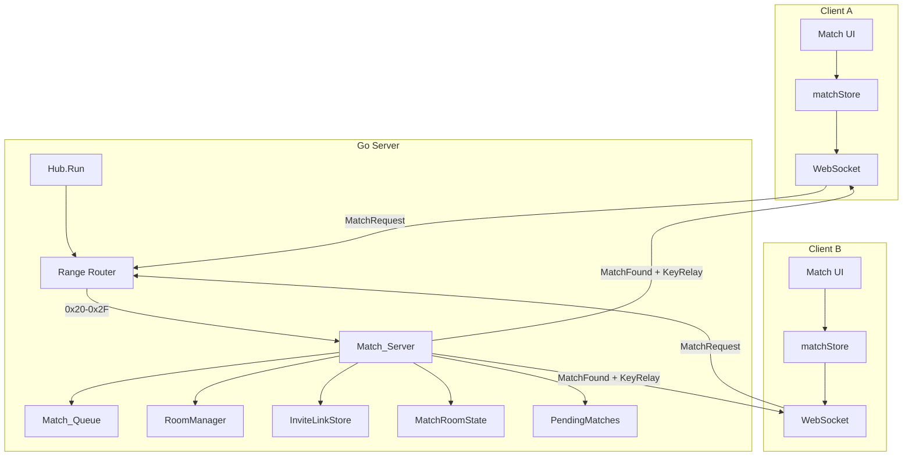
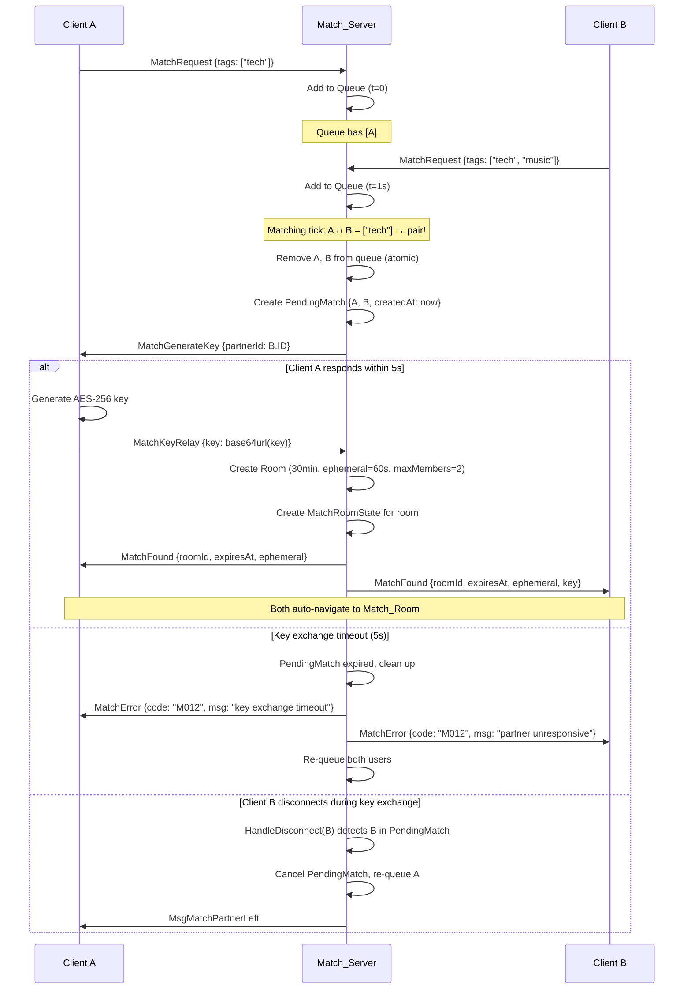

# Design Document: Random Match (随机配对聊天)

## Overview

Random Match 为 Arthas Hub 添加"加密版 Omegle"体验：用户点击按钮进入匹配队列，系统自动配对后创建临时 E2EE 1v1 房间。该功能复用现有 WebSocket Hub 架构和 Room 基础设施，以独立模块方式扩展，不侵入已有逻辑。

**核心设计决策：**

1. **Match 模块独立于 Hub 主循环** — Match_Server 作为独立 struct 运行自己的 ticker 协程（匹配循环），通过接口与 Hub 交互，避免污染 Hub.Run() 的 select 循环。
2. **复用 Room 基础设施** — Match_Room 使用现有 `room.NewRoom()` 创建，与普通房间共享 RoomManager 管理，仅在 maxMembers=2、不注册 HubRegistry 上做区别。
3. **客户端密钥生成 + 服务器中转** — 保持 zero-knowledge 承诺，Client A 生成 AES-256 密钥，服务器仅转发 base64url 编码密钥给 Client B，不持久化。
4. **Feature Flag 模式** — 通过 `--disable-random-match` / `DISABLE_RANDOM_MATCH` 环境变量完全禁用，服务端拒绝所有 match 消息，客户端通过 Hub Stats API 提前知晓功能状态并隐藏入口。
5. **范围路由** — Hub.HandleMessage 通过消息类型范围 (0x20-0x2F) 前置路由到 Match_Server，不在 Hub switch 中逐一添加 case，保持 Hub 代码精简。
6. **批量配对** — 匹配 tick 在单次执行中配对所有可行对（循环直到无匹配），避免 O(N) tick 才清空 N 用户的瓶颈。

## Architecture

### 高层架构



### 消息路由集成

```go
// hub.go — HandleMessage 中的范围路由（不在 switch 中添加单独 case）
func (h *Hub) HandleMessage(client *Client, msg *Message) {
    // Match messages: 0x20-0x2F → delegate to MatchServer
    if msg.Type >= 0x20 && msg.Type <= 0x2F {
        if h.matchServer != nil {
            h.matchServer.HandleMessage(client, msg)
        } else {
            h.sendError(client, "M001", "random match is disabled")
        }
        return
    }
    // ... existing switch for 0x01-0x1E ...
}
```

### Hub 集成点

```go
// hub.go — unregister case 中添加 match 断线通知
case client := <-h.unregister:
    h.mu.Lock()
    if _, ok := h.clients[client]; ok {
        delete(h.clients, client)
        close(client.send)
    }
    h.mu.Unlock()
    h.handleClientDisconnect(client)
    // 通知 Match_Server 客户端断线
    if h.matchServer != nil {
        h.matchServer.HandleDisconnect(client.ID)
    }
    logger.Info("Hub", "client %s disconnected, total: %d", client.ID, h.clientCount())
```

### 服务端模块结构

```
arthas-server/internal/
├── match/                          # 新增：独立 match 模块
│   ├── server.go                   # Match_Server 主逻辑（队列管理、配对、房间创建）
│   ├── queue.go                    # Match_Queue 数据结构与操作
│   ├── config.go                   # 匹配配置参数（timeout、cooldown、limits）
│   ├── ratelimit.go                # IP 级别速率限制 + 封禁 + 清理
│   ├── invite.go                   # Invite_Link 令牌管理 + 过期清理
│   ├── room_state.go              # MatchRoomState（extension 追踪）
│   └── server_test.go             # 单元测试 + 属性测试
├── network/
│   ├── protocol.go                 # 扩展：新增 match 消息类型 (0x20-0x2F)
│   └── hub.go                      # 扩展：范围路由 + unregister 断线通知
```

### 客户端模块结构

```
arthas-client/src/
├── match/                          # 新增：独立 match 模块
│   ├── matchStore.ts               # Zustand store（match 状态管理）
│   ├── MatchEntry.tsx              # Hub 页入口组件（按钮 + 在线人数）
│   ├── MatchWaiting.tsx            # 等待中 UI（动画 + 计时器 + 取消）
│   ├── MatchFound.tsx              # 配对成功动画
│   ├── MatchTimeout.tsx            # 超时 UI（重试 / 邀请 / 返回）
│   ├── MatchRoom.tsx               # Match 房间容器（Next 按钮 + Report + Extend）
│   ├── TagSelector.tsx             # 兴趣标签选择器
│   ├── InviteLink.tsx              # 邀请链接生成 + 分享
│   └── MatchInvitePage.tsx         # /match/:token 路由页面
```

### 数据流：完整匹配流程（含密钥交换超时）



## Components and Interfaces

### Server: Match_Server

```go
// match/server.go

// MatchServer 管理匹配队列、配对逻辑、Invite_Link 和速率限制。
// 作为独立组件运行，通过 RoomCreator 接口与 Hub 解耦。
//
// 并发模型：
// - Run() goroutine: 拥有匹配 ticker、超时扫描、内存清理
// - HandleMessage/HandleDisconnect: 被 Hub.Run() goroutine 调用
// - MatchQueue: 使用 sync.Mutex 保护（两个 goroutine 并发访问）
// - PendingMatches: 使用 sync.Mutex 保护（ticker 扫描 + handler 写入）
// - MatchRoomStates: 使用 sync.Mutex 保护（ticker 清理 + handler 写入）
type MatchServer struct {
    config        *Config
    queue         *MatchQueue
    invites       *InviteLinkStore
    rateLimiter   *MatchRateLimiter
    roomCreator   RoomCreator
    pending       *PendingMatchStore    // 密钥交换中的配对（TTL=5s）
    roomStates    *MatchRoomStateStore  // 活跃 match 房间的扩展状态
    recentPairs   *RecentPairsTracker   // 服务端维护的最近配对记录
    done          chan struct{}
}

// Compile-time interface check (in hub.go):
// var _ match.RoomCreator = (*Hub)(nil)

// RoomCreator 定义 Match_Server 创建房间所需的最小接口。
// Hub 实现此接口，使 Match_Server 无需直接依赖 Hub 具体类型。
type RoomCreator interface {
    // CreateMatchRoom 创建一个临时匹配房间，返回 roomId。
    // 房间不注册到 HubRegistry，maxMembers=2。
    CreateMatchRoom(expiresAt int64, ephemeral int) (string, error)
    // JoinClientToRoom 将客户端加入指定房间。
    JoinClientToRoom(client ClientRef, roomId string, name string) error
}

// ClientRef 是 Match_Server 对客户端连接的最小引用。
type ClientRef interface {
    GetID() string
    GetRoomID() string
    GetRemoteIP() string
    Send(data []byte)
}

// HandleMessage 路由 match 消息到具体 handler（由 Hub 范围路由调用）。
func (ms *MatchServer) HandleMessage(client ClientRef, msg *Message) {
    switch msg.Type {
    case MsgMatchRequest:
        ms.handleMatchRequest(client, msg.Data)
    case MsgMatchCancel:
        ms.handleMatchCancel(client)
    case MsgMatchKeyRelay:
        ms.handleMatchKeyRelay(client, msg.Data)
    case MsgMatchInviteJoin:
        ms.handleInviteJoin(client, msg.Data)
    case MsgMatchReport:
        ms.handleReport(client, msg.Data)
    case MsgMatchExtend:
        ms.handleExtendRequest(client, msg.Data)
    case MsgMatchNext:
        ms.handleNext(client, msg.Data)
    }
}

// HandleDisconnect 处理客户端断线（由 Hub 在 unregister 时调用）。
// 检查三种状态：队列中 → 移除；PendingMatch 中 → 取消并 re-queue 对方；
// MatchRoom 中 → 清理 roomState。
func (ms *MatchServer) HandleDisconnect(clientID string) { ... }

// Run 启动匹配循环。内部包含三个 ticker：
// - matchTicker (1s): 执行批量配对
// - cleanupTicker (30s): 清理过期 invite links、IP records、PendingMatch 超时
// - timeoutTicker (5s): 扫描队列超时和密钥交换超时
func (ms *MatchServer) Run() { ... }

// Stop 停止匹配循环。
func (ms *MatchServer) Stop() { ... }
```

### Server: Match_Queue

```go
// match/queue.go

// MatchEntry 队列中的单条记录。
type MatchEntry struct {
    ClientRef    ClientRef
    Tags         []string    // 0-3 个兴趣标签
    EnqueuedAt   time.Time   // 入队时间
    InviteToken  string      // 关联的邀请链接令牌（空=无邀请）
}

// MatchQueue 线程安全的匹配队列。
type MatchQueue struct {
    mu       sync.Mutex
    entries  []*MatchEntry          // 有序队列（按入队时间）
    byClient map[string]*MatchEntry // clientID → entry 快速查找
    maxSize  int
}

// Enqueue 添加到队列，返回 error 如果已在队列/队列满。
func (q *MatchQueue) Enqueue(entry *MatchEntry) error { ... }

// DequeuePair 原子移除两个配对的 entry。
func (q *MatchQueue) DequeuePair(idA, idB string) { ... }

// Remove 移除单个 entry（取消/断线/超时）。
func (q *MatchQueue) Remove(clientID string) *MatchEntry { ... }

// FindMatch 执行一次匹配扫描，考虑 tag 优先、FIFO 降级、最近配对排除。
// 返回最佳配对（或 nil, nil 表示无可用匹配）。
// 排除逻辑使用服务端 RecentPairsTracker（不依赖客户端提交的 recentPartners）。
func (q *MatchQueue) FindMatch(recentPairs *RecentPairsTracker, now time.Time, tagFallback time.Duration) (*MatchEntry, *MatchEntry) { ... }

// FindAllMatches 在单次调用中找出所有可行配对（批量配对）。
// 内部循环调用 FindMatch 直到返回 nil。
func (q *MatchQueue) FindAllMatches(recentPairs *RecentPairsTracker, now time.Time, tagFallback time.Duration) [][2]*MatchEntry { ... }

// Size 返回当前队列长度。
func (q *MatchQueue) Size() int { ... }

// Contains 检查客户端是否在队列中。
func (q *MatchQueue) Contains(clientID string) bool { ... }

// ExpireEntries 移除所有等待超过 timeout 的 entry，返回被移除的列表。
func (q *MatchQueue) ExpireEntries(timeout time.Duration) []*MatchEntry { ... }
```

### Server: PendingMatchStore

```go
// match/server.go

// PendingMatch 表示一个正在进行密钥交换的配对（TTL=5s）。
type PendingMatch struct {
    ClientA     ClientRef
    ClientB     ClientRef
    CreatedAt   time.Time
    KeyReceived bool     // Client A 是否已发送密钥
}

// PendingMatchStore 线程安全的 pending match 管理。
type PendingMatchStore struct {
    mu       sync.Mutex
    pending  map[string]*PendingMatch // clientA.ID → PendingMatch
    byAny   map[string]string         // clientID → clientA.ID（A/B 双向查找）
}

// Add 添加一个新的 pending match。
func (s *PendingMatchStore) Add(pm *PendingMatch) { ... }

// GetByClient 通过任一方的 clientID 查找 PendingMatch。
func (s *PendingMatchStore) GetByClient(clientID string) *PendingMatch { ... }

// Remove 移除一个 pending match（完成或超时）。
func (s *PendingMatchStore) Remove(clientAID string) { ... }

// ExpireAll 返回并移除所有超过 timeout 的 PendingMatch。
func (s *PendingMatchStore) ExpireAll(timeout time.Duration) []*PendingMatch { ... }
```

### Server: MatchRoomStateStore

```go
// match/room_state.go

// MatchRoomState 追踪活跃 match 房间的扩展状态和参与者信息。
// 独立于 Room 基础设施（Room struct 不添加 match 相关字段）。
type MatchRoomState struct {
    RoomID         string
    ClientAID      string
    ClientBID      string
    ExtensionCount int                   // 已成功延期次数
    PendingExtend  map[string]time.Time  // clientID → 提议时间（TTL=60s）
    CreatedAt      time.Time
}

// MatchRoomStateStore 线程安全的 match 房间状态管理。
type MatchRoomStateStore struct {
    mu     sync.Mutex
    states map[string]*MatchRoomState // roomID → state
}

// Add 注册一个新的 match 房间状态。
func (s *MatchRoomStateStore) Add(state *MatchRoomState) { ... }

// Get 获取房间状态。
func (s *MatchRoomStateStore) Get(roomID string) *MatchRoomState { ... }

// Remove 移除房间状态（房间销毁时）。
func (s *MatchRoomStateStore) Remove(roomID string) { ... }

// ProposeExtend 记录一方的延期提议。如果双方都已提议，返回 true（需执行延期）。
func (s *MatchRoomStateStore) ProposeExtend(roomID, clientID string) (bothAgreed bool) { ... }

// CleanExpiredProposals 清理超过 60s 的未响应延期提议。
func (s *MatchRoomStateStore) CleanExpiredProposals() { ... }
```

### Server: RecentPairsTracker

```go
// match/server.go

// RecentPairsTracker 服务端维护的最近配对记录。
// 用于防止 session loop 中重复配对（不信任客户端提交的 recentPartners）。
type RecentPairsTracker struct {
    mu    sync.Mutex
    pairs map[string][]string // clientID → []recentPartnerIDs（最近 5 个）
}

// RecordPair 记录一次成功配对（双向记录）。
func (t *RecentPairsTracker) RecordPair(idA, idB string) { ... }

// IsRecentPair 检查两个用户是否是最近配对过。
func (t *RecentPairsTracker) IsRecentPair(idA, idB string) bool { ... }

// Remove 清理断线用户的记录。
func (t *RecentPairsTracker) Remove(clientID string) { ... }
```

### Server: Config

```go
// match/config.go

type Config struct {
    Enabled            bool          // 功能开关
    MatchTimeout       time.Duration // 队列等待超时（默认 60s）
    KeyExchangeTimeout time.Duration // 密钥交换超时（默认 5s）
    RoomExpiry         time.Duration // 房间有效期（默认 30min）
    EphemeralSeconds   int           // 阅后即焚时间（默认 60s）
    MaxQueueSize       int           // 队列最大容量（默认 100）
    CooldownPeriod     time.Duration // 冷却期（默认 10s）
    HourlyRateLimit    int           // 每 IP 每小时限制（默认 20）
    BlockDuration      time.Duration // IP 封禁时长（默认 24h）
    MaxExtensions      int           // 最大延期次数（默认 3）
    TagFallbackDelay   time.Duration // 标签降级延迟（默认 10s）
    InviteLinkTTL      time.Duration // 邀请链接有效期（默认 5min）
    CleanupInterval    time.Duration // 内存清理间隔（默认 30s）
}

// DefaultConfig 返回默认配置。
func DefaultConfig() *Config { ... }

// Validate 验证配置有效性，无效时返回描述性错误。
func (c *Config) Validate() error { ... }
```

### Client: matchStore

```typescript
// match/matchStore.ts

interface MatchState {
  // Status — 完整状态机
  status: 'idle' | 'selecting-tags' | 'waiting' | 'pairing' | 'found' | 'timeout' | 'in-room';
  //         idle: 初始状态
  //         selecting-tags: 用户正在选择标签
  //         waiting: 在匹配队列中等待
  //         pairing: 已配对，密钥交换进行中（Client A 生成密钥 / Client B 等待）
  //         found: 配对成功，播放动画
  //         timeout: 匹配超时
  //         in-room: 在 Match_Room 中
  
  // Queue state
  selectedTags: string[];
  waitStartTime: number | null;
  elapsedSeconds: number;
  
  // Match result
  matchRoomId: string | null;
  matchKey: CryptoKey | null;
  isKeyGenerator: boolean;
  
  // Invite link
  inviteLink: string | null;
  inviteToken: string | null;
  
  // Room extension
  extensionProposed: boolean;
  extensionCount: number;
  partnerProposedExtend: boolean;
  
  // Recent partners (session loop — UI hint only, server enforces)
  recentPartnerIds: string[];
  
  // Feature availability (from Hub Stats API)
  matchEnabled: boolean;
  onlineCount: number;
  
  // Actions
  startMatch: (tags?: string[]) => void;
  cancelMatch: () => void;
  nextMatch: () => void;
  generateInviteLink: () => void;
  reportPartner: (reason: string) => void;
  proposeExtension: () => void;
  handleMatchMessage: (msg: Message) => void;
  fetchMatchStatus: () => Promise<void>;  // 从 Hub Stats API 获取功能状态
}
```

### Hub Stats API (新增)

```go
// GET /api/hub/stats — 返回 Hub 状态信息
// 客户端通过此 API 发现 match 功能是否可用 + 在线人数。
//
// Response:
// {
//   "online": 42,             // 当前 WebSocket 连接数
//   "matchEnabled": true,     // random match 功能是否启用
//   "matchQueueSize": 3       // 当前匹配队列中的用户数（让用户评估等待时间）
// }
type HubStatsData struct {
    Online         int  `json:"online"`
    MatchEnabled   bool `json:"matchEnabled"`
    MatchQueueSize int  `json:"matchQueueSize"`
}
```

### WebSocket Protocol Extension

新消息类型使用 `0x20-0x2F` 范围（与现有 `0x01-0x1E` 不冲突）：

```go
// Client → Server (0x20-0x27)
const (
    MsgMatchRequest    uint8 = 0x20  // 进入匹配队列
    MsgMatchCancel     uint8 = 0x21  // 取消匹配
    MsgMatchKeyRelay   uint8 = 0x22  // Client A 中转密钥
    MsgMatchInviteJoin uint8 = 0x23  // 通过邀请链接加入
    MsgMatchReport     uint8 = 0x24  // 举报配对对象
    MsgMatchExtend     uint8 = 0x25  // 提议延期
    MsgMatchNext       uint8 = 0x26  // Session loop: next match
)

// Server → Client (0x28-0x2F)
const (
    MsgMatchGenerateKey   uint8 = 0x28 // 指示 Client A 生成密钥
    MsgMatchFound         uint8 = 0x29 // 配对成功通知
    MsgMatchTimeout       uint8 = 0x2A // 队列超时通知
    MsgMatchError         uint8 = 0x2B // 匹配错误
    MsgMatchPartnerLeft   uint8 = 0x2C // 配对方离开通知
    MsgMatchExtendReq     uint8 = 0x2D // 对方提议延期通知
    MsgMatchExtended      uint8 = 0x2E // 延期成功通知
    MsgMatchInviteCreated uint8 = 0x2F // 邀请链接已创建
)
```

### Protocol Message Data Structures

```go
// Client → Server

type MatchRequestData struct {
    Tags []string `msgpack:"tags"` // 0-3 兴趣标签（server validates）
}

type MatchKeyRelayData struct {
    Key string `msgpack:"key"` // base64url-encoded AES-256 key
}

type MatchInviteJoinData struct {
    Token string `msgpack:"token"` // 邀请令牌
}

type MatchReportData struct {
    Reason string `msgpack:"reason"` // harassment | spam | inappropriate | other
}

// MsgMatchNext 复用 MatchRequestData 结构（客户端显式重新发送 tags，
// 避免依赖 MatchRoomState 在房间销毁后可能丢失 tags 的边界情况）。
type MatchNextData = MatchRequestData

// Server → Client

type MatchGenerateKeyData struct {
    PartnerID string `msgpack:"partnerId"` // 配对方 ID（用于 UI 显示）
}

type MatchFoundData struct {
    RoomID    string `msgpack:"roomId"`
    ExpiresAt int64  `msgpack:"expiresAt"`  // Unix 秒
    Ephemeral int    `msgpack:"ephemeral"`  // 阅后即焚秒数
    Key       string `msgpack:"key,omitempty"` // 仅 Client B 收到
}

type MatchTimeoutData struct {
    WaitedSeconds int `msgpack:"waitedSeconds"` // 等待了多少秒
}

type MatchErrorData struct {
    Code       string `msgpack:"code"`
    Msg        string `msgpack:"msg"`
    RetryAfter int    `msgpack:"retryAfter,omitempty"` // 秒（速率限制时）
}

type MatchExtendedData struct {
    NewExpiresAt   int64 `msgpack:"newExpiresAt"`   // 新的过期时间
    ExtensionsLeft int   `msgpack:"extensionsLeft"` // 剩余延期次数
}

type MatchInviteCreatedData struct {
    Token     string `msgpack:"token"`     // 邀请令牌
    ExpiresAt int64  `msgpack:"expiresAt"` // 令牌过期时间
    Link      string `msgpack:"link"`      // 完整 URL
}
```

### Match Error Codes

```go
const (
    ErrCodeMatchDisabled      = "M001" // 功能已禁用
    ErrCodeAlreadyInQueue     = "M002" // 已在队列中
    ErrCodeAlreadyInRoom      = "M003" // 已在房间中
    ErrCodeCooldown           = "M004" // 冷却期内
    ErrCodeRateLimit          = "M005" // 超过小时限制
    ErrCodeQueueFull          = "M006" // 队列已满
    ErrCodeInvalidTags        = "M007" // 无效标签
    ErrCodeIPBlocked          = "M008" // IP 被封禁
    ErrCodeInviteExpired      = "M009" // 邀请链接已过期
    ErrCodeInviteInvalid      = "M010" // 无效邀请令牌
    ErrCodeExtendMaxReached   = "M011" // 已达最大延期次数
    ErrCodeKeyExchangeTimeout = "M012" // 密钥交换超时
)
```

## Data Models

### Server-Side State

```go
// Match_Queue Entry (in-memory only)
type MatchEntry struct {
    ClientID    string
    ClientRef   ClientRef  // WebSocket connection reference
    Tags        []string   // validated, 0-3 items from predefined set
    EnqueuedAt  time.Time
    InviteToken string     // associated invite link (empty if none)
}

// Pending Key Exchange (in-memory, TTL=5s)
// 配对成功但密钥尚未交换完成的瞬态记录。
// 安全注意：密钥在收到 MatchKeyRelay 后立即转发给 Client B，
// 然后从 PendingMatch 移除。服务器内存中持有密钥的时间窗口 < 1ms。
type PendingMatch struct {
    ClientA     ClientRef
    ClientB     ClientRef
    CreatedAt   time.Time
    KeyReceived bool      // true after MatchKeyRelay received
}

// Match Room State (in-memory, lifecycle = room lifetime)
// 追踪 match 房间的扩展提议和参与者，独立于 Room 基础设施。
type MatchRoomState struct {
    RoomID         string
    ClientAID      string
    ClientBID      string
    ExtensionCount int
    PendingExtend  map[string]time.Time // clientID → proposal time
    CreatedAt      time.Time
}

// Invite_Link Token (in-memory, TTL=5min)
type InviteLink struct {
    Token      string    // crypto-random URL-safe token
    CreatorID  string    // client ID of creator
    CreatedAt  time.Time
    ExpiresAt  time.Time // CreatedAt + 5min
    Used       bool      // single-use flag
}

// IP Report Tracking (in-memory, sliding 24h window)
type IPReportRecord struct {
    IP          string
    Reports     []time.Time // timestamps within 24h window
    BlockedAt   *time.Time  // nil = not blocked
    BlockExpiry *time.Time  // nil = not blocked
}

// IP Rate Limit Tracking (in-memory, sliding 1h window)
type IPMatchRate struct {
    IP         string
    Timestamps []time.Time // match requests within current hour
}

// Recent Pairs Tracking (in-memory, per-connection lifetime)
// 服务端 source of truth，防止 session loop 中重复配对。
// 客户端提交的 recentPartners 仅作参考，服务端独立校验。
type RecentPairsEntry struct {
    ClientID   string
    Partners   []string  // 最近 5 个 partner IDs (ring buffer)
}
```

### Client-Side State

```typescript
// Persisted in localStorage
interface MatchPreferences {
  lastSelectedTags: string[];  // 上次选择的标签（convenience）
}

// In-memory Zustand state (see matchStore above)
// Match state resets on page refresh — no persistent match sessions
```

### Predefined Interest Tags

```go
var ValidTags = []string{
    "tech", "music", "gaming", "random", "language", "movies",
}
```

## Concurrency Model

```
┌─────────────────────────────────────────────────────────────────┐
│                    Goroutine Topology                             │
├─────────────────────────────────────────────────────────────────┤
│                                                                  │
│  Hub.Run() goroutine                                            │
│    ├── handles register/unregister                              │
│    ├── calls matchServer.HandleMessage() (synchronous)          │
│    └── calls matchServer.HandleDisconnect() (synchronous)       │
│                                                                  │
│  MatchServer.Run() goroutine                                    │
│    ├── matchTicker (1s): calls queue.FindAllMatches()           │
│    ├── cleanupTicker (30s): expires invite links, IP records    │
│    └── timeoutTicker (5s): expires queue entries, PendingMatch  │
│                                                                  │
│  Shared state (protected by sync.Mutex):                        │
│    ├── MatchQueue.mu            — queue operations              │
│    ├── PendingMatchStore.mu     — key exchange state            │
│    ├── MatchRoomStateStore.mu   — extension state               │
│    ├── RecentPairsTracker.mu    — pair history                  │
│    ├── InviteLinkStore.mu       — invite tokens                 │
│    └── MatchRateLimiter.mu      — rate limit + block records    │
│                                                                  │
│  client.Send() is non-blocking (select/default) — safe from     │
│  both goroutines without additional synchronization.             │
└─────────────────────────────────────────────────────────────────┘
```

## Memory Cleanup Strategy

所有 in-memory 状态需要定期清理，防止内存泄漏。MatchServer.Run() 中的 cleanupTicker (30s) 负责：

| 数据结构 | 清理条件 | 策略 |
|----------|----------|------|
| InviteLinkStore | token.ExpiresAt < now | 遍历删除过期令牌 |
| IPReportRecord.Reports | timestamp > 24h ago | 修剪旧时间戳，空记录删除 |
| IPMatchRate.Timestamps | timestamp > 1h ago | 修剪旧时间戳，空记录删除 |
| IPReportRecord (blocked) | BlockExpiry < now | 解除封禁，删除记录 |
| PendingMatch | CreatedAt + 5s < now | timeoutTicker 处理（见上） |
| MatchRoomState.PendingExtend | proposal time + 60s < now | 清理过期提议 |
| RecentPairsTracker | client disconnect | HandleDisconnect 时移除 |

## SPA Route Integration

邀请链接 URL 格式为 `{baseUrl}/match/{token}`。作为 React SPA：

1. **Go 服务器**: 对 `/match/*` 路径返回 `index.html`（与其他 SPA 路由一致的 catch-all 处理）
2. **React Router**: 添加路由 `/match/:token` → `MatchInvitePage` 组件
3. **MatchInvitePage 逻辑**:
   - 建立 WebSocket 连接（如果未连接）
   - 发送 `MsgMatchInviteJoin {token}`
   - 等待响应：`MsgMatchFound` → 导航到房间；`MsgMatchError` → 显示错误 + 提供进入常规队列选项

## Correctness Properties

### Property 1: Queue uniqueness

*For any* sequence of MatchRequest operations, a client ID SHALL appear at most once in the Match_Queue at any point in time.

**Validates: Requirements 1.3, 2.5**

### Property 2: Atomic pair removal

*For any* successful match pairing, both matched entries SHALL be removed from the queue atomically — after removal, neither client ID exists in the queue.

**Validates: Requirements 2.6**

### Property 3: Tag-based matching preference

*For any* two users A and B in the queue where A and B share at least one Interest_Tag, and A has waited less than TagFallbackDelay, A SHALL be paired with B before being paired with a user C who shares no tags with A.

**Validates: Requirements 2.1, 2.3**

### Property 4: FIFO fallback ordering

*For any* set of queued users with no tag overlap (or after TagFallbackDelay), the user who entered the queue earliest SHALL be matched first.

**Validates: Requirements 2.2, 2.3**

### Property 5: No self-match or recent-partner re-match

*For any* matching operation, the system SHALL never pair a user with themselves, nor with any user recorded in the server-side RecentPairsTracker for that client.

**Validates: Requirements 12.5**

### Property 6: Tag validation round-trip

*For any* submitted tag set, the server SHALL accept it if and only if: the set contains 0-3 elements AND every element belongs to the predefined ValidTags set.

**Validates: Requirements 5.5, 5.6**

### Property 7: Rate limit enforcement

*For any* client sending MatchRequest messages, if N requests are sent within the cooldown period from the same connection, requests after the first SHALL be rejected with ErrCodeCooldown. If M requests are sent within one hour from the same IP, requests after the HourlyRateLimit SHALL be rejected with ErrCodeRateLimit.

**Validates: Requirements 7.1, 7.2, 7.3, 7.4**

### Property 8: Invite link single-use and expiry

*For any* Invite_Link, after successful use (one join), all subsequent attempts to use the same token SHALL be rejected. After InviteLinkTTL from creation, all attempts to use the token SHALL be rejected.

**Validates: Requirements 11.4, 11.5**

### Property 9: Room extension mutual consent

*For any* Match_Room extension proposal, the room expiry SHALL only be extended when BOTH users have clicked "Extend". A single user's proposal alone SHALL NOT extend the room.

**Validates: Requirements 13.3**

### Property 10: Extension count limit

*For any* Match_Room, the total number of successful extensions SHALL never exceed `MaxExtensions` (default 3). After reaching the limit, extension proposals SHALL be rejected.

**Validates: Requirements 13.4**

### Property 11: Disconnection cleanup

*For any* client that disconnects, its entry SHALL be removed from: (a) MatchQueue, (b) PendingMatchStore (with partner re-queued), (c) RecentPairsTracker. The system SHALL NOT contain stale references to disconnected clients.

**Validates: Requirements 10.1, 10.2**

### Property 12: Match_Room isolation

*For any* Match_Room created by the matching system, it SHALL NOT appear in the HubRegistry listing and SHALL NOT count toward the `maxPublicRooms` quota.

**Validates: Requirements 3.3**

### Property 13: Configuration validation

*For any* Config instance, `Validate()` SHALL return an error if and only if any parameter is invalid (negative durations, zero max queue size, etc.). Valid configurations SHALL pass validation.

**Validates: Requirements 14.5**

### Property 14: Key exchange timeout

*For any* PendingMatch, if MatchKeyRelay is not received within KeyExchangeTimeout (default 5s), the PendingMatch SHALL be cancelled and both users SHALL be returned to the queue or notified of failure.

**Validates: Requirements 3.6 (error recovery)**

### Property 15: Batch matching completeness

*For any* matching tick, if N valid pairs exist in the queue, all N pairs SHALL be matched in that single tick (not just 1 pair per tick).

**Validates: Requirements 2.4 (minimize latency)**

## Error Handling

### Server-Side Error Strategy

| Error Scenario | Response | Recovery |
|---|---|---|
| Duplicate queue entry | `M002` error to client | Client stays in current state |
| Client already in room | `M003` error to client | Client must leave room first |
| Cooldown period active | `M004` error with `retryAfter` | Client shows countdown |
| Hourly rate exceeded | `M005` error with `retryAfter` | Client shows retry time |
| Queue full | `M006` error | Client can retry later |
| Invalid tags | `M007` error | Client corrects and retries |
| IP blocked | `M008` error | Client cannot match for duration |
| Room creation failure | Auto re-queue both users | Internal retry, transparent to user |
| Key exchange timeout (5s) | `M012` error to both + re-queue | Users stay in queue automatically |
| Partner disconnect during key exchange | Re-queue remaining user + `MsgMatchPartnerLeft` | User stays in queue |
| Partner disconnect during PendingMatch | Cancel pending, re-queue remaining | Transparent to remaining user |
| Feature disabled | `M001` error for all match messages | Client hides entry point via Stats API |
| Invalid config at startup | Fail-fast with descriptive message | Server does not start |

### Client-Side Error Handling

- All match errors displayed as localized toast notifications
- Network disconnection during wait → return to idle state (no auto-re-queue per Req 10.3)
- Key generation failure → rare (Web Crypto API), surface error and return to idle
- Navigation away during wait → send MatchCancel before unmount (best-effort)
- Feature disabled discovery → fetchMatchStatus() on Hub page load, hide button if false

## Security Considerations

### Key Exchange Timing Window

密钥在服务器内存中的生命周期：
1. Client A 发送 `MatchKeyRelay` → 服务器收到密钥
2. 服务器立即转发给 Client B（在 `handleMatchKeyRelay` 同一个函数调用中）
3. 转发完成后，密钥不保留在任何数据结构中

**内存驻留时间 < 1ms**（仅在函数栈上）。密钥不写入 PendingMatch struct，不存入任何 map。

### IP-Based Blocking Limitations

IP 封禁是无账户系统中可用的最佳标识符，但存在已知限制：
- **NAT 用户**: 多个用户共享同一 IP，一个恶意用户的行为可能导致同 NAT 下的无辜用户被封禁
- **移动用户**: 频繁切换网络/IP，封禁效果有限
- **VPN/代理**: 可轻松绕过 IP 封禁

这是当前无注册架构下的可接受折衷。未来改进方向：
- 浏览器指纹辅助（localStorage token）
- 行为分析（消息模式检测）
- 分级处罚（首次警告→短封禁→长封禁）

## Room Infrastructure: maxMembers Support

现有 `roomManager.CreateRoom(roomId, password, ephemeral, expiresAt)` 不包含 maxMembers 参数。需要确认/扩展：

**方案 A（推荐）**: 在 Room struct 中添加可选 `MaxMembers int` 字段（0=无限制），`IsFull()` 使用此字段判断。`CreateMatchRoom` 创建时设置 `MaxMembers=2`。

**方案 B**: 在 MatchServer 层面拦截 — 如果 roomID 存在于 `matchRooms` 中且已有 2 人，拒绝加入。缺点：绕过了 Room 层的正常 `IsFull()` 检查。

推荐方案 A，因为它复用了已有的 IsFull() 逻辑路径，改动最小（Room struct 加一个字段 + CreateRoom 加一个参数）。

## Observability

### 结构化日志事件

| 事件 | 日志级别 | 消息格式 |
|------|----------|----------|
| 匹配成功 | INFO | `"Match" "paired %s ↔ %s (tags: %v, wait: %ds)"` |
| 密钥交换完成 | INFO | `"Match" "key exchange complete for room %s"` |
| 密钥交换超时 | WARN | `"Match" "key exchange timeout: %s ↔ %s (5s expired)"` |
| 队列超时 | INFO | `"Match" "client %s timed out after %ds"` |
| 邀请链接创建 | INFO | `"Match" "invite link created by %s, token: %s"` |
| 邀请链接使用 | INFO | `"Match" "invite link used: %s joined %s via token %s"` |
| 邀请链接过期 | DEBUG | `"Match" "cleaned %d expired invite links"` |
| IP 封禁 | WARN | `"Match" "IP %s blocked (reports: %d in 24h)"` |
| IP 解封 | INFO | `"Match" "IP %s unblocked (block expired)"` |
| 速率限制触发 | WARN | `"Match" "rate limited: IP %s (%d/h exceeded)"` |
| 冷却期拒绝 | DEBUG | `"Match" "cooldown rejected: client %s (%ds remaining)"` |
| 房间延期 | INFO | `"Match" "room %s extended (%d/%d), new expiry: %s"` |
| 举报 | WARN | `"Match" "report: %s reported %s (reason: %s, IP reports: %d)"` |
| 批量配对完成 | INFO | `"Match" "tick: %d pairs matched, %d remaining in queue"` |
| 断线清理(队列) | DEBUG | `"Match" "disconnect cleanup: removed %s from queue"` |
| 断线清理(pending) | WARN | `"Match" "disconnect during key exchange: %s, re-queued %s"` |
| 功能启动 | INFO | `"Match" "match server started (queue max: %d, timeout: %s)"` |
| 功能停止 | INFO | `"Match" "match server stopped"` |
| 内存清理 | DEBUG | `"Match" "cleanup: %d invites, %d IP records, %d pending expired"` |

### 可观测性原则

- **不记录密钥内容** — 日志中不出现 AES 密钥或 base64url 编码（zero-knowledge）
- **不记录消息内容** — Match_Room 中的聊天内容不可见（与普通房间一致）
- **记录连接标识** — 使用 client ID（8 字符 UUID 前缀），不记录完整 IP（隐私）
- **封禁例外** — IP 封禁/速率限制日志中记录 IP（运营需要），但仅在 WARN 级别
- **配对效率指标** — 每次 tick 记录配对数和剩余队列长度（用于调优 tick interval）

## Testing Strategy

### Property-Based Tests (Go: `rapid` library)

Property-based tests validate the correctness properties above. Each test runs minimum 100 iterations with random inputs.

**Target areas:**
- Queue operations (enqueue, dequeue, remove, find-all-matches)
- Tag validation logic
- Rate limiter (sliding window correctness)
- Invite link lifecycle (creation, use, expiry)
- Config validation
- Matching algorithm (tag preference, FIFO fallback, exclusion, batch completeness)
- Key exchange timeout (PendingMatch expiry)
- Recent pairs exclusion (RecentPairsTracker)

**Configuration:**
- Library: `pgregory.net/rapid` (already used in arthas-cli property tests)
- Minimum iterations: 100 per property
- Tag format: `// Feature: random-match, Property N: <property text>`

### Unit Tests (Go: `testing` package)

- Match_Server message handlers (happy path + error paths)
- Room creation and key exchange flow
- Key exchange timeout path
- Disconnection handling: in queue, in pending match, in room
- Extension mutual consent state machine (ProposeExtend)
- IP block list management + cleanup
- Batch matching under load (50 users, verify all pairs found in 1 tick)
- Hub Stats API response

### Integration Tests

- Full match flow: two clients → queue → pair → key exchange → room join
- Key exchange timeout: Client A doesn't respond → both re-queued
- Invite link flow: create → share → join → paired
- Session loop: match → chat → next → re-match (verify no re-pairing)
- Concurrent matching under load
- Feature disabled: reject all messages + Stats API returns matchEnabled=false
- Range routing: unknown message in 0x20-0x2F range → no crash

### Client-Side Tests (Vitest)

- matchStore state transitions (all 7 states)
- 'pairing' state: entering and exiting
- Tag selector validation
- Protocol message serialization
- Timer/countdown logic
- fetchMatchStatus integration

### Manual Testing Scenarios

- Cold-start: single user → timeout → invite link → friend joins via /match/:token
- Rapid next: session loop 5+ matches consecutively (verify no repeat pairing)
- Disconnection during key exchange (both sides)
- Both users click "Next" simultaneously
- Extension proposal timeout (one user ignores)
- Queue burst: 20 users enter within 1s (verify all matched in ≤2 ticks)
- Feature flag: start with --disable-random-match, verify UI hidden + Stats API
