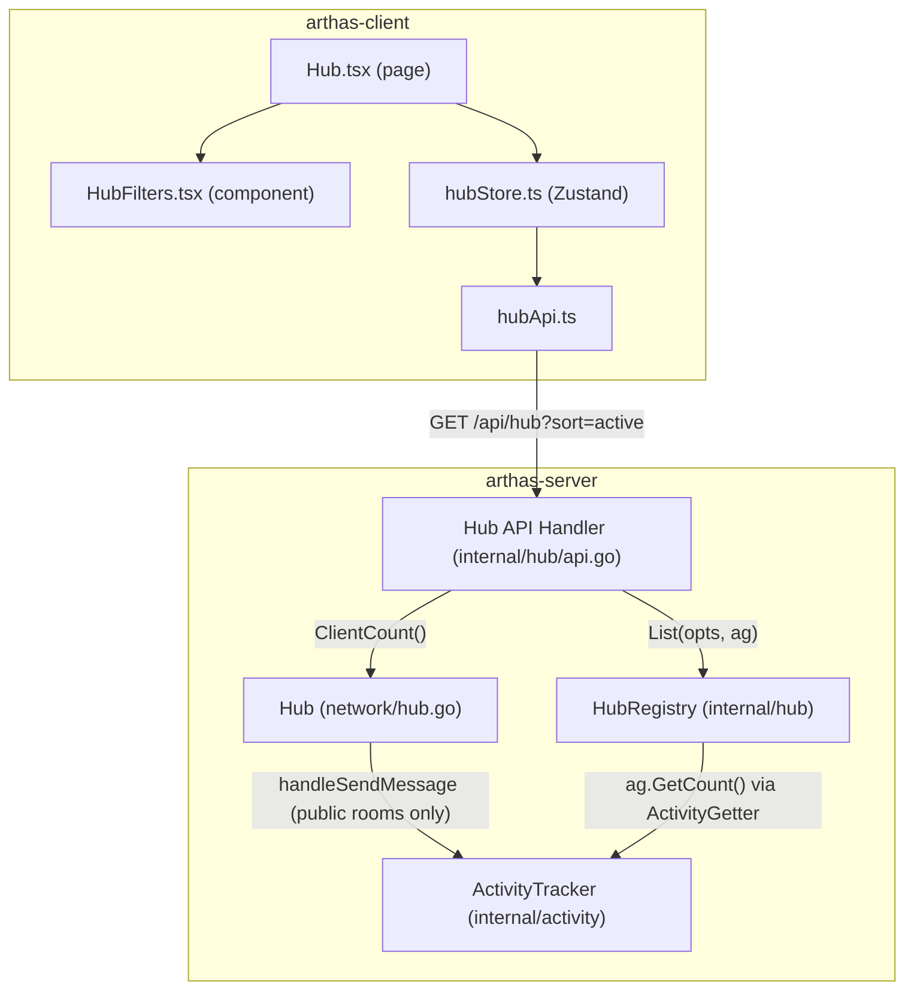

# Design Document: Room Activity Ranking

## Overview

This feature adds activity-based sorting and global online count to the Arthas Hub page. It enables users to discover the most active, popular, or newest public rooms without compromising Arthas's zero-knowledge E2EE design.

The design introduces three coordinated changes:

1. **Server-side Activity Tracker** — A new `internal/activity` module that counts message relay events per public room using a 5-minute sliding window. It never accesses message content; it only observes that a relay event occurred for a Hub-registered room.
2. **Hub API extensions** — The existing `/api/hub` endpoint gains a `sort` query parameter and returns two new fields: `messageCount5min` per room and `totalOnline` globally.
3. **Frontend sort mode UI** — The `HubFilters` component gains a tab row for sort modes (🔥 Most Active, 👥 Most People, 🆕 Newest, All). The Hub page header displays a live "N people online" indicator.

### Design Rationale

- **Privacy preservation**: The activity tracker counts relay events only for public rooms—never inspects `iv` or `ciphertext` fields, and never tracks private rooms. This maintains the existing zero-knowledge guarantee.
- **No new transport**: Activity data piggybacks on the existing 30-second HTTP polling mechanism. No WebSocket subscription is needed for the Hub page.
- **Bounded memory**: The sliding window uses a capped ring buffer per room (max 10,000 timestamps). Rooms with zero activity consume no memory after cleanup.
- **Sort on server**: Sorting is performed server-side so that pagination remains correct (client-side sort would only reorder the current page).
- **Only public rooms tracked**: The Activity Tracker only records events for rooms registered in HubRegistry, avoiding memory waste on private rooms and respecting their privacy.

## Architecture



### Data Flow

1. Client sends encrypted message → Server routes via `handleSendMessage`.
2. After successful broadcast, Hub checks if room is in HubRegistry; if yes, calls `ActivityTracker.Increment(roomID)`.
3. On Hub API request, API handler calls `registry.List(opts, activityGetter)`:
   - List() acquires read lock, collects filtered listings, releases lock
   - List() creates shallow copies (Copy-on-Enrichment)
   - List() pre-computes `MessageCount5min` from ActivityGetter on the copies
   - List() sorts copies using populated fields
   - List() paginates and returns
4. API handler sets `result.TotalOnline = hub.ClientCount()`.
5. API handler encodes JSON response.
6. Frontend renders sorted rooms and displays the online count.

### Key Constraint: Reactions Excluded

`handleSendReaction` does NOT trigger `Increment()`. Reactions have no server-side rate limiting (by design, as they are lightweight interactions), so counting them would allow users to artificially inflate a room's activity ranking.

## Components and Interfaces

### 1. ActivityTracker (Server — `internal/activity/tracker.go`)

A thread-safe, in-memory sliding window counter with time injection for testability.

```go
package activity

import (
    "sync"
    "time"
)

// Tracker maintains per-room message event counts within a sliding window.
type Tracker struct {
    mu        sync.RWMutex
    rooms     map[string]*roomActivity
    window    time.Duration // default 5 minutes
    maxEvents int           // cap per room (default 10,000)
    nowFunc   func() time.Time // default time.Now, injectable for testing
}

type roomActivity struct {
    timestamps []int64 // unix milliseconds, ring buffer (sorted, max maxEvents entries)
}

// New creates a Tracker with the given window duration and per-room event cap.
func New(window time.Duration, maxEvents int) *Tracker

// WithNowFunc sets a custom time function (for testing). Returns the Tracker for chaining.
func (t *Tracker) WithNowFunc(fn func() time.Time) *Tracker

// Increment records a message relay event for the given room.
// O(1) amortized: appends timestamp. If cap is reached, evicts the oldest timestamp
// and inserts the new one (ring buffer semantics).
func (t *Tracker) Increment(roomID string)

// GetCount returns the number of events within the sliding window for a room.
// Performs lazy pruning of expired timestamps before counting.
// Returns 0 for unknown rooms (no error).
func (t *Tracker) GetCount(roomID string) int

// Remove discards all activity data for a room (called on room destruction).
func (t *Tracker) Remove(roomID string)

// Cleanup prunes expired entries across all rooms. Called periodically (60s ticker).
func (t *Tracker) Cleanup()
```

**Design decisions:**
- Uses `[]int64` (unix ms timestamps) with ring buffer semantics: when cap is reached, oldest entry is evicted and newest is appended. This ensures the window always reflects the most recent N events.
- Lazy pruning in `GetCount` keeps `Increment` at O(1). Periodic `Cleanup` prevents unbounded growth for inactive rooms.
- `nowFunc` injection follows the same pattern as `RoomManager.NowFunc` in the existing codebase, enabling deterministic time-based testing.
- A single `sync.RWMutex` is acceptable because Hub API requests are infrequent (one per client per 30s) and the critical section is short. `Increment` and `Remove` acquire write lock; `GetCount` acquires read lock (with promotion to write for pruning).
- Concurrent safety: `handleSendMessage` runs in per-client readPump goroutines (concurrent), so multiple `Increment` calls happen in parallel. The mutex ensures correctness.

### 2. HubRegistry Extensions — Copy-on-Enrichment Pattern

#### The Data Race Problem

The current `HubRegistry.List()` returns `[]*RoomListing` where each pointer points to the **shared internal registry entry**. If the API handler sets `MessageCount5min` on these pointers, concurrent API requests would mutate the same memory — a classic data race detectable by `go test -race`.

```
// ❌ UNSAFE: Two concurrent API requests both writing to the same listing pointer
Request A: result.Rooms[0].MessageCount5min = 42   // goroutine 1
Request B: result.Rooms[0].MessageCount5min = 45   // goroutine 2 (race!)
```

#### Solution: Shallow Copy in List()

`List()` creates **shallow copies** of each filtered listing before returning. The returned slice contains freshly allocated structs that are safe to mutate. This is the only place copies are made — the internal registry map retains its original pointers undisturbed.

```
// ✅ SAFE: Each API request gets its own copy of each listing
Request A: copy_A.MessageCount5min = 42   // goroutine 1 (own memory)
Request B: copy_B.MessageCount5min = 45   // goroutine 2 (own memory)
```

**Cost**: At most 200 shallow copies of a small struct (~200 bytes each) per API request = ~40KB allocation. Negligible for a once-per-30s request.

#### Updated Interfaces

The `List()` method signature gains an `ActivityGetter` parameter:

```go
// ActivityGetter provides message activity counts (dependency injection interface).
// Defined in the hub package to avoid import cycles.
type ActivityGetter interface {
    GetCount(roomID string) int
}

// List returns a filtered, sorted, paginated slice of listings.
// When ag is non-nil, it populates MessageCount5min on each listing (copies)
// and uses it for "active"/"people" sort modes.
// When ag is nil, MessageCount5min defaults to 0 (graceful degradation).
func (r *HubRegistry) List(opts ListOptions, ag ActivityGetter) *ListResult
```

The `ListOptions` struct gains a new `Sort` field:

```go
type ListOptions struct {
    Tag          string
    Query        string
    IsDailyTopic *bool
    Sort         string // "active", "people", "newest", or "" (default)
    Limit        int
    Offset       int
}
```

The `ListResult` struct gains `TotalOnline`:

```go
type ListResult struct {
    Rooms       []*RoomListing `json:"rooms"`
    Total       int            `json:"total"`
    Limit       int            `json:"limit"`
    Offset      int            `json:"offset"`
    TotalOnline int            `json:"totalOnline"` // set by API handler, not by List()
}
```

The `RoomListing` struct gains a computed field:

```go
type RoomListing struct {
    // ... existing fields ...
    MessageCount5min int `json:"messageCount5min"` // populated by List() from ActivityGetter
}
```

#### List() Internal Flow (Pseudocode)

```go
func (r *HubRegistry) List(opts ListOptions, ag ActivityGetter) *ListResult {
    r.mu.RLock()
    // 1. Collect all listings into a slice (pointers to internal state)
    all := make([]*RoomListing, 0, len(r.listings))
    for _, l := range r.listings {
        all = append(all, l)
    }
    r.mu.RUnlock()

    // 2. Apply filters (tag, query, isDailyTopic)
    filtered := applyFilters(all, opts)

    // 3. COPY-ON-ENRICHMENT: Create shallow copies for safe mutation
    copies := make([]*RoomListing, len(filtered))
    for i, l := range filtered {
        c := *l  // shallow copy (value semantics)
        copies[i] = &c
    }

    // 4. Pre-compute activity counts (O(N) calls, not O(N log N))
    if ag != nil {
        for _, c := range copies {
            c.MessageCount5min = ag.GetCount(c.RoomID)
        }
    }

    // 5. Sort using the already-populated MessageCount5min field
    sortListings(copies, opts.Sort)

    // 6. Paginate and return
    total := len(copies)
    page := paginate(copies, opts.Limit, opts.Offset)
    return &ListResult{Rooms: page, Total: total, Limit: opts.Limit, Offset: opts.Offset}
}
```

**Key insight**: Activity counts are pre-computed once per listing (step 4), then sort.Slice uses the already-populated `MessageCount5min` field (step 5). This means:
- GetCount is called exactly N times (not N log N times during sort comparisons)
- The counts used for sorting are **identical** to the counts returned in the JSON response (no TOCTOU gap)
- All mutation happens on copies, never on shared internal state

### 3. Hub API Handler Extensions (`internal/hub/api.go`)

The API handler is now simpler because List() handles both enrichment and sorting:

```go
// HubHandlerConfig holds all dependencies for the Hub API handler.
// Using a config struct avoids breaking changes when adding new dependencies.
type HubHandlerConfig struct {
    Registry       *HubRegistry
    RateLimiter    *RateLimiter
    AllowedOrigins string
    ActivityGetter ActivityGetter // nil means all counts are 0 (graceful degradation)
    OnlineCountFn  func() int    // returns Hub.ClientCount()
}

// NewHubHandler creates the HTTP handler for the Hub directory API.
func NewHubHandler(cfg HubHandlerConfig) http.Handler
```

The handler's responsibility is reduced to:
1. Parse `sort` query parameter (validate: must be `active`, `people`, `newest`, or empty)
2. Call `registry.List(opts, cfg.ActivityGetter)` — List handles copy, enrich, sort, paginate
3. Set `result.TotalOnline = cfg.OnlineCountFn()` (if OnlineCountFn is non-nil, else 0)
4. Encode JSON response

```go
// Inside the handler:
result := cfg.Registry.List(opts, cfg.ActivityGetter)
if cfg.OnlineCountFn != nil {
    result.TotalOnline = cfg.OnlineCountFn()
}
json.NewEncoder(w).Encode(result)
```

**Migration note**: The previous signature `NewHubHandler(registry, rateLimiter, allowedOrigins)` is replaced with a config struct. This affects:
- `cmd/server/main.go` (line ~204)
- `internal/hub/api_test.go` (setupTestHandler and 10+ test functions)
- `internal/hub/integration_test.go` (2 test functions)

All call sites pass `ActivityGetter: nil` and `OnlineCountFn: nil` for backward compatibility in tests that don't exercise activity features.

### 4. Hub Integration (`internal/network/hub.go`)

- After `r.Broadcast(...)` in `handleSendMessage` ONLY (not handleSendReaction), check if the room is public:
  ```go
  if h.hubRegistry != nil && h.hubRegistry.GetListing(client.RoomID) != nil {
      h.activityTracker.Increment(client.RoomID)
  }
  ```
- Add a periodic `activityCleanupTicker` (60s interval) in `Run()` to call `h.activityTracker.Cleanup()`.
- On room removal (in `handleLeaveRoom` and `cleanupExpiredRooms`), call `h.activityTracker.Remove(roomID)`.
- Expose `ClientCount() int` as a new public method (wraps existing unexported `clientCount()`):
  ```go
  // ClientCount returns the number of currently connected WebSocket clients.
  // Safe for concurrent use (acquires read lock internally).
  func (h *Hub) ClientCount() int {
      return h.clientCount()
  }
  ```

### 5. Frontend Store Extensions (`hub/hubStore.ts`)

```typescript
// New state fields
interface HubState {
  // ... existing ...
  sortMode: SortMode;
  totalOnline: number;
  setSortMode: (mode: SortMode) => void;
}

type SortMode = 'active' | 'people' | 'newest' | '';
```

- `setSortMode` updates state and triggers an immediate `fetchRooms()` with offset reset to 0.
- `fetchRooms` includes the current `sortMode` in the API request.
- `totalOnline` is extracted from the API response and stored (defaults to 0 if field is missing).
- The sort mode persists across polling cycles (module-level timer calls `fetchRooms` which reads current `sortMode` from state).

### 6. Frontend API Client (`hub/hubApi.ts`)

```typescript
export interface FetchHubOptions {
  filters: HubFilters;
  limit?: number;
  offset?: number;
  isDailyTopic?: boolean;
  sort?: string; // new
}
```

The `sort` parameter is appended to the URL query string when non-empty.

### 7. Frontend Types (`hub/types.ts`)

```typescript
export interface RoomListing {
  // ... existing ...
  messageCount5min: number; // new
}

export interface HubListResponse {
  rooms: RoomListing[];
  total: number;
  limit: number;
  offset: number;
  totalOnline: number; // new
}
```

### 8. HubFilters Component (`components/HubFilters.tsx`)

Adds a sort mode tab row above the search input:

```tsx
const SORT_MODES = [
  { value: '', labelKey: 'hub.sort.all' },
  { value: 'active', labelKey: 'hub.sort.active', icon: '🔥' },
  { value: 'people', labelKey: 'hub.sort.people', icon: '👥' },
  { value: 'newest', labelKey: 'hub.sort.newest', icon: '🆕' },
] as const;
```

Each button uses `aria-pressed` for accessibility and a distinct background color when active. An `aria-live="polite"` region announces sort mode changes to screen readers.

### 9. Online Count Display (`pages/Hub.tsx`)

Near the header, a small badge:

```tsx
<span className="text-sm text-green-400 flex items-center gap-1">
  <span className="w-2 h-2 rounded-full bg-green-400 animate-pulse" aria-hidden="true" />
  {t('hub.onlineCount', { count: totalOnline })}
</span>
```

### 10. i18n Keys

New translation keys added to `en.json`, `zh.json`, `ja.json`:

| Key | EN | ZH | JA |
|-----|----|----|-----|
| `hub.sort.all` | All | 全部 | すべて |
| `hub.sort.active` | Most Active | 最活跃 | 最もアクティブ |
| `hub.sort.people` | Most People | 人数最多 | 最も人が多い |
| `hub.sort.newest` | Newest | 最新 | 最新 |
| `hub.onlineCount` | {{count}} online now | {{count}} 人在线 | {{count}} 人がオンライン |
| `hub.sort.changed` | Sorted by {{mode}} | 已按{{mode}}排序 | {{mode}}で並べ替え |

Note: Uses `{{count}}` interpolation syntax consistent with the existing i18n library (i18next-style double curly braces).

## Data Models

### Server-Side

**ActivityTracker in-memory state:**

```
rooms: map[string]*roomActivity
  └─ roomActivity
       └─ timestamps: []int64  (sorted, unix ms, ring buffer, max 10,000 entries)
```

No persistent storage. All data is ephemeral—lost on server restart, which is acceptable because the window is only 5 minutes. On restart, all `messageCount5min` values start at 0 and rebuild naturally within 5 minutes.

**Extended RoomListing (response only):**

| Field | Type | Source |
|-------|------|--------|
| `messageCount5min` | int | Populated by List() from ActivityGetter.GetCount() on shallow copies |

**Extended ListResult (response only):**

| Field | Type | Source |
|-------|------|--------|
| `totalOnline` | int | Set by API handler from Hub.ClientCount() after List() returns |

### Client-Side

**Extended HubState:**

| Field | Type | Default |
|-------|------|---------|
| `sortMode` | `'' \| 'active' \| 'people' \| 'newest'` | `''` |
| `totalOnline` | `number` | `0` |

### Sort Order Logic (in HubRegistry.List — operates on copies)

| `sort` param | Primary sort | Tiebreaker |
|--------------|-------------|------------|
| `active` | `MessageCount5min` DESC | `MemberCount` DESC |
| `people` | `MemberCount` DESC | `MessageCount5min` DESC |
| `newest` | `CreatedAt` DESC | — |
| `` (default) | `MemberCount` DESC | `CreatedAt` DESC |

When `ActivityGetter` is nil (e.g., server just restarted), all `MessageCount5min` values are 0. The "active" sort mode degrades gracefully to sorting by `MemberCount` (the tiebreaker), which matches the default sort behavior.


## Correctness Properties

*A property is a characteristic or behavior that should hold true across all valid executions of a system—essentially, a formal statement about what the system should do. Properties serve as the bridge between human-readable specifications and machine-verifiable correctness guarantees.*

### Property 1: Increment grows count

*For any* room ID and any sequence of N Increment calls (where N ≤ 10,000) all occurring within the sliding window, `GetCount(roomID)` SHALL equal N.

**Validates: Requirements 1.1, 7.3**

### Property 2: Sliding window expiry

*For any* room with events at various timestamps, `GetCount(roomID)` SHALL return only the count of events whose timestamps are within the most recent 5 minutes relative to the current time. Events older than 5 minutes SHALL NOT be included.

**Validates: Requirements 1.2, 1.3, 8.1, 8.2**
**Testing note**: Requires `nowFunc` injection to advance time deterministically.

### Property 3: Remove discards all data

*For any* room ID with any prior activity history, after calling `Remove(roomID)`, `GetCount(roomID)` SHALL return 0.

**Validates: Requirements 1.5**

### Property 4: Sort ordering invariant

*For any* set of room listings with arbitrary `messageCount5min`, `memberCount`, and `createdAt` values, and *for any* valid sort mode (`active`, `people`, `newest`, or default):
- `active`: output SHALL be ordered by `messageCount5min` DESC, ties by `memberCount` DESC
- `people`: output SHALL be ordered by `memberCount` DESC, ties by `messageCount5min` DESC
- `newest`: output SHALL be ordered by `createdAt` DESC
- default (including any unrecognized string): output SHALL be ordered by `memberCount` DESC, ties by `createdAt` DESC

**Validates: Requirements 2.3, 2.4, 2.5, 2.6, 2.7**

### Property 5: Event cap with ring buffer semantics

*For any* room where more than 10,000 Increment calls occur within the sliding window, `GetCount(roomID)` SHALL return exactly 10,000 and the internal storage SHALL contain exactly 10,000 timestamps representing the most recent events. Older events beyond the cap SHALL have been evicted.

**Validates: Requirements 8.4, 8.5**

### Property 6: Activity count consistency

*For any* room registered in the HubRegistry, the `messageCount5min` field in the API response SHALL equal the value returned by `ActivityTracker.GetCount(roomID)` at query time.

**Validates: Requirements 2.1**

### Property 7: Monotonicity within frozen time

*For any* room ID and any sequence of Increment calls made at the same timestamp (frozen time via nowFunc), `GetCount(roomID)` SHALL be monotonically non-decreasing after each Increment, up to the cap of 10,000.

**Validates: Requirements 1.6 (O(1) amortized correctness)**

### Property 8: Concurrent safety (Copy-on-Enrichment)

*For any* number of concurrent `List()` calls (simulating parallel API requests), each call SHALL return independent `RoomListing` copies. Mutations to `MessageCount5min` on one result SHALL NOT affect listings in the internal registry or in other concurrent results.

**Testing note**: Validated via `go test -race` with parallel goroutines calling `List()` simultaneously. All PBT tests MUST pass with `-race` flag.

### Property 9: ActivityTracker concurrent safety

*For any* combination of concurrent Increment, GetCount, Remove, and Cleanup calls across multiple goroutines, the Tracker SHALL never panic, produce negative counts, or enter an inconsistent state.

**Testing note**: Validated via `go test -race` with parallel goroutines exercising all Tracker methods simultaneously.

## Error Handling

### Server-Side

| Scenario | Handling |
|----------|----------|
| `sort` param has unrecognized value | Silently ignored, default sort applied (Req 2.7) |
| ActivityTracker.GetCount for unknown room | Returns 0 (no error) |
| ActivityGetter is nil (server just restarted) | API handler treats all counts as 0 (Req 2.8) |
| Room removed while building response | Room excluded from results (registry lock prevents mid-iteration removal). List() copies are independent — removing the original after copy has no effect on the response |
| Concurrent Increment during Cleanup | RWMutex ensures consistency; Cleanup holds write lock, Increment holds write lock, GetCount holds read lock |
| HubRegistry.GetListing returns nil during Increment check | Room is not public, Increment is skipped (Req 1.7) |

### Client-Side

| Scenario | Handling |
|----------|----------|
| API returns no `totalOnline` field | Default to 0 (TypeScript `response.totalOnline ?? 0`) |
| API returns no `messageCount5min` field | Default to 0 on the room listing |
| Network error during poll | Existing error handling in hubStore displays error state and retry button |
| Sort mode applied but no rooms match | Existing empty state UI shown |

## Testing Strategy

### Property-Based Tests (Go — `pgregory.net/rapid`)

The server-side ActivityTracker and sort logic are pure, deterministic functions with clear input/output—ideal for property-based testing.

**Library**: `pgregory.net/rapid` (already in go.mod, should be promoted from indirect to direct dependency)

**Configuration**: Minimum 100 iterations per property test. All tests run with `-race` flag.

**Test files**:
- `internal/activity/tracker_property_test.go` — Properties 1, 2, 3, 5, 7, 9
- `internal/hub/registry_property_test.go` — Properties 4, 6, 8

Each test tagged with:
```go
// Feature: room-activity-ranking, Property 1: Increment grows count
```

### Unit Tests (Go)

- `internal/activity/tracker_test.go`:
  - Specific examples: increment once, check count; advance time 5min via nowFunc, check count drops to 0
  - Edge case: Increment on nil/empty room
  - Edge case: Cleanup on empty tracker
  - Edge case: Remove non-existent room (no panic)
  - Edge case: Ring buffer eviction at cap (10,001st event evicts oldest)
  - Verify: Increment only fires for public rooms (integration with HubRegistry check)

- `internal/hub/api_test.go`:
  - Example: sort=active returns correct HTTP 200 with sorted rooms
  - Example: invalid sort param returns default-sorted results
  - Example: totalOnline field present with correct value
  - Edge case: 0 rooms with sort param (empty array, not error)
  - Edge case: nil ActivityGetter (graceful degradation, all counts 0)
  - Data race: concurrent API requests don't interfere (verified with `-race`)
  - Migration: all existing tests updated to use `HubHandlerConfig` struct

- `internal/hub/registry_test.go` (new tests):
  - List returns copies: mutating returned RoomListing does NOT affect registry internal state
  - List pre-computes counts: MessageCount5min is populated before sort
  - List with nil ActivityGetter: all MessageCount5min are 0
  - Concurrent List calls: no race conditions (with `-race` flag)

### Unit Tests (TypeScript — Vitest)

- `hub/hubStore.test.ts`:
  - Sort mode switch resets pagination offset
  - Sort mode persists across polling cycles
  - totalOnline updates from API response
  - Default sort mode is '' on initial load
  - totalOnline defaults to 0 when field missing from response

- `components/HubFilters.test.tsx`:
  - Renders 4 sort buttons with correct labels
  - Clicking sort button calls setSortMode
  - Active button has `aria-pressed="true"`
  - aria-live region announces sort change

### Integration Tests

- `internal/hub/integration_test.go`:
  - Full flow: create public room → send messages → query API with sort=active → verify ordering
  - Verify totalOnline matches connected client count
  - Verify messageCount5min decreases after 5 minutes elapse (via nowFunc)
  - Verify reactions do NOT increment activity count
  - Verify private room messages do NOT appear in activity counts

### i18n Verification

- Example tests for each locale (zh, en, ja) verifying translation keys resolve to non-empty strings
- Verify interpolation works for `hub.onlineCount` with numeric count values (uses `{{count}}` syntax)
