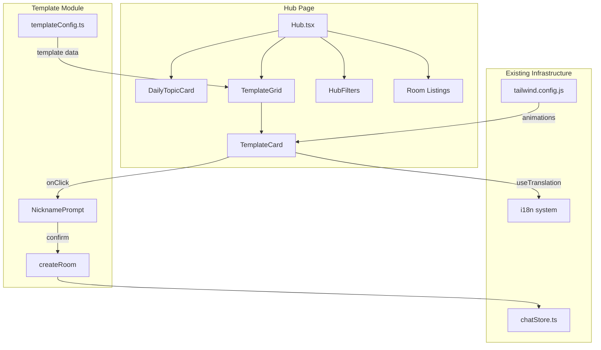

# Design Document: Room Templates

## Overview

Room Templates adds a visually engaging "Quick Create" section to the Arthas Hub page, providing pre-configured room creation shortcuts via animated template cards. Users click a template card, confirm a nickname, and immediately create a room with sensible defaults — no manual parameter configuration needed.

This is a pure frontend feature. Templates are defined as a static TypeScript configuration array in the arthas-client. Clicking a template card pre-fills the existing `createRoom()` function's parameters (expiry, ephemeral time, public listing data). No backend protocol changes are required.

**Key Design Decisions:**
- Templates live as a single static configuration constant — easy to add/remove templates without touching component code
- Reuses the existing `createRoom()` API from `chatStore` with its `publicData` parameter for Hub listing
- CSS animations follow the project's established patterns (pulse-glow, shimmer, fade-in-up, hover transforms) documented in `docs/beta/css-animation-guide.md`
- New components are isolated in a `src/hub/templates/` directory, following the project's single-responsibility principle

## Architecture



**Layout Order in Hub.tsx:**
1. Header (existing)
2. DailyTopicCard (existing)
3. Daily topic nickname prompt (existing, conditional)
4. **TemplateGrid (new)** — "Quick Create" section
5. HubFilters (existing)
6. Room listings (existing)

## Components and Interfaces

### Template Configuration (`src/hub/templates/templateConfig.ts`)

```typescript
/** Theme color for template card visual styling */
export type TemplateThemeColor = 'indigo' | 'emerald' | 'amber' | 'purple' | 'blue' | 'orange' | 'pink';

/**
 * Static configuration for a room template.
 * Defines all parameters needed to pre-fill createRoom() and render the card.
 */
export interface TemplateConfig {
  /** Unique identifier for the template (used as key) */
  id: string;
  /** Emoji icon displayed prominently on the card */
  emoji: string;
  /** i18n key for the template display name */
  nameKey: string;
  /** i18n key for the template short description */
  descriptionKey: string;
  /** Preset tags for the created room's public listing */
  tags: string[];
  /** Room expiry duration in seconds (0 = no expiry) */
  expirySeconds: number;
  /** Ephemeral mode timer in seconds (0 = disabled) */
  ephemeralSeconds: number;
  /** Whether to show password input during creation (recommended, not required) */
  passwordRecommended: boolean;
  /** Theme color for card border, glow, and hover effects */
  themeColor: TemplateThemeColor;
}

/** All available room templates — single source of truth */
export const ROOM_TEMPLATES: readonly TemplateConfig[] = [
  {
    id: 'interview-prep',
    emoji: '💼',
    nameKey: 'hub.templates.interviewPrep.name',
    descriptionKey: 'hub.templates.interviewPrep.desc',
    tags: ['interview', 'practice'],
    expirySeconds: 3600,       // 60 minutes
    ephemeralSeconds: 60,       // 60s ephemeral
    passwordRecommended: false,
    themeColor: 'indigo',
  },
  {
    id: 'debug-help',
    emoji: '🐛',
    nameKey: 'hub.templates.debugHelp.name',
    descriptionKey: 'hub.templates.debugHelp.desc',
    tags: ['debug', 'help'],
    expirySeconds: 0,           // no expiry
    ephemeralSeconds: 0,        // no ephemeral
    passwordRecommended: false,
    themeColor: 'emerald',
  },
  {
    id: 'team-retro',
    emoji: '🔄',
    nameKey: 'hub.templates.teamRetro.name',
    descriptionKey: 'hub.templates.teamRetro.desc',
    tags: ['team', 'retro'],
    expirySeconds: 0,           // no expiry
    ephemeralSeconds: 0,        // no ephemeral
    passwordRecommended: true,
    themeColor: 'purple',
  },
  {
    id: 'anonymous-feedback',
    emoji: '💭',
    nameKey: 'hub.templates.anonymousFeedback.name',
    descriptionKey: 'hub.templates.anonymousFeedback.desc',
    tags: ['anonymous', 'feedback'],
    expirySeconds: 86400,       // 24 hours
    ephemeralSeconds: 30,       // 30s ephemeral
    passwordRecommended: false,
    themeColor: 'amber',
  },
  {
    id: 'study-room',
    emoji: '🎓',
    nameKey: 'hub.templates.studyRoom.name',
    descriptionKey: 'hub.templates.studyRoom.desc',
    tags: ['study', 'focus'],
    expirySeconds: 7200,        // 2 hours
    ephemeralSeconds: 0,        // no ephemeral
    passwordRecommended: false,
    themeColor: 'blue',
  },
  {
    id: 'coffee-chat',
    emoji: '☕',
    nameKey: 'hub.templates.coffeeChat.name',
    descriptionKey: 'hub.templates.coffeeChat.desc',
    tags: ['chat', 'casual'],
    expirySeconds: 1800,        // 30 minutes
    ephemeralSeconds: 0,        // no ephemeral
    passwordRecommended: false,
    themeColor: 'orange',
  },
  {
    id: 'game-night',
    emoji: '🎮',
    nameKey: 'hub.templates.gameNight.name',
    descriptionKey: 'hub.templates.gameNight.desc',
    tags: ['game', 'fun'],
    expirySeconds: 0,           // no expiry
    ephemeralSeconds: 0,        // no ephemeral
    passwordRecommended: false,
    themeColor: 'pink',
  },
] as const;
```

### TemplateGrid Component (`src/hub/templates/TemplateGrid.tsx`)

```typescript
interface TemplateGridProps {
  /** Callback when user completes template selection flow */
  onCreateFromTemplate: (template: TemplateConfig, nickname: string, password?: string) => void;
  /** Whether room creation is in progress (disables prompt confirm) */
  isCreating: boolean;
  /** Error message to display inline in the prompt area */
  createError: string | null;
}
```

Responsibilities:
- Renders section header ("Quick Create" / "快速创建")
- Maps `ROOM_TEMPLATES` to `TemplateCard` components in a responsive grid
- Manages the staggered fade-in animation delays
- **Owns internal prompt state**: `selectedTemplate: TemplateConfig | null` — when non-null, renders `TemplateNicknamePrompt`
- Passes `isCreating` and `createError` through to the prompt
- Resets `selectedTemplate` to null on cancel or successful navigation

### TemplateCard Component (`src/hub/templates/TemplateCard.tsx`)

```typescript
interface TemplateCardProps {
  template: TemplateConfig;
  /** Stagger index for animation delay calculation */
  index: number;
  /** Triggered when user clicks/activates the card */
  onSelect: (template: TemplateConfig) => void;
}
```

Responsibilities:
- Renders emoji icon with pulse-glow animation
- Displays translated name and description
- Shows preset indicator badges (expiry time, ephemeral badge, password badge)
- Applies shimmer background animation
- Handles hover transform effects
- Manages keyboard accessibility (tabIndex, Enter/Space handling)
- Applies ARIA attributes (role="listitem", aria-label, aria-hidden on emoji)

### TemplateNicknamePrompt Component (`src/hub/templates/TemplateNicknamePrompt.tsx`)

```typescript
interface TemplateNicknamePromptProps {
  template: TemplateConfig;
  isCreating: boolean;
  createError: string | null;
  onConfirm: (nickname: string, password?: string) => void;
  onCancel: () => void;
}
```

Responsibilities:
- Displays the selected template's name and emoji for context
- Shows nickname input with localStorage persistence (reuses existing `arthas_hub_nickname` key)
- Conditionally shows password input when `template.passwordRecommended` is true
- Handles Enter key submission
- Validates nickname (1-20 chars, non-empty)
- Disables confirm button and shows loading spinner when `isCreating` is true
- Displays `createError` inline below the confirm button when non-null (red text, matches existing error patterns)

### Integration in Hub.tsx

The Hub page adds `TemplateGrid` between the daily nickname prompt (for DailyTopicCard) and HubFilters sections:

```typescript
// In Hub.tsx render, after DailyTopicCard and its nickname prompt:
<TemplateGrid
  onCreateFromTemplate={handleCreateFromTemplate}
  isCreating={isCreating}
  createError={templateError}
/>
```

The `handleCreateFromTemplate` handler calls the existing `chatStore.createRoom()`:

```typescript
const { t } = useTranslation();
const createRoom = useChatStore((s) => s.createRoom);
const roomId = useChatStore((s) => s.roomId);
const messages = useChatStore((s) => s.messages);
const [isCreating, setIsCreating] = useState(false);
const [templateError, setTemplateError] = useState<string | null>(null);
const creationTimeoutRef = useRef<ReturnType<typeof setTimeout> | null>(null);

// Navigate to chat when room is created (success path)
useEffect(() => {
  if (roomId && isCreating) {
    setPage('chat');
    setIsCreating(false);
    setTemplateError(null);
    if (creationTimeoutRef.current) clearTimeout(creationTimeoutRef.current);
  }
}, [roomId, isCreating, setPage]);

// Detect error from chatStore system messages (failure path)
useEffect(() => {
  if (!isCreating) return;
  const lastMsg = messages[messages.length - 1];
  if (lastMsg?.isSystem && lastMsg.timestamp > Date.now() - 5000) {
    setTemplateError(lastMsg.text);
    setIsCreating(false);
    if (creationTimeoutRef.current) clearTimeout(creationTimeoutRef.current);
  }
}, [messages, isCreating]);

const handleCreateFromTemplate = useCallback((
  template: TemplateConfig,
  nickname: string,
  password?: string
) => {
  setIsCreating(true);
  setTemplateError(null);

  // Timeout safety net: reset after 10s if no response
  creationTimeoutRef.current = setTimeout(() => {
    setIsCreating(false);
    setTemplateError(t('hub.templates.error.timeout'));
  }, 10_000);

  createRoom(
    nickname,
    password,
    template.ephemeralSeconds,
    template.expirySeconds,
    {
      title: t(template.nameKey),
      description: t(template.descriptionKey),
      tags: template.tags,
    }
  );
}, [createRoom, t]);
```

## Data Models

### TemplateConfig (Static — no persistence)

| Field | Type | Description |
|-------|------|-------------|
| id | string | Unique template identifier |
| emoji | string | Display emoji (single emoji character) |
| nameKey | string | i18n translation key for display name |
| descriptionKey | string | i18n translation key for description |
| tags | string[] | Preset tags for public room listing |
| expirySeconds | number | Room expiry (0 = never) |
| ephemeralSeconds | number | Ephemeral message timer (0 = off) |
| passwordRecommended | boolean | Show password field in prompt |
| themeColor | TemplateThemeColor | Card visual theme |

### Mapping to createRoom() Parameters

| TemplateConfig Field | createRoom Parameter | Notes |
|---------------------|---------------------|-------|
| (user input) | name | Nickname from prompt |
| (user input) | password | Optional, only if passwordRecommended |
| ephemeralSeconds | ephemeral | Passed directly |
| expirySeconds | expiry | Passed directly |
| nameKey (translated) | publicData.title | Runtime i18n resolution |
| descriptionKey (translated) | publicData.description | Runtime i18n resolution |
| tags | publicData.tags | Passed directly |

### i18n Keys Added

New translation keys follow the existing `hub.*` namespace pattern:

```
hub.templates.sectionTitle          — "Quick Create" / "快速创建"
hub.templates.interviewPrep.name    — "Interview Prep" / "面试模拟"
hub.templates.interviewPrep.desc    — description text
hub.templates.debugHelp.name        — "Debug Help" / "Debug 求助"
hub.templates.debugHelp.desc        — description text
hub.templates.teamRetro.name        — "Team Retro" / "团队回顾"
hub.templates.teamRetro.desc        — description text
hub.templates.anonymousFeedback.name — "Anonymous Feedback" / "匿名反馈"
hub.templates.anonymousFeedback.desc — description text
hub.templates.studyRoom.name        — "Study Room" / "学习空间"
hub.templates.studyRoom.desc        — description text
hub.templates.coffeeChat.name        — "Coffee Chat" / "闲聊时间"
hub.templates.coffeeChat.desc        — description text
hub.templates.gameNight.name        — "Game Night" / "游戏之夜"
hub.templates.gameNight.desc        — description text
hub.templates.badge.expiry          — "{{time}} expiry" / "{{time}} 后过期"
hub.templates.badge.ephemeral       — "Ephemeral" / "阅后即焚"
hub.templates.badge.password        — "Password" / "密码保护"
hub.templates.createButton          — "Create" / "创建"
hub.templates.cancel                — "Cancel" / "取消"
hub.templates.error.timeout         — "Creation timed out. Please try again." / "创建超时，请重试"
```

**Note on Japanese (ja) locale:** The project's i18n system enforces compile-time key completeness across all locale files (zh, en, ja). All new keys listed above MUST be added to `ja.json` as well. Use English text as fallback for ja — no Japanese translation required for this feature.

## Correctness Properties

*A property is a characteristic or behavior that should hold true across all valid executions of a system — essentially, a formal statement about what the system should do. Properties serve as the bridge between human-readable specifications and machine-verifiable correctness guarantees.*

### Property 1: Template Config Completeness

*For any* template in the `ROOM_TEMPLATES` array, the template SHALL have all required fields present with valid values: non-empty string `emoji`, non-empty string `nameKey`, non-empty string `descriptionKey`, a `tags` array with at least one string, `expirySeconds` as a non-negative number, `ephemeralSeconds` as a non-negative number, a boolean `passwordRecommended`, and a valid `themeColor`.

**Validates: Requirements 1.3**

### Property 2: Template-to-CreateRoom Parameter Mapping

*For any* template in the `ROOM_TEMPLATES` array and any valid nickname string (1-20 chars), confirming the template selection SHALL result in `createRoom()` being called with: the nickname as `name`, `template.ephemeralSeconds` as `ephemeral`, `template.expirySeconds` as `expiry`, and a `publicData` object containing the translated `nameKey` as title, translated `descriptionKey` as description, and `template.tags` as tags.

**Validates: Requirements 4.2**

### Property 3: i18n Key Completeness

*For any* template in the `ROOM_TEMPLATES` array, resolving `template.nameKey` and `template.descriptionKey` through the translation system SHALL produce a non-empty string for both the `zh` and `en` locales.

**Validates: Requirements 6.1, 6.2**

### Property 4: Accessibility Structure

*For any* rendered template card, the card element SHALL be keyboard-focusable (tabIndex 0 or interactive element), have `role="listitem"`, have an `aria-label` containing the template name, and the emoji icon element SHALL have `aria-hidden="true"`.

**Validates: Requirements 7.1, 7.4, 7.5**

### Property 5: Keyboard Activation Equivalence

*For any* rendered template card, pressing Enter or Space on the focused card SHALL trigger the same selection handler as a mouse click on that card.

**Validates: Requirements 7.3**

### Property 6: Reduced-Motion Compliance

*For any* rendered template card, WHEN the user has `prefers-reduced-motion: reduce` set, continuous animations (pulse-glow, shimmer) SHALL be disabled (animation-duration near-zero or animation: none) and hover/focus transitions SHALL have duration ≤ 10ms.

**Validates: Requirements 3.5**

## Error Handling

| Scenario | Handling Strategy |
|----------|-------------------|
| `createRoom()` WebSocket failure | Server sends MSG_ERROR → chatStore adds system message → Hub.tsx detects new system message via useEffect → sets `templateError` and resets `isCreating` (requirement 4.4) |
| Room creation timeout (10s) | setTimeout resets `isCreating` to false and sets `templateError` to timeout message (requirement 4.7) |
| Room creation in progress | Confirm button disabled, loading spinner shown. Prevents duplicate submissions (requirement 4.5) |
| Room creation success | `roomId` becomes non-null → useEffect triggers `setPage('chat')` navigation (requirement 4.6) |
| Missing i18n key (dev error) | TypeScript compiler catches missing keys at build time via `TranslationKey` type. Fallback: key string displayed as-is |
| Invalid nickname (empty/too long) | Confirm button disabled until valid; client-side validation only (matches existing HubRoomCard pattern) |
| localStorage unavailable | Nickname defaults to empty string; user must type every time. Graceful degradation |
| Reduced motion preference | `prefers-reduced-motion: reduce` media query disables continuous animations (shimmer, pulse-glow). Transitions reduced to near-zero duration |

Error display follows existing patterns:
- System messages appear inline (matching chatStore error message pattern)
- No toast/modal for room creation errors — user sees feedback and can retry

## Testing Strategy

### Unit Tests (Example-Based)

Focus areas:
- **Template config values** (Req 5.1-5.7): Verify each template has exact expected values (expiry, ephemeral, tags, password setting)
- **Component rendering**: Snapshot tests for TemplateCard, TemplateGrid, TemplateNicknamePrompt
- **User interactions**: Click card → prompt appears; confirm → createRoom called; cancel → prompt dismissed
- **Password conditional**: Template with `passwordRecommended: true` shows password field
- **Responsive grid classes**: Verify correct Tailwind breakpoint classes on grid container
- **Reduced motion**: Mock `matchMedia` and verify animation classes are conditionally applied
- **Error state**: Mock createRoom failure and verify error message appears, no navigation

### Property-Based Tests

**Library**: `fast-check` (already available in the JavaScript/TypeScript ecosystem, pairs with Vitest)

**Configuration**: Minimum 100 iterations per property test.

| Property | Test Description | Tag |
|----------|-----------------|-----|
| 1 | Generate random indices into ROOM_TEMPLATES, verify all fields present with correct types | Feature: room-templates, Property 1: Template config completeness |
| 2 | Generate random valid nicknames (1-20 chars) × random template selection, verify createRoom params | Feature: room-templates, Property 2: Template-to-CreateRoom parameter mapping |
| 3 | For each template, resolve nameKey/descriptionKey in both locales, assert non-empty | Feature: room-templates, Property 3: i18n key completeness |
| 4 | Render each template card, verify ARIA attributes and focusability | Feature: room-templates, Property 4: Accessibility structure |
| 5 | For each template card, simulate Enter and Space, verify handler called same as click | Feature: room-templates, Property 5: Keyboard activation equivalence |
| 6 | Mock prefers-reduced-motion: reduce, render each template card, verify no continuous animations active | Feature: room-templates, Property 6: Reduced-motion compliance |

### Integration Tests

- Full flow: render Hub → click template → enter nickname → verify createRoom called → verify navigation on success
- Locale switch: render Hub in `en` → switch to `zh` → verify template text updates

### CSS Animation Verification

CSS animations are not unit-tested. Verification approach:
- Visual review in development
- Tailwind class presence assertions in unit tests
- `prefers-reduced-motion` behavior tested via matchMedia mock

### Tailwind Config Additions

New keyframes and animation utilities added to `tailwind.config.js`:

```javascript
keyframes: {
  'fade-in-up': {
    from: { opacity: '0', transform: 'translateY(20px)' },
    to: { opacity: '1', transform: 'translateY(0)' },
  },
  'pulse-glow': {
    '0%, 100%': { boxShadow: '0 0 8px var(--glow-color, rgba(99,102,241,0.3))' },
    '50%': { boxShadow: '0 0 20px var(--glow-color, rgba(99,102,241,0.6))' },
  },
  'shimmer': {
    '0%': { backgroundPosition: '-200% center' },
    '100%': { backgroundPosition: '200% center' },
  },
},
animation: {
  'fade-in-up': 'fade-in-up 0.6s ease-out forwards',
  'pulse-glow': 'pulse-glow 2.5s ease-in-out infinite',
  'shimmer': 'shimmer 3.5s ease-in-out infinite',
},
```

**Implementation Notes:**
- `pulse-glow` uses `box-shadow` (not transform/opacity). This is acceptable per requirement 3.6 because it applies only to the small emoji icon area (≤64px).
- Staggered fade-in delays use inline `style` attributes since Tailwind lacks arbitrary animation-delay utilities: `style={{ animationDelay: \`${index * 120}ms\` }}`.
- All templates must have initial `opacity: 0` class to prevent flash before animation starts.
- `prefers-reduced-motion: reduce` media query disables pulse-glow and shimmer via `motion-reduce:animate-none`.

### File Structure

```
src/hub/templates/
├── templateConfig.ts          — TemplateConfig type + ROOM_TEMPLATES constant
├── TemplateGrid.tsx           — Grid container with section header
├── TemplateCard.tsx           — Individual animated card component
├── TemplateNicknamePrompt.tsx — Nickname (+ optional password) prompt
├── templateConfig.test.ts     — Unit + property tests for config
├── TemplateCard.test.tsx      — Component rendering + accessibility tests
└── TemplateGrid.test.tsx      — Integration test for grid + selection flow
```
