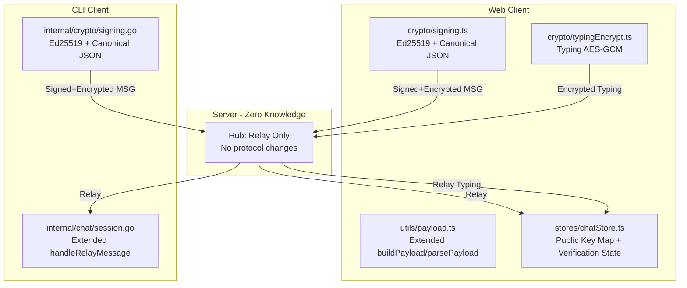
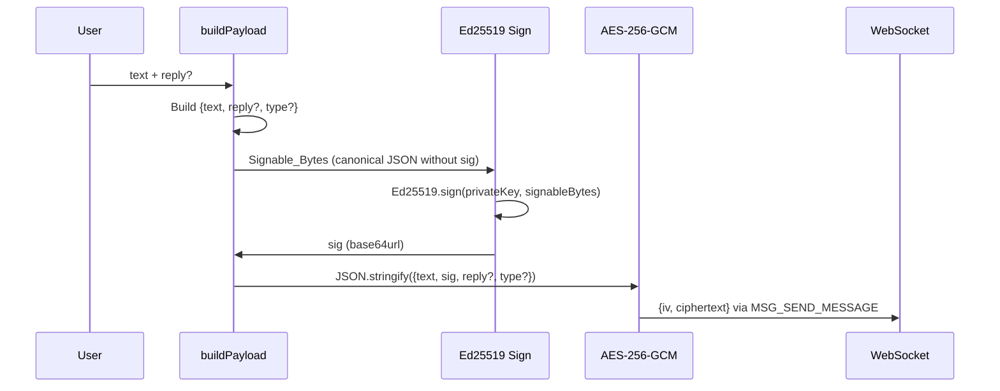
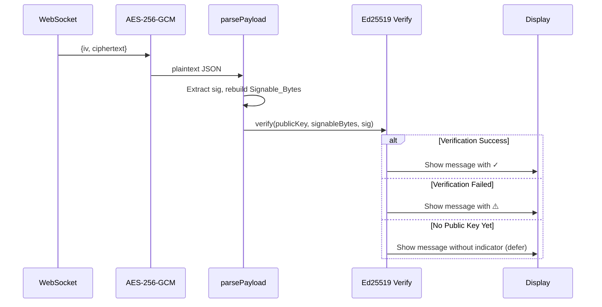
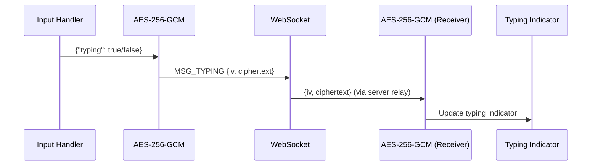

# Design Document: Security Upgrade (Phase 8)

## Overview

本设计文档描述 Arthas 加密聊天系统 Phase 8 安全升级的技术实现方案。包含两项核心增强：

1. **加密 Typing 状态** — 将明文 typing 布尔值替换为 AES-256-GCM 加密的 Typing_Payload，消除服务器对输入状态的元数据观察能力。
2. **Ed25519 消息签名** — 为每条消息添加数字签名，接收方可验证消息来源真实性，防止服务器伪造消息。

设计原则：
- **零服务器变更**：所有增强在客户端实现，服务器继续零知识中转
- **向后兼容**：旧客户端发送的消息仍能正常显示
- **跨客户端互操作**：Web 和 CLI 产生完全相同的密码学输出
- **最小侵入**：扩展现有 `buildPayload/parsePayload` 和 `MessagePayload`，不替换

### 浏览器兼容性要求

Ed25519 在 Web Crypto API 中的支持情况：
- Chrome 113+ (2023-05)
- Firefox 130+ (2024-09)
- Safari 17+ (2023-09)
- Edge 113+ (2023-05)

**Fallback 策略**：如果 `crypto.subtle.generateKey('Ed25519')` 抛出 `NotSupportedError`，客户端应 graceful degrade——不生成签名密钥对，不签名消息，不广播公钥。消息仍可正常加密发送（无 `sig` 字段），其他客户端按 `no-sig` 状态显示。

```typescript
// Feature detection（在 generateSigningKeyPair 内部调用）
async function isEd25519Supported(): Promise<boolean> {
  try {
    await crypto.subtle.generateKey('Ed25519', false, ['sign', 'verify']);
    return true;
  } catch {
    return false;
  }
}
```

## Architecture

### 高层架构



### 数据流

#### 消息签名流程（发送端）



#### 消息验证流程（接收端）



#### 加密 Typing 流程



> **注**: `setTyping` 当前是同步函数，加密后需变为 async。debounce 逻辑需适配异步加密调用。
> CLI 客户端已在 `handleServerMessage` 中静默忽略 `MsgMemberTyping`，接收端无需代码变更。

## Components and Interfaces

### Web Client 新增/修改模块

#### 1. `src/crypto/signing.ts` (新增)

```typescript
/**
 * Ed25519 签名模块 — 密钥生成、签名、验证。
 * 使用 Web Crypto API 的 Ed25519 算法。
 * 浏览器不支持时 graceful degrade（generateSigningKeyPair 返回 null）。
 */

/** Ed25519 密钥对（内存中，不持久化） */
export interface SigningKeyPair {
  privateKey: CryptoKey;  // Ed25519 私钥（用于签名）
  publicKey: CryptoKey;   // Ed25519 公钥（用于验证）
  publicKeyBytes: Uint8Array; // 32 字节原始公钥（用于广播）
}

/**
 * 生成 Ed25519 签名密钥对。
 * 每次加入/创建房间时调用，密钥对仅存在于内存中。
 * @returns SigningKeyPair 或 null（浏览器不支持 Ed25519 时）
 */
export async function generateSigningKeyPair(): Promise<SigningKeyPair | null>;

/**
 * 使用私钥对 Signable_Bytes 进行 Ed25519 签名。
 * @returns 64 字节签名的 base64url 编码
 */
export async function signPayload(
  privateKey: CryptoKey,
  signableBytes: Uint8Array
): Promise<string>;

/**
 * 使用公钥验证 Ed25519 签名。
 * 内部将 publicKeyBytes import 为 CryptoKey（结果应由调用方缓存）。
 * @returns true 如果签名有效
 */
export async function verifySignature(
  publicKey: CryptoKey,  // 已 import 的 CryptoKey（从缓存获取）
  signableBytes: Uint8Array,
  signatureBase64url: string
): Promise<boolean>;

/**
 * 将 32 字节原始公钥 import 为 CryptoKey（用于验证）。
 * 调用方应缓存结果，避免重复 import。
 */
export async function importVerifyKey(publicKeyBytes: Uint8Array): Promise<CryptoKey>;

/**
 * 从 base64url 编码的公钥字符串解码为原始字节。
 */
export function decodePublicKey(base64url: string): Uint8Array;

/**
 * 将原始公钥字节编码为 base64url 字符串。
 */
export function encodePublicKey(publicKeyBytes: Uint8Array): string;
```

#### 2. `src/crypto/canonicalJson.ts` (新增)

```typescript
/**
 * Canonical JSON 序列化 — 确保跨客户端产生相同的 Signable_Bytes。
 *
 * ⚠️ 实现陷阱警告：
 * 不能使用 JSON.stringify(obj, Object.keys(obj).sort()) ！
 * JSON.stringify 的 array replacer 会应用到所有嵌套层级，
 * 导致嵌套对象（如 reply）中不在 replacer 数组中的字段被丢弃。
 * 必须使用递归实现。
 *
 * 规则：key 按 Unicode 字母序排列，嵌套对象递归排序，无多余空格。
 */

/**
 * 将对象序列化为 canonical JSON 字符串（递归实现）。
 * - 每层 key 按字母序排列
 * - 嵌套对象递归排序
 * - 数组元素保持原始顺序（不排序）
 * - 无缩进、无尾部换行、无 BOM
 */
export function canonicalJsonStringify(value: unknown): string {
  if (value === null || typeof value !== 'object') {
    return JSON.stringify(value);
  }
  if (Array.isArray(value)) {
    return '[' + value.map(canonicalJsonStringify).join(',') + ']';
  }
  const keys = Object.keys(value as Record<string, unknown>).sort();
  const pairs = keys.map(k =>
    JSON.stringify(k) + ':' + canonicalJsonStringify((value as Record<string, unknown>)[k])
  );
  return '{' + pairs.join(',') + '}';
}

/**
 * 计算 Signable_Bytes：从 payload 中移除 sig 字段，canonical JSON 序列化，UTF-8 编码。
 */
export function computeSignableBytes(payload: Record<string, unknown>): Uint8Array {
  const { sig, ...rest } = payload;
  const canonical = canonicalJsonStringify(rest);
  return new TextEncoder().encode(canonical);
}
```

#### 3. `src/crypto/typingEncrypt.ts` (新增)

```typescript
/**
 * Typing 状态加密/解密 — 使用 Room_Key 加密输入状态。
 * 注意：setTyping 调用此模块后变为 async 函数。
 */

/**
 * 加密 typing 状态。
 * @returns {iv, ciphertext} base64url 编码
 */
export async function encryptTypingStatus(
  roomKey: CryptoKey,
  typing: boolean
): Promise<{ iv: string; ciphertext: string }>;

/**
 * 解密 typing 状态。
 * @returns typing 布尔值
 */
export async function decryptTypingStatus(
  roomKey: CryptoKey,
  iv: string,
  ciphertext: string
): Promise<boolean>;
```

#### 4. `src/utils/payload.ts` (修改)

扩展现有 `buildPayload` 和 `parsePayload` 以支持 `sig`、`type`、`pubkey` 字段：

```typescript
/** 扩展后的消息载荷接口 */
export interface SignedMessagePayload {
  text: string;
  sig?: string;        // base64url Ed25519 签名
  reply?: ReplyData;
  type?: string;       // "pubkey" 表示公钥广播
  pubkey?: string;     // base64url 32 字节公钥
}

/**
 * 构建带签名的加密载荷。
 * 1. 构建 payload 对象（不含 sig）
 * 2. 计算 Signable_Bytes（使用 canonicalJsonStringify 递归排序）
 * 3. Ed25519 签名
 * 4. 将 sig 插入 payload
 * 5. JSON.stringify 完整 payload（普通序列化，非 canonical）
 */
export async function buildSignedPayload(
  text: string,
  privateKey: CryptoKey | null,
  reply?: ReplyData | null,
  type?: string,
  pubkey?: string
): Promise<string>;

/**
 * 解析解密后的载荷，提取签名和验证信息。
 */
export function parseSignedPayload(plaintext: string): SignedMessagePayload;
```

#### 5. `src/stores/chatStore.ts` (修改)

新增状态字段：

```typescript
// 新增到 ChatState 接口
signingKeyPair: SigningKeyPair | null;       // 当前会话的签名密钥对（null = 不支持 Ed25519）
publicKeyMap: Map<string, PublicKeyEntry>;   // memberId → cached key entry

/** 公钥缓存条目（含 imported CryptoKey 避免重复 import） */
interface PublicKeyEntry {
  raw: Uint8Array;       // 32 字节原始公钥
  cryptoKey: CryptoKey;  // 已 import 的验证用 CryptoKey（缓存）
  firstSeen: number;     // 首次收到时间戳（用于 TOFU 冲突检测）
}
```

新增到 `ChatMessage` 接口：

```typescript
// 签名验证状态（一次性计算，结果缓存，不重复验证）
verificationStatus?: 'verified' | 'failed' | 'unknown' | 'no-sig';
```

### CLI Client 新增/修改模块

#### 1. `internal/crypto/signing.go` (新增)

```go
package crypto

import "crypto/ed25519"

// SigningKeyPair 持有 Ed25519 签名密钥对（内存中，不持久化）。
type SigningKeyPair struct {
    PrivateKey ed25519.PrivateKey // 64 字节（seed + public key）
    PublicKey  ed25519.PublicKey  // 32 字节
}

// GenerateSigningKeyPair 生成 Ed25519 签名密钥对。
func GenerateSigningKeyPair() (*SigningKeyPair, error)

// Sign 使用私钥对 signableBytes 进行 Ed25519 签名。
// 返回 base64url 编码的 64 字节签名。
func (kp *SigningKeyPair) Sign(signableBytes []byte) string

// VerifySignature 使用公钥验证 Ed25519 签名。
func VerifySignature(publicKey ed25519.PublicKey, signableBytes []byte, sigBase64url string) bool

// ZeroKeyPair 安全清零密钥对内存（best-effort）。
func (kp *SigningKeyPair) ZeroKeyPair()
```

#### 2. `internal/crypto/canonical.go` (新增)

```go
package crypto

// CanonicalJSON 将任意值序列化为 canonical JSON（递归实现）。
// - object: key 按 Unicode 字母序排列，递归处理嵌套对象
// - array: 元素保持原始顺序
// - 与 Web 客户端的 canonicalJsonStringify 产生完全相同的字节输出。
//
// ⚠️ 不能使用 json.Marshal（struct 按字段声明顺序，不是字母序）。
// 必须使用 map[string]interface{} + 手动排序 keys 的递归实现。
func CanonicalJSON(value interface{}) ([]byte, error)

// ComputeSignableBytes 从 payload map 中移除 "sig" 字段，
// 然后调用 CanonicalJSON 序列化为 UTF-8 字节。
func ComputeSignableBytes(payload map[string]interface{}) ([]byte, error)
```

#### 3. `internal/chat/session.go` (修改)

扩展 `Session` 结构体：

```go
type Session struct {
    // ... 现有字段 ...
    signingKeyPair *crypto.SigningKeyPair           // Ed25519 密钥对
    publicKeyMap   map[string]*PublicKeyEntry       // memberId → public key entry
}

// PublicKeyEntry 缓存成员的公钥及元数据
type PublicKeyEntry struct {
    PublicKey  ed25519.PublicKey
    FirstSeen time.Time  // TOFU: 首次收到时间
}
```

扩展 `MessagePayload` 结构体：

```go
type MessagePayload struct {
    Text   string     `json:"text"`
    Reply  *ReplyData `json:"reply,omitempty"`
    Sig    string     `json:"sig,omitempty"`    // base64url Ed25519 签名
    Type   string     `json:"type,omitempty"`   // "pubkey" 表示公钥广播
    PubKey string     `json:"pubkey,omitempty"` // base64url 32 字节公钥
}
```

## Data Models

### Signed_Payload JSON 格式

加密前的 JSON 结构（所有字段定义）：

```json
{
  "text": "Hello, world!",
  "sig": "base64url-encoded-64-byte-signature",
  "reply": {
    "stableId": "senderId:timestamp",
    "senderName": "Alice",
    "preview": "Previous message text..."
  },
  "type": "pubkey",
  "pubkey": "base64url-encoded-32-byte-public-key"
}
```

字段规则：
- `text` (string, required): 始终存在，公钥广播时为空字符串 `""`
- `sig` (string, optional): 存在时为 base64url 编码的 64 字节 Ed25519 签名
- `reply` (object, optional): 引用回复元数据
- `type` (string, optional): `"pubkey"` 表示公钥广播消息
- `pubkey` (string, optional): 仅 `type="pubkey"` 时存在

### Signable_Bytes 计算规则

1. 从 Signed_Payload 中**移除** `sig` 字段
2. 对剩余对象进行 **Canonical JSON** 序列化（递归实现）：
   - 每层 object 的 key 按 Unicode 字母序排列
   - 嵌套对象（如 `reply`）的 key 也按字母序排列（递归）
   - 数组元素保持原始顺序
   - 无缩进、无尾部换行、无 BOM
3. 将 JSON 字符串编码为 **UTF-8 字节**

> **⚠️ 实现陷阱**：JavaScript 中 `JSON.stringify(obj, Object.keys(obj).sort())` 的 array replacer
> 会应用到所有嵌套层级，导致嵌套对象中不在 replacer 数组中的字段被**丢弃**。
> 例如 `reply` 内的 `preview`、`senderName`、`stableId` 会消失。
> **必须使用递归实现**（见 `canonicalJson.ts` 模块）。
>
> Go 中 `json.Marshal` 对 struct 按字段声明顺序输出（不是字母序），同样不能直接使用。
> **必须使用 `map[string]interface{}` + 排序 keys 的递归实现**。

### Test Vectors（跨客户端验证基准）

> 以下 hex 值由 `Buffer.from(json, 'utf8').toString('hex')` 程序化生成并验证。
> 实现时应将这些 vectors 硬编码在两端测试中，作为互操作性的黄金标准。

```
Test Vector 1 (纯文本):
  Input:  {"text": "Hello"}
  Signable JSON: {"text":"Hello"}
  Signable Bytes (hex): 7b2274657874223a2248656c6c6f227d

Test Vector 2 (带 reply — 验证嵌套对象递归排序):
  Input:  {"reply": {"preview": "Hi", "senderName": "A", "stableId": "x:1"}, "text": "World"}
  Signable JSON: {"reply":{"preview":"Hi","senderName":"A","stableId":"x:1"},"text":"World"}
  Signable Bytes (hex): 7b227265706c79223a7b2270726576696577223a224869222c2273656e6465724e616d65223a2241222c22737461626c654964223a22783a31227d2c2274657874223a22576f726c64227d

Test Vector 3 (pubkey announcement):
  Input:  {"pubkey": "dGVzdC1wdWJsaWMta2V5LWJhc2U2NHVybA", "text": "", "type": "pubkey"}
  Signable JSON: {"pubkey":"dGVzdC1wdWJsaWMta2V5LWJhc2U2NHVybA","text":"","type":"pubkey"}
  Signable Bytes (hex): 7b227075626b6579223a226447567a6443317764574a7361574d74613256354c574a68633255324e4856796241222c2274657874223a22222c2274797065223a227075626b6579227d
```

### Encrypted Typing Payload

MSG_TYPING (0x05) 的 data 字段变更：

**旧格式（明文）：**
```json
{"typing": true}
```

**新格式（加密）：**
```json
{"iv": "base64url-12-bytes", "ciphertext": "base64url-encrypted-typing-json"}
```

加密前的明文：`{"typing":true}` 或 `{"typing":false}`（UTF-8 JSON）

### Public Key Announcement 消息

作为标准加密消息（MSG_SEND_MESSAGE 0x03）发送，解密后的 payload：

```json
{
  "type": "pubkey",
  "text": "",
  "pubkey": "base64url-encoded-32-byte-ed25519-public-key",
  "sig": "base64url-encoded-64-byte-signature-of-announcement"
}
```

> **公钥广播的签名验证（自证明）**：
> 接收方收到公钥广播时，发送方的公钥尚未存储（这正是广播的目的）。
> 因此验证逻辑为**自验证**：用广播中携带的 `pubkey` 验证广播本身的 `sig`。
> 这证明发送方确实持有对应的私钥（防止格式错误的公钥被存储）。
> 如果自验证失败，丢弃该广播，不存储公钥。
> 注意：这不能防止 MITM（服务器可替换整个广播），但能防止无效公钥。

### 内存状态模型

#### Web Client State (chatStore 扩展)

```typescript
interface SecurityState {
  signingKeyPair: SigningKeyPair | null;
  publicKeyMap: Map<string, PublicKeyEntry>;  // memberId → cached entry
}

interface PublicKeyEntry {
  raw: Uint8Array;       // 32 字节原始公钥
  cryptoKey: CryptoKey;  // 已 import 的 CryptoKey（缓存，避免重复 import）
  firstSeen: number;     // 首次收到时间戳
}
```

#### CLI Client State (Session 扩展)

```go
type Session struct {
    // ... existing fields ...
    signingKeyPair *crypto.SigningKeyPair
    publicKeyMap   map[string]*PublicKeyEntry
}

type PublicKeyEntry struct {
    PublicKey  ed25519.PublicKey
    FirstSeen time.Time
}
```

### 公钥冲突处理（TOFU Key Change）

当收到同一 memberId 的新公钥且与已存储的不同时（成员断线重连/刷新页面）：

1. **接受新公钥**：更新 `publicKeyMap` 中的条目
2. **显示警告**：
   - Web: 系统消息 "⚠️ {name} 的签名密钥已变更"（类似 SSH host key change 警告）
   - CLI: `[⚠ key changed] {name}` 系统消息
3. **不阻止通信**：新公钥立即生效，后续消息使用新公钥验证
4. **记录变更**：更新 `firstSeen` 为当前时间

> **设计决策**：不像 SSH 那样阻止连接，因为在临时聊天场景中密钥变更是正常操作
> （用户刷新页面、网络重连）。警告仅供用户知晓，不强制操作。

### 延迟验证队列（Deferred Verification）

当收到签名消息但发送方公钥未知时：

```typescript
interface DeferredVerification {
  pendingMessages: Map<string, {  // senderId → pending list
    messages: ChatMessage[];      // 待验证消息（最多 20 条/sender）
    timer: ReturnType<typeof setTimeout>;  // 60 秒清理定时器
  }>;
}
```

**规则**：
- 每个 sender 最多缓存 **20 条**待验证消息（超出则最早的标记为 `unknown` 并释放）
- **60 秒超时**：如果 60 秒内未收到该 sender 的公钥广播，所有待验证消息标记为 `unknown`
- 收到公钥后：批量验证所有缓存消息，更新 `verificationStatus`
- 验证结果是**一次性计算**，存储在 `ChatMessage.verificationStatus` 中，后续只读取缓存值

### WebSocket 重连与密钥生命周期

重连 = 等同于重新加入房间，触发完整流程：

1. 连接断开 → `signingKeyPair` 保留在内存中（不立即清除）
2. 重连成功 → 收到新的 `RoomJoined` 事件
3. 生成**新的** `SigningKeyPair`（旧的丢弃）
4. 清空 `publicKeyMap`（其他成员可能已变更）
5. 广播新的 `Public_Key_Announcement`
6. 其他成员收到新公钥 → 触发公钥冲突处理（显示警告）

> **为什么不复用旧密钥对？** 重连后房间状态可能已变化（成员离开/加入），
> 生成新密钥对确保密钥生命周期与会话严格绑定，简化安全推理。

### 验证状态枚举

| 状态 | 含义 | Web UI | CLI UI |
|------|------|--------|--------|
| `verified` | 签名验证通过 | ✓ 图标 | 正常显示 |
| `failed` | 签名验证失败 | ⚠️ + tooltip | `[⚠ unverified]` 前缀 |
| `unknown` | 公钥未知，无法验证 | 无指示器 | 正常显示 |
| `no-sig` | 消息无签名（旧客户端/不支持 Ed25519） | 无指示器 | 正常显示 |

## Correctness Properties

*A property is a characteristic or behavior that should hold true across all valid executions of a system — essentially, a formal statement about what the system should do.*

### Property 1: Typing encryption round-trip

*For any* valid AES-256 Room_Key and *for any* boolean typing status, encrypting the Typing_Payload with AES-256-GCM using the Room_Key, then decrypting the resulting `{iv, ciphertext}` with the same Room_Key, SHALL produce the original typing boolean value.

**Validates: Requirements 1.1, 1.5**

### Property 2: IV uniqueness and correct length

*For any* sequence of N encrypted typing messages (or chat messages) produced with the same Room_Key, each generated IV SHALL be exactly 12 bytes (96 bits), and all N IVs SHALL be distinct from each other.

**Validates: Requirements 1.3**

### Property 3: Ed25519 keypair validity and sign/verify round-trip

*For any* generated Ed25519 Signing_Keypair and *for any* arbitrary byte sequence (Signable_Bytes), the private key seed SHALL be 32 bytes, the public key SHALL be 32 bytes, and signing the Signable_Bytes with the private key then verifying the resulting signature with the corresponding public key SHALL return true.

**Validates: Requirements 2.1, 2.2, 2.4, 2.5, 4.1, 5.1**

### Property 4: Canonical JSON determinism with recursive sorted keys

*For any* valid Signed_Payload object (containing any combination of `text`, `reply`, `type`, `pubkey` fields, including nested objects), computing Signable_Bytes (removing `sig`, recursive canonical JSON with sorted keys at every level, UTF-8 encoding) SHALL be deterministic — calling `computeSignableBytes` twice on the same input SHALL produce byte-identical output. Furthermore, the JSON output SHALL have all keys in Unicode alphabetical order at **every nesting level**.

**Validates: Requirements 4.2, 7.4**

### Property 5: Tamper detection — modifying any field invalidates signature

*For any* valid Signed_Payload that has been signed with a keypair, modifying any non-`sig` field (`text`, `reply`, `type`, or `pubkey`) — including nested fields within `reply` — after signing SHALL cause Ed25519 signature verification to fail (return false).

**Validates: Requirements 4.6**

### Property 6: Signed_Payload JSON serialization round-trip

*For any* valid Signed_Payload object (with any combination of optional fields: `sig`, `reply`, `type`, `pubkey`), serializing to JSON then parsing back SHALL produce an object with equivalent field values — no data loss or corruption during the round-trip.

**Validates: Requirements 6.5**

### Property 7: Base64url encoding round-trip and RFC 4648 compliance

*For any* byte array of length 32 (public keys) or 64 (signatures), base64url encoding then decoding SHALL produce the original byte array. The encoded string SHALL contain only characters from the set `[A-Za-z0-9_-]` (no `+`, `/`, or `=` padding characters).

**Validates: Requirements 3.7, 6.7, 7.5**

### Property 8: Public key announcement round-trip with self-verification

*For any* 32-byte Ed25519 public key and corresponding private key, building a Public_Key_Announcement payload (with `type="pubkey"`, `text=""`, `pubkey=base64url(key)`, `sig=sign(announcement)`), then on the receiving side: (a) self-verifying the signature using the embedded pubkey SHALL succeed, and (b) storing the key SHALL result in a byte-identical copy of the original 32-byte public key.

**Validates: Requirements 3.2, 3.3**

### Property 9: Cross-client canonical JSON byte equivalence

*For any* valid Signed_Payload object, the Web client's `canonicalJsonStringify` and the CLI client's `CanonicalJSON` SHALL produce **byte-identical** UTF-8 output. This is verified via shared Test Vectors with exact hex comparisons hardcoded in both test suites.

**Validates: Requirements 7.4, 7.5**

## Error Handling

### 加密/解密错误

| 场景 | 处理策略 | 用户反馈 |
|------|----------|----------|
| Typing 解密失败 | 静默忽略，不更新 typing 指示器 | 无（不影响聊天功能） |
| 消息解密失败 | 显示 "[解密失败]" 占位符 | 系统消息提示 |
| 签名计算失败 | 发送无签名消息 + console.warn | 消息正常发送，无 ✓ 图标 |
| 签名验证失败 | 显示消息 + ⚠️ 警告 | tooltip 提示可能被篡改 |
| Ed25519 不支持（浏览器） | generateSigningKeyPair 返回 null | 所有消息以 no-sig 模式发送 |

### 密钥管理错误

| 场景 | 处理策略 | 用户反馈 |
|------|----------|----------|
| Ed25519 密钥生成失败 | signingKeyPair = null，继续使用房间 | console.error，无签名功能 |
| 公钥广播加密失败 | 重试一次，失败则放弃 | 其他成员无法验证此用户签名 |
| 收到无效公钥（非 32 字节） | 丢弃，不存储 | 该成员消息显示为 "unknown" 状态 |
| 公钥广播自验证失败 | 丢弃整个广播，不存储公钥 | 该成员消息显示为 "unknown" 状态 |
| 公钥冲突（同一成员新公钥） | 接受新公钥 + 显示警告 | 系统消息 "⚠️ {name} 签名密钥已变更" |

### 向后兼容错误处理

| 场景 | 处理策略 |
|------|----------|
| 收到明文 typing（旧客户端） | 检测无 `iv`/`ciphertext` 字段 → 按旧逻辑处理 |
| 收到无 `sig` 消息（旧客户端/不支持 Ed25519） | 正常显示，verificationStatus = 'no-sig' |
| 收到无效 JSON payload | 整个明文作为消息文本（现有 fallback 逻辑） |
| 收到未知 `type` 字段 | 忽略 type，正常显示 text |

### CLI 特殊处理

| 场景 | 处理策略 |
|------|----------|
| 收到加密 typing 消息 | 静默丢弃（已有行为，无需代码变更） |
| 密钥清零失败 | best-effort，进程退出时 OS 回收 |
| 签名验证失败 | 显示 `[⚠ unverified]` 前缀 + 消息内容 |

## Testing Strategy

### 测试框架

- **Web Client**: Vitest + fast-check (已有依赖)
- **CLI Client**: Go testing + pgregory.net/rapid (已有依赖)
- **跨客户端验证**: 共享 Test Vectors（硬编码在两端测试中，程序化生成并验证）

### 属性测试（Property-Based Testing）

每个 Correctness Property 对应一个属性测试，最少 100 次迭代。

**Web Client 属性测试文件结构：**
```
src/crypto/signing.property.test.ts      — Properties 3, 5
src/crypto/canonicalJson.property.test.ts — Properties 4, 9
src/crypto/typingEncrypt.property.test.ts — Properties 1, 2
src/utils/payload.property.test.ts       — Property 6
src/crypto/utils.property.test.ts        — Property 7 (扩展现有)
```

**CLI Client 属性测试文件结构：**
```
internal/crypto/signing_property_test.go    — Properties 3, 5
internal/crypto/canonical_property_test.go  — Properties 4, 9
internal/crypto/encrypt_property_test.go    — Properties 1, 2 (扩展现有)
```

### 单元测试（Example-Based）

**Web Client:**
- `src/crypto/signing.test.ts` — 使用 Test Vectors 验证签名/验证 + 自验证逻辑
- `src/crypto/canonicalJson.test.ts` — 使用 Test Vectors 验证 canonical JSON 输出（含嵌套对象）
- `src/crypto/typingEncrypt.test.ts` — 加密/解密 typing 的具体示例
- `src/stores/chatStore.test.ts` — 公钥存储、验证状态更新、向后兼容、公钥冲突警告、延迟验证队列

**CLI Client:**
- `internal/crypto/signing_test.go` — 使用 Test Vectors 验证签名/验证
- `internal/crypto/canonical_test.go` — 使用 Test Vectors 验证 canonical JSON（含嵌套对象）
- `internal/chat/session_test.go` — 公钥广播处理、验证状态、公钥冲突

### 跨客户端 Test Vectors

两端测试共享以下硬编码 Test Vectors，确保互操作性：

1. **Canonical JSON Vectors** — 固定 payload → 固定 Signable_Bytes（hex）
2. **Signing Vectors** — 固定 seed → 固定 public key → 固定 payload → 固定 signature
3. **Base64url Vectors** — 固定 bytes → 固定 encoded string

> **重要**：Test Vectors 必须由程序化工具生成（如 Node.js 脚本），不能手动计算 hex。
> 手动计算容易引入转录错误（如本文档早期版本中 Test Vector 3 的 hex 错误）。

### 测试覆盖矩阵

| 属性 | Web PBT | CLI PBT | Web Unit | CLI Unit | Integration |
|------|---------|---------|----------|----------|-------------|
| P1: Typing round-trip | ✓ | ✓ | ✓ | — | — |
| P2: IV uniqueness | ✓ | ✓ | — | — | — |
| P3: Keypair + sign/verify | ✓ | ✓ | ✓ (vectors) | ✓ (vectors) | ✓ |
| P4: Canonical JSON determinism | ✓ | ✓ | ✓ (vectors) | ✓ (vectors) | ✓ |
| P5: Tamper detection | ✓ | ✓ | — | — | — |
| P6: Payload round-trip | ✓ | ✓ | ✓ | ✓ | — |
| P7: Base64url | ✓ | ✓ | ✓ | ✓ | — |
| P8: Pubkey announcement + self-verify | ✓ | ✓ | ✓ | ✓ | ✓ |
| P9: Cross-client byte equivalence | — | — | ✓ (vectors) | ✓ (vectors) | ✓ |

### 不使用 PBT 的测试项

- **UI 渲染**（验证图标显示、tooltip 文案）→ 组件测试
- **服务器中转行为**（MSG_TYPING relay）→ 集成测试
- **生命周期管理**（leaveRoom 清理密钥、重连流程）→ 单元测试
- **向后兼容 fallback**（明文 typing、无 sig 消息）→ edge case 单元测试
- **公钥冲突警告**→ 单元测试
- **延迟验证队列超时/溢出** → 单元测试
- **Ed25519 不支持 fallback** → 单元测试（mock crypto.subtle）

## Appendix A: Complete Ed25519 Signing Test Vector

> 以下向量使用固定 seed 生成，两端实现必须对相同 seed 产生相同的 public key 和 signature。

```
Ed25519 Signing Test Vector:

  Seed (32 bytes, hex):
    746573742d736565642d666f722d6172746861732d766563746f727321212121

  Public Key (32 bytes, hex):
    3f23c13782fe6b1341fcd51844ecbc4de9e3af1cdf3a1f5599e8f1ad38340618

  Public Key (base64url):
    PyPBN4L-axNB_NUYROy8TenjrxzfOh9VmejxrTg0Bhg

  Signable Bytes (UTF-8 of canonical JSON '{"text":"Hello"}', hex):
    7b2274657874223a2248656c6c6f227d

  Signature (64 bytes, hex):
    072335f25bc666c64dc8ae69e005ab8beac57cbe082a51077d43fdf1f4eb969bfbbc32c05f017fae68a0c9d84404b49c276ba35b872f88ade0e4a64a16c4b308

  Signature (base64url):
    ByM18lvGZsZNyK5p4AWri-rFfL4IKlEHfUP98fTrlpv7vDLAXwF_rmigydhEBLScJ2ujW4cviK3g5KZKFsSzCA
```

**验证步骤**（两端必须通过）：
1. 从 seed 派生 public key → 必须等于上述 public key
2. 对 signable bytes 签名 → 必须等于上述 signature
3. 用 public key 验证 signature → 必须返回 true
4. 修改 signable bytes 任意一个字节后验证 → 必须返回 false

**Go 实现提示**：
```go
seed, _ := hex.DecodeString("746573742d736565642d666f722d6172746861732d766563746f727321212121")
privateKey := ed25519.NewKeyFromSeed(seed)
publicKey := privateKey.Public().(ed25519.PublicKey)
```

**TypeScript 实现提示**：
```typescript
// 使用 PKCS8 DER 格式导入 seed（Ed25519 PKCS8 前缀 + 32 字节 seed）
const pkcs8Prefix = new Uint8Array([0x30,0x2e,0x02,0x01,0x00,0x30,0x05,0x06,0x03,0x2b,0x65,0x70,0x04,0x22,0x04,0x20]);
const seedBytes = hexToBytes("746573742d736565642d666f722d6172746861732d766563746f727321212121");
const pkcs8 = new Uint8Array([...pkcs8Prefix, ...seedBytes]);
const privateKey = await crypto.subtle.importKey('pkcs8', pkcs8, 'Ed25519', false, ['sign']);
```

## Appendix B: Migration Checklist

### 新增文件

| 文件路径 | 职责 | 依赖 |
|----------|------|------|
| `src/crypto/signing.ts` | Ed25519 密钥生成、签名、验证 | Web Crypto API |
| `src/crypto/canonicalJson.ts` | Canonical JSON 递归序列化 | 无外部依赖 |
| `src/crypto/typingEncrypt.ts` | Typing 状态 AES-GCM 加密/解密 | `./utils.ts` (toBase64Url/fromBase64Url) |
| `internal/crypto/signing.go` | Ed25519 密钥生成、签名、验证 | `crypto/ed25519`, `encoding/base64` |
| `internal/crypto/canonical.go` | Canonical JSON 递归序列化 | `sort`, `strconv`, `strings` |

### 修改文件

| 文件路径 | 变更内容 |
|----------|----------|
| `src/utils/payload.ts` | 扩展 `buildPayload` → `buildSignedPayload`（async），`parsePayload` → `parseSignedPayload`，新增 `sig`/`type`/`pubkey` 字段 |
| `src/stores/chatStore.ts` | 添加 `signingKeyPair`、`publicKeyMap`、`deferredVerification` 状态；修改 `setTyping`（async + 加密）；修改 `handleServerMessage`（签名验证 + 公钥广播处理）；修改 `createRoom`/`joinRoom`（生成 keypair + 广播公钥）；修改 `leaveRoom`（清理 keypair） |
| `internal/chat/session.go` | 扩展 `Session` struct（signingKeyPair, publicKeyMap）；扩展 `MessagePayload` struct；修改 `handleUserInput`（签名）；修改 `handleRelayMessage`（验证）；新增 `handlePublicKeyAnnouncement`；修改 `RunCreate`/`RunJoin`（生成 keypair + 广播）；修改 `sendLeaveRoom`（清零 keypair） |

### 不需要修改的文件

| 文件路径 | 原因 |
|----------|------|
| `arthas-server/` (所有文件) | 零服务器变更，服务器继续零知识中转 |
| `src/network/protocol.ts` | MSG_TYPING 0x05 data 字段格式变化在应用层处理，协议层不感知 |
| `src/crypto/encrypt.ts` / `decrypt.ts` | 现有加密/解密逻辑不变，typing 加密复用相同模式 |
| `src/crypto/utils.ts` | base64url 工具函数已存在，直接复用 |
