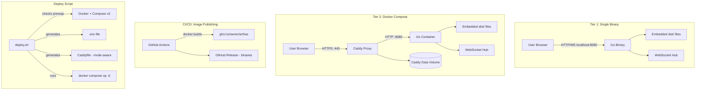
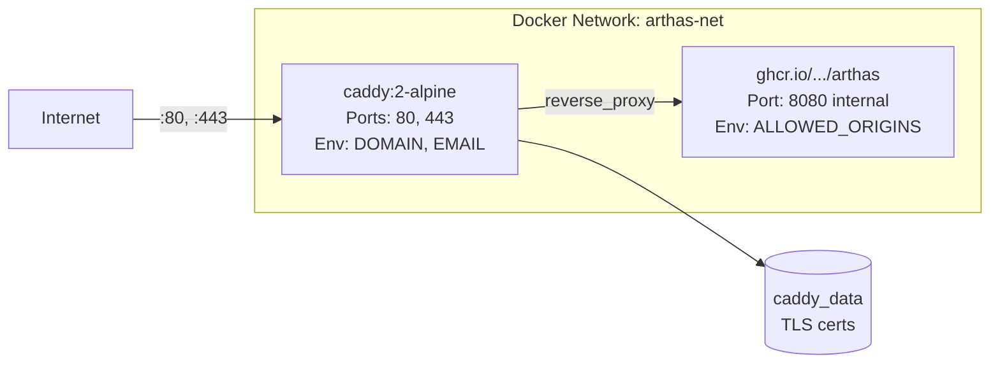

# Design Document: Self-Hosted Deployment

## Overview

This design enables self-hosted one-click deployment for Arthas, providing two deployment tiers that share a single Go binary architecture:

- **Tier 1 (Single Binary)**: Go `embed` package bundles the frontend `dist/` into the server binary. Users download one file, run it, and get a working Arthas instance on `localhost:8080`. Zero external dependencies.
- **Tier 2 (Docker Compose)**: Caddy handles HTTPS termination + reverse proxy, the same Go binary (in a Docker image) serves frontend + WebSocket. One `docker compose up -d` gives a production-ready HTTPS instance.

**Key architectural insight**: Both tiers use the same Go binary that embeds frontend static files and serves them alongside the WebSocket endpoint. Caddy in Tier 2 is purely a TLS/proxy layer — it forwards all traffic to the Go server, which handles routing internally. This eliminates shared volumes, simplifies the architecture, and means a single Dockerfile produces an image usable in both tiers.

**Relationship to existing deployment**: The current Vercel (frontend) + HF Spaces (backend) deployment remains unchanged. Self-hosted is an alternative path. The frontend gains a relative WebSocket URL fallback so the same build works in both modes.

## Architecture



**Architecture decisions and rationale:**

1. **Go embeds frontend** — The Go binary serves both static files and WebSocket from a single process. This eliminates the need for Nginx/Caddy to serve static files separately, removes shared volume complexity, and makes Tier 1 possible as a zero-dependency single file.

2. **Caddy only proxies** — In Tier 2, Caddy's sole job is HTTPS termination + reverse proxy. It forwards ALL requests (static + WebSocket) to the Go server. This keeps routing logic in one place (Go) and makes Caddy configuration trivial.

3. **Relative WebSocket URL** — The frontend uses `wss://${location.host}/ws` when `VITE_WS_URL` is not set. This means the same Docker image works on any domain without rebuilding.

4. **Three-stage Dockerfile** — Node.js builds frontend -> Go compiles with embedded dist/ -> Alpine runtime. Final image < 30MB.

5. **Multi-arch images** — `linux/amd64` + `linux/arm64` covers x86 servers, Raspberry Pi, and Apple Silicon (via Docker Desktop).

6. **Build tags for dev mode** — `//go:build !dev` on the embed file allows developers to build the server without frontend dist/ by using `-tags dev`. This prevents broken development workflow.

7. **Deploy script generates mode-aware Caddyfile** — For `DOMAIN=localhost`, the script generates a `:80` Caddyfile (HTTP-only). For real domains, it generates a standard domain block with automatic HTTPS. This avoids Caddy's default behavior of provisioning local CA certificates for `localhost`.

## Components and Interfaces

### 1. Frontend WebSocket URL Resolution (`arthas-client/src/network/websocket.ts`)

**Current state**: `DEFAULT_WS_URL = 'ws://localhost:8080/ws'` is hardcoded. The `connect()` function uses `import.meta.env.VITE_WS_URL ?? DEFAULT_WS_URL`.

**Change**: Replace the static `DEFAULT_WS_URL` with a function that derives the URL from `window.location`:

```typescript
/**
 * 📚 学习要点: 相对 WebSocket URL 的自动推导
 * 自托管模式下，前端和后端通过同一域名访问（Go 服务器同时服务两者）。
 * 通过 location.protocol 和 location.host 自动构建 WebSocket URL：
 * - HTTPS 页面 -> wss://
 * - HTTP 页面 -> ws://
 * 这消除了构建时注入 VITE_WS_URL 的需求，换域名无需重新构建镜像。
 */
function getDefaultWsUrl(): string {
  if (typeof window === 'undefined') {
    return 'ws://localhost:8080/ws'
  }
  const protocol = window.location.protocol === 'https:' ? 'wss:' : 'ws:'
  return `${protocol}//${window.location.host}/ws`
}

const DEFAULT_WS_URL = getDefaultWsUrl()
```

**Backward compatibility**: When `VITE_WS_URL` is set (development mode, Vercel deployment), it takes precedence. The relative URL only activates when the env var is absent — which is exactly the self-hosted case.

**Interface**: No API change. `connect()` signature unchanged.

### 2. Static File Server (`arthas-server/internal/static/`)

A new `internal/static` package handles embedded file serving with SPA fallback. Uses **build tags** to support both production (with embedded files) and development (without dist/) modes.

#### Production mode (`static_prod.go`):

```go
// 📚 学习要点: Build Tags 条件编译
// Go 的 //go:build 指令控制文件是否参与编译。
// !dev 表示「当 -tags 中不包含 dev 时编译此文件」。
// 生产构建不加任何 tag，所以此文件默认参与编译。
// 开发构建使用 go build -tags dev，此文件被排除，static_dev.go 生效。
//go:build !dev

package static

import (
    "embed"
    "io/fs"
    "net/http"
    "strings"
)

//go:embed dist
var distFS embed.FS

// Handler 返回一个 http.Handler，服务嵌入的前端静态文件。
func Handler() http.Handler {
    subFS, _ := fs.Sub(distFS, "dist")
    fileServer := http.FileServer(http.FS(subFS))

    return http.HandlerFunc(func(w http.ResponseWriter, r *http.Request) {
        path := r.URL.Path

        f, err := subFS.Open(strings.TrimPrefix(path, "/"))
        if err == nil {
            f.Close()
            if strings.HasPrefix(path, "/assets/") {
                w.Header().Set("Cache-Control", "public, immutable, max-age=31536000")
            }
            fileServer.ServeHTTP(w, r)
            return
        }

        // SPA fallback: 返回 index.html
        w.Header().Set("Cache-Control", "no-cache")
        r.URL.Path = "/"
        fileServer.ServeHTTP(w, r)
    })
}
```

#### Development mode (`static_dev.go`):

```go
// 📚 学习要点: 开发模式的条件编译
// 使用 go build -tags dev 时，此文件替代 static_prod.go。
// 返回 501 提示开发者使用 Vite dev server 服务前端。
// 这避免了开发时必须先构建前端才能编译后端的问题。
//go:build dev

package static

import "net/http"

// Handler 开发模式下返回提示信息，引导开发者使用 Vite dev server。
func Handler() http.Handler {
    return http.HandlerFunc(func(w http.ResponseWriter, r *http.Request) {
        http.Error(w, "static files not embedded in dev mode, use Vite dev server on :5173", http.StatusNotImplemented)
    })
}
```

**Build constraint**: The `//go:embed dist` directive requires `dist/` to exist at compile time. If missing and building without `-tags dev`, `go build` fails with: `pattern dist: no matching files found`.

**Interface**:
- `static.Handler() http.Handler` — returns the complete static file handler with SPA fallback and cache headers
- Development: `go build -tags dev ./cmd/server` (no dist/ needed)
- Production: `go build ./cmd/server` (dist/ must exist)

### 3. Enhanced Server Entry Point (`arthas-server/cmd/server/main.go`)

**Changes to existing main.go** (additions only, existing shutdown/signal logic unchanged):

```go
import (
    "flag"
    "fmt"
    // ... existing imports ...
    "github.com/arthas/arthas-server/internal/static"
)

func main() {
    // 📚 学习要点: --version flag 用于运维确认部署版本
    // 单二进制模式下，用户可能想快速确认当前运行的版本号。
    versionFlag := flag.Bool("version", false, "Print version and exit")
    portFlag := flag.Int("port", 0, "HTTP listen port (default: $PORT or 8080)")
    originsFlag := flag.String("allowed-origins", "", "Comma-separated allowed origins (default: $ALLOWED_ORIGINS or *)")
    flag.Parse()

    if *versionFlag {
        fmt.Println(Version)
        os.Exit(0)
    }

    logger.Init()

    // Port resolution: flag > env > default
    port := "8080"
    if *portFlag != 0 {
        port = fmt.Sprintf("%d", *portFlag)
    } else if envPort := os.Getenv("PORT"); envPort != "" {
        port = envPort
    }

    // Origins resolution: flag > env > default (allow all)
    origins := *originsFlag
    if origins == "" {
        origins = os.Getenv("ALLOWED_ORIGINS")
    }
    network.InitOriginControl(origins)

    hub := network.NewHub()
    go hub.Run()

    mux := http.NewServeMux()
    mux.HandleFunc("/ping", handlePing)
    mux.HandleFunc("/ws", func(w http.ResponseWriter, r *http.Request) {
        network.ServeWs(hub, w, r)
    })

    // 📚 学习要点: 路由优先级
    // Go 1.22+ 的 ServeMux 按最长前缀匹配。
    // /ws 和 /ping 是精确路径，优先于 / 的通配匹配。
    mux.Handle("/", static.Handler())

    // ... rest of server setup and shutdown logic unchanged ...
}
```

**Interface**:
- `GET /ping` -> 200 `"pong"` (unchanged)
- `GET /ws` -> WebSocket upgrade (unchanged)
- `GET /*` -> Static files or SPA fallback (new)
- CLI flags: `--port`, `--allowed-origins`, `--version`

### 4. Three-Stage Dockerfile (`deploy/Dockerfile`)

```dockerfile
# ============================================================================
# Arthas Self-Hosted — Three-Stage Dockerfile
# ============================================================================
# Stage 1 (frontend): Node.js build -> dist/
# Stage 2 (backend): Go compile with embedded dist/ -> single binary
# Stage 3 (runtime): Alpine + binary -> final image < 30MB
# ============================================================================

# --- Stage 1: Frontend Build ---
FROM node:20-alpine AS frontend
WORKDIR /app/client
COPY arthas-client/package.json arthas-client/package-lock.json ./
RUN npm ci --ignore-scripts
COPY arthas-client/ ./
# 不设置 VITE_WS_URL — 自托管模式使用相对 URL
RUN npm run build

# --- Stage 2: Go Build with Embedded Frontend ---
FROM golang:1.22-alpine AS builder
WORKDIR /app/server
COPY arthas-server/go.mod arthas-server/go.sum ./
RUN go mod download
COPY arthas-server/ ./
# 从 Stage 1 复制 dist/ 到 embed 目标位置
COPY --from=frontend /app/client/dist ./internal/static/dist/

ARG VERSION=latest
ARG TARGETARCH

# TARGETARCH 由 Docker Buildx 自动注入 (amd64 或 arm64)
RUN CGO_ENABLED=0 GOOS=linux GOARCH=${TARGETARCH} go build \
    -ldflags "-s -w -X main.Version=${VERSION}" \
    -o server ./cmd/server

# --- Stage 3: Minimal Runtime ---
FROM alpine:3.23
RUN adduser -D -u 1000 appuser
WORKDIR /home/appuser
COPY --from=builder /app/server/server .
RUN chown appuser:appuser ./server
USER appuser
EXPOSE 8080
ENV PORT=8080
HEALTHCHECK --interval=30s --timeout=3s \
    CMD wget -qO- http://localhost:8080/ping || exit 1
CMD ["./server"]
```

**Interface**:
- Build args: `VERSION`, `TARGETARCH` (auto-injected by buildx)
- Exposed port: 8080 (internal, Caddy proxies to this)
- Health check: `/ping` every 30s

### 5. Docker Compose Stack (`deploy/docker-compose.yml`)

```yaml
services:
  backend:
    image: ghcr.io/${GITHUB_OWNER:-user}/arthas:${ARTHAS_VERSION:-latest}
    container_name: arthas-backend
    environment:
      - PORT=8080
      - ALLOWED_ORIGINS=${ALLOWED_ORIGINS:-https://${DOMAIN}}
    networks:
      - arthas-net
    read_only: true
    restart: unless-stopped
    healthcheck:
      test: ["CMD", "wget", "-qO-", "http://localhost:8080/ping"]
      interval: 30s
      timeout: 3s
      retries: 3
    logging:
      driver: json-file
      options:
        max-size: "10m"
        max-file: "3"

  caddy:
    image: caddy:2-alpine
    container_name: arthas-caddy
    ports:
      - "80:80"
      - "443:443"
    environment:
      - DOMAIN=${DOMAIN}
      - EMAIL=${EMAIL:-}
    volumes:
      - ./Caddyfile:/etc/caddy/Caddyfile:ro
      - caddy_data:/data
      - caddy_config:/config
    networks:
      - arthas-net
    depends_on:
      backend:
        condition: service_healthy
    restart: unless-stopped
    healthcheck:
      test: ["CMD", "wget", "-qO-", "http://localhost:80/ping"]
      interval: 30s
      timeout: 3s
      retries: 3
    logging:
      driver: json-file
      options:
        max-size: "10m"
        max-file: "3"

networks:
  arthas-net:
    driver: bridge

volumes:
  caddy_data:
  caddy_config:
```

**Key fixes from review:**
- `caddy.environment` explicitly passes `DOMAIN` and `EMAIL` to the Caddy container (Caddy reads `{$DOMAIN}` from its process environment, not from Docker Compose `.env` directly)
- `ALLOWED_ORIGINS` uses shell default syntax: `${ALLOWED_ORIGINS:-https://${DOMAIN}}` — deploy.sh sets `ALLOWED_ORIGINS=*` in `.env` for localhost mode
- Caddy health check uses `http://localhost:80/ping` (proxied through to backend) instead of admin API port 2019 which may be disabled

**Interface**:
- Env vars consumed: `DOMAIN`, `EMAIL`, `ARTHAS_VERSION`, `GITHUB_OWNER`, `ALLOWED_ORIGINS`
- Exposed ports: 80, 443 (Caddy only)
- Internal network: `arthas-net` (backend not exposed to host)

### 6. Caddyfile (`deploy/Caddyfile`) — Mode-Aware

The deploy script generates one of two Caddyfile variants based on the DOMAIN value:

#### Production mode (DOMAIN = real domain):

```caddyfile
# 📚 学习要点: Caddy 全局配置块
# email 指令告诉 Caddy 使用哪个邮箱注册 Let's Encrypt 账户。
# 证书到期前 Caddy 会发送提醒邮件到此地址。
{
    email {$EMAIL}
}

{$DOMAIN} {
    reverse_proxy backend:8080

    # 📚 学习要点: 安全响应头
    header {
        X-Content-Type-Options nosniff
        X-Frame-Options DENY
        Referrer-Policy no-referrer
        -Server
    }
}
```

#### Localhost mode (DOMAIN = localhost):

```caddyfile
# 📚 学习要点: 为什么用 :80 而不是 localhost？
# Caddy 对 "localhost" 站点地址会自动生成本地 CA 签名的 HTTPS 证书。
# 使用 ":80" 格式明确告诉 Caddy 只监听 HTTP，不启用任何 TLS。
# 这符合 Requirement 4 AC6: DOMAIN=localhost 时使用 HTTP only。
:80 {
    reverse_proxy backend:8080

    header {
        X-Content-Type-Options nosniff
        X-Frame-Options DENY
        Referrer-Policy no-referrer
        -Server
    }
}
```

**Design rationale**: Caddy's `reverse_proxy` automatically handles WebSocket upgrade headers — no special configuration needed. The deploy script generates the appropriate Caddyfile variant based on whether DOMAIN is `localhost` or a real domain.

### 7. Deploy Script (`deploy/deploy.sh`)

```bash
#!/usr/bin/env bash
# 📚 学习要点: Bash 严格模式
set -euo pipefail
```

**Subcommands and flags**:

| Flag | Action |
|------|--------|
| (none) | Full deployment: prereq check -> config -> generate Caddyfile -> `docker compose up -d` |
| `--local` | Set `DOMAIN=localhost`, `ALLOWED_ORIGINS=*`, generate HTTP-only Caddyfile, override ports |
| `--down` | `docker compose down` |
| `--status` | Show health status of all services |
| `--upgrade` | `docker compose pull && docker compose up -d` |
| `--logs` | `docker compose logs --tail=50` |
| `--reconfigure` | Remove `.env` and `Caddyfile`, re-enter interactive setup |

**Prerequisite checks**:
1. `docker` binary exists and daemon is running
2. `docker compose version` returns v2.x (not standalone `docker-compose`)
3. Ports 80/443 are not in use (for non-local mode), with guidance on resolution

**Interactive configuration** (when `.env` doesn't exist):
1. Prompt for domain name
2. Prompt for email (skip if `--local`)
3. Generate `.env` from template
4. **Generate mode-aware Caddyfile** (`:80` for localhost, `{$DOMAIN}` for production)

**Localhost mode specifics** (`--local` flag):
- Sets `DOMAIN=localhost` in `.env`
- Sets `ALLOWED_ORIGINS=*` in `.env` (allows all origins for local dev)
- Generates `:80` Caddyfile variant (HTTP-only, no TLS)
- Generates `docker-compose.override.yml` that removes port 443 mapping (only expose 80)
- Skips email validation

**docker-compose.override.yml** (generated for localhost mode only):
```yaml
# 📚 学习要点: Docker Compose Override 文件
# docker compose 自动合并 docker-compose.yml 和 docker-compose.override.yml。
# 这让我们可以在不修改主文件的情况下覆盖特定配置。
# localhost 模式不需要 443 端口（没有 HTTPS），只暴露 80。
services:
  caddy:
    ports:
      - "80:80"
```

**Mode switching** (`--reconfigure` flag):
- Removes existing `.env`, `Caddyfile`, and `docker-compose.override.yml`
- Re-enters interactive configuration
- Useful when switching from localhost to production domain (or vice versa)
- Does NOT touch running containers — user must run `deploy.sh --down` first, then `deploy.sh --reconfigure`

**Idempotency**: Running `deploy.sh` multiple times produces the same result. If `.env` already exists, the script uses existing config without prompting. If containers are already running, `docker compose up -d` is a no-op for unchanged services.

### 8. GitHub Actions Workflow (`.github/workflows/release.yml`)

```yaml
name: Release Docker Image

on:
  push:
    tags:
      - 'v*.*.*'

jobs:
  build-and-push:
    runs-on: ubuntu-latest
    permissions:
      contents: read
      packages: write

    steps:
      - uses: actions/checkout@v4
      - uses: docker/setup-qemu-action@v3
      - uses: docker/setup-buildx-action@v3

      - uses: docker/login-action@v3
        with:
          registry: ghcr.io
          username: ${{ github.actor }}
          password: ${{ secrets.GITHUB_TOKEN }}

      - uses: docker/metadata-action@v5
        id: meta
        with:
          images: ghcr.io/${{ github.repository_owner }}/arthas
          tags: |
            type=semver,pattern={{version}}
            type=raw,value=latest

      # 📚 学习要点: QEMU ARM64 构建性能
      # 通过 QEMU 模拟 ARM64 编译 Go 代码较慢（约 15-20 分钟）。
      # 这是可接受的 tradeoff：简单的 CI 配置 vs 原生 ARM64 runner 的额外成本。
      # 如果构建时间成为瓶颈，可考虑：
      # 1. 使用 GitHub 的 ARM64 runner (larger runners)
      # 2. 将 ARM64 构建拆分为独立 job 并行执行
      - uses: docker/build-push-action@v5
        with:
          context: .
          file: deploy/Dockerfile
          platforms: linux/amd64,linux/arm64
          push: true
          tags: ${{ steps.meta.outputs.tags }}
          build-args: |
            VERSION=${{ github.ref_name }}
          cache-from: type=gha
          cache-to: type=gha,mode=max
```

**Interface**:
- Trigger: push tag `v*.*.*`
- Output: Multi-arch image at `ghcr.io/{owner}/arthas:{version}` and `latest`

### 9. Environment Configuration (`deploy/.env.example`)

```dotenv
# --- Arthas Self-Hosted Configuration ---

# 域名（必填）
# 公网部署: chat.example.com
# 本地测试: localhost (使用 --local flag 自动设置)
DOMAIN=

# Let's Encrypt 邮箱（公网部署必填，localhost 可留空）
EMAIL=

# Docker 镜像版本（可选，默认 latest）
ARTHAS_VERSION=latest

# GitHub 用户名/组织名（镜像仓库前缀）
GITHUB_OWNER=your-github-username

# WebSocket 允许的来源（通常由 deploy.sh 自动设置）
# 公网: https://{DOMAIN}
# 本地: * (允许所有)
# ALLOWED_ORIGINS=
```

### 10. .dockerignore (`deploy/.dockerignore` or root `.dockerignore`)

```dockerignore
# 📚 学习要点: .dockerignore 减少构建上下文
# Docker 构建时会将整个 context 目录发送给 Docker daemon。
# 排除不需要的大目录可以将上下文从 ~300MB 减少到 ~5MB，
# 大幅加速构建启动速度（尤其是远程 Docker daemon 场景）。

# Dependencies (will be installed fresh in container)
**/node_modules

# Version control
**/.git
**/.gitignore

# Build artifacts (will be built fresh in container)
**/dist
arthas-client/dist

# Environment files (may contain secrets)
**/.env
**/.env.*
!**/.env.example

# IDE and OS files
**/.vscode
**/.idea
**/.DS_Store

# Documentation (not needed for build)
docs/
official_doc/
.kiro/
```

**Placement**: At the project root (since the Dockerfile build context is the project root).

### 11. Cross-Compilation Makefile (`Makefile` at project root)

```makefile
# Arthas Build System
# Usage: make build-all (from project root)

VERSION ?= $(shell git describe --tags --always 2>/dev/null || echo "dev")
BINARY_NAME = arthas-server
SERVER_DIR = arthas-server
CLIENT_DIR = arthas-client
STATIC_DIR = $(SERVER_DIR)/internal/static/dist
LDFLAGS = -s -w -X main.Version=$(VERSION)

.PHONY: build-all build-frontend build-server dev-server clean

# Production: build frontend + cross-compile server for all platforms
build-all: build-frontend
	@echo "Cross-compiling for all platforms..."
	CGO_ENABLED=0 GOOS=linux GOARCH=amd64 go build -C $(SERVER_DIR) -ldflags "$(LDFLAGS)" -o ../dist/$(BINARY_NAME)-linux-amd64 ./cmd/server
	CGO_ENABLED=0 GOOS=linux GOARCH=arm64 go build -C $(SERVER_DIR) -ldflags "$(LDFLAGS)" -o ../dist/$(BINARY_NAME)-linux-arm64 ./cmd/server
	CGO_ENABLED=0 GOOS=darwin GOARCH=amd64 go build -C $(SERVER_DIR) -ldflags "$(LDFLAGS)" -o ../dist/$(BINARY_NAME)-darwin-amd64 ./cmd/server
	CGO_ENABLED=0 GOOS=darwin GOARCH=arm64 go build -C $(SERVER_DIR) -ldflags "$(LDFLAGS)" -o ../dist/$(BINARY_NAME)-darwin-arm64 ./cmd/server
	CGO_ENABLED=0 GOOS=windows GOARCH=amd64 go build -C $(SERVER_DIR) -ldflags "$(LDFLAGS)" -o ../dist/$(BINARY_NAME)-windows-amd64.exe ./cmd/server

# Build frontend and copy to embed location
build-frontend:
	cd $(CLIENT_DIR) && npm ci && npm run build
	rm -rf $(STATIC_DIR)
	cp -r $(CLIENT_DIR)/dist $(STATIC_DIR)

# Development: build server without embedded frontend
dev-server:
	go build -C $(SERVER_DIR) -tags dev -o ../dist/$(BINARY_NAME) ./cmd/server

clean:
	rm -rf dist/ $(STATIC_DIR)
```

**Key improvement**: Makefile lives at project root, eliminating relative path confusion. Uses `go build -C` to specify the module directory.

## Data Models

This feature introduces no new persistent data models (Arthas is stateless — no database). All new state is configuration or compile-time:

### Compile-Time Embedded Data

| Item | Type | Description |
|------|------|-------------|
| `distFS` | `embed.FS` | Frontend build artifacts embedded in Go binary (prod mode only) |
| `Version` | `string` | Server version injected via `-ldflags` |

### Runtime Configuration

| Variable | Source | Required | Default | Description |
|----------|--------|----------|---------|-------------|
| `DOMAIN` | `.env` | Yes (Tier 2) | — | Domain for Caddy HTTPS |
| `EMAIL` | `.env` | Yes (public) | — | Let's Encrypt notification email |
| `ARTHAS_VERSION` | `.env` | No | `latest` | Docker image tag |
| `GITHUB_OWNER` | `.env` | Yes (Tier 2) | — | ghcr.io image prefix |
| `PORT` | env / `--port` | No | `8080` | Go server listen port |
| `ALLOWED_ORIGINS` | env / `--allowed-origins` | No | `*` (Tier 1) / `https://{DOMAIN}` (Tier 2) | CORS origin whitelist |

### Docker Compose Service Topology



### File Layout (deploy/ directory)

```
project-root/
├── .dockerignore            # Excludes node_modules, .git, dist from build context
├── Makefile                 # Cross-compilation targets (runs from project root)
├── .github/
│   └── workflows/
│       └── release.yml      # Multi-arch Docker image publishing
├── official_doc/
│   └── self-hosting.md      # User-facing self-hosting documentation (Req 10)
└── deploy/
    ├── Dockerfile           # Three-stage build (Node -> Go -> Alpine)
    ├── docker-compose.yml   # Caddy + Backend service definitions
    ├── deploy.sh            # One-command deploy script (generates Caddyfile)
    ├── .env.example         # Configuration template
    ├── Caddyfile.production.example  # Reference: production Caddyfile with HTTPS
    └── Caddyfile.localhost.example   # Reference: localhost HTTP-only Caddyfile
```

Note: The actual `Caddyfile` used at runtime is generated by `deploy.sh` (not committed). The `.example` files are committed as reference documentation for users who want to customize.

## Correctness Properties

### Property 1: Static file serving correctness

*For any* file F that exists in the embedded `dist/` filesystem at path P, a GET request to `/{P}` SHALL return the content of F with the correct `Content-Type` header (as determined by the file extension) and HTTP 200 status.

**Validates: Requirement 2 AC2**

### Property 2: SPA fallback correctness

*For any* URL path P where P does not match any file in the embedded `dist/` filesystem AND P is not `/ws` or `/ping`, a GET request to `/{P}` SHALL return the content of `index.html` with `Content-Type: text/html` and `Cache-Control: no-cache`.

**Validates: Requirement 2 AC3**

### Property 3: WebSocket URL derivation correctness

*For any* page loaded with `location.protocol` in `{http:, https:}` and any valid `location.host` value, the `getDefaultWsUrl()` function SHALL return a URL where:
- Protocol is `ws:` when page protocol is `http:`
- Protocol is `wss:` when page protocol is `https:`
- Host matches `location.host` exactly
- Path is `/ws`

**Validates: Requirement 1 AC1**

### Property 4: Deploy script idempotency

*For any* valid `.env` configuration, executing `deploy.sh` twice in succession SHALL:
- Not produce any error on the second execution
- Result in the same set of running containers with the same configuration
- Not regenerate `.env` or `Caddyfile` if they already exist with valid content

**Validates: Requirement 6 AC3**

### Property 5: Cache header correctness

*For any* request to a path matching `/assets/*`, the response SHALL include `Cache-Control: public, immutable, max-age=31536000`. *For any* request that triggers SPA fallback (returns index.html), the response SHALL include `Cache-Control: no-cache`.

**Validates: Requirement 2 AC4**

### Property 6: Origin control mode switching

*For any* deployment where `DOMAIN=localhost`, the `ALLOWED_ORIGINS` SHALL be `*` (allow all). *For any* deployment where `DOMAIN` is a real domain name, the `ALLOWED_ORIGINS` SHALL be `https://{DOMAIN}` (restrict to legitimate origin only).

**Validates: Requirement 8 AC3, AC6**

## Error Handling

| Scenario | Behavior | User Impact | Recovery |
|----------|----------|-------------|----------|
| `dist/` missing at compile time (no `-tags dev`) | `go build` fails with `pattern dist: no matching files found` | Developer must build frontend first | Run `make build-frontend` or use `make dev-server` |
| `dist/` missing with `-tags dev` | Server starts, static handler returns 501 | Frontend not served, use Vite dev server | Expected behavior for development |
| Caddy cannot obtain TLS certificate | Caddy retries with exponential backoff, logs error | Users see connection refused on HTTPS | Check DNS propagation, firewall rules |
| Docker image pull fails | `docker compose up` exits with error | Deployment fails | Check network, verify image tag exists |
| Port 80/443 already in use | `deploy.sh` pre-check reports conflict with process name | Deployment blocked | Stop conflicting service (nginx, apache) |
| DOMAIN DNS not propagated | Caddy ACME HTTP-01 challenge fails | No certificate, HTTPS unavailable | Wait for DNS (up to 48h), verify with `dig` |
| Invalid DOMAIN in `.env` | Caddy fails to start, health check fails | Service unhealthy, auto-restart loops | Fix DOMAIN value, re-run deploy.sh |
| Backend crashes | Docker health check detects failure after 90s | Brief service interruption | Auto-restart via `restart: unless-stopped` |
| Caddy data volume lost | Certificates must be re-obtained from Let's Encrypt | Brief HTTPS interruption during re-issuance | Automatic recovery (Caddy re-requests certs) |
| `deploy.sh` run without Docker installed | Script exits with error listing install URL | No deployment | Install Docker per displayed instructions |
