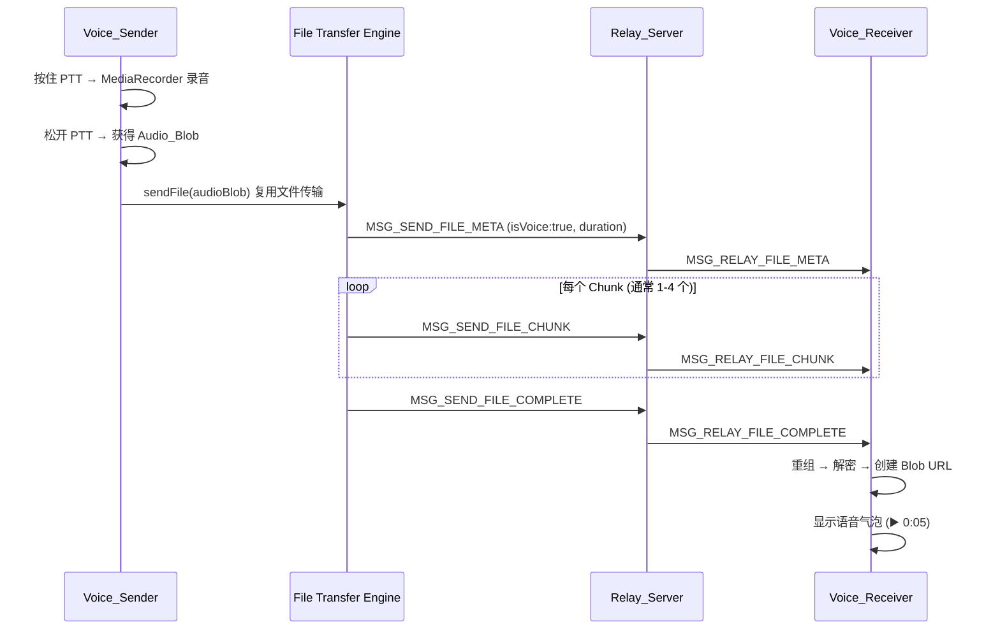
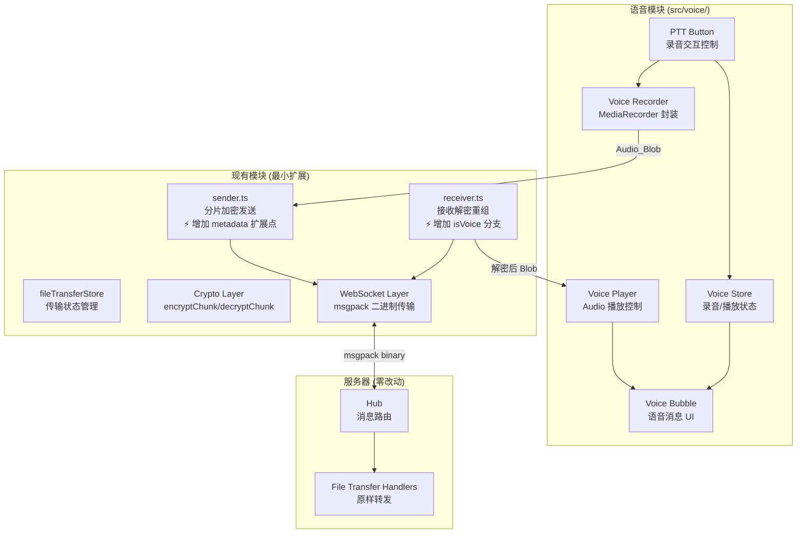
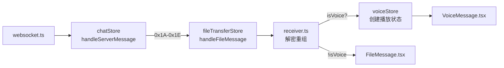
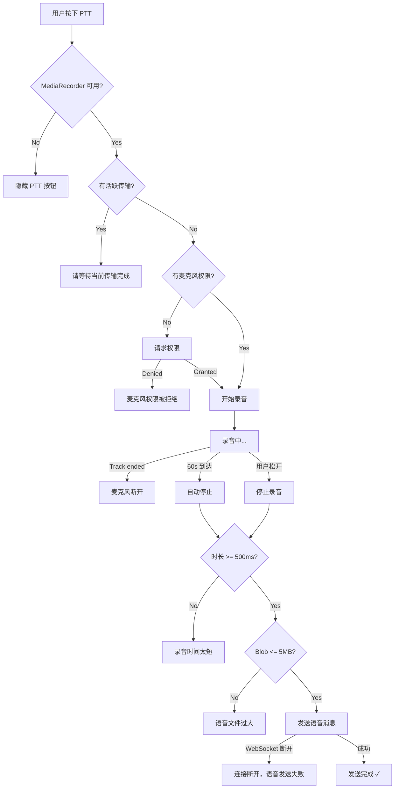

# Design Document: 加密语音消息 (Push-to-Talk)

## Overview

为 Arthas E2EE 聊天应用添加 Push-to-Talk 加密语音消息功能。用户按住按钮录音，松开后完整音频经 AES-256-GCM 分片加密，通过现有文件传输协议（MSG_SEND_FILE_META/CHUNK/COMPLETE）发送给房间内在线成员。接收方解密后可播放。

核心设计决策：
- **复用文件传输协议**：语音消息本质是"自动录制的小音频文件"，完全复用现有 0x08-0x0C / 0x1A-0x1E 协议，零服务器改动
- **整体加密**：录音完成后将完整 Audio_Blob 作为文件处理，复用 64KB 分片 + per-chunk AES-256-GCM 加密
- **浏览器原生 API**：使用 MediaRecorder API 录音 + HTML5 Audio 播放，不引入新依赖
- **独立模块**：新增 `src/voice/` 目录，对现有文件传输模块仅做最小扩展（增加 metadata 扩展点和消息子类型）
- **优雅降级**：旧客户端将语音消息视为普通音频文件下载，CLI 静默忽略
- **技术栈一致**：使用 React + Zustand + TSX，与项目现有架构保持一致



## Architecture

### 系统层次结构



> 📚 学习要点: 为什么语音模块不直接调用 WebSocket？
> 语音消息的加密传输流程与文件传输完全一致（分片 → 加密 → 发送 → 接收 → 解密 → 重组）。
> 直接复用 fileTransferStore + sender.ts + receiver.ts 的完整流程，
> 语音模块只需要负责「录音」和「播放」两个文件传输不涉及的环节。
> 这避免了重复实现加密、分片、流控、超时等复杂逻辑。

### 与现有架构的集成点

| 层级 | 现有模块 | 语音消息扩展 | 修改程度 |
|------|---------|-------------|---------|
| 协议 | `protocol.ts` | 新增 `ChatVoiceMessage` 接口（扩展 ChatFileMessage） | ✅ 小改动 |
| 加密 | `encryptChunk.ts` / `decryptChunk.ts` | 直接复用 | ❌ 不修改 |
| 传输 | `sender.ts` | 增加 `metadataExtensions` 参数支持自定义字段注入 | ✅ 小改动 |
| 传输 | `receiver.ts` | `handleFileMeta` 中增加 `isVoice` 检测分支 | ✅ 小改动 |
| 状态 | `fileTransferStore.ts` | `initiateTransfer` 增加可选 `extraMetadata` 参数 | ✅ 小改动 |
| UI | `MessageList.tsx` | 新增语音气泡渲染分支（根据 subType） | ✅ 小改动 |
| 新增 | — | `src/voice/` 目录（录音、播放、状态、UI） | ✅ 新增 |
| 服务器 | `hub.go` / `client.go` | 无改动 | ❌ 不修改 |

### 现有文件改动清单

> 📚 学习要点: 为什么不能做到"零改动现有代码"？
> 语音消息需要在加密 metadata 中注入 `isVoice` 和 `duration` 字段，
> 但现有 `sendEncryptedMetadata()` 直接从 File 对象构造 FileMetadata，
> 没有扩展点。同样，接收端需要根据 `isVoice` 字段决定渲染语音气泡还是文件卡片。
> 因此需要对文件传输模块做最小侵入式扩展（增加钩子），而非重写。

| 文件 | 改动内容 | 改动量 |
|------|---------|--------|
| `src/file-transfer/types.ts` | `FileMetadata` 接口增加可选 `isVoice?: boolean` 和 `duration?: number` | +2 行 |
| `src/file-transfer/sender.ts` | `sendEncryptedMetadata()` 接受可选 `extraFields` 参数并合并到 metadata | +5 行 |
| `src/file-transfer/fileTransferStore.ts` | `initiateTransfer()` 增加可选 `options?: { extraMetadata?: Record<string, unknown> }` | +8 行 |
| `src/file-transfer/receiver.ts` | `handleFileMeta()` 解密后检查 `isVoice`，调用不同的占位符插入函数 | +15 行 |
| `src/network/protocol.ts` | 新增 `ChatVoiceMessage` 接口 | +10 行 |
| `src/components/MessageList.tsx` | 渲染时检查 `subType === 'voice'` 渲染 `VoiceMessage` 组件 | +5 行 |

### 语音消息识别机制

> 📚 学习要点: 如何区分语音消息和普通文件？
> 语音消息复用文件传输协议，但 UI 需要区分两者以显示不同的气泡样式。
> 区分方式：在 FileMetadata（加密后的元数据 JSON）中添加 `isVoice: true` 和 `duration` 字段。
> 
> 这些字段在加密的 ciphertext 内部，服务器无法看到（零知识保持不变）。
> 接收方解密 metadata 后检查 `isVoice` 字段，决定渲染为语音气泡还是文件卡片。
> 旧客户端不认识 `isVoice` 字段，会忽略它并将消息渲染为普通音频文件（优雅降级）。

```typescript
// FileMetadata 扩展（加密前的明文结构）
interface VoiceFileMetadata extends FileMetadata {
  /** 标识这是一条语音消息（旧客户端忽略此字段） */
  isVoice: true;
  /** 语音时长（秒），用于 UI 显示 "0:05" */
  duration: number;
}
```

### 消息分发流程



**关键设计：语音消息在接收端的识别时机**

接收方在 `receiver.ts` 的 `handleFileMeta` 中解密 metadata 后，检查 `isVoice` 字段：
- `isVoice === true`：在聊天列表中插入语音消息占位符（而非文件消息占位符）
- 后续 chunk 接收、重组流程完全复用文件传输逻辑
- 重组完成后，voiceStore 创建 Blob URL 供播放

## Components and Interfaces

### 客户端模块结构

```
src/voice/
├── types.ts              # 语音模块类型定义
├── recorder.ts           # MediaRecorder 封装（录音控制）
├── player.ts             # Audio 播放控制（播放/暂停/进度）
├── voiceStore.ts         # 语音状态管理（Zustand store）
├── voiceSender.ts        # 语音发送协调（录音 → 文件传输）
├── formatDuration.ts     # 时间格式化工具函数
├── components/
│   ├── PttButton.tsx     # Push-to-Talk 按钮组件
│   ├── VoiceMessage.tsx  # 语音消息气泡组件
│   └── RecordingIndicator.tsx  # 录音状态指示器
└── __tests__/
    ├── recorder.test.ts
    ├── player.test.ts
    ├── voiceSender.test.ts
    ├── voiceStore.property.test.ts
    └── formatDuration.property.test.ts
```

### PTT 按钮布局集成

> 📚 学习要点: 输入区域布局设计
> PTT 按钮需要与现有 MessageInput.tsx 中的 FileAttachButton 和发送按钮共存。
> 布局原则：高频操作靠近拇指区域（移动端），低频操作靠边。

```
┌─────────────────────────────────────────────────────────┐
│  [📎]  [🎤 PTT]  │  文本输入框...              │  [发送]  │
└─────────────────────────────────────────────────────────┘
   ↑        ↑                                        ↑
   附件    语音录音                                  发送文本
```

**集成方式：** 在 `MessageInput.tsx` 中，FileAttachButton 右侧插入 `<PttButton />`。
PTT 按钮仅在 `MediaRecorder.isTypeSupported()` 返回 true 时渲染（优雅降级）。
录音状态指示器 `<RecordingIndicator />` 浮动显示在输入框上方（absolute 定位）。

### 核心接口定义

#### Voice Recorder（录音引擎）

```typescript
/**
 * 📚 学习要点: MediaRecorder API 封装
 * MediaRecorder 是浏览器原生的音频/视频录制 API。
 * 封装的目的：
 * 1. 统一处理不同浏览器的 MIME 类型支持差异（WebM vs MP4）
 * 2. 管理 MediaStream 生命周期（getUserMedia → stop tracks）
 * 3. 提供简洁的 start/stop 接口，隐藏事件回调复杂性
 * 4. 集中处理权限请求和错误
 */

/** 录音状态 */
type RecordingState = 'idle' | 'requesting' | 'recording' | 'processing';

/** 录音结果 */
interface RecordingResult {
  /** 完整的音频 Blob（WebM/Opus 或 MP4/Opus） */
  blob: Blob;
  /** 录音时长（秒），通过 Date.now() 差值计算: Math.round((stopTime - startTime) / 1000) */
  duration: number;
  /** 实际使用的 MIME 类型 */
  mimeType: string;
}

/** 录音引擎接口 */
interface VoiceRecorder {
  /** 当前录音状态 */
  state: RecordingState;
  /** 开始录音（请求麦克风权限 + 启动 MediaRecorder） */
  start(): Promise<void>;
  /** 停止录音并返回结果 */
  stop(): Promise<RecordingResult | null>;
  /** 取消录音（丢弃数据） */
  cancel(): void;
  /** 释放资源（停止 MediaStream tracks） */
  dispose(): void;
}
```

#### Voice Player（播放引擎）

```typescript
/**
 * 📚 学习要点: 为什么使用 HTML5 Audio 而非 Web Audio API？
 * - HTML5 Audio（<audio> 元素 / new Audio()）：简单、自动处理解码、支持所有格式
 * - Web Audio API（AudioContext + AudioBufferSourceNode）：低延迟、可编程、但需要手动解码
 * 
 * 语音消息场景不需要低延迟或音频处理（如混音、特效），
 * HTML5 Audio 的简单性和浏览器兼容性更适合。
 * 且 AudioBufferSourceNode 不支持暂停/恢复（只能 stop 后重新创建），
 * 而 Audio 元素原生支持 pause()/play()。
 */

/** 播放状态 */
type PlaybackState = 'idle' | 'playing' | 'paused';

/** 单条语音消息的播放状态 */
interface VoicePlaybackState {
  /** 当前播放状态 */
  state: PlaybackState;
  /** 当前播放进度（秒） */
  currentTime: number;
  /** 总时长（秒） */
  duration: number;
}

/** 播放引擎接口 */
interface VoicePlayer {
  /**
   * 播放指定语音消息。
   * 📚 学习要点: 单例播放策略
   * 同一时间只允许一条语音消息播放。调用 play() 时：
   * - 如果有其他语音正在播放，自动 stop() 前一条
   * - 更新 activePlaybackId 为新的 transferId
   * 这避免了多条语音同时播放的混乱体验（类似微信行为）。
   */
  play(transferId: string, blobUrl: string): void;
  /** 暂停当前播放 */
  pause(): void;
  /** 恢复播放 */
  resume(): void;
  /** 停止播放（重置 currentTime 为 0） */
  stop(): void;
  /** 获取指定消息的播放状态 */
  getState(transferId: string): VoicePlaybackState;
}
```

#### Voice Store（状态管理）

```typescript
/**
 * 📚 学习要点: 为什么语音需要独立的 Store？
 * 文件传输 Store 管理传输状态（进度、缓冲区），但不管理：
 * - 录音状态（是否正在录音、录音时长）
 * - 播放状态（哪条消息在播放、播放进度）
 * - 语音 Blob 缓存（LRU 淘汰策略）
 * 
 * 这些是语音消息特有的 UI 状态，与文件传输的通用逻辑无关。
 * 分离到 voiceStore 保持了关注点分离。
 *
 * 📚 学习要点: voiceStore 是语音 Blob 的唯一持有者
 * fileTransferStore.cleanupTransfer() 会从 Map 中移除 TransferState（包括 blobUrl）。
 * 因此语音模块不能依赖 fileTransferStore 来持久保存 blobUrl。
 * voiceStore 在 handleFileComplete 回调中立即复制 blobUrl 到自己的 blobCache，
 * 之后 fileTransferStore 可以安全 cleanup 而不影响语音播放。
 */

// 使用 Zustand create() 创建 store（与项目其他 store 一致）
import { create } from 'zustand';

interface VoiceState {
  // === 录音状态 ===
  /** 当前录音状态 */
  recordingState: RecordingState;
  /** 录音开始时间戳（Date.now()），用于实时计算已录制时长 */
  recordingStartTime: number | null;
  /** 录音已持续时间（秒），由 requestAnimationFrame 驱动更新 */
  recordingElapsed: number;
  /** 录音错误信息（通过 i18n translate() 获取本地化文案） */
  recordingError: string | null;

  // === 播放状态 ===
  /** 当前正在播放的 transferId（null = 无播放） */
  activePlaybackId: string | null;
  /** 播放状态映射：transferId → PlaybackState */
  playbackStates: Map<string, VoicePlaybackState>;

  // === Blob 缓存（voiceStore 是唯一持有者） ===
  /** 已解密的语音 Blob URL 缓存：transferId → blobUrl */
  blobCache: Map<string, string>;
  /** LRU 访问顺序：最近访问的 transferId 在数组末尾 */
  lruOrder: string[];

  // === Actions ===
  startRecording(): Promise<void>;
  stopRecording(): Promise<void>;
  cancelRecording(): void;
  playVoice(transferId: string): void;
  pauseVoice(): void;
  /** 注册语音 Blob（在 handleFileComplete 回调中调用） */
  registerVoiceBlob(transferId: string, blobUrl: string): void;
  /** 清理指定语音消息的资源 */
  evictBlob(transferId: string): void;
  /** 清理所有资源（离开房间时调用） */
  cleanup(): void;
}
```

#### Voice Sender（发送协调）

```typescript
/**
 * 📚 学习要点: voiceSender 的协调角色
 * voiceSender 不直接处理加密或网络传输，它的职责是：
 * 1. 将 Audio_Blob 包装为 File 对象（文件传输引擎需要 File 接口）
 * 2. 调用 fileTransferStore.initiateTransfer(file, { extraMetadata }) 进入文件传输流程
 * 3. extraMetadata 中包含 { isVoice: true, duration } 字段
 * 4. 在聊天列表中插入语音消息占位符（而非文件消息占位符）
 * 
 * 这是一个「适配器」模式：将语音录音的输出适配为文件传输的输入。
 *
 * 📚 学习要点: 为什么通过 extraMetadata 而非绕过 initiateTransfer？
 * 直接调用底层 sendFile() 会绕过队列管理、互斥检查、状态追踪等逻辑。
 * 通过给 initiateTransfer 增加 extraMetadata 参数（最小侵入式扩展），
 * 语音消息自动获得：队列排队、activeSendId 互斥、进度追踪、超时检测。
 * 仅需在 sendEncryptedMetadata() 中将 extraMetadata 合并到 FileMetadata 对象。
 *
 * 📚 学习要点: Duration 测量方式
 * MediaRecorder API 不直接提供录音时长属性。
 * 使用 Date.now() 在 start/stop 时计算差值：
 * duration = Math.round((stopTime - startTime) / 1000)
 * 这比依赖 audio.duration（需要加载完整 Blob 后才可用）更即时。
 */

interface VoiceSender {
  /** 
   * 发送语音消息。
   * 将 Audio_Blob 通过文件传输引擎加密发送。
   * @param blob - 录音完成的 Audio Blob
   * @param duration - 录音时长（秒），通过 Date.now() 差值计算
   * @param mimeType - 实际使用的 MIME 类型
   */
  sendVoice(blob: Blob, duration: number, mimeType: string): Promise<void>;
}
```

### 语音消息占位符

```typescript
/**
 * 聊天列表中的语音消息占位符。
 * 继承 ChatFileMessage 结构，添加语音特有字段。
 *
 * 📚 学习要点: 为什么复用 ChatFileMessage 而非新建类型？
 * 语音消息在传输层面就是文件消息，复用 ChatFileMessage 意味着：
 * 1. 现有的消息列表渲染逻辑（排序、ephemeral 清理）自动适用
 * 2. fileTransferStore 的进度追踪自动适用
 * 3. 只需在 MessageList.tsx 中增加一个渲染分支
 *
 * 📚 学习要点: subType 字段的条件渲染
 * MessageList.tsx 当前对 type === 'file' 的消息渲染 <FileMessage />。
 * 增加 subType 检查后：
 * - subType === 'voice' → 渲染 <VoiceMessage transferId={msg.transferId} />
 * - 无 subType 或其他值 → 渲染 <FileMessage transferId={msg.transferId} />（向后兼容）
 */
interface ChatVoiceMessage extends ChatFileMessage {
  /** 消息子类型，固定为 'voice'（用于 UI 条件渲染） */
  subType: 'voice';
  /** 语音时长（秒） */
  duration: number;
}
```

## Data Models

### 扩展的 FileMetadata（语音消息）

```typescript
/**
 * 语音消息的 FileMetadata（加密前明文）。
 * 在标准 FileMetadata 基础上添加语音标识字段。
 * 
 * 📚 学习要点: 向后兼容的扩展策略
 * 新增的 isVoice 和 duration 字段是可选的：
 * - 旧客户端解密 metadata 后不认识这些字段，直接忽略
 * - 旧客户端根据 mimeType (audio/webm) 将其显示为音频文件
 * - 新客户端检查 isVoice === true 后显示为语音气泡
 * 这是一种「渐进增强」策略，不破坏现有功能。
 */
interface VoiceFileMetadata {
  transferId: string;           // NanoID 21 chars
  fileName: string;             // 固定格式: "voice_YYYYMMDD_HHmmss.webm"
  fileSize: number;             // Audio_Blob 大小（字节）
  mimeType: string;             // "audio/webm;codecs=opus" 或 "audio/mp4;codecs=opus"
  totalChunks: number;          // Math.ceil(fileSize / 65536)，通常 1-4
  isVoice: true;                // 语音消息标识（新增）
  duration: number;             // 录音时长，秒（新增）
  // thumbnail 和 chunkHashes 不使用（语音消息不需要缩略图和 hash 校验）
}
```

### 录音状态模型

```typescript
/** 录音状态机 */
type RecordingState = 
  | 'idle'         // 空闲，等待用户按下 PTT
  | 'requesting'   // 正在请求麦克风权限
  | 'recording'    // 正在录音
  | 'processing';  // 录音结束，正在处理（生成 Blob）

/**
 * 📚 学习要点: 录音状态机的状态转换
 * 
 * idle → requesting: 用户按下 PTT（首次需要请求权限）
 * idle → recording: 用户按下 PTT（已有权限，直接开始）
 * requesting → recording: 权限授予成功
 * requesting → idle: 权限被拒绝（显示错误）
 * recording → processing: 用户松开 PTT
 * recording → idle: 录音时间 < 500ms（丢弃，显示提示）
 * processing → idle: Blob 生成完成，已交给发送引擎
 *
 * 📚 学习要点: 录音计时器精度
 * 不使用 setInterval(1000) 累加计数器，因为：
 * 1. 标签页后台时 setInterval 会被浏览器节流（最低 1s 间隔变为 1min+）
 * 2. 累加计数器会产生漂移（每次回调的实际间隔 ≠ 精确 1000ms）
 * 
 * 改用 Date.now() 差值方案：
 * - 录音开始时记录 startTime = Date.now()
 * - UI 通过 requestAnimationFrame 或 1s setInterval 触发重渲染
 * - 每次渲染时计算 elapsed = Math.floor((Date.now() - startTime) / 1000)
 * - 即使标签页被节流，恢复后 elapsed 值仍然准确
 */
```

### 播放状态模型

```typescript
/** 播放状态机 */
type PlaybackState = 
  | 'idle'      // 未播放
  | 'playing'   // 正在播放
  | 'paused'    // 已暂停
  | 'expired';  // Blob 已被 LRU 淘汰，不可播放

/**
 * 📚 学习要点: expired 状态的必要性
 * 由于服务器不存储音频数据（零知识架构），一旦 voiceStore 的 LRU 缓存
 * 淘汰了某条语音的 Blob，该消息将永久不可播放。
 * UI 需要明确告知用户这一状态（显示"语音已过期"），
 * 而非让用户点击播放后无响应或报错。
 * 
 * 状态转换：
 * - idle → playing: 用户点击播放
 * - playing → paused: 用户点击暂停
 * - paused → playing: 用户点击恢复
 * - playing → idle: 播放完成（audio.onended）
 * - idle/paused → expired: voiceStore.evictBlob() 被调用
 * - expired 是终态，不可恢复
 */
interface VoicePlaybackState {
  state: PlaybackState;
  /** 当前播放位置（秒） */
  currentTime: number;
  /** 总时长（秒，从 metadata.duration 获取） */
  duration: number;
}
```

### Blob 缓存模型（LRU）

```typescript
/**
 * 📚 学习要点: LRU 缓存策略
 * 每条语音消息解密后生成一个 Blob URL（内存中的音频数据）。
 * 如果不限制缓存数量，10 条 240KB 的语音消息 = 2.4MB 内存。
 * 
 * 使用 LRU（Least Recently Used）策略：
 * - 最多缓存 10 条语音 Blob（NFR-6）
 * - 新消息进入时，如果超过限制，淘汰最久未播放的 Blob
 * - 淘汰时调用 URL.revokeObjectURL() 释放内存
 * - 已淘汰的消息 UI 显示"点击重新加载"（因为原始数据已不可恢复）
 *
 * 📚 学习要点: voiceStore 是 Blob 的唯一持有者
 * fileTransferStore.cleanupTransfer(transferId) 会从 Map 中完全移除 TransferState，
 * 包括其中的 blobUrl。因此 voiceStore 必须在 handleFileComplete 回调中
 * 立即将 blobUrl 复制到自己的 blobCache。之后 fileTransferStore 可以安全 cleanup。
 * 
 * 注意：由于服务器不存储音频数据（零知识），一旦 Blob 被淘汰且 fileTransferStore
 * 已 cleanup，该语音消息将无法再次播放。这是可接受的权衡：
 * - 10 条缓存覆盖了绝大多数使用场景
 * - ephemeral 模式下消息本身也会消失
 * - 非 ephemeral 模式下，用户通常只回放最近几条
 */
const MAX_VOICE_CACHE = 10;
const MAX_VOICE_MEMORY_BYTES = 2_621_440; // 2.5MB
```

### 语音消息大小估算

```
录音参数：
- 编码: Opus (WebM 容器)
- 采样率: 48kHz (浏览器默认)
- 声道: Mono (1 channel)
- 比特率: 8-32 kbps (Opus 自适应)

大小估算：
- 5 秒语音: ~5-20 KB (1 chunk)
- 15 秒语音: ~15-60 KB (1 chunk)
- 30 秒语音: ~30-120 KB (1-2 chunks)
- 60 秒语音: ~60-240 KB (1-4 chunks)

加密开销：
- 每 chunk: 12B IV + 16B GCM tag = 28 bytes
- 60 秒最大 4 chunks: 4 × 28 = 112 bytes (可忽略)

传输时间（假设 1Mbps 上行）：
- 60 秒语音 (240KB): ~2 秒传输完成
```

## Correctness Properties

*A property is a characteristic or behavior that should hold true across all valid executions of a system—essentially, a formal statement about what the system should do. Properties serve as the bridge between human-readable specifications and machine-verifiable correctness guarantees.*

### Property 1: Voice message encryption round-trip

*For any* audio data of size between 500 bytes and 240KB (representing valid voice recordings), encrypting it using the file transfer chunk encryption mechanism and then decrypting and reassembling the chunks SHALL produce data identical to the original audio input.

**Validates: Requirements 3.1, 4.1**

### Property 2: Voice metadata invariant

*For any* voice recording with duration between 0.5 and 60 seconds and any valid blob size, the constructed VoiceFileMetadata SHALL always contain `isVoice: true`, a `duration` field matching the recording duration, a valid `mimeType` starting with "audio/", and `totalChunks` equal to `Math.ceil(fileSize / 65536)`.

**Validates: Requirements 3.3**

### Property 3: Voice bubble rendering completeness

*For any* voice message with any sender name (1-20 chars) and any duration (0.5-60 seconds), the rendered VoiceBubble component SHALL contain the sender name, the formatted duration string, and a play/pause button element.

**Validates: Requirements 5.2**

### Property 4: Duration format correctness

*For any* elapsed time in seconds (0 ≤ t ≤ 60), the time formatting function SHALL produce a string matching the pattern "M:SS" where M is minutes (0-1) and SS is zero-padded seconds (00-59).

**Validates: Requirements 5.7**

### Property 5: Recording mutual exclusion

*For any* state where the fileTransferStore has an active send transfer (activeSendId !== null), attempting to start a new voice recording SHALL be rejected without modifying the recording state or the active transfer state.

**Validates: Requirements 7.3**

### Property 6: Ephemeral voice cleanup

*For any* voice message in an ephemeral room, when the ephemeral timeout triggers removal of the message, the associated Blob URL SHALL be revoked (URL.revokeObjectURL called) and the blob SHALL be removed from the voice cache.

**Validates: Requirements 8.3**

### Property 7: LRU cache invariant

*For any* sequence of voice message registrations (registerVoiceBlob calls), the voiceStore's blobCache size SHALL never exceed MAX_VOICE_CACHE (10). When a new blob is registered and the cache is full, the least recently played blob SHALL be evicted, and URL.revokeObjectURL SHALL be called exactly once for the evicted blob URL.

**Validates: NFR-6, NFR-7**


## Error Handling

### 错误分类与处理策略

> 📚 学习要点: i18n 集成
> 项目有完整的国际化系统（`src/i18n/`）。所有用户可见的错误文案
> 通过 `translate('voice.error.micDenied')` 获取，而非硬编码中文字符串。
> 下表中的中文文案是 `zh-CN` locale 的默认值，实际代码中使用 i18n key。

| 错误类型 | 触发条件 | 用户反馈 (i18n key) | 恢复策略 |
|---------|---------|---------|---------|
| 权限拒绝 | getUserMedia 被拒绝 | `voice.error.micDenied` → "麦克风权限被拒绝" | 引导用户在浏览器设置中开启 |
| 录音太短 | 按住时间 < 500ms | `voice.error.tooShort` → "录音时间太短" | 自动丢弃，无需操作 |
| 麦克风断开 | MediaStream track ended | `voice.error.micDisconnected` → "麦克风断开" | 停止录音，丢弃数据 |
| 文件过大 | Blob > 5MB | `voice.error.tooLarge` → "语音文件过大" | 丢弃录音（理论上不会发生） |
| 传输互斥 | activeSendId 非空 | `voice.error.transferBusy` → "请等待当前传输完成" | 拒绝录音，等待传输完成 |
| 连接断开 | WebSocket 断开 | `voice.error.disconnected` → "连接断开，语音发送失败" | 复用文件传输的失败处理 |
| 解密失败 | 错误的 roomKey 或数据损坏 | `voice.error.decryptFailed` → "语音解密失败" | 显示错误状态，不可恢复 |
| 播放失败 | 浏览器 autoplay 策略 | `voice.error.autoplayBlocked` → "请点击页面以启用音频播放" | 用户交互后重试 |
| 浏览器不支持 | MediaRecorder 不可用 | 隐藏 PTT 按钮 | 优雅降级，不影响其他功能 |

### 错误处理流程



### 关键错误处理原则

> 📚 学习要点: Fail-Fast 与用户体验的平衡
> 1. **前置检查**：在录音开始前检查所有前置条件（权限、传输互斥、浏览器支持），
>    避免用户录完一段语音后才发现无法发送（浪费用户时间）。
> 2. **即时反馈**：所有错误在 1 秒内给出中文提示，不让用户困惑。
> 3. **不阻塞聊天**：语音相关错误不影响文本消息的发送和接收。
> 4. **资源清理**：任何错误路径都必须释放 MediaStream tracks，防止麦克风指示灯常亮。

```typescript
/**
 * 📚 学习要点: MediaStream 资源泄漏防护
 * getUserMedia() 返回的 MediaStream 包含活跃的音频 track。
 * 如果不调用 track.stop()，浏览器会保持麦克风占用（标签页显示录音图标）。
 * 
 * 必须在以下所有路径中释放 stream：
 * 1. 正常停止录音后
 * 2. 录音太短被丢弃时
 * 3. 麦克风断开时
 * 4. 组件卸载时（用户离开房间）
 * 5. 任何异常捕获路径中
 * 
 * 使用 try/finally 模式确保 stream 一定被释放。
 */
function releaseStream(stream: MediaStream): void {
  stream.getTracks().forEach(track => track.stop());
}
```

## Testing Strategy

### 测试层次

| 层次 | 工具 | 覆盖范围 | 运行频率 |
|------|------|---------|---------|
| Property Tests | fast-check | 加密 round-trip、metadata 构造、格式化函数 | CI (100+ iterations) |
| Unit Tests | Vitest | 录音状态机、播放控制、错误处理 | CI |
| Component Tests | Vitest + @testing-library/react | PTT 按钮交互、语音气泡渲染 | CI |
| Integration Tests | Vitest | 录音→加密→发送完整流程（mock WebSocket） | CI |
| Manual Tests | 浏览器 | 真实录音/播放、跨浏览器兼容性 | Release |

### Property-Based Testing 配置

**库选择：** `fast-check`（项目已有依赖，用于文件传输模块的 property tests）

**配置要求：**
- 每个 property test 最少 100 次迭代
- 每个 test 必须引用设计文档中的 Property 编号
- Tag 格式：`Feature: voice-push-to-talk, Property {number}: {property_text}`

### Property Test 实现计划

```typescript
// 示例：Property 1 — 加密 round-trip
// Feature: voice-push-to-talk, Property 1: Voice message encryption round-trip
test.prop(
  'voice audio data survives encrypt/decrypt round-trip',
  [fc.uint8Array({ minLength: 500, maxLength: 245760 })],
  async (audioData) => {
    const blob = new Blob([audioData], { type: 'audio/webm' });
    const roomKey = await generateRoomKey();
    
    // 分片加密
    const chunks = splitIntoChunks(audioData, CHUNK_SIZE);
    const encrypted = await Promise.all(
      chunks.map(chunk => encryptChunk(roomKey, chunk))
    );
    
    // 解密重组
    const decrypted = await Promise.all(
      encrypted.map(({ iv, ciphertext }) => decryptChunk(roomKey, iv, ciphertext))
    );
    const reassembled = reassembleChunks(decrypted);
    
    // 验证 round-trip
    expect(new Uint8Array(reassembled)).toEqual(new Uint8Array(audioData));
  },
  { numRuns: 100 }
);

// 示例：Property 4 — 时间格式化
// Feature: voice-push-to-talk, Property 4: Duration format correctness
test.prop(
  'formatDuration always produces M:SS pattern',
  [fc.integer({ min: 0, max: 60 })],
  (seconds) => {
    const result = formatDuration(seconds);
    expect(result).toMatch(/^\d:\d{2}$/);
    
    // 验证数值正确性
    const [m, ss] = result.split(':');
    expect(parseInt(m) * 60 + parseInt(ss)).toBe(seconds);
  },
  { numRuns: 100 }
);
```

### Unit Test 覆盖重点

| 模块 | 测试重点 | 示例 |
|------|---------|------|
| `recorder.ts` | 状态机转换、权限处理、超时 | idle→recording→processing 正常流程 |
| `player.ts` | 播放/暂停/停止、进度更新 | play() 设置 currentTime=0 |
| `voiceSender.ts` | Blob→File 适配、metadata 构造 | isVoice=true 始终设置 |
| `voiceStore.ts` | LRU 缓存淘汰、状态管理 | 第 11 条消息淘汰最旧的 |
| 格式化函数 | 时间格式化、文件名生成 | formatDuration(65) → "1:05" |

### 测试 Mock 策略

```typescript
/**
 * 📚 学习要点: 浏览器 API Mock 策略
 * 语音模块依赖多个浏览器 API，在 Node.js 测试环境中需要 mock：
 * 
 * 1. MediaRecorder — mock start/stop/ondataavailable
 * 2. navigator.mediaDevices.getUserMedia — mock 权限授予/拒绝
 * 3. MediaRecorder.isTypeSupported — mock MIME 类型支持
 * 4. Audio — mock play/pause/currentTime/duration
 * 5. URL.createObjectURL / revokeObjectURL — mock Blob URL 管理
 * 
 * 使用 vitest 的 vi.stubGlobal() 进行全局 mock，
 * 每个 test 后通过 vi.restoreAllMocks() 清理。
 */
```

### 浏览器兼容性测试矩阵

| 浏览器 | MediaRecorder | Opus/WebM | Opus/MP4 | 测试优先级 |
|--------|--------------|-----------|----------|-----------|
| Chrome 49+ | ✅ | ✅ | ❌ | P0 |
| Firefox 29+ | ✅ | ✅ | ❌ | P1 |
| Edge 79+ | ✅ | ✅ | ❌ | P1 |
| Safari 14.1+ | ✅ | ❌ | ✅ | P0 (fallback) |
| Safari < 14.1 | ❌ | ❌ | ❌ | 隐藏 PTT 按钮 |

### 性能验证

| 指标 | 目标 | 验证方式 |
|------|------|---------|
| 加密延迟 (60s 录音) | < 500ms | performance.now() 计时 |
| 解密+重组延迟 | < 500ms | performance.now() 计时 |
| 播放启动延迟 | < 100ms | 从 click 到 audio.play() resolve |
| 内存占用 (10 条缓存) | < 2.5MB | performance.memory 监控 |

### 无障碍与动画

> 📚 学习要点: prefers-reduced-motion 适配
> 录音状态指示器使用 CSS animation（脉冲红点）。
> 对于设置了"减少动画"偏好的用户，应禁用脉冲动画，改为静态红点。
> 实现方式：Tailwind CSS 的 `motion-reduce:` 变体。

```tsx
// RecordingIndicator.tsx 中的动画适配
<span className="
  w-3 h-3 rounded-full bg-red-500
  animate-pulse
  motion-reduce:animate-none
" />
```
