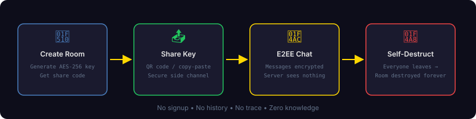
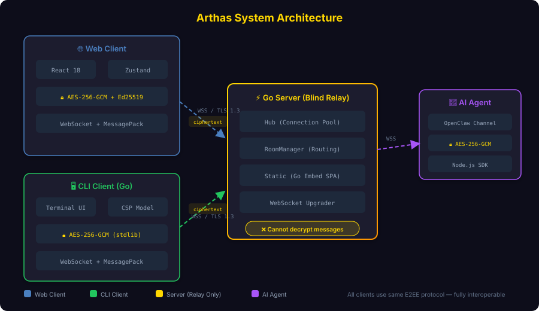
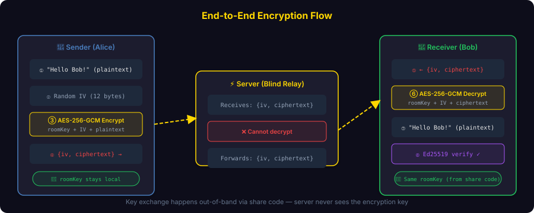
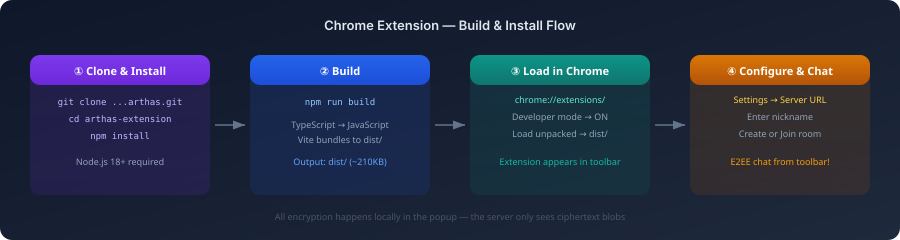
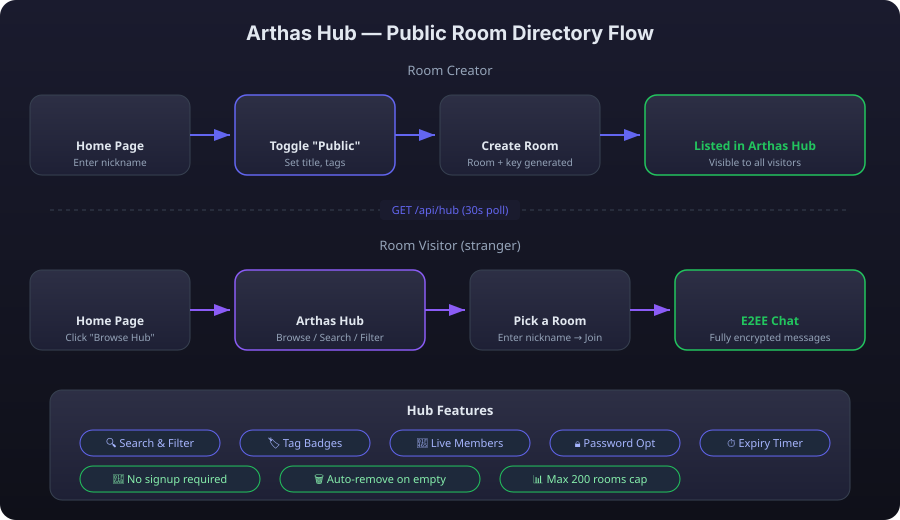
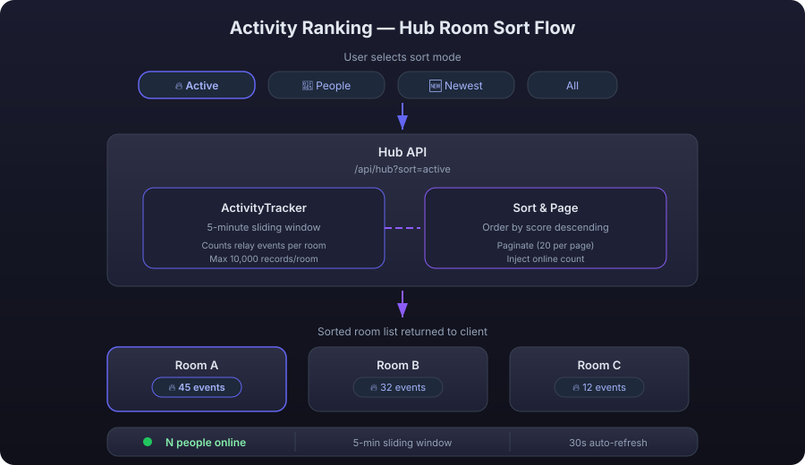

# Arthas

中文 | [English](README.md)

[](LICENSE)
[](https://go.dev)
[](https://www.typescriptlang.org/)
[](https://github.com/michaelwang123/arthas/pkgs/container/arthas)
[](https://github.com/michaelwang123/arthas/releases/latest)
[](https://github.com/michaelwang123/arthas/actions)

> E2EE 临时加密聊天 – 创建房间，分享密钥，安全通信，一切阅后即焚。

一个极简的端到端加密聊天应用。创建临时房间，生成唯一密钥分享给伙伴，所有消息端到端加密。服务器只做密文中转，无法读取任何聊天内容。无需注册，打开即用。

---

## 演示

> 创建房间，分享密钥，安全通信 — 一切阅后即焚。

- 🌐 **在线体验：** [arthas-blush.vercel.app](https://arthas-blush.vercel.app/)
- 📖 **项目官网：** [michaelwang123.github.io/arthas](https://michaelwang123.github.io/arthas/)

---

## 工作原理

<p align="center">
  
</p>

---

## 功能特性

- 🔒 **端到端加密** – AES-256-GCM + Ed25519 签名，服务器零知识
- ⚡ **实时通信** – WebSocket 全双工，消息即时送达
- 📎 **加密文件共享** – 分块加密，图片缩略图预览，拖拽上传
- 🎤 **加密语音消息** – Push-to-Talk 录音，Opus 编码，全程加密
- 📱 **二维码分享** – 扫码即入，无需手动输入邀请码
- ⏰ **房间过期** – 设定有效期（1h/24h/7d），到期自动销毁
- 🔑 **密钥即邀请** – 一串字符包含房间地址 + 解密密钥
- 🗑️ **阅后即焚** – 可选自动消失（10s/30s/60s/5min），仅客户端执行
- 💬 **回复与表情反应** – 引用回复 + emoji 表态，全部加密
- 🔐 **房间密码** – 可选密码保护，防止未授权访问
- ✍️ **Ed25519 签名** – 防篡改检测，接收方可验证发送者身份
- 🤖 **AI Agent 频道** – OpenClaw 插件实现 E2EE AI 对话，服务器无法窥视
- 🖥️ **CLI 客户端** – 独立 Go 二进制，终端创建/加入加密房间
- 🧩 **Chrome 扩展** – 浏览器工具栏弹窗中的 E2EE 聊天，与 Web/CLI 使用相同协议
- 🌐 **国际化** – 英语 / 中文 / 日语，自动检测浏览器语言
- 🌐 **Arthas Hub** – 公开房间目录，无需分享码即可浏览和加入房间
- 🔥 **房间活跃度排序** – 按活跃度、人数、最新排序 Hub 房间；5 分钟滑动窗口追踪 + 全局在线人数
- 🎲 **随机配对** – 加密版 Omegle 随机配对，支持兴趣标签、连续会话、邀请链接冷启动、双方同意延时
- 🚫 **无需注册** – 无账号体系，打开即用
- 🏠 **可自托管** – 单二进制零依赖，或 Docker Compose 配合自动 HTTPS

---

## 架构

<p align="center">
  
</p>

**核心设计原则：**
- **零知识** — 服务器是盲中继，永远不接触明文
- **统一协议** — Web、CLI、AI Agent 使用相同的 E2EE 协议（完全互通）
- **二进制协议** — MessagePack 密文传输，高效紧凑

---

## 加密方案

<p align="center">
  
</p>

| 层级 | 方案 | 用途 |
|------|------|------|
| 传输层 | WSS (TLS 1.3) | 保护传输中的元数据 |
| 应用层 | AES-256-GCM | 端到端消息加密 |
| 认证层 | Ed25519 | 消息签名验证 |

---

## 技术栈

| 层级 | 技术 | 用途 |
|------|------|------|
| 加密 | Web Crypto API | AES-256-GCM E2EE，原生硬件加速 |
| 前端 | React 18 + TypeScript | 组件化 UI，类型安全 |
| 状态管理 | Zustand | 极简状态管理 |
| 样式 | Tailwind CSS | 原子化 CSS |
| 构建 | Vite 6 | ESBuild 预打包，亚秒级 HMR |
| 协议 | WebSocket (WSS/TLS 1.3) | 全双工实时通信，TLS 传输加密 |
| 序列化 | MessagePack | 二进制编码，比 JSON 小 30-50% |
| 后端 | Go 1.23 + gorilla/websocket | Goroutine 并发，纯消息中继 |
| 部署 | Vercel + HF Spaces (Docker) | 前后端分离，零成本起步 |
| 自托管 | Go embed + Caddy + Docker | 单二进制或 Docker Compose，一键部署 |

---

## 自托管部署

<p align="center">
  
</p>

```bash
# 方案一：单二进制（All-in-One，推荐）
./arthas-server-all-linux-amd64 --port 8080

# 方案二：Docker（从 GHCR 拉取预构建镜像）
docker run -d -p 8080:8080 ghcr.io/michaelwang123/arthas:latest

# 方案三：Docker Compose（公网自动 HTTPS）
cd deploy && ./deploy.sh

# 方案四：一键脚手架（交互式配置）
npx @arthas-chat/create-arthas
```

> **注意：** 项目包含两个 Dockerfile，用途不同：
> - `deploy/Dockerfile` — 完整构建（前端 + 后端嵌入），用于自托管
> - `arthas-server/Dockerfile` — 仅后端（无前端），用于 HF Spaces 中继部署

完整指南：[自托管部署文档](official_doc/self-hosting.md)

---

## 快速开始

### 后端

```bash
cd arthas-server
go mod tidy
go run -tags dev cmd/server/main.go
```

服务启动在 `http://localhost:8080`，WebSocket 端点：`ws://localhost:8080/ws`

### 前端

```bash
cd arthas-client
npm install
npm run dev
```

前端启动在 `http://localhost:5173`

### CLI 客户端

```bash
cd arthas-cli
go build -o arthas-cli ./cmd/arthas-cli/

# 创建房间
./arthas-cli create --server ws://localhost:8080/ws --name Alice

# 加入房间（使用创建时输出的分享码）
./arthas-cli join <share_code> --server ws://localhost:8080/ws --name Bob
```

CLI 是独立的 Go 二进制，实现与 Web 客户端相同的 E2EE 协议 — 完全互通。

### Chrome 扩展

浏览器工具栏中的 E2EE 聊天 — 构建一次，加载为未打包扩展即可使用。

<p align="center">
  
</p>

```bash
cd arthas-extension
npm install
npm run build
```

在 `chrome://extensions/`（开发者模式）中加载 `arthas-extension/dist/` 目录。在设置中配置服务器地址，即可从工具栏弹窗创建或加入加密房间。使用相同的 E2EE 协议 — 与 Web 应用和 CLI 完全互通。

完整指南：[Chrome 扩展文档](official_doc/chrome-extension.md)

### Arthas Hub（公开房间目录）

Arthas Hub 让房间创建者可以选择将房间公开展示。访客无需分享码即可浏览、搜索并加入公开房间。

<p align="center">
  
</p>

**作为房间创建者：**
1. 在首页勾选 **「🌐 在 Arthas Hub 公开展示」**
2. 设置标题、可选描述和标签
3. 点击"创建房间" — 房间立即出现在 Hub 目录中

**作为访客：**
1. 在首页点击 **「🌐 浏览公开房间」**
2. 进入 Hub 目录（支持关键词搜索、标签筛选）
3. 选择一个房间，输入昵称，点击"加入"
4. 即刻进入 — 消息仍然是端到端加密的

> **安全说明：** 公开房间会主动暴露加密密钥以方便任何人加入。如需访问控制，可设置房间密码 — Hub 中会显示 🔒 图标，加入时需输入密码。

### 活跃度排序

<p align="center">
  
</p>

通过多种条件对 Hub 房间进行排序，发现最有趣的对话：

| 模式 | 说明 |
|------|------|
| 🔥 最活跃 | 近 5 分钟消息最多的房间 |
| 👥 最多人 | 成员数最多的房间 |
| 🆕 最新 | 最近创建的房间 |
| 全部 | 默认排序（人数优先） |

Hub 顶部的全局在线人数指示器实时显示平台活跃度（每 30 秒更新）。

**使用步骤：**
1. 打开 Hub 页面
2. 点击排序模式标签（🔥 / 👥 / 🆕 / 全部）
3. 浏览重新排列的房间列表
4. 查看顶部的在线人数指示器

### 随机配对（加密版 Omegle）

<p align="center">
  
</p>

匿名、端到端加密的随机配对聊天 — 类似 Omegle，但拥有真正的隐私保护：

- **兴趣标签** — 最多选择 3 个标签（#tech、#music、#gaming 等）提升匹配精准度
- **端到端加密** — 客户端生成 AES-256 密钥，服务器仅中转不存储
- **连续会话** — 点击 "Next" 立即重新进入匹配
- **邀请链接** — 队列无人时生成一次性链接实现冷启动
- **房间延时** — 双方同意即可延长 30 分钟房间，最多延长 3 次（共 2 小时）
- **举报拉黑** — 被举报 3 次后 IP 级 24 小时封禁

**使用步骤：**
1. 选择兴趣标签（可选）
2. 点击 "Match" 进入队列
3. 等待配对（60 秒超时）
4. 在加密房间中聊天
5. 点击 "Next" 再次配对，或关闭退出

---

## 项目结构

```
arthas/
├── arthas-client/              # Web 前端（React + TypeScript）
├── arthas-server/              # 后端中继服务器（Go）
├── arthas-cli/                 # CLI 客户端（独立 Go 二进制）
├── arthas-extension/           # Chrome 扩展（React + Manifest V3）
├── packages/openclaw-channel/  # OpenClaw AI Agent 频道插件（TypeScript）
├── deploy/                     # 自托管基础设施（Docker + Caddy）
├── website/                    # 项目官网（Astro + Starlight）
└── official_doc/               # 用户文档
```


---

## 文档

| 文档 | 说明 |
|------|------|
| [架构设计](official_doc/architecture.md) | 系统设计、模块划分、数据流 |
| [自托管部署](official_doc/self-hosting.md) | 三级部署方案指南 |
| [协议规范](official_doc/protocol.md) | WebSocket 消息格式规范 |
| [安全设计](official_doc/security.md) | E2EE 设计、信任模型、威胁分析 |
| [CLI 指南](official_doc/cli-guide.md) | 终端客户端使用 |
| [Chrome 扩展](official_doc/chrome-extension.md) | 浏览器扩展构建与使用 |
| [create-arthas](official_doc/create-arthas.md) | 一键自托管部署工具 |
| [OpenClaw 频道](official_doc/openclaw-channel.md) | AI Agent E2EE 插件 |
| [开发指南](official_doc/development.md) | 本地开发环境搭建、代码结构 |
| [配置参考](official_doc/configuration.md) | 所有可配置参数 |
| [活跃度排序](official_doc/activity-ranking.md) | Hub 房间排序模式与活跃度追踪 |
| [随机配对](official_doc/random-match.md) | 加密随机配对聊天（Omegle 风格） |

---

## 状态

**v1.2.2** — 功能完成 + 生产就绪 (2026-06-02)

所有计划功能已实现：E2EE 聊天 • 加密文件共享 • 加密语音消息 • 二维码分享 • 房间过期 • 回复与表情反应 • 密码保护 • 阅后即焚 • Ed25519 签名 • CLI 客户端 • AI Agent 频道 • Arthas Hub 公开房间 • 活跃度排序 • 随机配对 • 国际化 • 自托管部署（三级方案）。

详见 [路线图](docs/roadmap.md) 了解未来计划。

---

## 贡献

欢迎贡献！请阅读 [贡献指南](official_doc/contributing.md) 了解开发流程、编码规范和提交 Pull Request 的方法。

---

## 贡献者

<a href="https://github.com/michaelwang123/arthas/graphs/contributors">
  
</a>

---

## 许可证

[AGPL-3.0](LICENSE)
