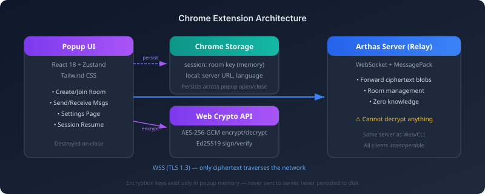

# Arthas Chrome 扩展

中文 | [English](README.md)

> 浏览器工具栏中的端到端加密临时聊天。与 Web 应用和 CLI 使用相同协议 — 完全互通。

**快速开始：** `npm install` → `npm run build` → 在 Chrome 中加载 `dist/` → 设置服务器地址 → 开始 E2EE 聊天。

---

## 架构

<p align="center">
  
</p>

---

## 功能特性

| 功能 | 说明 |
|------|------|
| 🔒 端到端加密 | AES-256-GCM + Ed25519，密钥永不离开 popup |
| 💬 实时聊天 | WebSocket + MessagePack 二进制协议 |
| 🔄 会话恢复 | 关闭 popup 后重新打开，自动重连房间 |
| 🌐 国际化 | 英语 / 中文 / 日语 |
| 🤝 跨客户端互通 | 同一房间可跨 Web、CLI、扩展使用 |

---

## 已知限制

| 限制 | 原因 | 替代方案 |
|------|------|----------|
| popup 关闭期间无法接收消息 | popup 关闭时 WebSocket 断开（Chrome 平台限制） | 使用 [Web 应用](https://arthas-blush.vercel.app/) 保持持续连接 |
| 每个浏览器只能一个会话 | 扩展共享同一份 chrome.storage | 使用无痕模式打开 Web 应用作为第二用户 |
| 无离线消息队列 | 服务器设计上不存储任何内容（零知识） | 活跃对话期间保持 popup 打开 |

---

## 从源码构建

### 前提条件

- Node.js 18+
- npm 9+

### 构建步骤

```bash
# 1. 克隆仓库
git clone https://github.com/michaelwang123/arthas.git
cd arthas/arthas-extension

# 2. 安装依赖
npm install

# 3. 构建生产版本
npm run build

# 4. 输出在 dist/ 目录 — 可直接加载到 Chrome
```

### 开发模式

```bash
# 启动 Vite 开发服务器（支持 HMR 热更新）
npm run dev
```

开发模式下加载 `arthas-extension/` 根目录（不是 `dist/`）作为未打包扩展 — `@crxjs/vite-plugin` 会处理 popup 的热更新。

---

## 安装到 Chrome

<table>
<tr>
<td width="40"><strong>1</strong></td>
<td>打开 <code>chrome://extensions/</code></td>
</tr>
<tr>
<td><strong>2</strong></td>
<td>右上角启用<strong>开发者模式</strong></td>
</tr>
<tr>
<td><strong>3</strong></td>
<td>点击<strong>加载已解压的扩展程序</strong></td>
</tr>
<tr>
<td><strong>4</strong></td>
<td>选择 <code>arthas-extension/dist/</code> 目录</td>
</tr>
<tr>
<td><strong>5</strong></td>
<td>点击工具栏扩展图标 → 设置 ⚙️ → 配置服务器地址</td>
</tr>
</table>

**公共演示服务器地址：**

```
wss://arthas100-arthas-server.hf.space/ws
```

---

## 使用方法

1. 输入昵称（1–20 个字符）
2. 点击**创建房间** — 本地生成 AES-256 密钥，连接到服务器
3. 复制分享码 → 发送给对方
4. 对方通过 Web 应用、CLI 或另一个扩展实例加入
5. 开始端到端加密聊天

---

## 技术栈

| 层级 | 技术 |
|------|------|
| UI | React 18 + TypeScript |
| 状态管理 | Zustand |
| 样式 | Tailwind CSS |
| 构建 | Vite 5 + @crxjs/vite-plugin |
| 加密 | Web Crypto API（AES-256-GCM、Ed25519） |
| 协议 | WebSocket + MessagePack |
| 存储 | chrome.storage.session（密钥） + chrome.storage.local（设置） |

---

## 项目结构

```
arthas-extension/
├── src/
│   ├── popup/          # Popup 入口（HTML）
│   ├── pages/          # React 页面组件（Home、Chat、Settings）
│   ├── components/     # 共享 UI 组件
│   ├── stores/         # Zustand 状态管理（chatStore）
│   ├── crypto/         # AES-256-GCM + Ed25519 封装
│   ├── network/        # WebSocket 客户端 + 协议定义
│   ├── i18n/           # 国际化字符串
│   ├── utils/          # Chrome 存储工具
│   └── background/     # Service Worker（最小化）
├── public/             # 扩展图标
├── dist/               # 构建输出（加载到 Chrome 的目录）
├── manifest.json       # Chrome 扩展清单（Manifest V3）
├── vite.config.ts      # Vite + CRXJS 配置
└── package.json
```

---

## 许可证

AGPL-3.0 — 与 Arthas 主项目一致。
