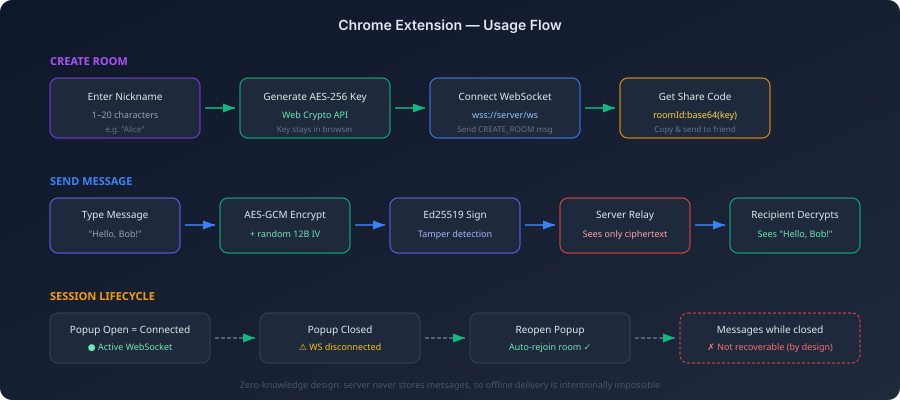

# Chrome 扩展指南

中文 | [English](chrome-extension.en.md)

> 浏览器工具栏中的端到端加密聊天 — 与 Web 应用和 CLI 使用相同协议。

**快速开始：** `git clone` → `cd arthas-extension` → `npm install` → `npm run build` → 在 Chrome 中加载 `dist/` → 设置服务器地址 → 开始 E2EE 聊天。

---

## 概述

Arthas Chrome 扩展将 E2EE 临时聊天直接嵌入浏览器工具栏。点击图标、输入昵称，即可开始加密对话。无需新标签页、无需独立应用 — 只需一个 popup 弹窗即可连接到 Arthas 服务器。

<p align="center">
  
</p>

---

## 从源码构建

<p align="center">
  
</p>

### 前提条件

| 依赖 | 版本 | 用途 |
|------|------|------|
| Node.js | 18+ | JavaScript 运行时 |
| npm | 9+ | 包管理器 |
| Chrome | 116+ | Manifest V3 + chrome.storage.session 支持 |

### 第一步 — 克隆与安装

```bash
git clone https://github.com/michaelwang123/arthas.git
cd arthas/arthas-extension
npm install
```

安装所有依赖，包括 React、Vite 以及处理 Chrome 扩展打包的 CRXJS 插件。

### 第二步 — 构建

```bash
npm run build
```

**构建过程：**
1. TypeScript 编译为 JavaScript（`tsc`）
2. Vite 打包 popup、background worker 和静态资源
3. CRXJS 将 `manifest.json` 转换为生产格式
4. 输出到 `dist/` 目录（总计约 210KB）

### 第三步 — 加载到 Chrome

1. 打开 `chrome://extensions/`
2. 右上角启用**开发者模式**
3. 点击**加载已解压的扩展程序**
4. 选择 `arthas-extension/dist/` 目录
5. Arthas 图标出现在工具栏中

### 第四步 — 配置服务器

1. 点击 Arthas 图标 → 设置 ⚙️
2. 输入服务器地址：
   ```
   wss://arthas100-arthas-server.hf.space/ws
   ```
3. 点击**保存** → **测试连接** → 显示 ✓ 连接成功
4. 返回主界面

---

## 使用方法

### 创建房间

1. 输入昵称（1–20 个字符）
2. 点击**创建房间**
3. 扩展在本地生成 AES-256 密钥并连接到服务器
4. 生成分享码 — 复制并发送给聊天对象
5. 开始输入 — 消息在发送前已加密

### 加入房间

1. 将收到的分享码粘贴到"加入房间"输入框
2. 输入你的昵称
3. 点击**加入**
4. 成功加入 — 所有消息端到端加密

### 跨客户端互通

分享码可在所有 Arthas 客户端之间通用：

| 创建方 | 加入方 | 是否互通 |
|--------|--------|----------|
| 扩展 | Web 应用 | ✅ |
| 扩展 | CLI | ✅ |
| Web 应用 | 扩展 | ✅ |
| CLI | 扩展 | ✅ |

所有客户端使用相同的 AES-256-GCM + MessagePack 协议。

---

## 会话行为

| 状态 | 连接 | 消息 |
|------|------|------|
| Popup 打开 | ● 已连接 | 正常收发 |
| Popup 关闭（房间有 2+ 人） | ○ 已断开 | 错过（不存储） |
| Popup 重新打开 | ● 自动重连 | 恢复接收 |
| Popup 关闭（你是唯一成员） | ○ 已断开 | 房间被销毁 |

**要点：**
- Popup 关闭期间发送的消息**无法恢复** — 这是设计决策（零知识服务器）
- 如果其他成员仍在房间中，房间不会因你断开而被销毁
- 重新打开 popup 会自动重连并恢复会话
- 如需持续连接，请使用 [Web 应用](https://arthas-blush.vercel.app/)

---

## 开发模式

支持热模块替换（HMR）的开发模式：

```bash
npm run dev
```

然后加载 `arthas-extension/` **根目录**（不是 `dist/`）作为未打包扩展。`@crxjs/vite-plugin` 提供 HMR — popup 代码的修改会立即反映，无需手动刷新。

### 运行测试

```bash
npm run test        # 单次运行
npm run test:watch  # 监听模式
```

测试使用 Vitest + Testing Library + happy-dom 进行组件测试，fast-check 用于属性基加密测试。

---

## 架构

```
┌─────────────────────────────────────────────────────────┐
│ Chrome 扩展 (Manifest V3)                               │
├─────────────────────────────────────────────────────────┤
│                                                         │
│  ┌──────────┐    ┌──────────────┐    ┌──────────────┐  │
│  │  Popup   │◄──►│ chrome.storage│    │ Web Crypto   │  │
│  │  (React) │    │  .session    │    │   API        │  │
│  └────┬─────┘    │  .local      │    │ AES-256-GCM  │  │
│       │          └──────────────┘    │ Ed25519      │  │
│       │                              └──────────────┘  │
│       │ WebSocket (MessagePack)                         │
├───────┼─────────────────────────────────────────────────┤
        │
        ▼
┌───────────────┐
│ Arthas 服务器 │  ← 只能看到加密 blob
│  (Go 中继)    │
└───────────────┘
```

---

## 常见问题

| 问题 | 解决方案 |
|------|----------|
| 点击"创建房间"无反应 | 检查设置中的服务器地址，先测试连接 |
| 重新打开后显示"房间会话已过期" | 房间已被销毁（你是最后一个成员），创建新房间即可 |
| 点击按钮 Console 无输出 | 重新构建 `npm run build`，然后在 chrome://extensions/ 刷新扩展 |
| Console 显示 WebSocket 错误 | 服务器可能在冷启动中（HF Spaces），等待 30 秒重试 |

---

## 许可证

AGPL-3.0 — 与 Arthas 主项目一致。
