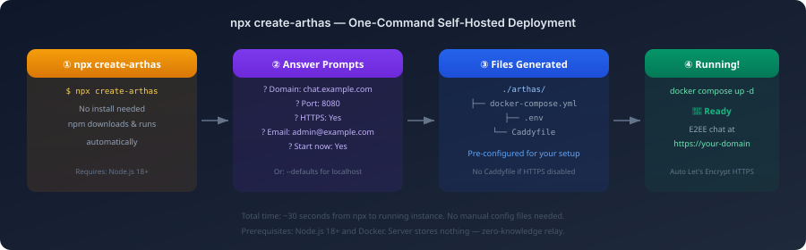

# create-arthas 使用指南

中文 | [English](create-arthas.en.md)

> 一行命令自托管 Arthas E2EE 聊天。无需手动配置。

**快速开始：** `npx create-arthas` → 回答问题 → 30 秒内实例运行。

---

## 概述

<p align="center">
  
</p>

`create-arthas` 是一个脚手架工具，为你生成可直接运行的 Docker 部署配置。通过交互式问答处理所有配置 — 域名、HTTPS、端口 — 然后可选择立即启动。

---

## 前提条件

| 依赖 | 版本 | 用途 |
|------|------|------|
| Node.js | 18+ | 运行脚手架工具 |
| Docker | 20+ | 运行 Arthas 容器 |
| Docker Compose | v2+ | 服务编排 |

---

## 使用方法

### 交互模式

```bash
npx create-arthas
```

会依次询问：
1. **域名** — 你的主机名（或 `localhost` 用于测试）
2. **端口** — 暴露哪个端口（默认 8080）
3. **HTTPS** — 通过 Caddy 自动获取 Let's Encrypt 证书（域名非 localhost 时）
4. **邮箱** — 证书通知邮箱（启用 HTTPS 时）
5. **镜像版本** — 使用的 Docker 标签（默认 `latest`）
6. **自动启动** — 是否立即执行 `docker compose up -d`

### 非交互模式

```bash
npx create-arthas --defaults
```

跳过所有提示。使用：localhost:8080、无 HTTPS、立即启动。

---

## 生成的文件

### 无 HTTPS（本地 / 内网）

```
./arthas/
├── docker-compose.yml   # 单容器，端口映射
└── .env                 # PORT, GITHUB_OWNER, VERSION
```

### 有 HTTPS（生产域名）

```
./arthas/
├── docker-compose.yml   # 后端 + Caddy 反向代理
├── .env                 # DOMAIN, EMAIL, PORT 等
└── Caddyfile            # 自动 HTTPS + 安全响应头
```

---

## 部署后操作

```bash
cd arthas

# 查看日志
docker compose logs -f

# 停止
docker compose down

# 更新到最新版本
docker compose pull && docker compose up -d

# 重新配置（重新运行 create-arthas）
cd .. && npx create-arthas
```

---

## 架构

```
互联网 → Caddy（TLS 终止）→ Arthas 服务器（Go 中继）→ WebSocket 客户端
          端口 80/443          内部端口 8080
          自动 Let's Encrypt   零知识：只能看到密文
```

无 HTTPS 模式：
```
互联网 → Arthas 服务器（Go 中继）→ WebSocket 客户端
          端口 8080
```

---

## 示例

### 本地测试

```bash
$ npx create-arthas --defaults

🔒 create-arthas — Self-hosted E2EE chat in seconds

  Using default configuration (localhost:8080, no HTTPS)

  ✓ Generated files:
    ./arthas/docker-compose.yml
    ./arthas/.env

  🎉 Arthas is running at http://localhost:8080
     WebSocket: ws://localhost:8080/ws
```

### 生产部署

```bash
$ npx create-arthas

🔒 create-arthas — Self-hosted E2EE chat in seconds

? Domain: chat.mycompany.com
? Port: 8080
? Enable HTTPS: Yes
? Email: admin@mycompany.com
? Image version: latest
? Start now: Yes

  ✓ Generated files:
    ./arthas/docker-compose.yml
    ./arthas/.env
    ./arthas/Caddyfile

  🎉 Arthas is running at https://chat.mycompany.com
     WebSocket: wss://chat.mycompany.com/ws
```

---

## 常见问题

| 问题 | 解决方案 |
|------|----------|
| `docker: command not found` | 安装 Docker：https://docs.docker.com/get-docker/ |
| 端口被占用 | 在提示中修改端口或编辑 `.env` |
| HTTPS 证书失败 | 确保域名 DNS 已解析到此服务器，端口 80/443 已开放 |
| 容器不健康 | 运行 `docker compose logs` 查看后端错误 |
| 需要修改配置 | 重新运行 `npx create-arthas` — 会覆盖现有文件 |

---

## 许可证

MIT — create-arthas 工具本身使用 MIT 许可证以最大化兼容性。
生成的 Arthas 实例在 AGPL-3.0 下运行。
